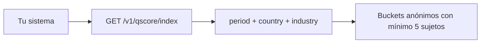

> **Ambientes:** Test `https://cryptobank.qbank.cl/platform` (`pk_test_...`) - Live `https://api.qbank.cl/platform` (`pk_...`).

Qscore Index es una vista pública y agregada de la distribución trimestral de
scores. Es informativa: no consulta personas ni empresas individuales. Nunca
expone RUT, IDs de cuenta ni poblaciones menores al mínimo estadístico.



## Leer el índice

`GET /v1/qscore/index` es público y no exige credenciales. Si omites
`period`, usa el trimestre UTC cerrado más reciente. Filtros opcionales:

| Query | Descripción |
|---|---|
| `period` | Trimestre exacto `YYYY-Q1`…`YYYY-Q4`. |
| `country` | Filtro de país ISO 3166-1 alpha-2. |
| `industry_code` | Filtro de industria/ISIC. |

```bash Índice público
curl "https://api.qbank.cl/platform/v1/qscore/index?period=2026-Q2&country=CL&industry_code=6499"
```

```json 200 OK
{"period":"2026-Q2","country":"CL","industry_code":"6499","items":[{"period":"2026-Q2","country":"CL","industry_code":"6499","band":"B","subject_count":12,"avg_score":742,"created_at":"2026-07-01T00:00:00Z"}],"methodology":"quarterly anonymous buckets; each bucket requires at least five subjects"}
```

Los `items` vienen ordenados por país, industria y banda. No hay paginación:
la respuesta es el snapshot filtrado.

## Estados de respuesta, metodología y privacidad

| HTTP | Significado | Acción |
|---:|---|---|
| `200` | Snapshot trimestral filtrado | Lee los `items` anónimos |
| `400 invalid_period` | Período mal formado o no soportado | Envía un `YYYY-Qn` cerrado |

Al cerrar cada trimestre se toma el último score de cada sujeto existente antes
del cierre. Se agrupa por país, industria y banda (`A`, `B`, `C`, `D`, `E` o
`SC`). Solo se publica un bucket con **al menos cinco sujetos**. `avg_score`
es el promedio entero redondeado del bucket.

El índice es append-only por período y bucket. No es un score vivo de una
persona o empresa y no permite drill-down individual.

Consulta el [catálogo de errores](https://docs.cbpayapp.com/es/errores).

## Equivalente autenticado

`GET /v1/qscore/index/account` devuelve el mismo snapshot y filtros para una
cuenta o scope de lectura admin autenticado. Una cuenta requiere el servicio
`risk`; los scopes administrativos no dependen del flag de una cuenta.

El índice no cobra, no emite webhook y no envía email.

## Errores y FAQ

Un período inválido responde `400 invalid_period`; usa `YYYY-Q1` a `YYYY-Q4`
y años entre 2020 y 9999.

#### ¿Puedo identificar a un sujeto?
    No. Los buckets menores a cinco se omiten y nunca aparecen identificadores.
#### ¿Sin período significa el trimestre actual?
    No. Significa el último trimestre UTC cerrado.
#### ¿Puedo filtrar una industria?
    Sí, envía `industry_code` junto con `country` y `period`.
