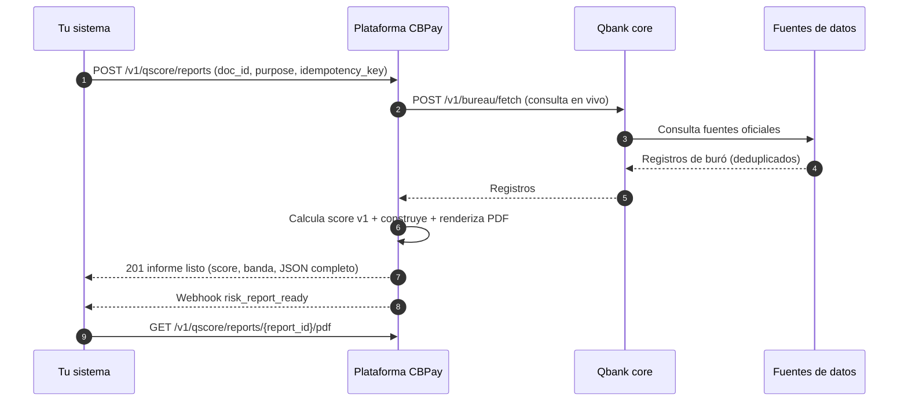

> **Ambientes:** Test `https://cryptobank.qbank.cl/platform` (`pk_test_...`) - Live `https://api.qbank.cl/platform` (`pk_...`).

Qscore es el buró de crédito API-first de la plataforma. Una sola llamada devuelve el **informe crediticio completo** de una persona o empresa — identidad, líneas de crédito, morosidades, quiebras, actividad comercial, datos alternativos — más un **score crediticio (1–999) con su banda y códigos de razón explicables**, renderizado como PDF brandeado y expuesto como JSON.

- **Chile primero, diseño country-agnostic**: hoy los sujetos son chilenos (`country: "CL"`, RUT como `doc_id`); nuevos países se enchufan sin cambios de contrato.
- **Frescura en vivo**: cada informe consulta las fuentes de datos al momento de la compra y declara, por fuente, si el dato está `live`, `cached` o `unavailable`. Nada de data rancia en silencio.
- **Cumplimiento incorporado**: la `purpose` declarada es obligatoria (ley de protección de datos de Chile), cada score lleva sus códigos de razón, y cada informe incluye un código de verificación pública.

> **Nota**
Qscore es un producto pagado, gated por el service flag `risk` de tu cuenta y facturado por informe (fees standalone `risk_report_person` / `risk_report_company`). Si la generación falla después del cobro, el fee se **reembolsa automáticamente** y el informe queda `failed` con su `error_code`. Excepción: **tu propio informe (self)** es gratis — ver "Tu propio informe (self)" más abajo.
## Cómo funciona



La generación es **síncrona**: el `POST` consulta los registros de buró, calcula el score, renderiza el PDF y devuelve el informe listo en una sola respuesta. Una fuente caída **no** hace fallar un informe pagado — se genera con la data persistida y la fuente se declara `cached` (o `unavailable` si no aportó nada) en la sección `sources`.

## Tu propio informe (self)

Si tienes una **cuenta verificada** (KYC/KYB aprobado), puedes generar y descargar **tu propio informe Qscore** directamente. Es tu derecho de acceso a tus datos personales (ARCO / Ley 21.719 de Chile), no una compra:

- **Gratis**: nunca cobra fee.
- **Sin penalización al score**: los informes self quedan excluidos del conteo de consultas de tu score — revisar tu propio informe jamás lo perjudica.
- **Anti-oráculo por diseño**: la identidad del sujeto sale del `tax_id` verificado en tu KYC/KYB. El request **no** acepta `doc_id` — pedir el informe de un tercero por estos endpoints es imposible.
- **Límite de frecuencia**: un informe **nuevo** cada 30 días. Si ya tienes uno `ready` dentro de la ventana, el `POST` lo devuelve con `idempotency_hit: true` (HTTP 200) en vez de generar otro.

### Generar (o reusar) tu informe

`POST /v1/qscore/my-report` — el body es opcional: `{"lang": "es"|"en"|"zh"}` (default `es`). La generación es **síncrona**: la respuesta trae el informe terminado. No necesitas `idempotency_key` — la idempotencia es determinista por cuenta, sujeto y día (un doble submit el mismo día devuelve el informe ya creado).

```bash Genera tu propio informe
curl -X POST "https://api.qbank.cl/platform/v1/qscore/my-report" \
  -H "Authorization: Bearer pk_live_..." \
  -H "Content-Type: application/json" \
  -d '{"lang": "es"}'
```

```json 201 Created (informe nuevo generado)
{
  "report_id": "9f1c2d3e-4a5b-4c6d-8e7f-0a1b2c3d4e5f",
  "subject_id": "3fa85f64-5717-4562-b3fc-2c963f66afa6",
  "status": "ready",
  "purpose": "self_access",
  "lang": "es",
  "band": "B",
  "model_version": "qscore-v2",
  "verify_code": "Q9f1c2d3e4a5b4c6d8e7f0a1b2c3d4e5f1a2b3c4d5e6f",
  "created_at": "2026-08-08T15:04:12Z",
  "score": 742,
  "reason_codes": ["RC01", "RC07"],
  "completed_at": "2026-08-08T15:04:19Z",
  "report": { "...": "informe completo JSON" }
}
```

Una segunda llamada dentro de los 30 días responde `200 OK` con el mismo informe y `"idempotency_hit": true`. Si la generación falla, la respuesta es `201` con `status: "failed"` y su `error_code` / `error_message` (nada se cobró — el informe self es gratis).

### Leer tu último informe

`GET /v1/qscore/my-report` devuelve tu informe self más reciente (cualquier estado) sin generar uno nuevo — `404 not_found` si nunca generaste uno.

### Descargar el PDF

`GET /v1/qscore/my-report/pdf` descarga el PDF de tu último informe self (`Content-Disposition: attachment; filename="qscore_self_<id>.pdf"`). Si el informe aún no está `ready`, responde `404 pdf_not_ready`.

El PDF lleva el mismo código de verificación pública que cualquier informe Qscore — cualquiera que lo tenga puede comprobar su autenticidad en `GET /verify/qscore/{code}` (ver "Verificación pública" más abajo).

### Errores del informe self

| HTTP | Código | Cuándo | Solución |
|---|---|---|---|
| 403 | `kyc_required` | El KYC/KYB de tu cuenta no está aprobado | Completa primero la verificación de identidad |
| 409 | `no_tax_id` | Tu cuenta no tiene un tax id verificado registrado | Completa tu perfil verificado o contacta a soporte |
| 400 | `invalid_tax_id` | El tax id registrado no es válido para el país de la cuenta | Contacta a soporte para corregir tus datos verificados |
| 409 | `identity_mismatch` | El `tax_id` de la cuenta no calza con el documento de identidad verificado (fue sobrescrito) | Contacta a soporte — tus datos verificados deben ser consistentes |
| 404 | `not_found` | Nunca generaste un informe self (`GET`) | Genera uno con `POST /v1/qscore/my-report` |
| 404 | `pdf_not_ready` | El informe aún no está `ready` o no tiene PDF | Reintenta la descarga cuando el informe esté `ready` |

> **Nota**
El endpoint comercial `POST /v1/qscore/reports` **rechaza** `purpose: "self_access"` con `400 invalid_purpose` — el acceso self solo va por `/v1/qscore/my-report`. El webhook `risk_report_ready` de un informe self lleva un campo extra `"purpose": "self_access"` en su payload (los informes comerciales lo omiten).
## 1. Comprar un informe

`POST /v1/qscore/reports` crea y genera el informe completo. La `idempotency_key` es **obligatoria** (el informe cobra un fee: un retry con la misma clave devuelve el informe original con `idempotency_hit: true` y jamás cobra dos veces).

| Campo | Tipo | Requerido | Descripción |
|---|---|---|---|
| `doc_id` | string | sí | Documento del sujeto. En Chile, el RUT (`11.111.111-1`); se normaliza a su forma canónica. |
| `country` | string | sí | País ISO 3166-1 alpha-2 del documento. Hoy `CL`. |
| `subject_type` | string | no | `person` o `company`. Si se omite, se infiere del documento. |
| `purpose` | string | sí | Finalidad declarada (ley de protección de datos): `credit_evaluation`, `tenant_screening`, `hiring`, `supplier_onboarding`, `other`. |
| `lang` | string | no | Idioma del informe: `es` (default), `en`, `zh`. |
| `idempotency_key` | string | sí | Tu clave única para esta compra. |

#### Persona

```bash Crear informe de persona
curl -X POST "https://api.qbank.cl/platform/v1/qscore/reports" \
  -H "Authorization: Bearer pk_live_..." \
  -H "Content-Type: application/json" \
  -d '{
    "doc_id": "11.111.111-1",
    "country": "CL",
    "purpose": "credit_evaluation",
    "lang": "es",
    "idempotency_key": "qscore-2026-08-08-0001"
  }'
```

#### Empresa

```bash Crear informe de empresa
curl -X POST "https://api.qbank.cl/platform/v1/qscore/reports" \
  -H "Authorization: Bearer pk_live_..." \
  -H "Content-Type: application/json" \
  -d '{
    "doc_id": "76.123.456-0",
    "country": "CL",
    "subject_type": "company",
    "purpose": "supplier_onboarding",
    "lang": "es",
    "idempotency_key": "qscore-2026-08-08-0002"
  }'
```

```json 201 Created (informe listo)
{
  "report_id": "f47ac10b-58cc-4372-a567-0e02b2c3d479",
  "subject_id": "3fa85f64-5717-4562-b3fc-2c963f66afa6",
  "status": "ready",
  "purpose": "credit_evaluation",
  "lang": "es",
  "band": "B",
  "model_version": "qscore-v1",
  "verify_code": "Qf47ac10b58cc4372a5670e02b2c3d4791a2b3c4d5e6f",
  "created_at": "2026-08-08T15:04:22Z",
  "score": 742,
  "completed_at": "2026-08-08T15:04:25Z",
  "report": {
    "meta": {
      "report_id": "QSR-f47ac10b58cc",
      "lang": "es",
      "purpose": "credit_evaluation",
      "generated_at": "2026-08-08T15:04:25Z",
      "verification_code": "Qf47ac10b58cc4372a5670e02b2c3d4791a2b3c4d5e6f",
      "verification_url": "https://business.cbpayapp.com/verify/qscore/Qf47ac10b58cc4372a5670e02b2c3d4791a2b3c4d5e6f"
    },
    "identity": {
      "subject_type": "person",
      "doc_id": "11111111-1",
      "name": "Juan Pérez González",
      "country": "CL"
    },
    "score": {
      "score": 742,
      "band": "B",
      "model_version": "qscore-v1",
      "reason_codes": [
        {"code": "ACTIVE_TRADELINES", "direction": "positive", "weight": "medium"},
        {"code": "CREDIT_HISTORY_DEPTH", "direction": "positive", "weight": "low"}
      ],
      "computed_at": "2026-08-08T15:04:25Z"
    },
    "summary": ["Sin morosidades vigentes registradas", "Actividad tributaria al día"],
    "internal_score": {"available": false},
    "sources": [
      {"source": "res_chile", "label": "Registro de Empresas y Sociedades (RES)", "records": 2, "fetched_at": "2026-08-08T15:04:23Z", "freshness": "live"}
    ]
  }
}
```

Si algo falla después del cobro del fee, el fee se reembolsa y la respuesta es el error con `error_code: "generation_failed"` persistido en el informe. Reejecutar con la **misma** `idempotency_key` devuelve el informe original (o su falla) — jamás cobra dos veces.

## 2. El score (modelo v1)

El score corre `qscore-v1`: base **600**, rango **1–999**, ajustado por hechos adversos (morosidades vigentes, protestos, quiebras, consultas recientes) y señales positivas (líneas activas, profundidad de historial, actividad de la empresa, datos alternativos).

| Banda | Rango | Lectura |
|---|---|---|
| `A` | 800–999 | Excelente |
| `B` | 650–799 | Bueno |
| `C` | 500–649 | Regular |
| `D` | 350–499 | Débil |
| `E` | 1–349 | Alto riesgo |
| `SC` | — | Sin datos del sujeto (el score es `null`) |

Cada informe lleva sus `reason_codes` — la capa de explicabilidad del score:

| Código | Dirección | Significado |
|---|---|---|
| `NO_DATA` | negative | No se encontraron registros del sujeto (banda `SC`) |
| `BANKRUPTCY_OPEN` | negative | Procedimiento de quiebra/insolvencia vigente |
| `OPEN_DELINQUENCY` | negative | Morosidad vigente en cobranza |
| `PROTESTO_OPEN` | negative | Documento protestado impago (cheque/pagaré) |
| `RECENT_DELINQUENCY` | negative | Morosidad reportada recientemente |
| `MANY_RECENT_QUERIES` | negative | Muchos informes comprados sobre el sujeto en los últimos 90 días |
| `ACTIVE_TRADELINES` | positive | Líneas de crédito activas y al día |
| `CREDIT_HISTORY_DEPTH` | positive | Historial crediticio largo |
| `COMPANY_ACTIVE` | positive | Empresa activa con actividad tributaria |
| `COMPANY_NEW` | negative | Empresa de constitución reciente |
| `ALTERNATIVE_POSITIVE` | positive | Datos alternativos positivos (servicios básicos, open finance) |
| `INTERNAL_ACTIVITY` | positive | Señales internas positivas de la plataforma |

### Comparación con pares de la industria (solo informes de empresa)

Los informes de **empresa** pueden incluir el bloque `peer_benchmark`: la posición del score **dentro de su segmento** — mismo país y misma industria (clasificación ISIC, tomada del registro tributario).

```json
"peer_benchmark": {
  "available": true,
  "segment_code": "6499",
  "segment_label": "Other financial service activities",
  "peers": 12,
  "percentile": 75,
  "median_score": 640
}
```

| Campo | Tipo | Descripción |
|---|---|---|
| `available` | booleano | `true` cuando hay una población comparable suficiente. |
| `segment_code` / `segment_label` | string | Código y nombre de la industria del sujeto (ISIC). |
| `peers` | número | Empresas comparables consideradas. |
| `percentile` | número | Porcentaje de pares con score **menor** (75 = mejor que el 75% del segmento). |
| `median_score` | número | Score mediano del segmento. |

Reglas del benchmark:

- **Solo informes de empresa** — los informes de persona nunca lo incluyen (el bloque se omite).
- **La industria sale del registro tributario** y queda asociada al sujeto (la última conocida manda).
- **La población comparable es el último score de cada empresa** del mismo país e industria, excluyendo al sujeto evaluado.
- **Se publica solo con al menos 5 empresas comparables** — con menos, el bloque no aparece en el informe (nunca se inventa contexto estadístico).
- `percentile` se lee como "mejor que el N% del segmento"; `median_score` es la mediana del segmento.

El PDF del informe incluye la sección de comparación con pares solo cuando el bloque está disponible.

## 3. Consulta e historial

### Listar informes

`GET /v1/qscore/reports` lista los informes comprados por tu cuenta. `from` y `to` (fechas `YYYY-MM-DD`, UTC, ambos inclusive) son **obligatorios**; los filtros `subject_id` y `status` (`pending`, `ready`, `failed`) son opcionales; paginación con `page` / `page_size` (default 50, máx 200).

```bash Listar informes
curl "https://api.qbank.cl/platform/v1/qscore/reports?from=2026-08-01&to=2026-08-31&status=ready&page=1&page_size=50" \
  -H "Authorization: Bearer pk_live_..."
```

```json 200 OK
{
  "items": [
    {
      "report_id": "f47ac10b-58cc-4372-a567-0e02b2c3d479",
      "account_id": "ae8c91f2-…",
      "subject_id": "3fa85f64-5717-4562-b3fc-2c963f66afa6",
      "purpose": "credit_evaluation",
      "status": "ready",
      "lang": "es",
      "score": 742,
      "band": "B",
      "score_model_version": "qscore-v1",
      "reason_codes": [{"code": "ACTIVE_TRADELINES", "direction": "positive", "weight": "medium"}],
      "verify_code": "Qf47ac10b58cc4372a5670e02b2c3d4791a2b3c4d5e6f",
      "created_at": "2026-08-08T15:04:22Z",
      "completed_at": "2026-08-08T15:04:25Z"
    }
  ],
  "meta": {"page": 1, "page_size": 50, "total": 1}
}
```

### Detalle del informe

`GET /v1/qscore/reports/{report_id}` devuelve el informe; cuando está `ready` incluye el objeto `report` completo (mismo shape que la respuesta de creación).

### Descargar el PDF

`GET /v1/qscore/reports/{report_id}/pdf` descarga el PDF brandeado (`application/pdf`, filename `qscore_<report_id>.pdf`). Mientras el informe no esté `ready` responde `404 pdf_not_ready`. El PDF es un documento privado: se descarga **autenticado** — jamás se adjunta a emails ni se expone en URLs públicas.

### Ficha del sujeto y score vigente (sin comprar un informe nuevo)

`GET /v1/qscore/subjects/{doc_id}?country=CL` devuelve la ficha del sujeto (identidad + último score) de un documento sobre el que ya compraste informes:

```json 200 OK (ficha del sujeto)
{
  "subject_id": "3fa85f64-5717-4562-b3fc-2c963f66afa6",
  "country": "CL",
  "doc_id": "11111111-1",
  "subject_type": "person",
  "display_name": "Juan Pérez González",
  "last_score": 742,
  "last_band": "B",
  "last_score_at": "2026-08-08T15:04:25Z"
}
```

`GET /v1/qscore/subjects/{doc_id}/score?country=CL` devuelve solo el score vigente (`404 no_score` si el sujeto aún no tiene):

```json 200 OK (score vigente)
{
  "subject_id": "3fa85f64-5717-4562-b3fc-2c963f66afa6",
  "doc_id": "11111111-1",
  "country": "CL",
  "band": "B",
  "model_version": "qscore-v1",
  "computed_at": "2026-08-08T15:04:25Z",
  "score": 742
}
```

## 4. Estados del informe

| Estado | Significado | Qué hacer |
|---|---|---|
| `pending` | Informe creado, generación en curso (transitorio dentro de la llamada síncrona) | Nada — la respuesta del `POST` trae el estado final |
| `ready` | Informe generado: score, JSON completo y PDF disponibles (final) | Leer el JSON, descargar el PDF, compartir el link de verificación |
| `failed` | La generación falló; el fee fue **reembolsado** (final) | Leer `error_code` / `error_message`, corregir la causa, comprar un informe nuevo con una `idempotency_key` **nueva** |

## 5. Errores

| HTTP | Código | Cuándo | Solución |
|---|---|---|---|
| 400 | `invalid_payload` | Falta `doc_id`/`country` o el JSON está mal formado | Envía ambos campos con un body JSON válido |
| 400 | `purpose_required` | Falta `purpose` | Declara la finalidad (ley de protección de datos) |
| 400 | `invalid_purpose` | `purpose` fuera de la lista cerrada, o `self_access` enviado al endpoint comercial | Usa `credit_evaluation`, `tenant_screening`, `hiring`, `supplier_onboarding` u `other` — el acceso self va por `POST /v1/qscore/my-report` |
| 400 | `invalid_doc_id` | El documento no es válido para el país (ej. dígito verificador del RUT incorrecto) | Corrige el formato del `doc_id` para el país |
| 400 | `invalid_subject_type` | `subject_type` no es `person`/`company` y no pudo inferirse | Envía `subject_type` explícito |
| 400 | `idempotency_key_required` | Falta `idempotency_key` | Envía una clave única por compra |
| 404 | `not_found` | El informe/sujeto no existe (o pertenece a otra cuenta) | Revisa el ID |
| 404 | `no_score` | El sujeto aún no tiene score calculado | Compra un informe primero |
| 404 | `pdf_not_ready` | El informe aún no está `ready` | Consulta el detalle hasta `status=ready` |
| 502 | `generation_failed` | El informe no pudo generarse tras el cobro | El fee fue reembolsado; reintenta más tarde o contacta soporte |

Catálogo completo en [Errores](https://docs.cbpayapp.com/es/errores).

## 6. Webhooks

Suscríbete a los eventos de Qscore en tu [configuración de webhooks](https://docs.cbpayapp.com/es/webhooks). Los tres son eventos de audiencia cuenta, firmados como todo webhook.

#### risk_report_ready — un informe terminó de generarse

```json risk_report_ready
{
  "report_id": "f47ac10b-58cc-4372-a567-0e02b2c3d479",
  "subject_id": "3fa85f64-5717-4562-b3fc-2c963f66afa6",
  "doc_id": "11111111-1",
  "country": "CL",
  "subject_type": "person",
  "score": 742,
  "band": "B",
  "verify_code": "Qf47ac10b58cc4372a5670e02b2c3d4791a2b3c4d5e6f"
}
```

Un informe self (ver "Tu propio informe (self)") emite el mismo evento con un campo extra `"purpose": "self_access"`; los informes comerciales lo omiten.

#### risk_score_changed — el score del sujeto se movió

Se emite cuando un informe nuevo calcula un score distinto al anterior del sujeto.

```json risk_score_changed
{
  "subject_id": "3fa85f64-5717-4562-b3fc-2c963f66afa6",
  "report_id": "f47ac10b-58cc-4372-a567-0e02b2c3d479",
  "old_score": 715,
  "new_score": 742,
  "old_band": "B",
  "new_band": "B"
}
```

#### risk_monitoring_alert — un sujeto monitoreado cambió

Se emite por cada suscripción de monitoreo activa cuando el score del sujeto cae bajo tu piso `monitor_since_score`, aparecen registros nuevos en el buró o se eliminan registros. La primera evaluación tras suscribirte solo siembra el baseline y nunca alerta.

```json risk_monitoring_alert
{
  "monitoring_id": "2f7b1c94-8d3a-4c5e-9f01-6a7b8c9d0e11",
  "subject_id": "3fa85f64-5717-4562-b3fc-2c963f66afa6",
  "doc_id": "11111111-1",
  "country": "CL",
  "subject_type": "person",
  "triggers": ["score_drop_below", "new_records"],
  "previous_score": 688,
  "score": 612,
  "band": "C",
  "record_count": 4,
  "new_records": [
    {
      "source": "res_chile",
      "record_type": "debt_collection",
      "reported_at": "2026-08-08",
      "amount": "350000",
      "currency": "CLP",
      "status": "open"
    }
  ],
  "detected_at": "2026-08-08T16:30:00Z"
}
```

## 7. Verificación pública

Cada PDF del informe imprime un **código de verificación** y su URL. Cualquiera que tenga el código puede verificar la autenticidad del informe — sin PII — en `GET /verify/qscore/{code}` (sin auth):

```json 200 OK (informe válido)
{
  "valid": true,
  "type": "verification_report",
  "kind": "qscore",
  "status": "ready",
  "decision": "B",
  "date": "2026-08-08",
  "issued_by": "CBPay"
}
```

Un código inválido o alterado responde `404` con `{"valid": false, ...}`. El endpoint tiene rate limit por IP y no revela nada más que la validez, la banda y la fecha.

## 8. Disputas ARCO

Los titulares de los datos pueden ejercer sus derechos ARCO (acceso, rectificación, cancelación, oposición). Tu cuenta abre una disputa contra un registro específico de un sujeto:

```bash Abrir una disputa
curl -X POST "https://api.qbank.cl/platform/v1/qscore/subjects/11111111-1/disputes?country=CL" \
  -H "Authorization: Bearer pk_live_..." \
  -H "Content-Type: application/json" \
  -d '{
    "record_source": "res_chile",
    "record_ref": "RES-2026-04512",
    "reason": "La morosidad informada fue pagada el 2026-07-30",
    "report_id": "f47ac10b-58cc-4372-a567-0e02b2c3d479"
  }'
```

```json 201 Created
{
  "dispute_id": "7c9e6679-7425-40de-944b-e07fc1f90ae7",
  "subject_id": "3fa85f64-5717-4562-b3fc-2c963f66afa6",
  "report_id": "f47ac10b-58cc-4372-a567-0e02b2c3d479",
  "record_source": "res_chile",
  "record_ref": "RES-2026-04512",
  "reason": "La morosidad informada fue pagada el 2026-07-30",
  "status": "open",
  "created_by": "ae8c91f2-…",
  "created_at": "2026-08-08T16:11:00Z"
}
```

Ciclo de vida de la disputa: `open` → `under_review` → `resolved_corrected` | `resolved_rejected` (final). Lístala con `GET /v1/qscore/subjects/{doc_id}/disputes?country=CL&status=open` (paginado) y lee una con `GET /v1/qscore/disputes/{dispute_id}`. La resolución la hace el admin de tu organización desde el panel de administración.

## 9. Monitoreo

Cuando ya tienes un informe `ready` de un sujeto, suscríbelo al **monitoreo continuo** y recibe un webhook `risk_monitoring_alert` cada vez que algo relevante cambia: el score cae bajo tu umbral, aparecen registros nuevos en el buró o se eliminan registros. El monitoreo es **gratuito** — el único requisito es el informe comprado (la misma política del endpoint de score: nadie vigila a un tercero sin haber pagado por conocerlo).

```bash Suscribir (o actualizar umbrales)
curl -X PUT "https://api.qbank.cl/platform/v1/qscore/subjects/11111111-1/monitoring" \
  -H "Authorization: Bearer pk_live_..." \
  -H "Content-Type: application/json" \
  -d '{
    "country": "CL",
    "monitor_since_score": 640,
    "only_material": true
  }'
```

```json 200 OK
{
  "monitoring_id": "2f7b1c94-8d3a-4c5e-9f01-6a7b8c9d0e11",
  "subject_id": "3fa85f64-5717-4562-b3fc-2c963f66afa6",
  "doc_id": "11111111-1",
  "country": "CL",
  "subject_type": "person",
  "active": true,
  "only_material": true,
  "monitor_since_score": 640,
  "last_score": 688,
  "last_record_count": 3,
  "created_at": "2026-08-08T16:20:00Z",
  "last_checked_at": "2026-08-08T16:25:00Z"
}
```

- `monitor_since_score` (opcional, 1–999): alerta cuando el score cae bajo este umbral (trigger `score_drop_below`).
- `only_material` (default `false`): en `true` solo los cambios materiales disparan la alerta.
- El worker re-evalúa cada sujeto monitoreado cada **~5 minutos**. La primera pasada solo siembra el baseline — jamás alerta sobre datos que ya viste en el informe que pagaste.

Lee una suscripción con `GET /v1/qscore/subjects/{doc_id}/monitoring`, lista todos los sujetos monitoreados de la cuenta con `GET /v1/qscore/monitoring?active=true&page=1&page_size=50` (paginado: `items`, `page`, `page_size`, `total`) y desactiva con `DELETE`:

```bash Desactivar el monitoreo
curl -X DELETE "https://api.qbank.cl/platform/v1/qscore/subjects/11111111-1/monitoring?country=CL" \
  -H "Authorization: Bearer pk_live_..."
```

```json 200 OK
{
  "subject_id": "3fa85f64-5717-4562-b3fc-2c963f66afa6",
  "doc_id": "11111111-1",
  "active": false
}
```

`DELETE` desactiva (`active: false`) — la historia de la suscripción jamás se borra, y un nuevo `PUT` la reactiva con umbrales frescos.

> **Importante**
Sin un informe `ready` comprado del sujeto, `PUT` responde `403 report_required` — la **misma** respuesta que recibe un sujeto inexistente, por diseño, para que el endpoint jamás revele si un documento existe en el buró. Ver [errores](https://docs.cbpayapp.com/es/errores).
El payload de la alerta (`risk_monitoring_alert`) lleva los triggers (`score_drop_below`, `new_records`, `records_removed`), el score actual y el anterior, la banda y los registros nuevos — ejemplo completo en [webhooks](https://docs.cbpayapp.com/es/webhooks).

## 10. Scoring por lotes (carteras)

Para evaluar una cartera completa en vez de un sujeto a la vez, sube un **lote** con `POST /v1/qscore/batches`: hasta 5.000 sujetos (JSON o CSV), un solo `country` y `purpose` para todo el lote, y un fee estimado calculado por adelantado. La API responde `202 Accepted` al instante y un worker en segundo plano genera los informes individuales uno por uno — cada ítem es un informe Qscore estándar con su propio PDF, su fee y su reembolso automático si la generación falla.

- **Un solo aviso al final**: cuando el lote termina recibes exactamente **un** webhook `risk_batch_completed` y **un** email de resumen (nunca uno por sujeto).
- **Seguimiento**: lista e inspecciona lotes, revisa sus ítems paginados y descarga el CSV consolidado en `GET /v1/qscore/batches/{id}/results.csv`.

El flujo completo (diagrama mermaid, rechazo por ítem, estados, errores y FAQ) está en la [guía de scoring por lotes](https://docs.cbpayapp.com/es/guias/qscore-batch).

## Preguntas frecuentes

#### ¿El score se recalcula en cada informe?
    Sí. Cada compra consulta las fuentes en vivo y recalcula el score con el modelo `qscore-v1` vigente. Si una fuente está caída, el informe se genera con la data persistida y la fuente se declara `cached`/`unavailable` en la sección `sources` — nunca en silencio.
#### ¿Qué pasa si el informe falla después de cobrarme?
    El fee se reembolsa automáticamente en el mismo flujo y el informe queda `failed` con su `error_code`. Tu `idempotency_key` reapunta a ese informe fallido; para reintentar, usa una clave nueva.
#### ¿Por qué la finalidad es obligatoria?
    La ley chilena de protección de datos exige una finalidad declarada y legítima para consultar datos crediticios de una persona o empresa. Se almacena con el informe y se imprime en él (auditabilidad para el titular).
#### ¿Puedo consultar el score de alguien sin pagar un informe?
    Sí — si ya compraste un informe de ese sujeto, `GET /v1/qscore/subjects/{doc_id}/score` devuelve el último score calculado sin costo adicional. El primer informe de un sujeto siempre es un informe completo pagado.
#### ¿El PDF se envía por email?
    No. El email de "informe listo" no lleva adjunto a propósito (minimización de datos de terceros). El PDF solo se descarga autenticado desde la API.
#### ¿Qué países están soportados?
    Chile hoy (`country: "CL"`, RUT como `doc_id`). El contrato es country-agnostic: nuevos países funcionarán con los mismos endpoints cuando se enchufen sus fuentes.
#### ¿Cada cuánto se revisa un sujeto monitoreado?
    Cada ~5 minutos. El webhook `risk_monitoring_alert` solo se emite cuando algo cambió contra el baseline (o solo en cambios materiales con `only_material: true`) — nunca recibes una alerta por un no-op.
