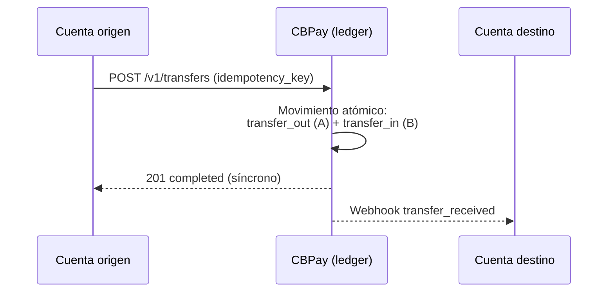

> **Ambientes:** Test `https://cryptobank.qbank.cl/platform` (`pk_test_...`) - Live `https://api.qbank.cl/platform` (`pk_...`).

Las transferencias internas mueven saldo entre dos cuentas **CBPay**, de
forma atómica en el ledger y **siempre sin comisión** — el dinero nunca sale
del ecosistema. Funcionan con las cuatro monedas (`USDT`, `USDC`, `BTC`,
`GOLD`) y siempre **entre saldos de la misma moneda**: el `asset` que envías
es el `asset` que recibe el destino, sin conversión.



Funcionan entre **cualquier combinación de cuentas**:

| Origen | Destino | Comisión |
|---|---|---|
| Persona | Persona | 0 |
| Persona | Empresa | 0 |
| Empresa | Persona | 0 |
| Empresa | Empresa | 0 |

## Crear una transferencia

El destino se identifica por `to_account_id`, `to_email`, **`to_phone`**
(teléfono verificado) o **`to_contact_id`** (un
[contacto](https://docs.cbpayapp.com/es/guias/contactos) de tu libreta):

```bash Por teléfono (verificado)
curl -X POST https://api.qbank.cl/platform/v1/transfers \
  -H "Authorization: Bearer <token>" \
  -H "Content-Type: application/json" \
  -d '{
    "to_phone": "+56987654321",
    "amount": "25.000000",
    "description": "Almuerzo",
    "idempotency_key": "alm-2026-07-10-a"
  }'
```

```bash Por contacto
curl -X POST https://api.qbank.cl/platform/v1/transfers \
  -H "Authorization: Bearer <token>" \
  -H "Content-Type: application/json" \
  -d '{
    "to_contact_id": "3f8a1b2c-…",
    "amount": "10.000000",
    "idempotency_key": "t-991"
  }'
```

```bash Por email (persona → persona)
curl -X POST https://api.qbank.cl/platform/v1/transfers \
  -H "Authorization: Bearer <token>" \
  -H "Content-Type: application/json" \
  -d '{
    "to_email": "carlos@ejemplo.com",
    "amount": "25.000000",
    "description": "Split de gastos",
    "idempotency_key": "split-2026-07-06-a"
  }'
```

```bash Por account_id (persona → empresa)
curl -X POST https://api.qbank.cl/platform/v1/transfers \
  -H "Authorization: Bearer <token>" \
  -H "Content-Type: application/json" \
  -d '{
    "to_account_id": "ae8cf540-22a9-414d-82cc-8ac04732be4f",
    "amount": "120.500000",
    "description": "Pago servicio mensual",
    "idempotency_key": "serv-2026-07-a"
  }'
```

```bash Empresa → persona (nómina)
curl -X POST https://api.qbank.cl/platform/v1/transfers \
  -H "Authorization: Bearer <token de la empresa>" \
  -H "Content-Type: application/json" \
  -d '{
    "to_email": "empleado@ejemplo.com",
    "amount": "850.000000",
    "description": "Sueldo julio",
    "idempotency_key": "nomina-2026-07-emp01"
  }'
```

```bash En otra moneda (GOLD, gramos de oro)
curl -X POST https://api.qbank.cl/platform/v1/transfers \
  -H "Authorization: Bearer <token>" \
  -H "Content-Type: application/json" \
  -d '{
    "to_email": "carlos@ejemplo.com",
    "asset": "GOLD",
    "amount": "2.500000",
    "description": "Regalo en oro",
    "idempotency_key": "oro-2026-07-09-a"
  }'
```

La forma del request es idéntica en todas las combinaciones (persona o
empresa, en cualquier dirección) — cambia solo la credencial que llama.
`asset` es opcional y por defecto `USDT`; acepta `USDT`, `USDC`, `BTC` o
`GOLD` y el destino recibe **en esa misma moneda**.

Respuesta `201` — la transferencia es **síncrona e inmediata**:

```json
{
  "transfer_id": "77b1…",
  "from_account_id": "…",
  "to_account_id": "…",
  "asset": "USDT",
  "amount": "25.000000",
  "description": "Split de gastos",
  "status": "completed",
  "created_at": "2026-07-06T20:10:00Z"
}
```

Replay con la misma `idempotency_key` — `200` con la transferencia
original:

```json
{
  "transfer_id": "77b1…",
  "amount": "25.000000",
  "status": "completed",
  "idempotency_hit": true
}
```

El receptor puede enterarse por el webhook `transfer_received` y ambos ven
el movimiento en su historial (`transfer_out` / `transfer_in`).

> **Nota**
Cada transferencia guarda al destinatario como [contacto](https://docs.cbpayapp.com/es/guias/contactos)
automáticamente (envía `"save_contact": false` para no guardarlo). Por
seguridad, `to_phone` solo resuelve cuentas con el teléfono **verificado
por OTP**; si más de una cuenta comparte el número responde
`422 recipient_ambiguous`.
## Consultar transferencias

Lista las transferencias de tu cuenta (enviadas y recibidas), con
paginación y filtros de fecha:

```bash
curl "https://api.qbank.cl/platform/v1/transfers?from=2026-07-01&to=2026-07-07&page_size=50" \
  -H "Authorization: Bearer <token>"
```

O una en particular por su ID (solo visible para las dos partes):

```bash
curl https://api.qbank.cl/platform/v1/transfers/77b1… \
  -H "Authorization: Bearer <token>"
```

Cada fila trae `direction` (`sent` o `received`) desde tu perspectiva.

## Reglas

- Solo entre cuentas CBPay **activas**; las cuentas internas del sistema no
  pueden recibir.
- Siempre **misma moneda en origen y destino**: no hay conversión entre
  saldos (`USDT`→`USDT`, `GOLD`→`GOLD`, …).
- No puedes transferirte a ti mismo (`400 self_transfer`).
- Requiere `idempotency_key` (body o header `Idempotency-Key`); el replay
  devuelve `200` con `idempotency_hit: true`.
- `amount` acepta hasta los decimales de la moneda: 6 para `USDT`/`USDC`/
  `GOLD`, 8 para `BTC`.

## Errores

| HTTP | `error` | Causa |
|---|---|---|
| 400 | `recipient_required` | Falta `to_account_id`, `to_email`, `to_phone` y `to_contact_id` |
| 400 | `invalid_amount` | Monto inválido, demasiados decimales o `asset` no soportado |
| 400 | `invalid_phone` | `to_phone` no se pudo normalizar a E.164 |
| 400 | `self_transfer` | Origen y destino son la misma cuenta |
| 402 | `insufficient_funds` | Saldo disponible insuficiente en esa moneda |
| 404 | `recipient_not_found` | El email/ID no corresponde a una cuenta CBPay, o ningún teléfono verificado coincide |
| 422 | `recipient_ambiguous` | Más de una cuenta comparte ese teléfono (usa `to_account_id` o `to_email`) |
| 422 | `contact_not_linked` | El contacto no tiene cuenta CBPay asociada |
| 422 | `recipient_unavailable` | La cuenta destino está bloqueada/cerrada |
## FAQ

#### ¿Las transferencias internas tienen costo?
No — las transferencias entre cuentas de tu organización son gratis e
instantáneas.
#### ¿Puedo transferir entre assets distintos?
No — ambos lados mueven el **mismo** asset (USDT a USDT, USDC a USDC…).
Para cambiar de asset, convierte primero con [Swaps](https://docs.cbpayapp.com/es/guias/swaps).
#### ¿Una transferencia se puede reversar?
No — las transferencias son instantáneas e irreversibles. Si enviaste a la
cuenta equivocada, coordina la devolución con la contraparte.
#### ¿Cómo funciona el envío por teléfono?
`to_phone` solo resuelve números **verificados** de tu organización. Un
número sin verificar o desconocido responde 404; si más de una cuenta calza
recibes `recipient_ambiguous` (422) — usa `to_alias` o el ID de cuenta.
#### ¿Qué son to_alias y to_qr_token?
Destinatarios alternativos: el alias inmutable de la cuenta y el token de
su QR de perfil (`GET /v1/me/qr`). Todos resuelven solo dentro de tu
organización.
#### ¿Para qué sirve checkout_token?
Liquida un [link de cobro](https://docs.cbpayapp.com/es/guias/checkout) por transferencia interna:
el destino se fuerza a la cuenta del link y el monto debe cubrir el due
cotizado (si no, `checkout_amount_mismatch`, 422).
