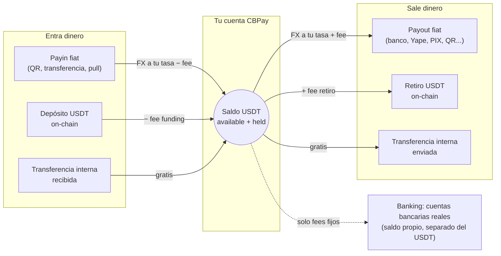

CBPay es una plataforma de pagos multi-moneda para Latinoamérica. Cada
cuenta mantiene **cuatro saldos virtuales independientes** — `USDT` (la
moneda operativa), `USDC`, `BTC` y `GOLD` (gramos de oro) — y opera sobre
ellos:

- **Payouts fiat** - Dispersa dinero a cuentas bancarias locales en Chile, Perú, México, Venezuela, Bolivia, Brasil, Paraguay, Ecuador y Argentina — incluido pagar QRs PIX escaneados.
- **Payins fiat** - Cobra en moneda local (QR, transferencias, cuentas dedicadas, cobros pull) y recibe el abono automáticamente.
- **Checkout** - Un link de pago universal: tu pagador elige su país, método o crypto en una página hosted y tú liquidas en el asset que elijas.
- **Tarjetas y suscripciones** - Emite tarjetas que gastan de cualquier saldo en tiempo real, acepta pagos con tarjeta, [guarda tarjetas y agenda cobros recurrentes](https://docs.cbpayapp.com/es/guias/stored-cards-subscriptions).
- **QR POS** - Registra merchants verificados y genera cobros QR crypto con monto para puntos de venta físicos.
- **Crypto on-chain** - Fondea y retira USDT/USDC por TRON y Ethereum, y BTC nativo por Bitcoin — toda cuenta nace con sus wallets de depósito.
- **Swaps** - Convierte entre tus saldos USDT, USDC, BTC y GOLD a la tasa de tu cuenta, al instante.
- **Transferencias internas** - Mueve saldo a cualquier otra cuenta CBPay — por ID, alias, QR o teléfono verificado — al instante y sin comisión.
- **Banking** - Cuentas bancarias reales a tu nombre: recibe, mantén y envía dinero por rieles internacionales (SEPA, SWIFT, ACH), incluidas cuentas de terceros.
- **Wallets segregadas** - Wallets on-chain dedicadas con saldo propio, aisladas del ledger — créalas, impórtalas y expórtalas.
- **KYC/KYB y compliance** - Verificación de personas y empresas, más [screening AML](https://docs.cbpayapp.com/es/guias/aml) standalone y [screening de direcciones crypto](https://docs.cbpayapp.com/es/guias/screenings).
- **Cartola y analytics** - Estado de cuenta completo por período (JSON, PDF, Excel) con cuadratura garantizada, [comprobantes](https://docs.cbpayapp.com/es/guias/comprobantes) por operación y un [resumen analytics](https://docs.cbpayapp.com/es/guias/analytics) listo para graficar.
Todos los eventos llegan a tus **webhooks firmados**
([guía](https://docs.cbpayapp.com/es/webhooks)).

## Cómo funciona

La operación fiat gira alrededor del saldo USDT — el dinero entra por un
lado, se convierte, y sale por el otro. Los saldos USDC, BTC y GOLD se
mueven con [swaps](https://docs.cbpayapp.com/es/guias/swaps), depósitos y retiros on-chain,
transferencias internas, settlement de payouts (`settlement_asset`) y
conversión automática de payins (`default_payin_asset`):

1. CBPay te da acceso: registro con email/contraseña
   o una API key directa.
2. Fondeas tu cuenta: con un payin fiat o un depósito USDT on-chain.
3. Operas: payouts, transferencias, retiros — todo se debita y acredita
   sobre tu saldo USDT con conversión FX al momento.
4. Te enteras de todo: cada movimiento queda en un historial inmutable
   (`GET /v1/movements`) y los eventos llegan a tus webhooks.

## URLs base y ambientes

CBPay corre dos ambientes totalmente aislados con exactamente la misma API:

| Ambiente | URL base | API keys | Dinero |
|---|---|---|---|
| **Test** | `https://cryptobank.qbank.cl/platform` | `pk_test_...` | Simulado — cada riel lo sirve un simulador determinista |
| **Live** | `https://api.qbank.cl/platform` | `pk_...` | Real e irreversible |

Todas las rutas de esta documentación son relativas a esas URLs base.
Construye primero contra **test** y pasa a live cambiando la URL y la key —
detalles, valores mágicos y checklist de salida a producción en
[entorno y pruebas](https://docs.cbpayapp.com/es/entorno-y-pruebas).

> **Nota**
Los montos son siempre **strings decimales** (ej. `"10.500000"`), nunca
números flotantes. Cada moneda usa su precisión: 6 decimales para
`USDT`/`USDC`/`GOLD` y 8 para `BTC`.
## Siguientes pasos

### Crea tu cuenta y token

Sigue el [inicio rápido](https://docs.cbpayapp.com/es/inicio-rapido) para registrarte y hacer tu
primera llamada.
### Entiende el modelo de dinero

Lee [modelo de dinero](https://docs.cbpayapp.com/es/conceptos/modelo-de-dinero) y
[comisiones](https://docs.cbpayapp.com/es/conceptos/comisiones).
### Integra tu primer producto

Empieza por [payouts](https://docs.cbpayapp.com/es/guias/payouts) o [payins](https://docs.cbpayapp.com/es/guias/payins).
