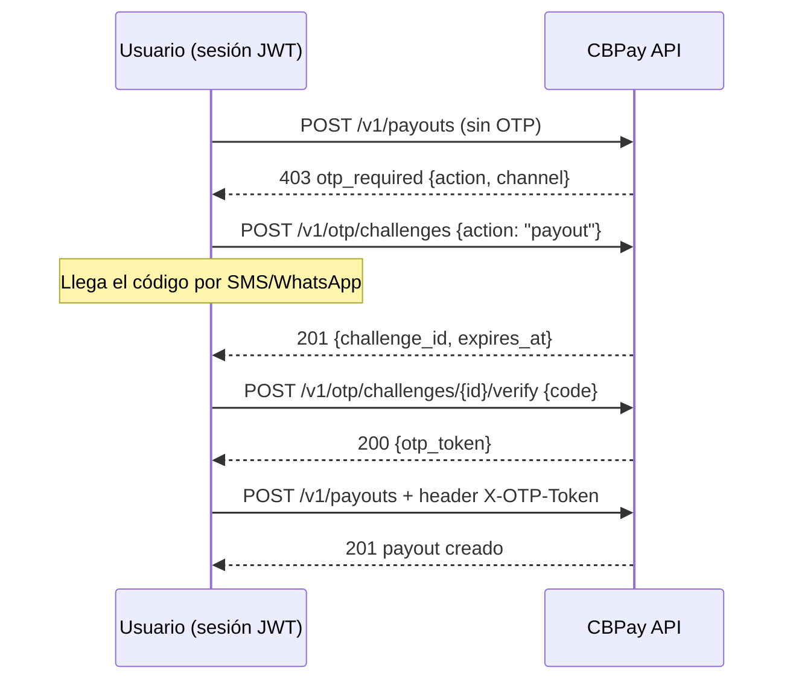

CBPay puede exigir un **código de verificación de un solo uso (OTP)** antes
de las acciones sensibles: iniciar sesión, crear un payout, retirar crypto,
revelar una tarjeta, emitir una API key… El código llega por **SMS o
WhatsApp** al teléfono de la cuenta, y tu operador decide **qué acciones lo
exigen y por qué canal** — por cuenta o para toda la organización.

> **Nota**
El OTP aplica **solo a sesiones de usuario** (login con JWT). Las **API keys
`pk_` están exentas**: son integraciones server-to-server y no hay un humano
con teléfono al otro lado. Si toda tu operación usa API keys, esta página no
cambia nada de tu integración.
> **Nota**
Esta página cubre el **flujo OTP por acción** que tu integración debe manejar
(`otp_required` → challenge → verify). Todo lo que el usuario final gestiona
sobre sus propios factores — activar el 2FA, canales (SMS/WhatsApp/email), la
app autenticadora (TOTP), códigos de recuperación y passkeys — vive en
[Perfil y seguridad](https://docs.cbpayapp.com/es/guias/perfil).
## Cómo funciona



El `otp_token` es de **un solo uso**, está ligado a tu usuario y a la acción
para la que se emitió, y expira junto con el desafío (10 minutos desde el
envío del código).

## 1. Consulta tu política

`GET /v1/otp/settings` te dice si el OTP está activo y qué acciones lo
exigen:

```bash
curl https://api.qbank.cl/platform/v1/otp/settings \
  -H "Authorization: Bearer <token>"
```

```json
{
  "enabled": true,
  "phone": "********5678",
  "phone_verified": true,
  "actions": [
    { "action": "login", "required": true, "channel": "sms" },
    { "action": "payout", "required": true, "channel": "whatsapp" },
    { "action": "crypto_withdrawal", "required": true, "channel": "sms" },
    { "action": "transfer", "required": false, "channel": "sms" },
    { "action": "banking_operation", "required": false, "channel": "sms" },
    { "action": "card_reveal", "required": true, "channel": "sms" },
    { "action": "api_key_create", "required": true, "channel": "sms" },
    { "action": "member_add", "required": false, "channel": "sms" },
    { "action": "phone_change", "required": true, "channel": "sms" }
  ]
}
```

## 2. Pide el código

```bash
curl -X POST https://api.qbank.cl/platform/v1/otp/challenges \
  -H "Authorization: Bearer <token>" \
  -H "Content-Type: application/json" \
  -d '{ "action": "payout" }'
```

Respuesta `201` — el código ya viaja al teléfono de la cuenta:

```json
{
  "challenge_id": "6f1c02aa-93a1-4f0e-a7d1-1f2e3c4b5a69",
  "account_id": "9b1deb4d-3b7d-4bad-9bdd-2b0d7b3dcb6d",
  "action": "payout",
  "channel": "whatsapp",
  "phone": "********5678",
  "status": "pending",
  "created_at": "2026-07-08T21:00:00Z",
  "expires_at": "2026-07-08T21:10:00Z"
}
```

Si la cuenta no tiene teléfono: `409 phone_required` (cárgalo con
`PATCH /v1/me`). Hay límites de envío por hora — si te pasas,
`429 too_many_attempts`.

## 3. Verifica el código

```bash
curl -X POST https://api.qbank.cl/platform/v1/otp/challenges/6f1c02aa-93a1-4f0e-a7d1-1f2e3c4b5a69/verify \
  -H "Authorization: Bearer <token>" \
  -H "Content-Type: application/json" \
  -d '{ "code": "482913" }'
```

```json
{
  "challenge_id": "6f1c02aa-93a1-4f0e-a7d1-1f2e3c4b5a69",
  "action": "payout",
  "otp_token": "otp_Zk9uY2XIr1EYE0lq8xqlM3VayVZYX4aa11bb22cc33",
  "expires_at": "2026-07-08T21:10:00Z",
  "note": "single use: send it in the X-OTP-Token header of the protected action"
}
```

Código incorrecto → `401 invalid_code` (tienes 5 intentos por desafío).

## 4. Ejecuta la acción con el token

```bash
curl -X POST https://api.qbank.cl/platform/v1/payouts \
  -H "Authorization: Bearer <token>" \
  -H "X-OTP-Token: otp_Zk9uY2XIr1EYE0lq8xqlM3VayVZYX4aa11bb22cc33" \
  -H "Content-Type: application/json" \
  -d '{ "country": "CL", "currency": "CLP", "method": "bank_transfer", "amount": "50000", "beneficiary": { "...": "..." }, "idempotency_key": "pay-991" }'
```

El token se consume al usarlo, incluso si la acción falla después (por
ejemplo por saldo insuficiente): para reintentar necesitas verificar un
desafío nuevo. Tu `idempotency_key` sigue siendo la protección contra
duplicados — el OTP no la reemplaza.

## Login en dos pasos

Si tu política exige OTP en `login`, `POST /v1/auth/login` deja de devolver
la sesión directamente:

```json
{
  "otp_required": true,
  "pending_token": "eyJhbGciOi…",
  "challenge_id": "8a2b…",
  "channel": "sms",
  "phone": "********5678",
  "expires_at": "2026-07-08T21:10:00Z",
  "note": "verify the code with POST /v1/auth/login/otp to receive the session token"
}
```

El `pending_token` **no sirve para llamar a la API**: solo se canjea, junto
con el código, por la sesión real:

```bash
curl -X POST https://api.qbank.cl/platform/v1/auth/login/otp \
  -H "Content-Type: application/json" \
  -d '{ "pending_token": "eyJhbGciOi…", "code": "482913" }'
```

```json
{
  "access_token": "eyJhbGciOi…",
  "expires_at": "2026-07-09T21:00:00Z",
  "account_id": "9b1deb4d-3b7d-4bad-9bdd-2b0d7b3dcb6d",
  "role": "owner"
}
```

## El teléfono de la cuenta

- Formato **E.164** (`+56912345678`), se define en el registro, con
  `PATCH /v1/me` o por tu operador.
- `phone_verified` pasa a `true` la primera vez que verificas un desafío:
  demuestra que el titular tiene el teléfono en mano.
- **Cambiar el teléfono** (acción `phone_change`) valida el código contra el
  número **anterior** — así nadie puede redirigir tus códigos sin tener tu
  teléfono actual.
- Si el teléfono se enlaza por primera vez (o se cambia sin verificación),
  los desafíos por SMS/WhatsApp quedan bloqueados por **24 horas**: es la
  ventana anti-secuestro de sesión. Durante el cooldown, si tienes la app
  autenticadora enrolada o tu email verificado, el desafío se emite
  automáticamente por ese factor más fuerte (el canal llega en la respuesta
  del desafío); solo si no tienes ninguna alternativa recibes
  `403 phone_binding_cooldown`. El teléfono cargado por tu operador no tiene
  cooldown.
- El **login en dos pasos** respeta la misma regla: con 2FA de login por
  SMS/WhatsApp y el teléfono en cooldown, el código del login se emite por
  la app autenticadora o tu email de login (el `channel` efectivo llega en
  la respuesta del login) — jamás viaja a un número recién enlazado sin
  verificar. Sin factor alternativo el login responde
  `403 phone_binding_cooldown` hasta que venza el cooldown.

## Errores

| HTTP | `error` | Qué significa | Qué hacer |
|---|---|---|---|
| 403 | `otp_required` | La acción exige OTP y no enviaste `X-OTP-Token` | Crea y verifica un desafío, reintenta con el header |
| 403 | `otp_invalid` | Token inválido, expirado o ya usado | Verifica un desafío nuevo |
| 403 | `session_required` | Pediste un desafío con una API key | Los desafíos son solo para sesiones de usuario |
| 403 | `phone_binding_cooldown` | Teléfono enlazado hace menos de 24 h sin verificación y sin factor alternativo (app autenticadora o email verificado) | Enrola la app autenticadora o verifica tu email; si no, espera el cooldown o pide a tu operador fijar el número |
| 401 | `invalid_code` | El código no coincide | Revisa el SMS/WhatsApp y reintenta (5 intentos) |
| 401 | `invalid_pending_token` | El token intermedio del login expiró | Vuelve a iniciar sesión |
| 409 | `phone_required` | La cuenta no tiene teléfono | `PATCH /v1/me` con `phone` E.164 |
| 409 | `otp_phone_missing` | El login exige OTP y no hay teléfono | Contacta a tu operador |
| 409 | `challenge_not_pending` | El desafío expiró o ya se usó | Crea uno nuevo |
| 429 | `too_many_attempts` | Límite de envíos/verificaciones | Espera unos minutos |
| 503 | `otp_unavailable` | El servicio de verificación no está disponible | Reintenta; la acción queda bloqueada (nunca se salta el OTP) |

## FAQ

#### ¿El OTP afecta mis integraciones server-to-server?
    No. Las API keys `pk_` están exentas por diseño: la automatización no
    pasa por OTP. Protege tus keys como corresponde — emitir una key nueva
    sí puede exigir OTP (acción `api_key_create`).
#### ¿Puedo elegir SMS o WhatsApp?
    El canal lo configura tu operador por acción (por cuenta o para toda la
    organización). Lo ves en `GET /v1/otp/settings`.
#### ¿Cuánto dura un código y cuántos intentos tengo?
    El código y el desafío duran 10 minutos. Tienes 5 verificaciones por
    desafío y un límite de envíos por hora. El `otp_token` resultante es de
    un solo uso.
#### ¿Puedo pedir el token una vez y usarlo en varias acciones?
    No: el token queda ligado a la acción exacta para la que pediste el
    desafío (un token de `payout` no sirve para `transfer`) y se consume al
    primer uso.
#### La acción falló después de consumir el token, ¿pago dos veces?
    No. El token consumido solo te obliga a verificar un desafío nuevo; la
    `idempotency_key` de la operación sigue garantizando que no haya
    duplicados.
