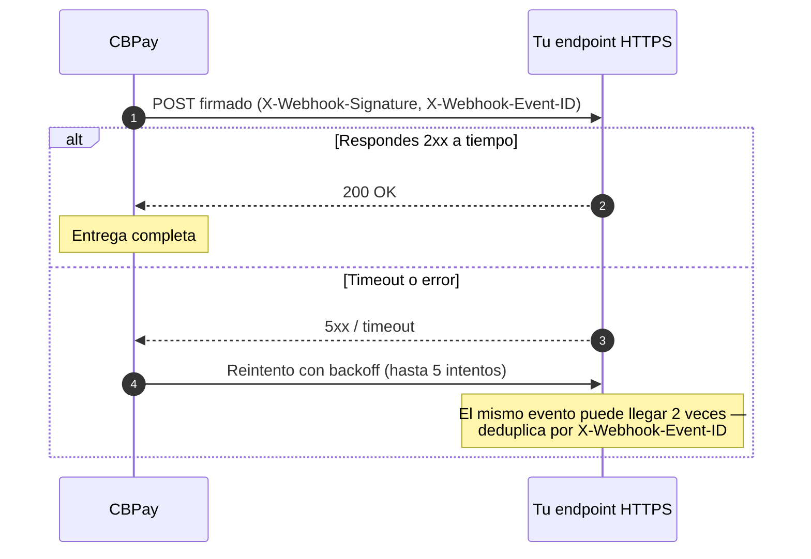

Los webhooks te notifican los eventos de tu cuenta en un callback HTTPS
propio, firmados criptográficamente.



## Crear una suscripción

```bash
curl -X POST https://api.qbank.cl/platform/v1/webhooks/subscriptions \
  -H "Authorization: Bearer <token>" \
  -H "Content-Type: application/json" \
  -d '{
    "event_type": "payout_status_changed",
    "callback_url": "https://api.miapp.com/webhooks/cbpay",
    "secret": "un-secreto-de-al-menos-16-chars"
  }'
```

- `event_type`: uno de los eventos de la tabla siguiente, o `*` para todos.
- `callback_url`: **HTTPS obligatorio**; se rechazan localhost e IPs
  privadas — para desarrollo local usa un
  [túnel HTTPS](https://docs.cbpayapp.com/es/entorno-y-pruebas#probar-webhooks-en-desarrollo-local).
- `secret`: mínimo 16 caracteres; se usa para firmar cada entrega. Se
  almacena cifrado y no puede recuperarse.

La suscripción recibe los eventos de **tu cuenta**. Puedes listar las
suscripciones activas en cualquier momento:

```bash
curl https://api.qbank.cl/platform/v1/webhooks/subscriptions \
  -H "Authorization: Bearer <token>"
```

```json
{
  "page": 1,
  "page_size": 50,
  "subscriptions": [
    {
      "id": "5f3a…",
      "event_type": "payout_status_changed",
      "callback_url": "https://api.miapp.com/webhooks/cbpay",
      "status": "active",
      "created_at": "2026-07-01T12:00:00Z"
    }
  ]
}
```

## Desactivar y reactivar una suscripción

Cuando un callback deja de usarse, desactívalo en vez de borrarlo (las
suscripciones **nunca se borran**: quedan `disabled` y puedes reactivarlas
cuando quieras):

```bash
curl -X PATCH https://api.qbank.cl/platform/v1/webhooks/subscriptions/5f3a… \
  -H "Authorization: Bearer <token>" \
  -H "Content-Type: application/json" \
  -d '{ "status": "disabled" }'
```

```json
{
  "id": "5f3a…",
  "event_type": "payout_status_changed",
  "callback_url": "https://api.miapp.com/webhooks/cbpay",
  "status": "disabled",
  "created_at": "2026-07-01T12:00:00Z"
}
```

Para reactivarla, el mismo llamado con `{ "status": "active" }`.

- El toggle rige lo **futuro**: una suscripción `disabled` deja de recibir
  eventos nuevos, pero las entregas **ya encoladas** siguen saliendo.
- Es **idempotente**: repetir el estado vigente responde `200` sin cambiar
  nada.
- Solo puedes tocar las suscripciones de **tu cuenta**: una suscripción de
  otra cuenta responde `404` (es indistinguible de una inexistente).

| HTTP | `error` | Solución |
|---|---|---|
| 400 | `invalid_status` | El estado debe ser `active` o `disabled` |
| 404 | `not_found` | La suscripción no existe o pertenece a otra cuenta |

## Eventos

| Evento | Cuándo se emite |
|---|---|
| `payin_credited` | Un cobro fiat fue recibido y abonado |
| `payin_expired` | Un cobro activo (QR / checkout) venció o falló sin recibir el pago |
| `payin_refunded` | Una [devolución](https://docs.cbpayapp.com/es/guias/devoluciones) de un cobro con tarjeta llegó a estado final (incluye el contracargo impuesto por el emisor) |
| `payout_status_changed` | Un payout cambió de estado |
| `transfer_received` | La cuenta recibió una transferencia interna |
| `crypto_deposit_credited` | Un depósito on-chain fue confirmado y abonado |
| `crypto_deposit_held` | Un depósito entrante quedó retenido por riesgo del remitente ([screening](https://docs.cbpayapp.com/es/guias/screenings)) |
| `crypto_deposit_alert` | Un depósito se acreditó pero el remitente presenta riesgo alto (informativo) |
| `crypto_withdrawal_status_changed` | Un retiro on-chain cambió de estado |
| `banking_customer_status_changed` | Cambió la verificación de un perfil bancario (propio o de un tercero registrado — `customer_kind` lo distingue) |
| `banking_operation_status_changed` | Un pago bancario cambió de estado |
| `card_transaction` | Una compra con tarjeta fue autorizada, anulada o ajustada |
| `card_status_changed` | Una tarjeta cambió de estado (incluye congelamiento automático) |
| `card_stored` | La tarjeta de un pagador fue tokenizada y guardada con consentimiento ([tarjetas guardadas](https://docs.cbpayapp.com/es/guias/payins#tarjetas-guardadas)) |
| `stored_card_revoked` | Una credencial de tarjeta guardada fue revocada (los cobros iniciados por el comercio dejan de funcionar) |
| `subscription_status_changed` | Una suscripción sobre una tarjeta guardada cambió de estado (`active` / `paused` / `past_due` / `canceled`) |
| `kyc_verification_status_changed` / `kyb_verification_status_changed` | Una verificación de identidad cambió de estado (incluye tu propio onboarding, con `self_onboarding: true`) |
| `kyc_link_completed` / `kyb_link_completed` | Un link de verificación hosteado fue completado |
| `kyc_document_validated` / `kyb_document_validated` | Terminó el OCR de un documento subido por API |
| `kyc_liveness_completed` | Una prueba de vida fue completada desde un liveness link |
| `aml_screening_updated` | Novedades del screening AML (resultado, casos, riesgo, transacción revisada) |
| `risk_report_ready` | Un informe crediticio [Qscore](https://docs.cbpayapp.com/es/guias/qscore) terminó de generarse (lleva el score y la banda) |
| `risk_score_changed` | El score de un sujeto monitoreado se movió (re-evaluación tras nuevos datos del buró) |
| `wallet_deposit_received` | Llegó un depósito on-chain a una [wallet segregada](https://docs.cbpayapp.com/es/guias/wallets-segregadas) (no toca el ledger) |
| `wallet_send_status_changed` | Un envío desde una wallet segregada cambió de estado |
| `wallet_key_exported` | Se exportó la llave privada de una wallet segregada (alerta de seguridad) |
| `wallet_external_movement` | Movimiento on-chain de una wallet segregada que no pasó por la plataforma (esperable en custodia `client`) |
| `wallet_key_compromise_suspected` | **Alarma crítica**: salida externa desde una wallet con custodia `cbpay` — posible llave comprometida |
| `txn_review_status_changed` | Una operación retenida por el [firewall transaccional](https://docs.cbpayapp.com/es/guias/revisiones-operaciones) cambió de estado de revisión (`in_review` / `info_requested` / `released` / `rejected`) — payload neutro, sin motivos internos; un rechazo también puede venir del barrido automático por plazo (auto-rechazo) |
| `corridor_status_changed` | Un corredor de pago cambió su disponibilidad (`operational` / `degraded` / `down`) — broadcast, ver la [guía de estado del servicio](https://docs.cbpayapp.com/es/estado-del-servicio) |
| `balance_adjusted` | Un administrador aplicó un abono o cargo manual sobre un saldo |
| `account_status_changed` | El estado administrativo de la cuenta cambió (`active` / `blocked` / `closed`) |
| `member_security_event` | Hecho de seguridad de un usuario de la cuenta (inicio de sesión, cambio de credenciales, factor nuevo, sesión revocada) |

### Payload de cada evento

```json payin_credited
{
  "payin_id": "9c2a…",
  "account_id": "ae8c…",
  "country": "BO",
  "currency": "BOB",
  "local_amount": "700.00",
  "fx_rate": "6.91",
  "usdt_credited": "100.302460",
  "fee": "1.000000"
}
```

```json payin_expired
{
  "payin_id": "567d…",
  "account_id": "ae8c…",
  "status": "expired",
  "country": "BO",
  "currency": "BOB",
  "local_amount": "60.99",
  "reference": "CBK7Q2M4XZ9P"
}
```

```json payin_refunded
{
  "refund_id": "3a7d…",
  "payin_id": "9f1c…",
  "account_id": "c57f…",
  "kind": "refund",
  "status": "completed",
  "currency": "USD",
  "local_amount": "40.00",
  "usdt_debited": "40.000000",
  "receipt_url": "https://api.qbank.cl/platform/v1/payin-refunds/3a7d…/receipt"
}
```

```json payout_status_changed
{
  "payout_id": "0d4f…",
  "account_id": "ae8c…",
  "country": "MX",
  "currency": "MXN",
  "local_amount": "1500.00",
  "usdt_amount": "85.714286",
  "total_debit": "86.014286",
  "status": "completed",
  "status_code": "",
  "bank_reference": "00761123456"
}
```

```json txn_review_status_changed
{
  "account_id": "ae8c…",
  "review_id": "7a3f…",
  "kind": "payout",
  "resource_id": "0d4f…",
  "status": "info_requested",
  "previous_status": "in_review",
  "amount": "1500.00",
  "asset": "USD"
}
```

```json transfer_received
{
  "transfer_id": "77b1…",
  "from_account_id": "389d…",
  "to_account_id": "ae8c…",
  "asset": "USDT",
  "amount": "25.000000",
  "description": "Split de gastos",
  "created_at": "2026-07-06T20:10:00Z"
}
```

```json crypto_deposit_credited
{
  "account_id": "ae8c…",
  "chain": "tron",
  "asset": "USDT",
  "tx_id": "b1946ac9…",
  "amount": "499.000000",
  "fee": "1.000000"
}
```

```json crypto_deposit_held
{
  "account_id": "ae8c…",
  "hold_id": "c1d2e3f4…",
  "chain": "tron",
  "asset": "usdt",
  "tx_id": "8a5b3c…",
  "risk": "Severe",
  "status": "held"
}
```

```json crypto_deposit_alert
{
  "account_id": "ae8c…",
  "chain": "tron",
  "asset": "usdt",
  "tx_id": "9c6d4e…",
  "risk": "High",
  "status": "credited"
}
```

```json crypto_withdrawal_status_changed
{
  "withdrawal_id": "5e8c…",
  "account_id": "ae8c…",
  "chain": "tron",
  "asset": "USDT",
  "tx_id": "7d3f01aa…",
  "status": "completed",
  "amount": "100.000000"
}
```

```json banking_customer_status_changed
{
  "account_id": "ae8c…",
  "customer_id": "9f2b…",
  "customer_kind": "third_party",
  "third_party_id": "77aa…",
  "kyc_status": "approved"
}
```

En `banking_customer_status_changed`, `customer_kind` distingue tu perfil
propio (`self`) de un tercero que registraste (`third_party`, con su
`third_party_id` — el mismo id de `GET /v1/banking/third-parties/{id}`).

```json banking_operation_status_changed
{
  "account_id": "ae8c…",
  "customer_id": "9f2b…",
  "operation_id": "7e8a…",
  "type": "withdraw",
  "status": "completed"
}
```

```json card_transaction
{
  "account_id": "ae8c…",
  "card_id": "3c2b…",
  "transaction_id": "5e4d…",
  "status": "authorized",
  "amount_usdt": "16.170000",
  "merchant": "AMZN Mktp"
}
```

```json card_status_changed
{
  "account_id": "ae8c…",
  "card_id": "3c2b…",
  "status": "frozen",
  "reason": "monthly_fee_unpaid"
}
```

```json card_stored
{
  "stored_card_id": "a9b8…",
  "account_id": "ae8c…",
  "payer_reference": "pagador@email.com",
  "brand": "VISA",
  "last4": "1234",
  "country": "BO",
  "currency": "BOB",
  "seed_payin_id": "9c2a…"
}
```

```json stored_card_revoked
{
  "stored_card_id": "a9b8…",
  "account_id": "ae8c…",
  "payer_reference": "pagador@email.com",
  "brand": "VISA",
  "last4": "1234"
}
```

```json subscription_status_changed
{
  "subscription_id": "4f1e…",
  "account_id": "ae8c…",
  "stored_card_id": "a9b8…",
  "status": "past_due",
  "period": 3,
  "next_charge_at": "2026-08-01T12:00:00Z",
  "payer_reference": "pagador@email.com",
  "reason": "dunning_exhausted",
  "failed_attempts": 3
}
```

```json kyc_verification_status_changed
{
  "account_id": "ae8c…",
  "kind": "kyc",
  "event": "approved",
  "submission_id": "c3d4…",
  "external_customer_id": "cust_789",
  "status": "approved",
  "risk_band": "low",
  "decision": "approved",
  "decision_source": "auto"
}
```

Cuando el evento lleva una decisión final (`approved`, `rejected` o
`changes_requested`), el payload incluye `decision_source`: `"auto"` si la
resolvió el motor de decisión automática (los expedientes limpios se aprueban
en segundos sin intervención humana), `"admin"` si la decidió un oficial de
cumplimiento desde la consola de revisión. El campo se omite en submissions
antiguas sin datos del motor.

```json kyb_link_completed
{
  "account_id": "ae8c…",
  "kind": "kyb",
  "event": "link_completed",
  "link_id": "b2c3…",
  "submission_id": "d4e5…",
  "external_customer_id": "cust_456",
  "status": "completed"
}
```

```json kyc_document_validated
{
  "account_id": "ae8c…",
  "kind": "kyc",
  "submission_id": "c3d4…",
  "external_customer_id": "cust_789",
  "category": "identity",
  "outcome": "MATCH",
  "score": 0.97,
  "summary": "Document matches the submitted identity"
}
```

```json kyc_liveness_completed
{
  "account_id": "ae8c…",
  "kind": "kyc",
  "submission_id": "c3d4…",
  "external_customer_id": "cust_789",
  "outcome": "PASS",
  "passed": true
}
```

```json aml_screening_updated
{
  "account_id": "ae8c…",
  "screening_event": "compliance_risk_changed",
  "customer_id": "cus_8f2e…",
  "data": { "risk_level": "high" }
}
```

```json wallet_deposit_received
{
  "wallet_id": "b7e3…",
  "account_id": "ae8c…",
  "chain": "tron",
  "asset": "USDT",
  "tx_id": "b1946ac9…",
  "amount_raw": "125000000",
  "from_address": "TDonor…"
}
```

```json wallet_send_status_changed
{
  "send_id": "9c8b…",
  "wallet_id": "b7e3…",
  "account_id": "ae8c…",
  "chain": "tron",
  "asset": "USDT",
  "tx_id": "b1946ac9…",
  "status": "completed",
  "amount_raw": "25500000"
}
```

```json wallet_key_exported
{
  "wallet_id": "b7e3…",
  "account_id": "ae8c…",
  "chain": "tron",
  "asset": "USDT",
  "address": "TRmSZRaMAqLEevAdGwo3R43bRBXamWR5bd"
}
```

```json wallet_external_movement
{
  "wallet_id": "b7e3…",
  "account_id": "ae8c…",
  "chain": "tron",
  "asset": "USDT",
  "direction": "out",
  "tx_id": "9a3c1e5f…",
  "amount_raw": "25000000",
  "custody": "client"
}
```

```json wallet_key_compromise_suspected
{
  "wallet_id": "b7e3…",
  "account_id": "ae8c…",
  "chain": "tron",
  "asset": "USDT",
  "direction": "out",
  "tx_id": "9a3c1e5f…",
  "amount_raw": "25000000",
  "custody": "cbpay"
}
```

```json risk_report_ready
{
  "report_id": "9f1c…",
  "subject_id": "6aa2…",
  "doc_id": "76.123.456-7",
  "country": "CL",
  "subject_type": "person",
  "score": 712,
  "band": "B",
  "verify_code": "Q9f1c2e7a5b6d4c8e9a0f1d2b3c4d5e6f0123456789ab"
}
```

```json risk_score_changed
{
  "subject_id": "6aa2…",
  "report_id": "9f1c…",
  "old_score": 688,
  "new_score": 712,
  "old_band": "C",
  "new_band": "B"
}
```

```json corridor_status_changed
{
  "flow": "payout",
  "country": "VE",
  "currency": "VES",
  "method": "bank_transfer",
  "status": "down",
  "previous_status": "operational",
  "since": "2026-07-24T22:10:00Z",
  "reason": "consecutive infrastructure failures"
}
```

```json balance_adjusted
{
  "account_id": "ae8c…",
  "asset": "USDT",
  "amount": "25.000000",
  "direction": "credit",
  "reason": "goodwill credit",
  "available": "1025.000000",
  "held": "0.000000"
}
```

```json account_status_changed
{
  "account_id": "ae8c…",
  "status": "blocked",
  "previous_status": "active"
}
```

```json member_security_event
{
  "account_id": "ae8c…",
  "member_id": "3f7b…",
  "event_type": "password_changed",
  "ip": "200.83.14.7",
  "user_agent": "Mozilla/5.0 (Macintosh; Intel Mac OS X 10_15_7)"
}
```

En `payout_status_changed` y `crypto_withdrawal_status_changed`, `status`
puede ser `completed` o `failed` (con `failed` el débito ya fue
reembolsado cuando recibes el evento).

## Formato de entrega

Cada entrega es un `POST` JSON con estos headers:

| Header | Contenido |
|---|---|
| `X-Webhook-Event` | Tipo de evento |
| `X-Webhook-Event-ID` | ID único del evento |
| `X-Webhook-Delivery-ID` | ID de esta entrega (cambia entre reintentos) |
| `X-Webhook-Timestamp` | Unix timestamp (segundos, UTC) |
| `X-Webhook-Signature` | Firma HMAC (ver abajo) |

## Verificar la firma

```
X-Webhook-Signature = hex( HMAC-SHA256( secret, timestamp + "." + body ) )
```

```javascript Node.js
const crypto = require("crypto");

function verifyWebhook(req, secret) {
  const ts = req.headers["x-webhook-timestamp"];
  const sig = req.headers["x-webhook-signature"];
  const expected = crypto
    .createHmac("sha256", secret)
    .update(ts + "." + req.rawBody)
    .digest("hex");
  return crypto.timingSafeEqual(Buffer.from(sig), Buffer.from(expected));
}
```

```python Python
import hashlib, hmac

def verify_webhook(headers, raw_body: bytes, secret: str) -> bool:
    ts = headers["X-Webhook-Timestamp"]
    sig = headers["X-Webhook-Signature"]
    expected = hmac.new(
        secret.encode(), f"{ts}.".encode() + raw_body, hashlib.sha256
    ).hexdigest()
    return hmac.compare_digest(sig, expected)
```

> **Importante**
Calcula el HMAC sobre el **body crudo** (bytes tal como llegan), no sobre el
JSON re-serializado. Rechaza timestamps muy antiguos (> 5 minutos) para
prevenir replay.
## Reintentos e idempotencia

- Tu endpoint debe responder **2xx** dentro del timeout; cualquier otra
  respuesta se reintenta.
- Hasta **5 intentos** con backoff incremental:

| Intento | 1 | 2 | 3 | 4 | 5 |
|---|---|---|---|---|---|
| Espera aprox. | inmediato | ~5s | ~20s | ~45s | ~80s |

- Usa `X-Webhook-Event-ID` para deduplicar: el mismo evento puede llegar más
  de una vez (entregas at-least-once).
- Si los 5 intentos fallan, el evento no se reenvía — recupera el estado
  con el `GET` del recurso (por eso ningún flujo debe depender SOLO del
  webhook).

## Buenas prácticas

- Responde `200` de inmediato y procesa en background.
- Registra el `X-Webhook-Delivery-ID` para trazabilidad.
- No dependas solo de webhooks para estados críticos: puedes consultar el
  objeto por API en cualquier momento (`GET /v1/payouts/{id}`, etc.).
