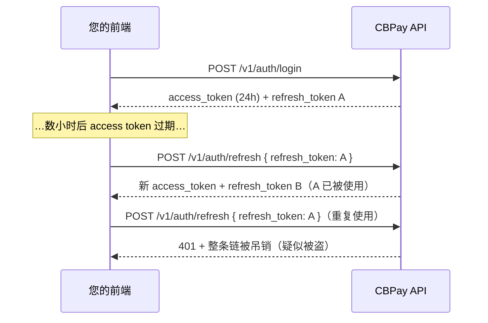

除注册和登录外，每次调用都必须在 `Authorization` 请求头中携带
凭证：

```
Authorization: Bearer <token>
```

也可使用 `X-API-Key: <token>` 作为替代请求头。

## 凭证类型

#### JWT 会话（有登录的用户）

通过 `POST /v1/auth/register` 或 `POST /v1/auth/login` 获取，有效期
**24 小时**。适用于用户需要登录的应用。除 `access_token` 外，您还会收到
一个**刷新令牌（refresh token）**，无需再次输入密码即可续期会话 ——
见[会话续期](#session-renewal-refresh-tokens)。

```bash
curl -X POST https://api.qbank.cl/platform/v1/auth/login \
  -H "Content-Type: application/json" \
  -d '{ "org": "cbpay", "email": "ana@example.com", "password": "…" }'
```

```json
{
  "access_token": "eyJ…",
  "expires_at": "2026-07-14T15:20:49Z",
  "refresh_token": "rt_6a1e6c22-….XXXXXXXX…",
  "refresh_expires_at": "2026-08-12T15:20:49Z",
  "account_id": "…",
  "role": "owner"
}
```

企业账户可以拥有多个具有不同角色的**成员** —— 见下文
[企业成员](#company-members)。

> **注**
如果账户策略要求**登录时进行 OTP 验证**，响应会返回
`otp_required: true` 及一个 `pending_token`（而非会话）：第二步在
`POST /v1/auth/login/otp` 使用通过 SMS/WhatsApp 收到的验证码完成。
完整流程见[安全与双因素认证](https://docs.cbpayapp.com/zh/security-2fa)。
> **注**
您还可以提供**使用 Google、Apple、Microsoft 或 Facebook 注册和登录**
（免密码）—— 见[社交登录](https://docs.cbpayapp.com/zh/guides/social-login)。
#### API 密钥（服务器到服务器）

格式为 `pk_<key_id>.<secret>`。永不过期，且不绑定任何会话。
签发方式：

```bash
curl -X POST https://api.qbank.cl/platform/v1/api-keys \
  -H "Authorization: Bearer <session-token>" \
  -H "Content-Type: application/json" \
  -d '{ "label": "production-backend" }'
```

```json
{
  "api_key_id": "…",
  "key_id": "a1b2c3d4e5f60718",
  "token": "pk_a1b2c3d4e5f60718.XXXXXXXX…",
  "note": "store this token now; it cannot be retrieved again"
}
```

> **重要**
明文令牌**仅显示一次**。服务器端只存储其哈希 —— 如果丢失，请签发
新的密钥。
## 会话续期（刷新令牌） {#session-renewal-refresh-tokens}

`access_token` 有效期为 24 小时；`refresh_token`（`rt_…`）可让您在
**无需重新登录**的情况下换取新的令牌对，有效期 30 天，每次使用自动
续期，自最初登录起最长 90 天。它是**一次性的**：每次兑换都会返回新的
`refresh_token`，旧的立即失效（轮换）。



```bash
curl -X POST https://api.qbank.cl/platform/v1/auth/refresh \
  -H "Content-Type: application/json" \
  -d '{ "refresh_token": "rt_6a1e6c22-….XXXXXXXX…" }'
```

```json
{
  "access_token": "eyJ…",
  "expires_at": "2026-07-14T15:20:50Z",
  "refresh_token": "rt_9f2b1c30-….YYYYYYYY…",
  "refresh_expires_at": "2026-08-12T15:20:50Z",
  "account_id": "…",
  "role": "owner"
}
```

前端必须了解的安全规则：

- **严格轮换**：兑换时，该设备之前的 access token 立即被吊销（每条链
  只有一个存活的 access token）。请始终用响应中的令牌替换两个令牌。
- **重复使用 = 被盗**：如果已兑换过的刷新令牌再次被提交，该设备的整条
  链（令牌和会话）将被吊销，并在 `GET /v1/me/security/events` 中记录
  `refresh_token_reuse` 事件。用户必须重新登录。
- **随会话失效**：退出登录（`DELETE /v1/me/sessions/{id}`）、
  `POST /v1/me/sessions/revoke-all` 或修改/重置密码也会使关联的刷新
  令牌失效。
- 任何拒绝都返回 `401 invalid_refresh_token` —— 收到该错误时请引导用户
  重新登录。
- 请将刷新令牌保存在安全存储中（移动端使用 Keychain/Keystore；Web 端
  建议内存 + 重新登录，或由您的后端使用 httpOnly Cookie）。`pk_` API
  密钥不使用刷新机制：它们永不过期。

#### 应该多久刷新一次？
在 access token 即将过期时（参考 `expires_at`），或在正常调用收到
`401` 时刷新。避免多处并行刷新：同一令牌的两次兑换同时到达时，一次
成功、另一次收到 `401` 且不受惩罚 —— 但兑换一个**已被轮换**的令牌会
吊销整条链。
#### 90 天后会发生什么？
链的绝对上限是自最初登录起 90 天：即使每天刷新，到达上限后刷新会返回
`401`，用户必须重新认证（密码、通行密钥或社交登录）。
#### 刷新对 API 密钥适用吗？
不适用：`pk_` API 密钥永不过期且没有会话。刷新仅用于人类用户的 JWT
会话。
## 访问级别

您的凭证（会话 JWT 或 API 密钥）操作的是**您自己的账户**：余额、
付款、收款、转账、加密资产、KYC/KYB 以及您自己的 webhook。如果某个
端点返回 `403 account_required` 或 `403 org_admin_required`，说明该
操作属于其他凭证级别 —— 请联系 CBPay 团队。

## 您的账户资料

```bash
# Read the profile (includes kyc_status and type)
curl https://api.qbank.cl/platform/v1/me \
  -H "Authorization: Bearer <token>"

# Update profile fields (all optional)
curl -X PATCH https://api.qbank.cl/platform/v1/me \
  -H "Authorization: Bearer <token>" \
  -H "Content-Type: application/json" \
  -d '{
    "display_name": "Comercial Andina SpA",
    "tax_id": "76.543.210-8",
    "phone": "+56 9 1234 5678",
    "country": "CL"
  }'
```

```json
{
  "id": "9b1deb4d-3b7d-4bad-9bdd-2b0d7b3dcb6d",
  "type": "company",
  "display_name": "Comercial Andina SpA",
  "email": "legal@andina.cl",
  "tax_id": "76.543.210-8",
  "phone": "+56 9 1234 5678",
  "country": "CL",
  "status": "active",
  "kyc_status": "approved",
  "created_at": "2026-06-01T12:00:00Z"
}
```

`PATCH /v1/me` 接受 `display_name`、`tax_id`、`phone` 和 `country`
（只需发送有变更的字段）。`email`、`status` 和 `kyc_status` 不可
自行管理：由管理员处理。

## 企业成员

**企业**账户可以拥有多个各自登录、权限级别不同的用户：

| 角色 | 权限 |
|---|---|
| `owner` | 全部权限：可操作、管理成员和凭证 |
| `operator` | 日常操作（创建成员时的默认角色） |
| `viewer` | 只读 |

```bash
# Add a member (company accounts only)
curl -X POST https://api.qbank.cl/platform/v1/members \
  -H "Authorization: Bearer <token>" \
  -H "Content-Type: application/json" \
  -d '{
    "email": "finance@andina.cl",
    "password": "a-strong-password",
    "role": "viewer"
  }'

# List members
curl "https://api.qbank.cl/platform/v1/members?page_size=50" \
  -H "Authorization: Bearer <token>"
```

```json
{
  "page": 1,
  "page_size": 50,
  "members": [
    { "id": "…", "email": "legal@andina.cl", "role": "owner", "status": "active" },
    { "id": "…", "email": "finance@andina.cl", "role": "viewer", "status": "active" }
  ]
}
```

在个人账户上调用 `POST /v1/members` 会返回 `403 company_only`。

## 最佳实践

- 将 API 密钥保存在密钥管理器中；切勿写入代码或暴露在浏览器中。
- 每个环境/服务使用一个密钥（配上有意义的 `label`），以便在不中断
  服务的情况下轮换。

### 零停机轮换

通过 `POST /v1/api-keys` 签发新密钥（使用新的 label）。
### 部署

更新您的服务以使用新密钥。
### 停用旧密钥

流量迁移完成后，请联系 CBPay 团队吊销旧密钥。
- JWT 会话面向前端；自动化流程应始终使用 API 密钥。
