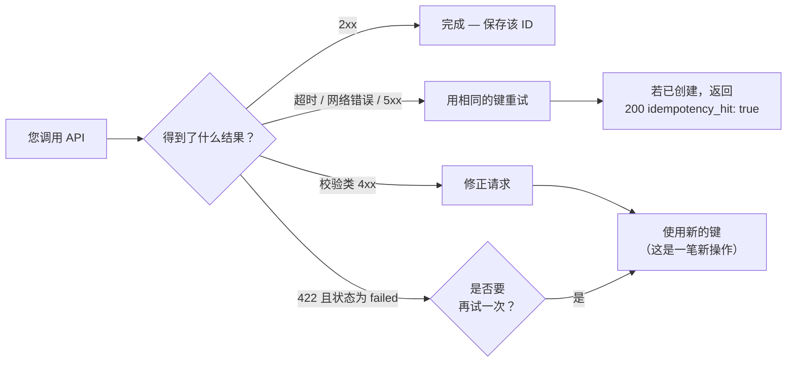

所有涉及资金变动的操作都需要一个**幂等键**（idempotency key）。
完整列表如下：

| 接口 | 幂等键 | 原因 |
|---|---|---|
| `POST /v1/payouts` | **必填** | 扣减您的余额并进行付款分发 |
| `POST /v1/payouts/qr/confirm` | **必填** | 扣款并支付该 QR（`scan` 免费，无需幂等键） |
| `POST /v1/payins/collect` | **必填** | 对付款人执行真实扣款 |
| `POST /v1/transfers` | **必填** | 在账户之间转移余额 |
| `POST /v1/crypto/withdrawals` | **必填** | 扣款并在链上广播 |
| `POST /v1/banking/operations` | **必填** | 发送银行付款（`prepare` 免费，无需幂等键） |
| `POST /v1/cards` | **必填** | 可能收取发卡费 |
| `POST /v1/payins` 且 `method: "fintoc"` | 可选，**建议使用** | 使用相同幂等键重试会返回同一个支付会话（绝不会开启第二个） |
| `POST /v1/payins`（qr / bank_transfer） | 不适用 | 在有人付款之前该收款单不产生资金变动；未支付的重复单会自然过期 |

## 如何发送

两种等效方式（若两者都发送，以请求体为准）：

```bash Body
curl -X POST …/v1/payouts \
  -d '{ "idempotency_key": "payroll-2026-07-001", … }'
```

```bash Header
curl -X POST …/v1/payouts \
  -H "Idempotency-Key: payroll-2026-07-001" \
  -d '{ … }'
```

未提供时返回 `400 idempotency_key_required`。

## 重试时会发生什么

幂等键在每个**来源账户**内唯一。若您用相同的键重复一次调用：

- 不会创建新操作，资金也不会再次变动。
- 您会收到 `200 OK`（而非 `201`/`202`），返回原始对象并附带
  `idempotency_hit: true`。

```json
{
  "payout_id": "same-as-the-first-time",
  "status": "processing",
  "idempotency_hit": true
}
```

## 该用哪个键重试？

完整的决策规则，让您永远不必猜测：



## 建议

- 使用来自**您自己**系统的标识符（订单 ID、工资单 ID 等），而不是
  时间戳或每次重试都重新生成的 UUID。
- 在调用 API 之前先持久化该键；这样在超时后即可重试，且保证不会
  产生重复。
- 遇到网络错误或 `5xx` 时，**用相同的键重试**。遇到校验类 `4xx` 时，
  修正请求并使用新的键。
