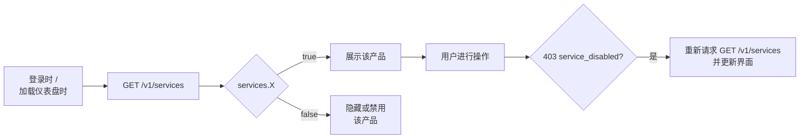

每个账户都根据其与 CBPay 的商业协议拥有一组**已启用的服务**。
在您的界面中展示某个产品（或尝试使用它）之前，请先查询生效的
服务映射：

```bash
curl https://api.qbank.cl/platform/v1/services \
  -H "Authorization: Bearer <token>"
```

```json
{
  "account_id": "9b1deb4d-3b7d-4bad-9bdd-2b0d7b3dcb6d",
  "services": {
    "payouts": true,
    "payins": true,
    "transfers": true,
    "crypto": true,
    "banking": false,
    "kyc": true,
    "cards": false
  }
}
```

## 服务目录

| 服务 | 启用的功能 |
|---|---|
| `payouts` | 法币付款分发（`POST /v1/payouts`、QR scan/confirm） |
| `payins` | 法币收款（QR、转账、支付页面、collect、CLABE） |
| `transfers` | CBPay 账户之间的内部转账 |
| `crypto` | 链上钱包与 USDT 提现 |
| `banking` | 国际银行账户（档案、账户、付款） |
| `kyc` | 第三方 KYC/KYB 身份验证（链接、提交、文件、活体检测） |
| `aml` | AML 名单筛查、重新筛查与监控 |
| `cards` | 卡片发行与运营 |
| `swaps` | 余额之间的兑换（USDT/USDC/BTC/GOLD） |
| `wallets` | 拥有独立链上余额的[隔离钱包](https://docs.cbpayapp.com/zh/guides/segregated-wallets)（仅限企业） |

## 服务被关闭时会发生什么

该产品的**操作类接口**将返回 `403 service_disabled`：

```json
{
  "error": "service_disabled",
  "message": "this service is not enabled for your account"
}
```

重要规则：

- **读取永不被阻断**：您始终可以列出并查询您的历史操作、余额和
  账目变动。
- **进行中的资金会走完其周期**：一笔处于 `processing` 的出款会正常
  完成（或退款），即使该服务随后被停用。
- 关闭 `cards` 后，卡片消费会立即停止授权，且不再产生月费。

## 推荐的集成模式



1. 在应用加载时查询 `GET /v1/services`（并缓存几分钟）。
2. 只展示值为 `true` 的产品。
3. 仍需在所有操作上处理 `403 service_disabled`：配置可能在您的缓存
   与实际操作之间发生变化。

> **注**
服务由您的组织根据商业协议启用。如果您需要开通某个产品（例如
`banking` 或 `cards`），请联系您的 CBPay 管理员 — 变更即时生效，
无需重新部署。
