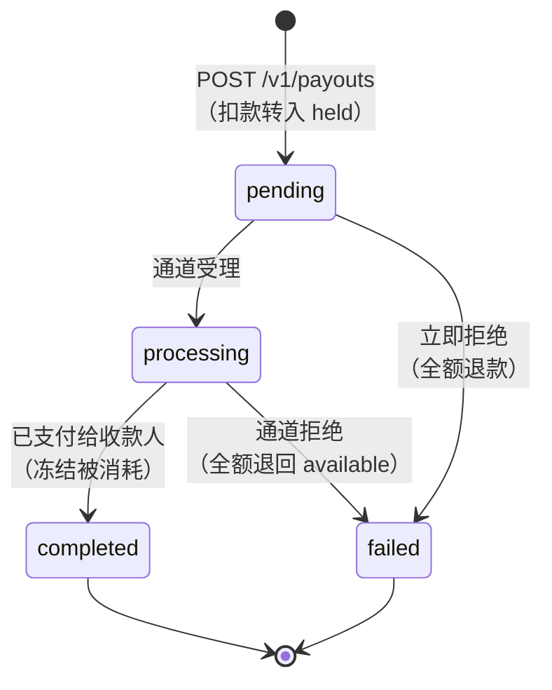

CBPay 的每笔操作都遵循明确的生命周期。本页将**所有产品的所有状态**
汇总在一处，并附上黄金法则：在看到**最终状态**之前，绝不假定操作
已成功。

## 统一状态表

| 产品 | 状态 | 最终状态 | Webhook 事件 |
|---|---|---|---|
| 出款（Payout） | `pending` → `processing` → `completed` / `failed` | `completed`、`failed` | `payout_status_changed` |
| 收款（Payin） | `pending` → `credited` / `expired` / `failed`（+ `unassigned`） | `credited`、`expired`、`failed` | `payin_credited` |
| 转账（Transfer） | `completed`（同步） | `completed` | `transfer_received`（发给收款方） |
| 加密货币充值 | 检测到 → 网络确认后 `credited` | `credited` | `crypto_deposit_credited` |
| 加密货币提现 | `pending` → `processing` → `completed` / `failed` | `completed`、`failed` | `crypto_withdrawal_status_changed` |
| 银行服务（付款） | 视清算通道而定：`pending` → `processing` → `completed` / `failed` | `completed`、`failed` | `banking_operation_status_changed` |
| 卡片 | `pending_activation` → `active` ⇄ `frozen` → `cancelled` | `cancelled` | `card_status_changed` |
| 账户 KYC | `none` → `pending` → `approved` / `rejected` | `approved`、`rejected` | —（查询 `GET /v1/me`） |

## 出款：带资金冻结的生命周期

- 全部扣款金额（`total_debit`）在操作进行期间离开 `available`
  并停留在 `held` 中。
- `failed` **始终将全部扣款金额**（金额 + 手续费）自动退回
  `available`。
- 处于 `processing` 的出款无法通过 API 取消：请等待最终状态
  （webhook 或 `GET /v1/payouts/{id}`）。

### 失败出款的 `status_code` 目录

当出款失败时，`status_code` 与 `status_message` 以中立的措辞说明
失败原因：

| `status_code` | 含义 | 该怎么做 |
|---|---|---|
| `core_rejected` | 处理方在创建时拒绝了该操作（收款人数据无效、目标账户不存在、通道不可用） | 阅读 `status_message`，修正数据并创建新的出款（使用新的幂等键） |
| *通道代码* | 银行清算通道的后续拒绝（例如账户已注销） | 同上：修正后作为新操作重试 |
| *（空）* 且状态为 `failed` | 通道报告的一般性失败 | 查看 `status_message`；若不明确，请携带 `payout_id` 联系支持 |

无论哪种情况，退款都已经完成：可在 `GET /v1/movements` 中核实
（一条 `payout_refund` 记录）。

## 收款：收款状态

- `pending` — 收款单已创建并等待付款。QR 和支付页面会过期
  （无人付款则变为 `expired`）。
- `credited` — 已收到付款，按您的 `payin_rate` 换算并入账。若配置了
  银行卡结算延迟，收款在支付确认时即达到 `credited`，但**余额**稍后
  才到账：`settle_at` 未到期时响应带有 `settlement_pending: true` 且
  `settled_at: null`（见
  [银行卡收款结算延迟](https://docs.cbpayapp.com/zh/concepts/fees#银行卡收款结算延迟)）。
- `unassigned` — 收到一笔无法匹配到任何账户的入金；由管理员手动
  分配，随后按目标账户的汇率与费用入账。
- `failed` — 收款失败（例如付款人拒绝了 collect 扣款）。
  没有资金变动。

## 加密货币提现：链上确认

提现在交易于网络上确认后到达 `completed`。典型耗时：**TRON 约
1 分钟**（19 个确认），**以太坊数分钟**，视拥堵程度而定。`tx_id`
会在响应和 webhook 中返回，供您在区块浏览器上核实。

若提现在广播之前失败，全部扣款金额将被退回
（一条 `withdrawal_refund` 记录）。

## 卡片

- `pending_activation` — 实体卡已发行并以未激活状态寄出；通过
  `POST /v1/cards/{id}/activate` 激活。
- `active` — 实时授权消费，扣减卡片消费资产的余额
  （`spending_asset`：USDT、USDC、BTC 或 GOLD）。
- `frozen` — 已冻结（手动冻结或因月费未付）；消费会被拒绝并返回
  `unfunded_card_frozen`。结清待付费用后即可解冻。
- `cancelled` — 最终状态；不可撤销。

## 通用规则

#### 什么时候可以信任一个状态？
通过 webhook **或**通过该资源的 `GET` 获得最终状态 — 两者是等效的
事实来源。webhook 是推送方式（推荐）；`GET` 是 webhook 丢失时的
兜底方案。
#### 创建操作时遇到超时该怎么办？
不要用新的键重试。使用**相同的** `idempotency_key` 重复同一请求
（它会返回原始对象并附带 `idempotency_hit: true`），或查询资源列表。
详见[幂等性](https://docs.cbpayapp.com/zh/concepts/idempotency)。
#### 状态会回退吗？
不会。生命周期是单调的：`completed` 和 `failed` 是最终结论，
操作绝不会回到之前的状态。
#### 在哪里能看到每个状态对我余额的影响？
在 `GET /v1/movements` 中：每次产生经济影响的状态转换都会留下一条
不可变的账目记录（`payout_debit`、`payout_refund`、`payin_credit`……）。
参见[账目变动与对账](https://docs.cbpayapp.com/zh/concepts/movements-reconciliation)。
