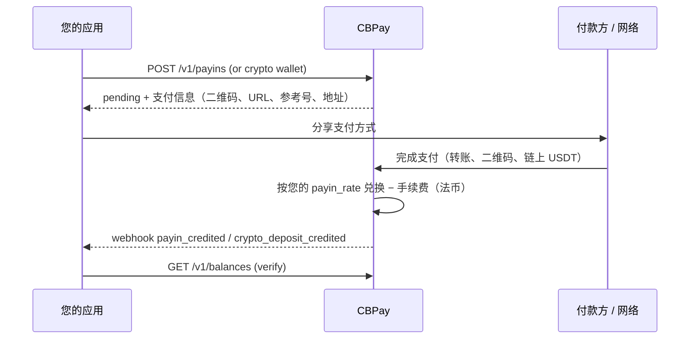
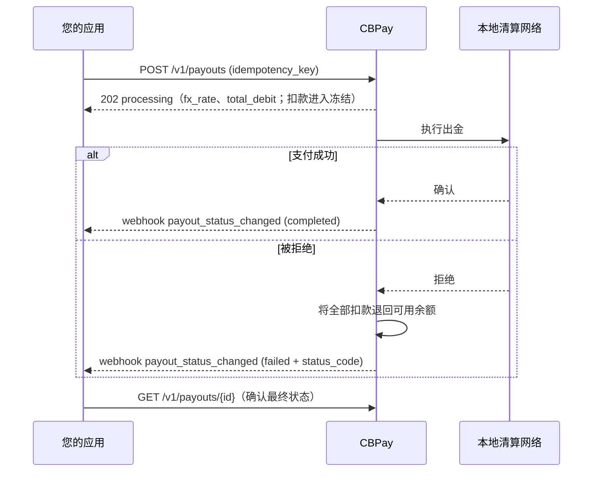
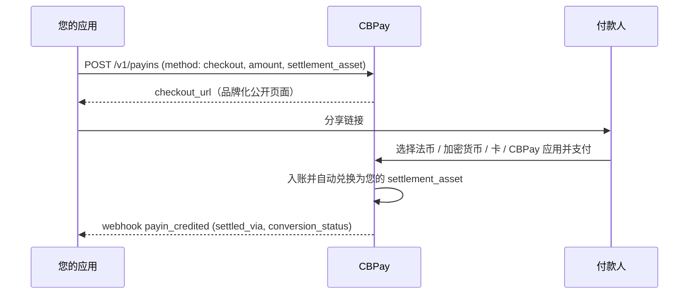
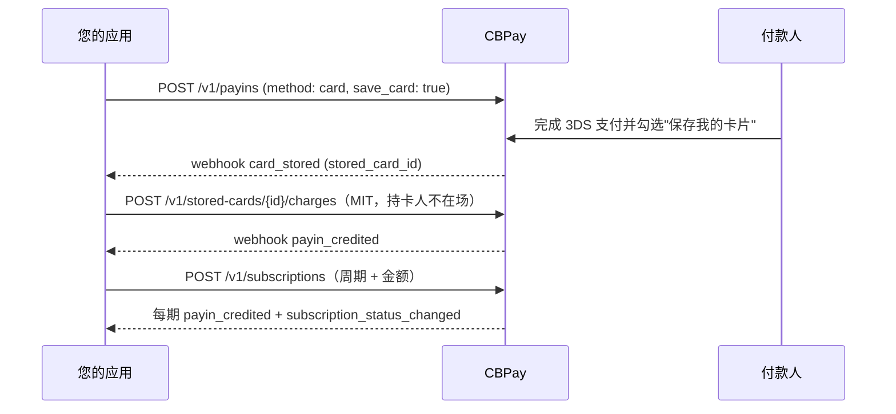
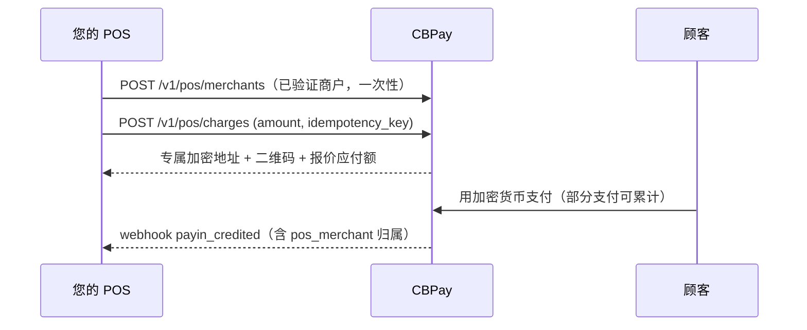
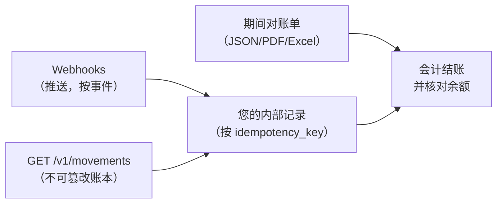
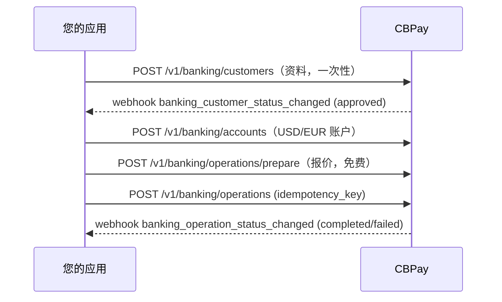

本页将各产品串联成**完整的业务流程**：调用什么、期待什么，以及哪个
webhook 为每个闭环收尾。每个流程都链接到对应产品的详细指南。

## 1. 为账户注资

资金流入有三条路径；全部以 USDT 入账和一个 webhook 结束：

| 路径 | 端点 | 收尾 webhook |
|---|---|---|
| 法币收款（二维码、转账、支付页面、扣款） | `POST /v1/payins` / `/collect` | `payin_credited` |
| 链上 USDT 充值 | `POST /v1/crypto/wallets`（固定地址） | `crypto_deposit_credited` |
| 来自其他账户的内部转账 | ——（由发送方发起） | `transfer_received` |

详情：[收款](https://docs.cbpayapp.com/zh/guides/payins) · [加密资产](https://docs.cbpayapp.com/zh/guides/crypto) ·
[转账](https://docs.cbpayapp.com/zh/guides/transfers)。

## 2. 付款（Payout）

**二维码**变体（玻利维亚、巴西 PIX）：`POST /v1/payouts/qr/scan`（免费，
解码）→ 展示数据 → `POST /v1/payouts/qr/confirm`（按普通付款计费）。
详情：[付款](https://docs.cbpayapp.com/zh/guides/payouts) · [QR 出金](https://docs.cbpayapp.com/zh/guides/qr-payout)。

## 3. 向客户收款

根据国家和期望的体验选择模式：

| 模式 | 国家 | 付款方体验 | 确认方式 |
|---|---|---|---|
| 托管支付页面 | CL | 打开一个 URL，从其银行完成支付 | 自动 |
| 二维码 | BO、BR（PIX） | 使用其银行 App 扫码 | 自动 |
| 附参考号转账 | CL、PE、MX、BR | 转账时附带参考号 | 按参考号自动确认（或按金额） |
| 专属 CLABE / CVU | MX、AR | 转账到您的固定账户 | 自动，无需参考号 |
| 主动扣款（c2p / debit） | VE | 通过 OTP 授权后由您执行扣款 | 同一调用内**同步**确认 |
| 卡支付 | BO（BOB/USD） | 在安全托管页面输入卡片（3DS） | 自动 |
| 通用收款链接 | 所有已开通国家 + 加密货币 + 卡 | 打开一个链接自选支付方式 | 自动 |

所有模式都以 `payin_credited` 收尾，净额入账到您的余额。
详情：[收款](https://docs.cbpayapp.com/zh/guides/payins) · [Checkout](https://docs.cbpayapp.com/zh/guides/checkout)。

## 4. Checkout 端到端

一个链接覆盖所有支付轨道，结算到您选择的余额：

详情：[Checkout](https://docs.cbpayapp.com/zh/guides/checkout)。

## 5. 已保存卡片与订阅

在持卡人同意下保存一次卡片，之后即可扣款 —— 一键支付、持卡人不在场
（MIT）或按周期循环：

详情：[已保存卡片与订阅](https://docs.cbpayapp.com/zh/guides/stored-cards-subscriptions)。

## 6. QR POS 收款（收单处理商）

面向运营线下销售点的企业：

详情：[QR POS](https://docs.cbpayapp.com/zh/guides/qr-pos)。

## 7. 余额兑换（Swaps）

一次调用即可在 USDT、USDC、BTC 和 GOLD 之间按您账户的汇率兑换 ——
资金不离开账户，因此无需 OTP。详情：[兑换](https://docs.cbpayapp.com/zh/guides/swaps)。

## 8. 对账

完整做法见
[流水与对账](https://docs.cbpayapp.com/zh/concepts/movements-reconciliation)和
[对账单](https://docs.cbpayapp.com/zh/guides/statement)。

## 9. 端到端国际银行服务

银行余额存放在您的银行账户中（与 USDT 分离）；CBPay 只收取已配置
的固定费用。详情：[银行服务](https://docs.cbpayapp.com/zh/guides/banking)。

> **提示**
首次集成？请按照[快速开始](https://docs.cbpayapp.com/zh/quickstart)（注资 → 付款 → webhook）
操作，添加更多产品时再回到本页。
