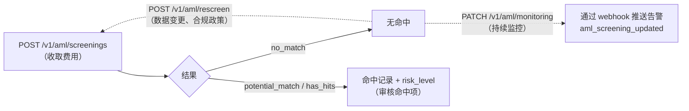

> **环境：** 测试 `https://cryptobank.qbank.cl/platform` (`pk_test_...`) - 正式 `https://api.qbank.cl/platform` (`pk_...`).

**AML 筛查**将个人或企业的身份与全球名单进行比对——制裁名单、PEP（政治公众人物）、负面媒体——并返回带有风险等级的分析结果。它是纯粹的合规产品：它**不**通过证件或活体检测来验证身份（那是
[KYC/KYB 验证](https://docs.cbpayapp.com/zh/guides/kyc)的职责）；它分析的是该身份是否存在名单风险。



> **重要**
**破坏性变更（v1.34）**：此产品原先位于 `POST /v1/kyc`、
`/v1/kyc/rescreen` 和 `PATCH /v1/kyc/monitoring`。这些路由已被
**移除**，现在为 `POST /v1/aml/screenings`、`POST /v1/aml/rescreen`
和 `PATCH /v1/aml/monitoring`（语义相同，费用相同）。
`/v1/kyc/...` 路由现在属于
[身份验证](https://docs.cbpayapp.com/zh/guides/kyc)，这是一个不同的产品。
> **注**
如果 CBPay 配置了合规费用，该费用会在调用**之前**扣除
（你会在响应中看到 `compliance_fee`），并且在筛查失败时**自动
退还**。费用为 0 时，该服务对你免费。需要你自己的
[身份验证已通过](https://docs.cbpayapp.com/zh/guides/kyc#your-own-verification-onboarding)。
## 用于构建表单的目录数据

在构建筛查（或验证）表单之前，先通过 `GET /v1/aml/catalogs` 获取官方
目录数据：性别、公司状态、地址类型、法律实体形式（全球列表加按国家/地区级联）、
收入/财富来源、行业标准及其按国家/地区的默认值，
以及完整的 ISO-3166 国家和行政区划列表。每个条目都包含
`value`（发送给 API 的值）和 `label`（用于展示的文本）。这些是静态
数据——可以安全地缓存数小时。

```bash
curl https://api.qbank.cl/platform/v1/aml/catalogs \
  -H "Authorization: Bearer <token>"
```

```json
{
  "genders": [ { "value": "male", "label": "Male" } ],
  "company_types_by_country": {
    "CL": [ { "value": "Sociedad por Acciones", "label": "Sociedad por Acciones" } ]
  },
  "industry_code_type_by_country": { "CL": "ISIC" },
  "countries": [ { "value": "CL", "label": "Chile" } ],
  "meta": { "note": "value = send to the API; label = display in the UI." }
}
```

> **提示**
级联规则：公司所在国家/地区决定其可选的法律形式
（`company_types_by_country[country]`，回退到 `company_types`）以及
其行业标准（`industry_code_type_by_country[country]`，默认为
ISIC）；确定标准后，再从
`industries_by_code_type[standard]` 中选取行业代码。
### 城市目录（按国家/地区）

当表单需要填写城市时，在选定国家/地区后调用
`GET /v1/aml/catalogs/cities?country=US` —— 每个国家只需调用一次，
然后在客户端按州/省筛选：

```bash
curl "https://api.qbank.cl/platform/v1/aml/catalogs/cities?country=US" \
  -H "Authorization: Bearer <token>"
```

```json
{
  "country": "US",
  "states": { "US-FL": ["Miami", "Orlando"] },
  "country_cities": [],
  "meta": { "state_count": 51, "city_count": 3200 }
}
```

- `states` 的键与主目录中 `country_subdivisions` 的 ISO 3166-2
  行政区划相同；`country_cities` 列出无法映射到行政区划的城市 ——
  也应一并提供。这两个字段永远不会是 `null`。
- 没有覆盖的国家/地区返回 `200` 和空列表 —— 此时回退到自由文本的
  城市字段。格式错误的代码返回 `400 invalid_country`；未知代码返回
  `404 country_not_found`。
- 静态数据，响应带 `Cache-Control: public, max-age=86400` —— 可以
  缓存一天。

### 邮政编码查询（美国）

当表单需要填写地址时，先调用
`GET /v1/aml/catalogs/postal-code?country=US&code=33130` 解析 ZIP，
并预填城市和州/省：

```bash
curl "https://api.qbank.cl/platform/v1/aml/catalogs/postal-code?country=US&code=33130" \
  -H "Authorization: Bearer <token>"
```

```json
{
  "country": "US",
  "postal_code": "33130",
  "city": "Miami",
  "state": "FL"
}
```

- 目前仅美国 ZIP 编码（5 位数字）有数据集。返回 `404
  postal_code_not_found` 表示该 ZIP 未知 —— 或该国家/地区没有数据集 ——
  地址字段保持手动填写即可。
- 请求格式错误返回 `400 invalid_payload`。
- 与其他目录相同的缓存策略：`Cache-Control: public, max-age=86400`。

## 提交筛查

个人和企业使用同一个端点；类型由请求体自动识别
（账户类型之间的其他差异汇总见
[个人与企业](https://docs.cbpayapp.com/zh/concepts/persons-companies)）：

```bash Person
curl -X POST https://api.qbank.cl/platform/v1/aml/screenings \
  -H "Authorization: Bearer <token>" \
  -H "Content-Type: application/json" \
  -d '{
    "customer": {
      "person": {
        "full_name": "Ana Pérez Rojas",
        "date_of_birth": { "year": 1990, "month": 4, "day": 12 },
        "personal_identification": [
          { "issuing_country": "CL", "number": "12.345.678-5" }
        ]
      },
      "email": "ana@example.com",
      "country": "CL"
    },
    "monitor": false
  }'
```

```bash Company
curl -X POST https://api.qbank.cl/platform/v1/aml/screenings \
  -H "Authorization: Bearer <token>" \
  -H "Content-Type: application/json" \
  -d '{
    "customer": {
      "company": {
        "legal_name": "Comercial Andina SpA",
        "registration_authority_identification": "76.543.210-8"
      },
      "email": "legal@andina.cl",
      "country": "CL"
    },
    "monitor": true
  }'
```

```bash Minimal (autofilled from your account)
curl -X POST https://api.qbank.cl/platform/v1/aml/screenings \
  -H "Authorization: Bearer <token>" \
  -H "Content-Type: application/json" \
  -d '{ "customer": {}, "monitor": false }'
```

如果省略 `person`/`company`，系统会用你的账户数据自动填充
（个人/企业类型取自你的账户类型）。

## 尽可能发送你掌握的全部身份字段（推荐）

`customer` 对象接受**更多可选字段**，全部原样转发
给筛查引擎：**发送的身份数据越多，分析越精确**——出生日期、国家/地区和强身份证件
可以排除同名者，减少误报。

| 字段（个人） | 含义 |
|---|---|
| `full_name` — 或 `first_name` / `middle_name` / `last_name` | 完整姓名或拆分姓名 |
| `date_of_birth` | 仅接受对象格式 `{ "year": 1990, "month": 4, "day": 12 }`（纯字符串 `"YYYY-MM-DD"` 会被 `422` 拒绝） |
| `nationality` | 国籍为 ISO-3166 代码的**数组**，如 `["CL"]`（纯字符串会被 `422` 拒绝） |
| `country_of_birth` | 出生国家/地区 |
| `residential_information[]` | 居住信息，每项包含 `country_of_residence` |
| `personal_identification[]` | 强身份证件：`{ "issuing_country", "number" }`（身份证、护照……）——**不要**发送 `type` 字段（引擎会拒绝） |
| `alias` / `aliases` | 其他已知名称 |

| 字段（企业） | 含义 |
|---|---|
| `legal_name` | 法定名称 |
| `alias[]` | 商号/别名 |
| `registration_authority_identification` | 税务/商业登记标识（税号、登记号） |
| `place_of_registration` | 注册/成立国家（ISO-3166） |
| `incorporation_date` | 成立日期，对象格式 `{ "year": 2015, "month": 8, "day": 1 }` |
| `address[]` | 地址，每项包含 `country` |

> **重要**
筛查引擎对字段格式非常严格，不匹配会以 `422` 拒绝：在 `company` 中不要发送
`tax_id`、`registration_number` 或 `country_of_incorporation` 等扁平字段
（标识符放在 `registration_authority_identification`，国家放在
`place_of_registration`）；在 `person` 中，`date_of_birth` 仅接受
`{year, month, day}` 对象、`nationality` 必须是数组、
`personal_identification[]` 不带 `type` 字段（2026-07-18 实测验证）。
> **注**
使用**完全相同的身份数据**再次查询会复用之前的
筛查结果（不再收费）。新增或更改身份字段（姓名、日期、
国家/地区、证件、别名）会使搜索更具体，并执行——同时计费——一次新的筛查。修饰性字段（邮箱、电话、文本地址）不会
影响匹配。
`201` 响应——个人和企业共享相同的结构；只有
`compliance_service` 不同（`compliance_person` 与 `compliance_company`，
各自有独立的费用）：

```json Person
{
  "customer_id": "cus_8f2e1a…",
  "status": "screened",
  "risk_level": "low",
  "screening_result": "no_match",
  "compliance_service": "compliance_person",
  "compliance_fee": "0.500000"
}
```

```json Company
{
  "customer_id": "cus_5b7c33…",
  "status": "screened",
  "risk_level": "medium",
  "screening_result": "potential_match",
  "compliance_service": "compliance_company",
  "compliance_fee": "1.000000"
}
```

## 重新筛查

对同一身份重新执行分析（例如在数据变更后，或按周期性
合规政策执行）。无需请求体——使用你上一次
筛查的 `customer_id`：

```bash
curl -X POST https://api.qbank.cl/platform/v1/aml/rescreen \
  -H "Authorization: Bearer <token>"
```

`200` 响应（收取 `compliance_rescreen` 费用，如已配置）：

```json
{
  "customer_id": "cus_8f2e1a…",
  "status": "screened",
  "risk_level": "low",
  "screening_result": "no_match",
  "compliance_service": "compliance_rescreen",
  "compliance_fee": "0.250000"
}
```

需要已有一次先前的筛查；否则返回 `409 no_screening`。

## 持续监控

对该身份启用（或停用）持续监控——名单变化、
PEP、负面媒体。更新通过 `aml_screening_updated` webhook 送达：

```bash Enable (bills compliance_monitoring)
curl -X PATCH https://api.qbank.cl/platform/v1/aml/monitoring \
  -H "Authorization: Bearer <token>" \
  -H "Content-Type: application/json" \
  -d '{ "enabled": true }'
```

```bash Disable (always free)
curl -X PATCH https://api.qbank.cl/platform/v1/aml/monitoring \
  -H "Authorization: Bearer <token>" \
  -H "Content-Type: application/json" \
  -d '{ "enabled": false }'
```

`200` 响应：

```json
{
  "customer_id": "cus_8f2e1a…",
  "monitoring": true,
  "compliance_service": "compliance_monitoring",
  "compliance_fee": "0.100000"
}
```

停用时，`compliance_fee` 返回 `"0.000000"`——停用
始终免费。

## 筛查 PDF 报告

历史记录中的每一条筛查都可以下载为带有你品牌的**高管级 PDF 报告**：
封面呈现决策及其风险信号灯、风险指标（制裁、观察名单、PEP、恐怖主义、
毒品、负面媒体、欺诈、腐败、武器）、含名单及关联关系的合并匹配、别名、
信号术语表，以及列明所查国际数据源的最终背书章节。这是你交给审计师或
交易对手作为分析证据的文档。

先在历史记录中找到 `screening_id`：

```bash
curl "https://api.qbank.cl/platform/v1/aml/screenings?from=2026-07-01&to=2026-07-14&page=1&page_size=50" \
  -H "Authorization: Bearer <token>"
```

然后下载报告（纯读取——无费用、无幂等键）：

```bash 英文（默认）
curl "https://api.qbank.cl/platform/v1/aml/screenings/a1b2c3d4-e5f6-7890-abcd-ef1234567890/report" \
  -H "Authorization: Bearer <token>" \
  -o aml_report.pdf
```

```bash 西班牙文
curl "https://api.qbank.cl/platform/v1/aml/screenings/a1b2c3d4-e5f6-7890-abcd-ef1234567890/report?lang=es" \
  -H "Authorization: Bearer <token>" \
  -o aml_report.pdf
```

```bash 中文
curl "https://api.qbank.cl/platform/v1/aml/screenings/a1b2c3d4-e5f6-7890-abcd-ef1234567890/report?lang=zh" \
  -H "Authorization: Bearer <token>" \
  -o aml_report.pdf
```

响应为 `application/pdf`，带有描述性的 `Content-Disposition` 文件名。
`lang` 接受 `en`（默认）、`es` 和 `zh`；其他值返回
`400 invalid_language`。属于其他账户的 `screening_id` 返回 `404`。

> **注**
报告基于筛查的持久化证据生成，即使合规引擎不可用也始终可以下载。
分析数据（名单名称、媒体标题）保留原文；仅报告的标签会被翻译。
## Webhook

| 事件 | 触发时机 |
|---|---|
| `aml_screening_updated` | 筛查完成、案件状态变化、风险等级变化或受监控的交易被审核时 |

示例载荷：

```json
{
  "account_id": "9b1deb4d-3b7d-4bad-9bdd-2b0d7b3dcb6d",
  "screening_event": "compliance_risk_changed",
  "customer_id": "cus_8f2e1a…",
  "data": { "risk_level": "high" }
}
```

订阅方式与其他事件相同（见 [Webhooks](https://docs.cbpayapp.com/zh/webhooks)）。

## 错误

| HTTP | `error` | 原因 | 解决方法 |
|---|---|---|---|
| 400 | `invalid_language` | PDF 报告的 `lang` 不是 `en`、`es` 或 `zh` | 使用三种受支持语言之一 |
| 402 | `insufficient_funds` | 余额不足以支付合规费用 | 为账户充值后重试 |
| 403 | `verification_required` | 你的账户尚未通过身份验证 | 完成你的[入驻验证](https://docs.cbpayapp.com/zh/guides/kyc#your-own-verification-onboarding) |
| 403 | `service_disabled` | 你的账户未启用 `aml` 服务 | 联系你的运营方 |
| 409 | `no_screening` | 在没有先前筛查的情况下执行重新筛查/监控 | 先发送 `POST /v1/aml/screenings` |
| 502 | `compliance_unavailable` | 服务暂时不可用（费用已退还） | 稍后重试 |

## 常见问题

#### AML 筛查与 KYC/KYB 验证有什么区别？
筛查将身份与名单进行比对（制裁名单、PEP、负面媒体）
——不涉及证件。[KYC/KYB 验证](https://docs.cbpayapp.com/zh/guides/kyc)则通过表单、证件和视频
活体检测来证明个人/企业确实是其声称的身份。两者互为补充：用 KYC/KYB 验证身份，
用 AML 监控其风险。
#### 我可以筛查我自己的客户吗？
可以：`customer` 对象接受任何身份，不限于你账户本身的身份。
每次筛查都会收取相应费用（根据请求体判定为个人或企业）。
#### 筛查会改变我账户的验证状态吗？
不会。自 v1.34 起，你账户的 `kyc_status` 完全由
KYC/KYB 身份验证（你的入驻验证）管理。筛查只评估
名单风险。
#### 为什么旧的筛查不出现在历史记录中，也无法下载 PDF 报告？
历史记录和 PDF 报告基于每次筛查的持久化证据生成，
仅覆盖历史功能上线（v1.55）之后执行的操作。更早的筛查
没有持久化证据，因此不会出现在 `GET /v1/aml/screenings` 中，
也无法下载报告。如需该文件，请对同一身份重新执行一次筛查
（身份数据完全相同时会复用之前的结果，不重复收费），
然后下载其报告。
