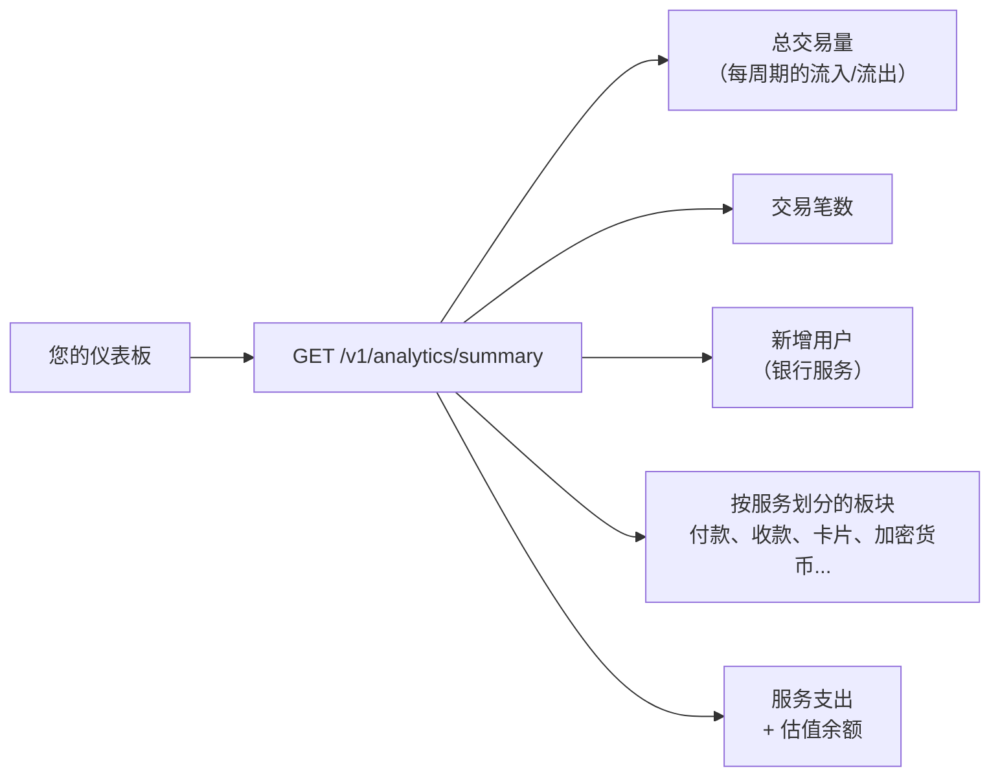

> **环境：** 测试 `https://cryptobank.qbank.cl/platform` (`pk_test_...`) - 正式 `https://api.qbank.cl/platform` (`pk_...`).

`GET /v1/analytics/summary` 通过**一次调用**返回您账户（个人或企业）
概览页所需的全部数据：可直接绘图的时间序列、每个服务及其所有维度
（国家、货币、方式、状态、链、商户）的明细、您在服务上的支出以及
按美元估值的余额。



## 请求

```bash
curl "https://api.qbank.cl/platform/v1/analytics/summary?from=2026-07-01&to=2026-07-10&granularity=day" \
  -H "Authorization: Bearer <token>"
```

| 参数 | 是否必填 | 说明 |
|---|---|---|
| `from` / `to` | 是 | `YYYY-MM-DD` 格式，按贵组织时区的范围，两端均包含；最长 366 天 |
| `granularity` | 否 | `day`（默认）、`week`（周一至周日）或 `month` |

您只能看到**自己账户**的数据。所有金额均为美元十进制字符串；
没有活动的时间桶会**以零填充**，因此可以直接绘图。

## 全局区块（头部 KPI 与三大主图表）

```json
{
  "gross_volume": {
    "in": "636936.87",
    "out": "270118.87",
    "total": "907055.74",
    "series": [
      { "date": "2026-07-01", "in": "51023.10", "out": "31210.44", "total": "82233.54" }
    ],
    "previous_period": { "in": "512300.00", "out": "241000.10", "total": "753300.10" },
    "change_pct": "20.41",
    "unpriced_assets": []
  },
  "transactions": {
    "total": 92,
    "series": [ { "date": "2026-07-01", "in": 3, "out": 5, "total": 8 } ],
    "previous_period": { "total": 71 },
    "change_pct": "29.58"
  },
  "new_users": {
    "total": 11,
    "series": [ { "date": "2026-07-01", "count": 1 } ],
    "previous_period": { "total": 6 },
    "change_pct": "83.33"
  }
}
```

- **`gross_volume`**：所有流入（收款、加密货币充值、收到的转账）与
  流出（付款、提现、发出的转账、卡片消费）的美元价值。退款会与其
  所属服务对冲净额计算——绝不会虚增交易量。兑换（swap）属于内部
  转换，有其独立板块。
- **`transactions`**：操作笔数（不含费用与退款）。
- **`new_users`**：您的企业注册的第三方银行用户（个人账户的序列
  为零）。
- **`change_pct`**：与紧邻的、等长的上一周期相比的变化率——用于
  ▲▼ 涨跌标识（上一周期为 0 时为 `null`）。
- `BTC`/`GOLD` 按当前参考价格估值；若价格不可用，该资产会列在
  `unpriced_assets` 中，其金额不计入美元总额（我们绝不虚构价格）。

## `by_country` — 按国家的全局视图

付款与收款合并，按交易量排序——用于地图或按国家的柱状图：

```json
"by_country": [
  {
    "country": "BR",
    "payouts": { "count": 18, "volume_usd": "3410.20" },
    "payins":  { "count": 4,  "volume_usd": "820.00" },
    "total_usd": "4230.20"
  }
]
```

## `sections` — 每一项服务的明细

每个板块都包含总计、按时间桶的序列及其自有维度：

#### payouts — 法币付款

```json
"payouts": {
  "count": 24, "volume_usd": "5120.40", "fees_usd": "7.20",
  "series": [ { "date": "2026-07-01", "count": 3 } ],
  "by_status": [ { "key": "completed", "count": 21, "volume_usd": "4980.10" } ],
  "by_country": [
    { "country": "BR", "count": 18, "volume_usd": "3410.20", "local_volume": { "BRL": "17550" } }
  ],
  "by_method": [ { "key": "pix", "count": 18, "volume_usd": "3410.20" } ]
}
```

`by_status` 提供成功率；`by_country` 包含按货币划分的当地货币交易量；
`by_method` 按 pix、bank_transfer、yape 等方式拆分。失败的付款不计入
交易量（其款项已退回）。

#### payins — 法币收款

```json
"payins": {
  "count": 9, "volume_usd": "2210.00", "fees_usd": "0.00",
  "series": [ { "date": "2026-07-02", "count": 2 } ],
  "by_country": [ { "key": "BO", "count": 5, "volume_usd": "1400.00" } ],
  "by_method": [ { "key": "qr", "count": 5, "volume_usd": "1400.00" } ],
  "by_kind":   [ { "key": "qr", "count": 5, "volume_usd": "1400.00" } ]
}
```

只有**已入账（credited）**的收款才会计入。

#### deposits / withdrawals — 链上加密货币

```json
"deposits": {
  "count": 3, "volume_usd": "1500.00",
  "series": [ { "date": "2026-07-03", "count": 1 } ],
  "by_chain": [ { "chain": "tron", "asset": "USDT", "count": 2, "amount": "1000.000000" } ]
},
"withdrawals": {
  "count": 2, "volume_usd": "600.00",
  "series": [ { "date": "2026-07-04", "count": 1 } ],
  "by_chain": [ { "chain": "eth", "asset": "USDC", "count": 1, "status": "completed", "amount": "500.000000", "fees": "1.000000" } ]
}
```

#### transfers、swaps 与 cards

```json
"transfers": {
  "in":  { "count": 4, "volume_usd": "300.00" },
  "out": { "count": 2, "volume_usd": "120.00" },
  "series": [ { "date": "2026-07-01", "count": 1 } ]
},
"swaps": {
  "count": 5, "volume_usd": "890.00",
  "series": [ { "date": "2026-07-05", "count": 2 } ],
  "by_pair": [ { "pair": "USDT/BTC", "count": 3, "volume_usd": "600.00" } ]
},
"cards": {
  "count": 12, "volume_usd": "230.50", "fees_usd": "5.00", "active_cards": 1,
  "series": [ { "date": "2026-07-06", "count": 4 } ],
  "by_status": [ { "status": "settled", "count": 10, "volume_usd": "205.00" } ],
  "top_merchants": [ { "merchant": "AMAZON", "count": 4, "volume_usd": "98.20" } ]
}
```

#### banking、verifications（KYC/KYB）、aml 与 contacts

```json
"banking": {
  "new_third_parties": 11,
  "third_parties_series": [ { "date": "2026-07-01", "count": 1 } ],
  "new_accounts": 14,
  "accounts_series": [ { "date": "2026-07-01", "count": 2 } ],
  "operations": 6,
  "volume": {
    "in":  { "count": 4, "volume_usd": "1200.00" },
    "out": { "count": 9, "volume_usd": "3450.00" },
    "series": [ { "date": "2026-07-01", "count": 2 } ],
    "volume_usd": "4650.00"
  },
  "fees_usd": "18.00",
  "fees_by_service": { "banking_customer": { "count": 11, "fees_usd": "11.00" } }
},
"verifications": {
  "submissions": [ { "kind": "kyc", "status": "approved", "count": 3 } ],
  "links":       [ { "kind": "kyb", "status": "pending", "count": 1 } ],
  "fees_usd": "9.00",
  "fees_by_kind": {
    "kyc_verification": { "count": 3, "fees_usd": "6.00" },
    "kyb_verification": { "count": 1, "fees_usd": "3.00" }
  }
},
"aml": { "screenings": 4, "fees_usd": "2.00", "by_service": { "compliance_screening": { "count": 4, "fees_usd": "2.00" } } },
"contacts": { "new_contacts": 7, "series": [ { "date": "2026-07-02", "count": 2 } ] },
"adjustments": { "count": 2, "volume_usd": "2000.00", "series": [ { "date": "2026-03-14", "count": 1 } ] }
```

`deposits` 板块还包含 `wallet_fees_usd`（加密货币产品的钱包创建
费用），而在 `balances.items` 中，银行镜像余额带有
`custody: "banking"`（权威余额存放在银行）。

`new_third_parties` 与"新增用户"图表是同一指标：您的企业注册的
银行用户。

`banking.volume` 是经由您的银行账户流动的资金（流入与流出，按
美元估值）：它同样计入账户的全局 `gross_volume`，其明细与
[对账单](https://docs.cbpayapp.com/zh/guides/statement)中的 `BANK_USD`/`BANK_EUR` 板块相互
勾稽。

## `spending` — 您在服务上的消费

您在该期间支付的每一笔显性费用，以及每项服务的计费次数：

```json
"spending": {
  "total_usd": "34.50",
  "by_service": {
    "banking_customer": { "count": 11, "fees_usd": "11.00" },
    "wallet_creation":  { "count": 2,  "fees_usd": "1.00" },
    "verification_kyc": { "count": 3,  "fees_usd": "9.00" }
  }
}
```

## `balances` — 您的估值余额

```json
"balances": {
  "items": [
    { "asset": "USDT", "available": "1520.250000", "held": "0.000000", "usd_estimate": "1520.25" },
    { "asset": "BTC",  "available": "0.00500000",  "held": "0.00000000", "usd_estimate": "313.68" }
  ],
  "net_worth_usd_estimate": "1833.93"
}
```

## 余额变动趋势 — `GET /v1/balances/history`

用于带图表的余额卡片（"近 30 天余额"及其 ▲▼）：
每种资产的**每日**序列，包含每天的收盘余额，外加聚合的美元序列
及该期间的流入/流出。

```bash
curl "https://api.qbank.cl/platform/v1/balances/history?from=2026-06-12&to=2026-07-11" \
  -H "Authorization: Bearer <token>"
```

| 参数 | 是否必填 | 说明 |
|---|---|---|
| `from` / `to` | 是 | `YYYY-MM-DD` 格式，按贵组织时区的范围，两端均包含；最长 366 天 |

```json
{
  "account_id": "9b1deb4d-3b7d-4bad-9bdd-2b0d7b3dcb6d",
  "from": "2026-06-12",
  "to": "2026-07-11",
  "granularity": "day",
  "timezone": "America/New_York",
  "assets": {
    "USDT": {
      "series": [
        { "date": "2026-06-12", "balance": "100.000000" },
        { "date": "2026-06-13", "balance": "100.000000" },
        { "date": "2026-07-11", "balance": "125.430000" }
      ],
      "first": "100.000000",
      "last": "125.430000",
      "change_pct": "25.43"
    },
    "BTC": {
      "series": [
        { "date": "2026-06-12", "balance": "0.00060000" },
        { "date": "2026-07-11", "balance": "0.00060000" }
      ],
      "first": "0.00060000",
      "last": "0.00060000",
      "change_pct": "0.00"
    },
    "BANK_USD": {
      "series": [
        { "date": "2026-06-12", "balance": "1500.00" },
        { "date": "2026-07-11", "balance": "1725.50" }
      ],
      "first": "1500.00",
      "last": "1725.50",
      "change_pct": "15.03"
    }
  },
  "total_usd": {
    "series": [
      { "date": "2026-06-12", "balance_usd": "163.73" },
      { "date": "2026-07-11", "balance_usd": "191.34" }
    ],
    "first": "163.73",
    "last": "191.34",
    "change_pct": "16.86",
    "spot_priced_dates": [],
    "unpriced_assets": []
  },
  "period": { "in_usd": "280.20", "out_usd": "254.77", "net_usd": "25.43" },
  "current": {
    "items": [
      { "asset": "USDT", "available": "125.430000", "held": "10.000000", "usd_estimate": "135.43" },
      { "asset": "BTC", "available": "0.00060000", "held": "0.00000000", "usd_estimate": "65.91" }
    ],
    "net_worth_usd_estimate": "201.34"
  }
}
```

- 每个数据点是**当日收盘时的可用余额**（按贵组织时区）；没有变动的日子会
  沿用前一天的余额，因此序列没有缺口，可直接绘图。
- `assets` 还包含银行账户镜像（`BANK_USD`、`BANK_EUR`），以其自身
  货币（2 位小数）作为独立序列提供——适合在图表上做"Bank USD"/
  "Bank EUR"筛选项。它们**不**计入 `total_usd` 聚合，该聚合仅覆盖
  运营余额。
- `total_usd` 按**每一天的历史价格**为 BTC/GOLD 估值。若某天尚无
  历史价格，则使用今日现货价格，并在 `spot_priced_dates` 中披露
  该日期（绝不虚构数值）。
- `period.in_usd`/`out_usd` 是该范围内的总流入与总流出（与
  `gross_volume` 的分类一致）——即卡片上的"↗ $280.2K ↘ −$254.8K"。
- `current` 是今日快照，同时包含 `available` **和** `held`
  （历史序列只记录可用余额：冻结金额没有历史记录）。

## 您的汇率变动 — `GET /v1/rates/history`

**您账户的**外汇汇率时间序列（与 `GET /v1/rates` 相同的汇率，已应用
您的配置），用于带"+3.4% / −3.0%"标识的汇率走势图：

```bash
curl "https://api.qbank.cl/platform/v1/rates/history?from=2026-06-12&to=2026-07-11&granularity=day" \
  -H "Authorization: Bearer <token>"
```

| 参数 | 是否必填 | 说明 |
|---|---|---|
| `from` / `to` | 是 | `YYYY-MM-DD` 格式，按贵组织时区的范围，两端均包含 |
| `granularity` | 否 | `day`（默认，最长 366 天）或 `hour`（最长 31 天） |
| `currency` | 否 | 筛选单一货币（例如 `CLP`） |

```json
{
  "base": "USD",
  "from": "2026-06-12",
  "to": "2026-07-11",
  "granularity": "day",
  "rates": {
    "chile": {
      "currency": "CLP",
      "series": [
        { "date": "2026-06-12", "rate": "939.068965", "payin_rate": "967.452325" },
        { "date": "2026-07-11", "rate": "910.896551", "payin_rate": "938.428400" }
      ],
      "first": "939.068965",
      "last": "910.896551",
      "change_pct": "-3.00"
    }
  },
  "asset_prices": {
    "BTC": {
      "currency": "USD",
      "unit": "btc",
      "series": [
        { "date": "2026-06-12", "price": "106214.55" },
        { "date": "2026-07-11", "price": "109853.24" }
      ],
      "first": "106214.55",
      "last": "109853.24",
      "change_pct": "3.43"
    }
  },
  "retrieved_at": "2026-07-11T15:00:00Z"
}
```

- `rate` 是付款侧，`payin_rate` 是入金侧——与当前快照相同的两种
  汇率，逐点对应。
- `change_pct` 带符号返回（`"3.43"` 表示上涨，`"-3.00"` 表示下跌）：
  可直接用它为标识着色（绿色/红色）。
- 没有数据的时间桶会沿用最后一个已知值；历史记录开始之前的日子
  则直接缺席。

## 错误

| HTTP | `error` | 应对方式 |
|---|---|---|
| 400 | `invalid_range` | `from`/`to` 为必填（`YYYY-MM-DD`），范围最长 366 天 |
| 400 | `invalid_granularity` | 使用 `day`、`week` 或 `month`（历史类端点：`day` 或 `hour`） |
| 403 | `account_required` | 该端点需要账户级凭证 |
| 502 | `rates_unavailable` | 汇率历史暂时不可用；请几秒后重试 |

## 常见问题

#### 时间桶使用哪个时区？
贵组织的时区（IANA 名称，默认 `America/New_York`），与整个平台
API 的 `from`/`to` 过滤器一致。响应会在 `timezone` 字段中回显。
平台管理员可通过 `PUT /v1/admin/orgs/{orgID}/settings`（键
`timezone`）更改。
#### 哪些计入交易量，哪些不计入？
所有向您账户流入/流出资金的操作：收款、加密货币充值和收到的转账
（流入）；付款、提现、发出的转账和卡片消费（流出）。退款会对冲
净额计算，费用在 `spending` 中单独报告，兑换（您自己余额之间的
转换）有其独立板块。
#### BTC 和 GOLD 如何估值？
按查询时生效的参考价格（与 `GET /v1/rates` 相同）。这是一种展示
用途的估值：若价格不可用，该资产会出现在 `unpriced_assets` 中，
且不计入美元总额。
#### 总额与账户对账单一致吗？
一致：两者来自同一账本。对账单（`GET /v1/reports/statement`）是
逐行的会计文件；分析端点则是用于绘图的聚合视图。
#### 数据的时效性如何？
实时：每一笔已入账的操作都会出现在下一次调用中。
#### 汇率历史从何时开始可用？
汇率历史持续记录（每次汇率变化时），并包含约 90 天每日汇率的初始
回填。若您请求的范围早于历史记录开始的时间，这些日子在序列中直接
缺席——绝不虚构数值。
#### 余额历史包含冻结金额吗？
不包含：序列记录的是每天收盘时的可用余额。冻结金额（在途付款、
卡片预授权冻结）没有历史记录；今日的 `held` 在 `current` 区块中
返回。
#### 为什么我的汇率变化会和市场不同？
不会不同：您的汇率由市场汇率经您的商务配置推导而来，该配置是一个
常数因子——百分比变化是相同的。图表所示正是您在每一天实际操作时
本会得到的汇率。
