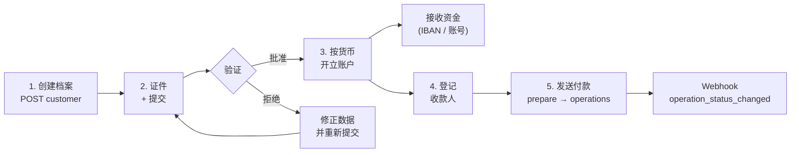
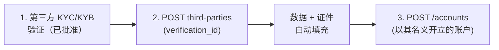

> **环境：** 测试 `https://cryptobank.qbank.cl/platform` (`pk_test_...`) - 正式 `https://api.qbank.cl/platform` (`pk_...`).

银行服务为您提供以您已验证档案名义开立的**真实银行账户**：您可以通过国际通道（视货币而定，SEPA、SWIFT、ACH）接收资金、持有法币余额，并向第三方发送付款。它是独立于您 USDT 余额的产品：**银行资金存放在您的银行账户中**，而不在 CBPay 余额里。

| 概念 | 存放位置 | 查询方式 |
|---|---|---|
| CBPay USDT 余额 | CBPay 账本 | `GET /v1/balances` |
| 银行余额 | 您的银行账户 | `GET /v1/banking/accounts/{id}/balance` |

> **注**
银行服务费用（`banking_customer`、`banking_account`、`banking_operation`）为固定金额，在每笔操作执行时从您的 **USDT 余额**扣除，若操作失败则**自动退款**。费用为 0（默认值）时服务免费。每个响应中的 `banking_fee` 字段显示实际扣费金额。
## 完整流程



1. **创建您的银行客户档案**（`POST /v1/banking/customer`）——仅一次。
2. **上传验证证件**并**提交审核**。
3. 状态变为 `approved` 后，按货币**开立账户**。
4. **登记收款人**（交易对手）用于第三方付款。
5. **发送付款**：用 `prepare` 询价，用 `operations` 执行。

状态变更通过 `banking_customer_status_changed` 和 `banking_operation_status_changed` webhook 送达（[webhooks](https://docs.cbpayapp.com/zh/webhooks)）。

## 1. 创建您的银行客户档案

每个账户仅一次。若省略 `type`、`name` 或 `email`，会从您的 CBPay 账户自动填充：

```bash
curl -X POST https://api.qbank.cl/platform/v1/banking/customer \
  -H "Authorization: Bearer <token>" \
  -H "Content-Type: application/json" \
  -d '{
    "currency": "USD",
    "address": { "countryIso": "CL", "city": "Santiago" }
  }'
```

响应 `201`：

```json
{
  "customer_id": "9f2b…",
  "provider_id": "…",
  "status": "draft",
  "data": { "item": { "…": "…" } },
  "created_at": "2026-07-07T12:00:00Z",
  "banking_fee": "5.000000"
}
```

如果您的账户已有银行客户档案——`409 banking_customer_exists`。可随时查询状态：

```bash
curl https://api.qbank.cl/platform/v1/banking/customer \
  -H "Authorization: Bearer <token>"
```

## 2. 证件与验证

以 base64 格式上传每份证件（免费）：

```bash
curl -X POST https://api.qbank.cl/platform/v1/banking/customer/documents \
  -H "Authorization: Bearer <token>" \
  -H "Content-Type: application/json" \
  -d '{
    "type": "PASSPORT",
    "filename": "passport.pdf",
    "attach": "<base64 content>"
  }'
```

然后将档案提交审核（免费）：

```bash
curl -X POST https://api.qbank.cl/platform/v1/banking/customer/submit \
  -H "Authorization: Bearer <token>"
```

档案状态：`draft` → `submitted` → `under_review` → **`approved`** 或 `rejected`。每次变更都会由 `banking_customer_status_changed` webhook 通知 — 包括自己的档案（`customer_kind: self`）和你注册的第三方（`customer_kind: third_party`，附其 `third_party_id`）：

```json
{
  "account_id": "…",
  "customer_id": "9f2b…",
  "customer_kind": "self",
  "kyc_status": "approved"
}
```

## 3. 开立银行账户

档案变为 `approved` 后，按货币各开立一个账户。可用货币：**USD**（ACH/Fedwire/SWIFT 通道）和 **EUR**（SEPA/SWIFT）：

```bash
curl -X POST https://api.qbank.cl/platform/v1/banking/accounts \
  -H "Authorization: Bearer <token>" \
  -H "Content-Type: application/json" \
  -d '{ "currency": "USD", "name": "Operating USD" }'
```

响应 `201`——`data` 中包含用于**接收**资金的信息（账号/IBAN、路由号、银行）：

```json
{
  "account_id": "c4d1…",
  "provider_id": "…",
  "status": "active",
  "data": { "…": "…" },
  "banking_fee": "1.000000"
}
```

列出您的账户、查询单个账户的详情及余额：

```bash
curl https://api.qbank.cl/platform/v1/banking/accounts \
  -H "Authorization: Bearer <token>"

curl https://api.qbank.cl/platform/v1/banking/accounts/c4d1… \
  -H "Authorization: Bearer <token>"

curl https://api.qbank.cl/platform/v1/banking/accounts/c4d1…/balance \
  -H "Authorization: Bearer <token>"
```

详情端点（`GET /v1/banking/accounts/{id}`）返回账户的实时数据 —
名称、币种、状态，以及 `data` 下的**接收资金所需要件**（电汇与本地
轨道：银行、账号/IBAN、routing）。用于展示特定账户的入金指引，无需
遍历列表：

```json
{
  "account_id": "c4d1…",
  "provider_id": "…",
  "source": "live",
  "data": {
    "name": "Operating USD",
    "currencyCode": "USD",
    "status": "ACCEPT",
    "requisites": [
      { "type": "SWIFT", "…": "…" },
      { "type": "LOCAL", "…": "…" }
    ]
  }
}
```

`source` 表示详情的来源：`live`（银行实时返回）或 `mirror`（银行当时
无法返回该账户，返回最近一次已知快照——入金要件仍然可用）。

> **注**
列表仅暴露根据通道配置**为您的业务启用**的账户。未启用的账户不会出现
在列表中，其按 id 的查询返回 `404 not_found`。
> **注**
**个人账户限制**：个人账户**最多持有 1 个银行账户**。尝试开立第二个会返回 `409 banking_account_limit`。企业账户没有限制。
## 第三方用户（仅限企业）

如果您的账户是**企业**，除了您自己的账户外，还可以登记**第三方银行用户**——您的终端客户（个人或企业）——每个用户拥有自己的身份和验证，以及**以其名义开立的银行账户**。第三方数量及每个第三方的账户数量均无限制。



### 登记第三方

登记需要该第三方一条[**已批准**的 KYC/KYB 验证](https://docs.cbpayapp.com/zh/guides/kyc)的 `verification_id`——这是其在 CBPay 内的唯一身份。类型由验证种类决定（KYC ⇒ `INDIVIDUAL`，KYB ⇒ `COMPANY`），数据（姓名、邮箱、地址）会从已验证的档案自动填充（您显式提供的内容优先），并且**已校验的证件会自动重新递交**给银行服务提供方。此时计收银行客户档案费用（登记失败则退款）：

```bash
curl -X POST https://api.qbank.cl/platform/v1/banking/third-parties \
  -H "Authorization: Bearer <token>" \
  -H "Content-Type: application/json" \
  -d '{
    "verification_id": "c3d4e5f6-a7b8-4c9d-0e1f-2a3b4c5d6e7f"
  }'
```

响应 `201`：

```json
{
  "third_party_id": "7f2a…",
  "customer_id": "…",
  "kind": "third_party",
  "status": "pending",
  "verification_id": "c3d4e5f6-a7b8-4c9d-0e1f-2a3b4c5d6e7f",
  "documents_synced": 2,
  "registered_at": "2026-07-10T15:00:00Z",
  "banking_fee": "1.000000"
}
```

> **注**
`documents_synced` 表示自动加载到该第三方银行档案中的验证证件数量。如果某份证件未能同步（或银行要求额外类别），请通过下方的手动证件流程上传，然后执行 `submit`。
请保存 `third_party_id`：所有第三方路由都使用它。列出与查询（GET 中包含实时的验证状态）：

```bash
curl "https://api.qbank.cl/platform/v1/banking/third-parties?page=1&page_size=50" \
  -H "Authorization: Bearer <token>"

curl https://api.qbank.cl/platform/v1/banking/third-parties/7f2a… \
  -H "Authorization: Bearer <token>"
```

### 第三方验证（免费）

与您自己的档案相同，只是作用于该第三方：

```bash
curl -X POST https://api.qbank.cl/platform/v1/banking/third-parties/7f2a…/documents \
  -H "Authorization: Bearer <token>" \
  -H "Content-Type: application/json" \
  -d '{ "type": "PASSPORT", "file_base64": "…" }'

curl -X POST https://api.qbank.cl/platform/v1/banking/third-parties/7f2a…/submit \
  -H "Authorization: Bearer <token>"
```

### 第三方账户

第三方获批后，为其开立账户（同样计收 `banking_account` 费用），操作方式与您自己的账户完全一致：

```bash
curl -X POST https://api.qbank.cl/platform/v1/banking/third-parties/7f2a…/accounts \
  -H "Authorization: Bearer <token>" \
  -H "Content-Type: application/json" \
  -d '{ "currency": "USD", "name": "Carlos account" }'

curl https://api.qbank.cl/platform/v1/banking/third-parties/7f2a…/accounts \
  -H "Authorization: Bearer <token>"

curl https://api.qbank.cl/platform/v1/banking/third-parties/7f2a…/accounts/{bankAccountID}/balance \
  -H "Authorization: Bearer <token>"
```

- 每个第三方只属于您：其他 CBPay 账户永远无法查看或操作它（会得到 `404`）。
- **个人**账户尝试创建第三方会收到 `403 company_required`。
- 未提供 `verification_id`（或验证未获批准）时，登记会返回 `422 verification_required` / `422 verification_not_approved`。如果发送的 `type` 与验证种类不匹配，则返回 `422 verification_kind_mismatch`。在此规则之前创建的第三方继续正常运作。
- 已登记的第三方会计入您[账户摘要](https://docs.cbpayapp.com/zh/guides/analytics)中的"新用户"指标。

## 4. 登记收款人

要向第三方付款，需先用其银行信息登记收款人（免费；需经审核通过后方可使用）：

```bash
curl -X POST https://api.qbank.cl/platform/v1/banking/counterparties \
  -H "Authorization: Bearer <token>" \
  -H "Content-Type: application/json" \
  -d '{
    "description": "ACME supplier",
    "profile": {
      "name": "ACME LLC",
      "address": { "addressLine1": "1 Main St", "city": "New York", "stateIso": "NY", "countryIso": "US", "postalCode": "10001" },
      "additionalInfo": { "type": "CORPORATION" }
    },
    "accounts": [
      {
        "currencyCode": "USD",
        "bank": { "name": "Test Bank", "number": "011000138" },
        "fiat": {
          "number": "0532013000",
          "routingNumber": "011000138",
          "additionalInformation": { "type": "TYPE_FIAT_US", "accountType": "CHECKING", "supportedRails": ["ACH"] }
        }
      }
    ]
  }'
```

用 `GET /v1/banking/counterparties` 列出您的收款人，用 `POST /v1/banking/counterparties/{id}/accounts` 为已有收款人追加更多账户。

## 5. 发送付款

两种操作类型：

| `type` | 作用 | `paymentType` |
|---|---|---|
| `TRANSFER` | 在您自己的银行账户之间 | `EMPTY` |
| `WITHDRAW` | 发往已登记的收款人 | 按通道（例如 `SEPA_CT`） |

先询价（免费，不移动资金）：

```bash
curl -X POST https://api.qbank.cl/platform/v1/banking/operations/prepare \
  -H "Authorization: Bearer <token>" \
  -H "Content-Type: application/json" \
  -d '{
    "currency": "USD",
    "type": "WITHDRAW",
    "paymentType": "SEPA_CT",
    "sourceRequisit": { "account": "c4d1…" },
    "destinationRequisit": { "beneficiar": "<beneficiary account>" },
    "amount": { "currencyCode": "USD", "units": "250", "nanos": 0 }
  }'
```

带幂等键执行（`banking_operation` 费用在此处计收）：

```bash WITHDRAW (to a beneficiary)
curl -X POST https://api.qbank.cl/platform/v1/banking/operations \
  -H "Authorization: Bearer <token>" \
  -H "Idempotency-Key: acme-payment-0071" \
  -H "Content-Type: application/json" \
  -d '{
    "currency": "USD",
    "type": "WITHDRAW",
    "paymentType": "SEPA_CT",
    "sourceRequisit": { "account": "c4d1…" },
    "destinationRequisit": { "beneficiar": "<beneficiary account>" },
    "amount": { "currencyCode": "USD", "units": "250", "nanos": 0 },
    "comment": "Invoice 8841"
  }'
```

```bash TRANSFER (between your accounts)
curl -X POST https://api.qbank.cl/platform/v1/banking/operations \
  -H "Authorization: Bearer <token>" \
  -H "Idempotency-Key: internal-move-0012" \
  -H "Content-Type: application/json" \
  -d '{
    "currency": "USD",
    "type": "TRANSFER",
    "paymentType": "EMPTY",
    "sourceRequisit": { "account": "c4d1…" },
    "destinationRequisit": { "account": "<another account of yours>" },
    "amount": { "currencyCode": "USD", "units": "100", "nanos": 0 }
  }'
```

响应 `202`：

```json
{
  "operation_id": "7e8a…",
  "provider_id": "…",
  "status": "pending",
  "idempotency_key": "platform:…:acme-payment-0071",
  "data": { "…": "…" },
  "banking_fee": "2.000000"
}
```

- 最终状态通过 `banking_operation_status_changed` webhook 送达（`completed` / `failed`）；您也可以轮询 `GET /v1/banking/operations/{id}`。操作达到最终状态后，webhook 中会包含其 `receipt_url`，并可通过 `GET /v1/banking/operations/{id}/receipt` 下载 PDF 凭证（[凭证](https://docs.cbpayapp.com/zh/guides/receipts)）。
- 使用相同 `Idempotency-Key` 的重试会返回原始操作（`idempotency_hit: true`），**不会再次收取费用**。

> **注**
**完整可追溯性。** 每笔银行操作都会记录在您的账户上：它出现在[对账单](https://docs.cbpayapp.com/zh/guides/statement)的 `banking_operations` 部分，其资金在 `BANK_USD`/`BANK_EUR` 镜像余额（`assets` 部分）中对账，其交易量计入[分析](https://docs.cbpayapp.com/zh/guides/analytics)中的 `gross_volume`。权威余额仍以银行为准：镜像余额会定期对账。
带筛选条件的完整历史：

```bash
curl "https://api.qbank.cl/platform/v1/banking/operations?from=2026-07-01&to=2026-07-08&status=completed&type=WITHDRAW&page_size=50" \
  -H "Authorization: Bearer <token>"
```

```json
{
  "items": [
    {
      "id": "7e8a…",
      "type": "withdraw",
      "status": "completed"
    }
  ],
  "meta": { "page": 1, "page_size": 50, "retrieved": 1 }
}
```

## 操作状态

| 状态 | 含义 |
|---|---|
| `pending` | 已接受，等待处理 |
| `processing` | 正在银行通道上执行 |
| `completed` | 资金已到账——最终态 |
| `failed` | 失败；操作费用（如有）已退款 |
| `cancelled` | 执行前已取消 |

## 错误

| HTTP | `error` | 处理方式 |
|---|---|---|
| 400 | `idempotency_key_required` | 在请求体或请求头中发送该 key |
| 402 | `insufficient_funds` | USDT 余额不足以支付银行服务费 |
| 403 | `account_blocked` | 账户未处于活跃状态；请联系 CBPay 团队 |
| 409 | `banking_customer_exists` | 您的账户已有银行客户档案（`GET /v1/banking/customer`） |
| 409 | `no_banking_customer` | 请先创建您的档案（`POST /v1/banking/customer`） |
| 409 | `banking_account_limit` | 个人账户最多持有 1 个银行账户 |
| 403 | `company_required` | 第三方用户仅对企业账户开放 |
| 422 | `verification_required` | 登记第三方需要一条已批准验证的 `verification_id`（[先完成验证](https://docs.cbpayapp.com/zh/guides/kyc)） |
| 422 | `verification_not_approved` | 所引用的验证尚未批准；请等待批准 |
| 422 | `verification_kind_mismatch` | 发送的 `type` 与验证种类不匹配（KYC ⇒ INDIVIDUAL，KYB ⇒ COMPANY） |
| 422 | `verification_invalid` | 您引用了自己的入驻验证；第三方需要其自己的验证 |
| 404 | `not_found` | 第三方（或验证）不存在或不属于您的账户 |
| 502 | `banking_request_failed` | 银行通道错误；费用已退款——请重试 |
## 常见问题

#### Banking 资金会显示在我的 USDT 余额里吗？
不会。Banking 资金存放在你的银行账户中，通过
`GET /v1/banking/accounts/{id}/balance` 查询。权威余额始终以银行为准；你的
[对账单](https://docs.cbpayapp.com/zh/guides/statement) 会在 `BANK_USD`/`BANK_EUR` 镜像余额中对其
进行核对。只有 banking **手续费**才会从你的 USDT 余额中扣除。
#### 操作失败时手续费会怎样？
自动退款 —— 档案、账户和操作的手续费一视同仁。使用相同的
`Idempotency-Key` 重试会返回原始操作（`idempotency_hit: true`），绝不会
重复收费。
#### 我可以开多少个银行账户？
每种货币一个（USD、EUR）。此外，**个人**账户总共最多持有 1 个银行账户
（`409 banking_account_limit`）；企业账户没有限制。
#### 为什么我的某个账户不在列表里？
列表只展示按通道配置**为你的业务启用**的账户。未启用的账户不会出现，
其按 id 的查询会返回 `404 not_found` —— 如需启用请联系你的 CBPay 团队。
#### 个人账户可以登记第三方用户吗？
不可以 —— 第三方是企业能力（`403 company_required`）。登记还需要该第三方
一次**已通过**的 KYC/KYB 验证的 `verification_id`。
#### 如何知道一笔付款到达最终状态？
订阅 `banking_operation_status_changed`：它在 `completed` / `failed` 时触发，
最终状态时附带 `receipt_url`。你也可以轮询
`GET /v1/banking/operations/{id}`。
