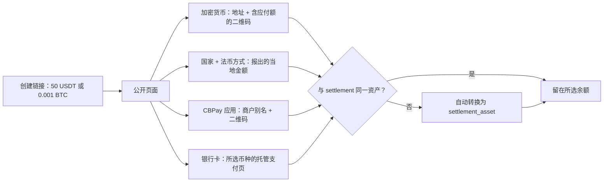

> **环境：** 测试 `https://cryptobank.qbank.cl/platform` (`pk_test_...`) - 正式 `https://api.qbank.cl/platform` (`pk_...`).

创建一个**通用收款链接**：一次 `POST /v1/payins`（`method: "checkout"`）
即可返回一个带品牌的公开 URL，付款人在页面上自行选择支付方式。收款以
**你选择的虚拟余额**计价（`settlement_asset`：`USDT`、`USDC`、`BTC` 或
`GOLD`，默认 `USDT`），每笔付款在入账时**自动转换**为该余额——除非付款
人用同一资产支付，此时不发生转换。

页面将支付方式组织为**四个标签页**：

- **CBPay** —— 使用应用直接支付：显示商户别名和二维码；用应用扫码
  即可通过内部转账即时付款，支持 4 种余额中的任意一种。
- **Crypto** —— 可用币种按网络分组（目前为 TRON 与以太坊上的 USDT、
  以太坊上的 USDC 以及 BTC；新网络启用后会自动出现），每笔收款专属
  充值地址，并附带**可扫描二维码**，兼容外部钱包（Trust Wallet、
  MetaMask、Binance 等）。
- **Fiat** —— 付款人在**所有有可用代收走廊的国家**中选择自己的国家，
  即可看到可用方式（二维码、银行转账、托管支付页）及即时报出的当地
  金额。
- **银行卡** —— 在安全的托管页面用信用卡或借记卡支付，按**扣款币种**
  列出（目前为 BOB 和 USD；未来收单机构的币种会自动出现）。每种币种
  都是独立的支付选项，各自有报出的金额。



```bash
curl -X POST https://api.qbank.cl/platform/v1/payins \
  -H "Authorization: Bearer <token>" \
  -H "Content-Type: application/json" \
  -d '{
    "method": "checkout",
    "amount": "50",
    "settlement_asset": "USDT",
    "description": "订单 8841",
    "country": "CL",
    "success_url": "https://your-app.com/payment/ok",
    "failure_url": "https://your-app.com/payment/error",
    "expires_in": 86400,
    "idempotency_key": "order-8841"
  }'
```

- `amount` 以 **`settlement_asset`** 计价：配 `USDT` 的 `"50"` 表示 50
  USDT；配 `BTC` 的 `"0.001"` 表示 0.001 BTC；配 `GOLD` 的 `"2"` 表示
  2 克黄金。不要发送 `currency`——那是旧契约，会返回 `400`（收款不再
  绑定当地货币）。
- `country` 为**可选**，仅用于页面上的国家预选；付款人可以更改。
- `GOLD` 没有自己的支付轨道：收款始终通过自动转换达成，无论客户用什么
  方式付款。

响应 `201`：

```json
{
  "payin_id": "d0135ed5-8e9c-4f8b-a522-8ec100470426",
  "kind": "checkout",
  "status": "pending",
  "settlement_asset": "USDT",
  "asset_amount": "50",
  "country": "CL",
  "description": "订单 8841",
  "reference": "CB68JZCT46QE",
  "checkout_url": "https://api.qbank.cl/platform/pay/fc4981b8e7c7…",
  "expires_at": "2026-07-17T17:57:44Z",
  "receipt_url": "https://api.qbank.cl/platform/v1/payins/d0135ed5-…/receipt"
}
```

把 `checkout_url` 分享给付款人（链接、邮件、WhatsApp、打印二维码均可）。
页面无需登录，带有你组织的品牌，并会自动刷新：任一方式确认付款后，页面
显示"已支付"，如设置了 `success_url` 则自动跳转。

## 各支付轨道的工作方式

- **多国家法币**：付款人选择国家和方式；当地金额即时报价（目标金额 →
  美元 → 当地货币，按你走廊的 `payin_rate`，向上取整），在选定方式时
  **冻结**。入账按正常 payin 汇率与手续费结算，随后转换为
  `settlement_asset`。付款金额**小于**冻结报价时照常入账（钱是真实的），
  但**不会**将链接标记为已支付。当一个国家以**多种币种**提供同一方式
  （例如玻利维亚同时提供 BOB 和 USD 的二维码）时，页面把每种币种列为
  独立选项。墨西哥的银行转账会为该链接生成一个**专属 CLABE（仅限本次
  收款）**：付款人只需转账准确金额，**无需填写任何参考号** —— 账户本身
  即可识别链接，存款自动检测并结算。若当时无法签发专属账户，页面会降级
  为经典方式（商户通用账户 + 转账附言中必须填写参考号）。
- **拉取式收款（委内瑞拉）**：`c2p` 和 `debito_inmediato` 直接从付款人
  账户扣款。页面要求填写银行、证件号、电话（C2P）或账户（即时扣款）
  以及 OTP —— C2P 由付款人在其银行 App 中生成；即时扣款则按需发送
  （"请求密码"按钮）。金额始终是报价时冻结的金额；若通道同步确认，
  链接即刻支付完成。被拒绝不会终结链接：付款人可修正数据或改用其他
  方式。
- **银行卡（多币种）**：标签页按扣款币种列出每个可用选项及其报价金额；
  选择后打开该币种的托管支付页面。每种币种是独立的物化（同一链接可
  同时以 BOB 和 USD 报价；最先完成支付的生效）。
- **加密货币（每笔收款一个钱包）**：选择币种后生成专属地址及其
  `qr_payload` 和 `qr_png_base64`——二维码始终为裸地址（BTC bech32、
  TRON base58、ETH hex），以兼容钱包与交易所（Binance 等会拒绝
  BIP-21/EIP-681 URI）；精确金额显示在旁边可复制。若支付资产与
  `settlement_asset` 不同，报出的应付额**已包含转换成本**（由付款人
  承担；你收到精确的目标金额）。部分支付会累加，页面显示剩余金额。
  涉及 BTC/GOLD 的报价每 15 分钟刷新。
- **CBPay 应用**：商户二维码内嵌链接
  （`cbpay:pay?to=…&checkout=…`）。应用通过内部转账以 4 种余额中的
  任意一种付款：同一资产 ⇒ 精确目标金额；不同 ⇒ 含转换的应付额。金额
  在服务端按新报价校验——不足以覆盖收款时返回
  `422 checkout_amount_mismatch` 及当前应付额。集成方：
  `POST /v1/transfers` 接受可选字段 `checkout_token`（或在
  `to_qr_token` 中使用扩展二维码）；目标账户强制为链接所属账户。

## 自动转换到所选余额

任何与 `settlement_asset` 不同资产的入账都会经你账户的转换引擎转换
（与 `POST /v1/swaps` 相同的点差与限额）。汇总状态通过
`conversion_status` 传递：

| `conversion_status` | 含义 |
|---|---|
| _（缺省）_ | 未发生转换（用同一资产支付） |
| `done` | 链接的所有转换均已执行 |
| `pending_retry` | 某次转换暂时失败（价格不可用或限额）；资金留在收到的资产中并自动重试 |

## 链接的公开端点（免认证，有限流）

- `GET {checkout_url}/state`——链接状态：`status`、`paid_method`、
  `settlement_asset`、`asset_amount`、冻结的法币物化
  （`fiat_methods`）、加密进度（`crypto`，含 `due`/`received`）及
  `conversion_status`。
- `GET {checkout_url}/quote`——选择前的报价：`countries`（按国家的
  目录；每个国家在 `options[]` 中列出其通道——每个方式+币种一行，
  拉取式方式带 `collect: true`）、`cards`（按国家与币种的银行卡选项，
  含 `local_amount`）、`crypto`（各币对的参考应付额）和 `cbpay`
  （别名 + 各资产应付额）。带 `?country=XX` 时额外返回该国每个选项
  当地金额的 `country_quote`。
- `POST {checkout_url}/methods/{method}`——物化所选支付选项。法币方式
  要求 `?country=XX`；当国家以多种币种提供该方式时（银行卡、玻利维亚
  的 QR BOB/USD）还须传 `&currency=YYY`；加密货币使用
  `crypto:<chain>:<asset>`（如 `crypto:tron:usdt`），不带国家。拉取式
  方式返回付款人表单定义（`banks[]`、`requires_otp_request`）和冻结的
  报价。对同一组合重复 POST 返回**同一个**物化结果。
- `POST {checkout_url}/collect/otp`——当通道按需发送密码时
  （`requires_otp_request: true`，如委内瑞拉即时扣款），请求拉取式
  收款的 OTP。返回随最终扣款一起提交的 `otp_reference`。严格限流
  （每次调用都是真实的短信/推送）。
- `POST {checkout_url}/collect`——用付款人数据（银行、证件号、电话或
  账户、OTP）执行拉取式扣款。金额始终是冻结的金额；若通道同步确认，
  返回 `paid: true`，链接在同一次调用中完成结算。

如果你想在同一链接上渲染自己的支付页面，这些端点会很有用。

## 链接规则

- **一个链接 = 一笔收款**：最先完成支付的方式生效；之后经其他轨道的
  付款不会入账（在无人付款前，选择某个方式不会锁定其他方式）。
- `expires_in` 取值 600 到 604800 秒（10 分钟到 7 天；默认 24 小时）。
  到期未支付时 payin 变为 `expired`，你会收到 `payin_expired` Webhook。
- 使用相同 `idempotency_key` 重试会返回**同一个链接**（URL 不变），
  绝不会开启第二笔收款。
- `settlement_asset` 必须已为你的组织启用；若被停用，创建请求返回
  `422 settlement_asset_disabled`。

收款完成后你会收到 `payin_credited`，附带 `settled_via`（如
`crypto:tron:usdt`、`qr`、`cbpay`）、`settlement_asset` 和
`asset_amount`；加密支付额外附带 `crypto_amount`，CBPay 应用支付额外
附带 `transfer_id`、`asset` 和 `amount`。

在 `GET /v1/payins` 和 `GET /v1/payins/{payin_id}` 中，checkout 收款在
所有状态（待支付、已过期、已入账）都会返回其计价 —
`settlement_asset` + `asset_amount`；在使用本地支付方式之前
`currency`/`local_amount` 保持为空。以加密货币或 CBPay 应用结算的收款
会返回 `usdt_credited` 而没有 `fx_rate`（不适用外汇报价）。

链接专属错误（由打开页面的人看到）：

| HTTP | `error` | 含义 |
|---|---|---|
| 404 | `not_found` | 令牌无效或链接不存在 |
| 400 | `country_required` | 法币方式缺少 `?country=XX` |
| 400 | `currency_required` | 该国家以多种币种提供此方式；缺少 `?currency=YYY` |
| 409 | `already_paid` | 链接已通过其他方式支付 |
| 410 | `checkout_expired` | 链接到期未支付 |
| 422 | `method_unavailable` | 该方式对此链接或国家不可用 |
| 422 | `country_unavailable` | 该国家没有可用的支付方式 |
| 422 | `checkout_amount_mismatch` | CBPay 转账不足以覆盖收款的当前应付额 |
| 422 | `collect_otp_failed` | 通道拒绝发送 OTP（请检查数据） |
| 422 | `collect_rejected` | 通道拒绝了拉取式扣款（OTP 无效或数据错误）；链接保持待支付 |
| 429 | `too_many_attempts` | 公开页面的按 IP 限流 |
| 503 | `pricing_unavailable` | 报价暂时不可用；请稍后重试 |
## 常见问题

#### 同一个链接可以被支付两次吗？
不可以。一个链接 = 一次收款：第一个完成支付的通道胜出（`already_paid`，
409）。在链接已被其他通道结算之后到达的加密货币入金**不会**入账 ——
它会被保留等待对账。
#### 付款人转的加密货币比报价少（或多）怎么办？
部分加密支付会**累加**：页面会显示距报价金额还差多少。链接过期后到达的
迟到付款仍会记入你的账户。
#### 链接的有效期是多久？
`expires_in` 介于 600 秒和 7 天之间（默认 24 小时）。过期时你会收到
`payin_expired` webhook，公开页面返回 `checkout_expired`（410）。
#### 转换到我的结算资产失败了会怎样？
资金安全地保留在 USDT 中，payin 报告
`conversion_status: pending_retry`；平台会自动重试直到兑换成功 ——
你的钱不会丢失，也不会被重复转换。
#### 付款人选定支付方式后还能更换吗？
可以。每种方式独立物化；重复请求同一方式会返回相同的物化结果。哪个
通道先支付，哪个就结算该链接。
#### 创建链接可以安全重试吗？
可以 —— 用**相同**的 `idempotency_key` 重试 `POST /v1/payins` 会返回同一个
链接。新的 key 会创建一个全新的独立链接。
