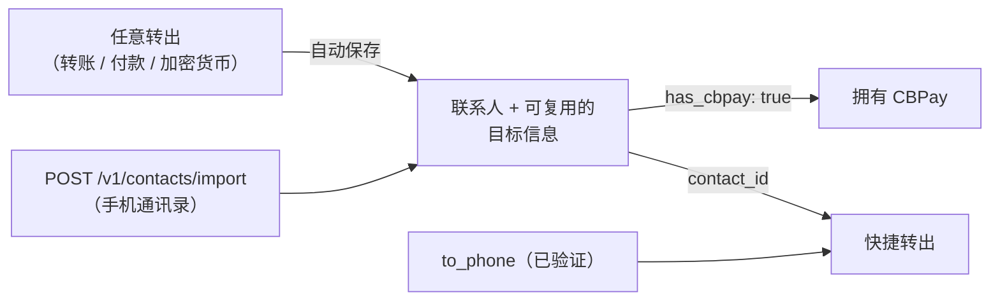

> **环境：** 测试 `https://cryptobank.qbank.cl/platform` (`pk_test_...`) - 正式 `https://api.qbank.cl/platform` (`pk_...`).

**联系人簿**让你告别重复输入：每次转出（内部转账、
法币付款或加密货币提现）都会自动将目标保存为联系人，
你可以**导入手机通讯录**来发现哪些联系人已经拥有 CBPay，
并且转账可以直接使用**手机号**
或 `contact_id` 作为目标。



## 联系人自动创建

每次转出都会把目标保存到你的联系人簿中（自动去重：重复使用
同一目标绝不会产生重复项，只会将其标记为已使用）：

| 转出类型 | 保存的内容 |
|---|---|
| 内部转账 | 目标 CBPay 账户（姓名、邮箱，以及手机号——当已验证时） |
| 法币付款 | 完整的收款人信息（银行、账户、证件……），按国家/地区和方式区分 |
| 加密货币提现 | 每个网络对应的地址（在提现时用 `contact_name` 为其命名） |

不想保存一次性的目标？在转出请求体中加入
`"save_contact": false`。自动保存绝不会影响转出本身：即使保存
失败，转出仍会正常执行。

## 导入手机通讯录

上传手机中的联系人（每次请求最多 **1,000 条**；超出请
分批上传），CBPay 会告诉你**谁已经拥有账户**——匹配依据
手机号，且仅与同一运营方的账户进行匹配：

```bash
curl -X POST https://api.qbank.cl/platform/v1/contacts/import \
  -H "Authorization: Bearer <token>" \
  -H "Content-Type: application/json" \
  -d '{
    "contacts": [
      { "name": "Carlos Soto", "phones": ["+56 9 8765 4321"] },
      { "name": "Ana Pérez", "phones": ["912345678"] },
      { "name": "Aunt Rosa", "phones": ["not-a-number"] }
    ]
  }'
```

`200` 响应：

```json
{
  "imported": 2,
  "matched": 1,
  "total": 3,
  "contacts": [
    { "name": "Carlos Soto", "phone": "+56987654321", "contact_id": "3f8a…", "has_cbpay": true },
    { "name": "Ana Pérez", "phone": "+56912345678", "contact_id": "9c1d…", "has_cbpay": false },
    { "name": "Aunt Rosa", "skipped": true, "reason": "no_valid_phone" }
  ]
}
```

- 号码会自动规范化为 **E.164** 格式：支持 `+…`、`00…`
  以及本地号码（会自动加上你账户所在国家/地区的区号）。无效
  号码会被跳过。
- 重复导入是安全的：已存在的联系人绝不会被重复创建。
- `has_cbpay: true` 表示该手机号属于同一运营方的一个
  有效账户——你可以立即向其转账。

## 通过手机号转账

内部转账支持 `to_phone`（除 `to_account_id`、`to_email`
和 `to_contact_id` 之外）：

```bash
curl -X POST https://api.qbank.cl/platform/v1/transfers \
  -H "Authorization: Bearer <token>" \
  -H "Content-Type: application/json" \
  -d '{
    "to_phone": "+56987654321",
    "amount": "25.000000",
    "description": "Lunch",
    "idempotency_key": "lunch-2026-07-10"
  }'
```

> **重要**
出于安全考虑，`to_phone` 只会解析到手机号已通过 **OTP 验证**的
账户（我们绝不会根据未验证的号码来猜测资金去向）。如果
该号码未验证：返回 `404 recipient_not_found`；如果多个
账户共用该号码：返回 `422 recipient_ambiguous`（请改用 `to_account_id` 或
`to_email`）。
## 向联系人转账

每种转出都可以直接指定联系人：

```bash Transfer (contact with CBPay)
curl -X POST https://api.qbank.cl/platform/v1/transfers \
  -H "Authorization: Bearer <token>" \
  -H "Content-Type: application/json" \
  -d '{ "to_contact_id": "3f8a…", "amount": "10.000000", "idempotency_key": "t-991" }'
```

```bash Payout (saved beneficiary)
curl -X POST https://api.qbank.cl/platform/v1/payouts \
  -H "Authorization: Bearer <token>" \
  -H "Content-Type: application/json" \
  -d '{
    "country": "CL", "currency": "CLP", "amount": "45000",
    "beneficiary_contact_id": "7b2c…",
    "idempotency_key": "rent-07"
  }'
```

```bash Crypto withdrawal (saved address)
curl -X POST https://api.qbank.cl/platform/v1/crypto/withdrawals \
  -H "Authorization: Bearer <token>" \
  -H "Content-Type: application/json" \
  -d '{ "chain": "tron", "to_contact_id": "5d4e…", "amount": "100.000000", "idempotency_key": "w-2211" }'
```

- **付款（payouts）**：使用该联系人在对应国家/地区最近保存的
  收款人（如指定了方式则按方式匹配；否则采用已保存目标的方式）。请求体中显式的 `beneficiary` 始终优先。该走廊没有
  已保存的目标时：返回 `422 no_saved_destination`。
- **加密货币**：使用该 `chain` 对应的已保存地址；显式的
  `to_address` 优先。
- **转账（transfers）**：使用联系人关联的 CBPay 账户；如果联系人
  只有手机号，则尝试其（已验证的）号码。两者都没有时：
  返回 `422 contact_not_linked`。

## 管理联系人簿

```bash
# Listing with search and filters
curl "https://api.qbank.cl/platform/v1/contacts?q=carlos&has_cbpay=true&page=1&page_size=50" \
  -H "Authorization: Bearer <token>"

# Create manually
curl -X POST https://api.qbank.cl/platform/v1/contacts \
  -H "Authorization: Bearer <token>" \
  -H "Content-Type: application/json" \
  -d '{ "display_name": "Carlos Soto", "phone": "+56987654321", "email": "carlos@mail.com", "favorite": true }'

# Detail (includes saved destinations)
curl https://api.qbank.cl/platform/v1/contacts/{contact_id} \
  -H "Authorization: Bearer <token>"

# Edit / delete
curl -X PATCH https://api.qbank.cl/platform/v1/contacts/{contact_id} \
  -H "Authorization: Bearer <token>" -H "Content-Type: application/json" \
  -d '{ "alias": "Carlitos", "favorite": true }'
curl -X DELETE https://api.qbank.cl/platform/v1/contacts/{contact_id} \
  -H "Authorization: Bearer <token>"
```

联系人详情（`200`）：

```json
{
  "contact_id": "3f8a1b2c-…",
  "display_name": "Carlos Soto",
  "alias": "Carlitos",
  "phone": "+56987654321",
  "email": "carlos@mail.com",
  "has_cbpay": true,
  "cbpay_account_id": "389d34a3-…",
  "source": "import",
  "favorite": true,
  "destinations": [
    { "destination_id": "aa11…", "type": "cbpay", "last_used_at": "2026-07-10T15:00:00Z", "created_at": "2026-07-08T10:00:00Z" },
    { "destination_id": "bb22…", "type": "payout", "country": "CL", "currency": "CLP", "method": "bank_transfer",
      "details": { "name": "Carlos Soto", "tax_id": "12.345.678-5", "bank_code": "012", "account_type": "checking", "account_number": "123456789" },
      "last_used_at": "2026-07-09T18:30:00Z", "created_at": "2026-07-09T18:30:00Z" },
    { "destination_id": "cc33…", "type": "crypto", "chain": "tron", "address": "TVJ6njG5Fyrq6XwYok3xPQx8kR7HQx6vXk",
      "last_used_at": "2026-07-07T12:00:00Z", "created_at": "2026-07-07T12:00:00Z" }
  ],
  "created_at": "2026-07-07T12:00:00Z",
  "updated_at": "2026-07-10T15:00:00Z"
}
```

你还可以手动添加目标（`POST
/v1/contacts/{id}/destinations`，携带 `type: payout|crypto|cbpay` 及其
字段），也可以删除它们（`DELETE .../destinations/{destination_id}`）。

## 错误

| HTTP | `error` | 原因 | 解决方法 |
|---|---|---|---|
| 400 | `invalid_phone` | 手机号无法规范化为 E.164 | 以 `+<country><number>` 形式发送 |
| 400 | `batch_too_large` | 单次导入超过 1,000 条联系人 | 分批上传 |
| 404 | `not_found` | 联系人/目标不存在或不属于你 | 检查该 id |
| 404 | `recipient_not_found` | 没有匹配的已验证手机号 | 请收款方验证其手机号，或改用邮箱/account_id |
| 409 | `duplicate` | 你已经有一个使用该手机号/邮箱的联系人 | 编辑已有的联系人 |
| 422 | `recipient_ambiguous` | 多个账户共用该手机号 | 使用 `to_account_id` 或 `to_email` |
| 422 | `contact_not_linked` | 该联系人未关联 CBPay 账户 | 通过其他标识转账，或改为向其付款（payout） |
| 422 | `no_saved_destination` | 该联系人在该走廊/链上没有已保存的目标 | 显式发送 `beneficiary`/`to_address`（它会被保存下来） |

## 常见问题

#### 对方会知道我把他保存为联系人了吗？
不会。联系人簿是你账户的私有数据：导入通讯录或
保存联系人绝不会通知任何人，也不会共享你的数据。只有你能看到
自己的联系人簿。
#### 为什么我确定某个联系人有 CBPay，却显示 has_cbpay: false？
匹配依据精确的手机号（E.164），且仅针对同一
运营方的账户。如果那个人在其账户上注册了不同的号码（或没有注册号码），
就不会匹配上。一旦对方注册并验证了该手机号，重新导入即可
匹配到。
#### 我可以向 has_cbpay: false 的联系人转账吗？
无法通过内部转账（没有可入账的账户）。但你可以向其
银行账户发起法币付款，或向其钱包发送加密货币——这些
目标同样会保存到该联系人下。
#### 如果我所在机构中有两个人共用同一个号码怎么办？
按手机号转账会明确失败，返回 422 recipient_ambiguous——我们绝不
猜测资金去向。这种情况请使用 to_account_id 或 to_email。
#### 导入功能会被用来探测任意号码是否拥有 CBPay 吗？
匹配仅针对你同一运营方的账户，每次请求上限
1,000 条联系人，并受 API 的全局速率限制约束。除账户存在与否之外
（这是能够向其转账的前提），不会暴露被匹配账户的任何信息。
