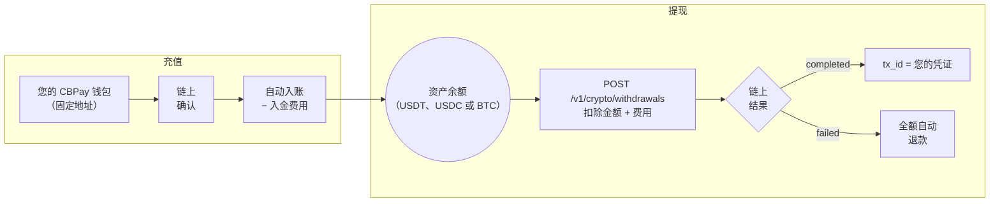

> **环境：** 测试 `https://cryptobank.qbank.cl/platform` (`pk_test_...`) - 正式 `https://api.qbank.cl/platform` (`pk_...`).

您的加密货币余额与区块链相连。支持的组合：

| 网络 | 资产 | 入账余额 |
|---|---|---|
| `tron` | `usdt` | USDT |
| `eth` | `usdt` | USDT |
| `eth` | `usdc` | USDC |
| `btc` | `btc` | BTC |

每笔充值都会计入**其对应资产的余额**（USDC 钱包的充值计入您的
USDC 余额；Bitcoin 钱包计入您的 BTC 余额）。`GOLD` 是唯一没有链上
通道的余额：它只能通过内部转账和运营方入账进行变动。



## 您的账户创建时即自带钱包

每个账户——个人和企业——在创建时都会自动获得**每种支持组合各一个
充值钱包**（`tron`/`usdt`、`eth`/`usdt`、`eth`/`usdc` 和
`btc`/`btc`），**完全免费**：注册完成后，您的四个地址即可接收资金。

```bash
# 账户创建后，您的地址即已存在：
curl https://api.qbank.cl/platform/v1/crypto/wallets \
  -H "Authorization: Bearer <token>"
```

```json
{
  "page": 1,
  "page_size": 50,
  "wallets": [
    { "wallet_id": "9d68…", "chain": "tron", "asset": "USDT", "address": "TXMD…", "label": "", "type": "deposit", "receive_only": true, "created_at": "2026-07-11T23:33:20Z" },
    { "wallet_id": "a83d…", "chain": "eth", "asset": "USDT", "address": "0xefe0…", "label": "", "type": "deposit", "receive_only": true, "created_at": "2026-07-11T23:33:20Z" },
    { "wallet_id": "fb88…", "chain": "eth", "asset": "USDC", "address": "0xa072…", "label": "", "type": "deposit", "receive_only": true, "created_at": "2026-07-11T23:33:20Z" },
    { "wallet_id": "c1d4…", "chain": "btc", "asset": "BTC", "address": "bc1qf66…", "label": "", "type": "deposit", "receive_only": true, "created_at": "2026-07-11T23:33:20Z" }
  ]
}
```

> **注**
钱包在账户创建时于后台配置：若您在注册的同一秒查询，某个地址可能
尚未生成——请几秒后重试。
充值钱包是**入金入口**，而非操作型钱包：它们只用于**接收**加密
货币并计入您的虚拟余额。它们不能发送资金，也不能导出或导入（那是
[隔离钱包](https://docs.cbpayapp.com/zh/guides/segregated-wallets)的功能）。

> **注**
两个产品、两条路由：充值钱包位于 `/v1/crypto/wallets`，隔离钱包位于
`/v1/segregated-wallets`。每个钱包响应都带有 `type` 鉴别字段
（`deposit` / `segregated`），便于随时区分。
| 账户类型 | 每个网络+资产组合的充值钱包数 |
|---|---|
| 个人 | **1**（初始钱包已占用名额） |
| 企业 | **1**（初始钱包已占用名额） |

## 可以创建更多充值钱包吗？

不可以。每个账户——个人和企业——每个网络+资产组合都恰好持有
**一个充值钱包**，且全部随账户创建自动生成。
`POST /v1/crypto/wallets` 仅用于补齐缺失的组合（例外情况）：四个
钱包均已就位时会返回 `422 wallet_limit_reached`。

```bash
curl -X POST https://api.qbank.cl/platform/v1/crypto/wallets \
  -H "Authorization: Bearer <token>" \
  -H "Content-Type: application/json" \
  -d '{ "chain": "eth", "asset": "usdc" }'
```

若该组合已存在——`422`：

```json
{
  "error": "wallet_limit_reached",
  "message": "accounts hold one deposit wallet per network/asset pair (created automatically with the account); use segregated wallets for additional wallets"
}
```

- 初始钱包**始终免费**；`wallet_creation` 费用仅适用于手动补齐的
  情况（费用为 0——默认值——时即免费；若创建失败，费用会自动退回）。
- 需要**多个拥有独立余额的钱包**（按客户、按项目、按业务单元）？
  那是[隔离钱包](https://docs.cbpayapp.com/zh/guides/segregated-wallets)产品：企业不限数量，
  个人每个网络+资产组合限 1 个。

## 查看我的钱包

```bash
curl https://api.qbank.cl/platform/v1/crypto/wallets \
  -H "Authorization: Bearer <token>"
```

```json
{
  "wallets": [
    {
      "wallet_id": "b7e3…",
      "chain": "tron",
      "asset": "USDT",
      "address": "TQmZ…",
      "label": "",
      "type": "deposit",
      "receive_only": true,
      "created_at": "2026-07-07T12:00:00Z"
    },
    {
      "wallet_id": "a1c9…",
      "chain": "eth",
      "asset": "USDT",
      "address": "0x8f3B…",
      "label": "",
      "type": "deposit",
      "receive_only": true,
      "created_at": "2026-07-07T12:00:00Z"
    },
    {
      "wallet_id": "fb88…",
      "chain": "eth",
      "asset": "USDC",
      "address": "0xa072…",
      "label": "",
      "type": "deposit",
      "receive_only": true,
      "created_at": "2026-07-07T12:00:00Z"
    },
    {
      "wallet_id": "c1d4…",
      "chain": "btc",
      "asset": "BTC",
      "address": "bc1qf66…",
      "label": "",
      "type": "deposit",
      "receive_only": true,
      "created_at": "2026-07-07T12:00:00Z"
    }
  ]
}
```

> **注**
Bitcoin 地址为**原生 bech32** 格式（`bc1q…`）：任何现代钱包或交易所
都可以向其发送资金。BTC 金额使用 8 位小数（`"0.00050000"`）。
## 充值

将钱包对应的资产**通过正确的网络**发送到其地址。充值在链上确认后，
该资产的余额会自动入账（若 CBPay 配置了 `funding` 费用则扣除后
入账），并触发 `crypto_deposit_credited` webhook：

```json
{
  "account_id": "…",
  "chain": "tron",
  "asset": "USDT",
  "tx_id": "b1946ac9…",
  "amount": "499.000000",
  "fee": "1.000000"
}
```

> **重要**
**只能通过钱包所属网络发送该钱包的资产**（USDT 发到 USDT 钱包，
USDC 发到 USDC 钱包，BTC 发到 Bitcoin 钱包）。地址归您所有且固定
不变：每次充值都可以重复使用。
### 确认时间

| 网络 | 检测 | 入账（网络确认） |
|---|---|---|
| TRON | 近乎即时 | **约 1 分钟**（19 个确认） |
| Ethereum | 近乎即时 | **数分钟**，视网络拥堵情况而定 |
| Bitcoin | 第一个区块（约 10 分钟） | **约 30 分钟**（3 个确认） |

入账时始终附带 webhook 和 `tx_id`，您可以在网络浏览器上进行核验。

## 转出（链上提现）

从对应余额向任意外部地址发送 USDT、USDC 或 BTC（`asset` 为可选：
`tron`/`eth` 网络默认 `USDT`，`btc` 网络默认 `BTC`；USDC 仅支持
`eth` 网络）：

```bash USDT（TRON 网络）
curl -X POST https://api.qbank.cl/platform/v1/crypto/withdrawals \
  -H "Authorization: Bearer <token>" \
  -H "Content-Type: application/json" \
  -d '{
    "chain": "tron",
    "to_address": "TVJ6…",
    "amount": "100.000000",
    "idempotency_key": "withdrawal-2026-07-07-b"
  }'
```

```bash USDC（Ethereum 网络）
curl -X POST https://api.qbank.cl/platform/v1/crypto/withdrawals \
  -H "Authorization: Bearer <token>" \
  -H "Content-Type: application/json" \
  -d '{
    "chain": "eth",
    "asset": "USDC",
    "to_address": "0x8f3B…",
    "amount": "50.000000",
    "idempotency_key": "withdrawal-usdc-2026-07-09-a"
  }'
```

```bash BTC（Bitcoin 网络）
curl -X POST https://api.qbank.cl/platform/v1/crypto/withdrawals \
  -H "Authorization: Bearer <token>" \
  -H "Content-Type: application/json" \
  -d '{
    "chain": "btc",
    "to_address": "bc1qw50…",
    "amount": "0.00050000",
    "idempotency_key": "withdrawal-btc-2026-07-15-a"
  }'
```

> **注**
在 Bitcoin 网络上，目标地址可以是 bech32（`bc1q…`）、taproot
（`bc1p…`）或 legacy（`1…` / `3…`）地址。Bitcoin 的**网络费用**由
操作本身承担——最终状态会像其他提现一样通过 webhook 送达。
响应 `202` —— 扣除 `amount + fee`，交易随即广播：

```json
{
  "withdrawal_id": "5e8c…",
  "chain": "tron",
  "asset": "USDT",
  "to_address": "TVJ6…",
  "amount": "100.000000",
  "fee": "1.000000",
  "total_debit": "101.000000",
  "status": "processing",
  "tx_id": "…"
}
```

> **注**
每笔提现都会自动将地址保存为[联系人](https://docs.cbpayapp.com/zh/guides/contacts)——在
请求体中用 `"contact_name"` 为其命名，或用 `"save_contact": false`
禁用。若要重复发送，可使用 `"to_contact_id"` 代替 `to_address`
（将使用该联系人在对应 `chain` 上保存的地址）。
最终状态通过 `crypto_withdrawal_status_changed` webhook 送达：
**`completed`**（`tx_id` 即您的凭证）或 **`failed`**（全额扣款
退回）。

您也可以随时查询提现：

```bash
curl https://api.qbank.cl/platform/v1/crypto/withdrawals/5e8c… \
  -H "Authorization: Bearer <token>"
```

```json
{
  "withdrawal_id": "5e8c…",
  "chain": "tron",
  "asset": "USDT",
  "to_address": "TVJ6…",
  "amount": "100.000000",
  "fee": "1.000000",
  "total_debit": "101.000000",
  "status": "completed",
  "status_code": "confirmed",
  "status_message": "confirmed on-chain",
  "tx_id": "7d1f…"
}
```

> **注**
若要向**另一个 CBPay 账户**转移余额，无需经过区块链：
[内部转账](https://docs.cbpayapp.com/zh/guides/transfers)即时且免费。
### Travel Rule（超过阈值的提现）

国际监管（FATF R.16，即 "Travel Rule"）要求 **1,000 USD 起**的链上
提现在资金移动前申报收款人。低于阈值一切不变。有两条路径：

#### 自有钱包（self-hosted）

若目的地是账户持有人自己的钱包（而非交易所），申报 `wallet_type`
和受益人姓名：

```bash
curl -X POST https://api.qbank.cl/platform/v1/crypto/withdrawals \
  -H "Authorization: Bearer <token>" \
  -H "Content-Type: application/json" \
  -d '{
    "chain": "tron",
    "to_address": "TVJ6…",
    "amount": "1500.000000",
    "wallet_type": "self_hosted",
    "beneficiary_name": "Maria Perez",
    "idempotency_key": "withdrawal-2026-07-12-a"
  }'
```

响应包含 `"travel_rule_status": "self_hosted_attested"`。

#### 其他机构（travel address）

若目的地是另一家兼容机构的账户，向受益人索取其 **travel address**
（以 `ta…` 开头的代码），连同其姓名一起发送 — 付款地址由收款机构
提供，因此可省略 `to_address`：

```bash
curl -X POST https://api.qbank.cl/platform/v1/crypto/withdrawals \
  -H "Authorization: Bearer <token>" \
  -H "Content-Type: application/json" \
  -d '{
    "chain": "tron",
    "amount": "1500.000000",
    "travel_address": "ta2AQSjBotWQf38c8sxYYK2Kfis…",
    "beneficiary_name": "Maria Perez",
    "idempotency_key": "withdrawal-2026-07-12-b"
  }'
```

与收款机构的数据交换内联完成。若获批准，提现会发往对方提供的地址，
且响应包含 `"travel_rule_status": "approved"`。若对方拒绝
（`travel_rule_rejected`）或尚未处理（`travel_rule_pending`），
提现不会执行、也不会扣款 — 稍后用**同一个** `idempotency_key` 重试。

| 错误 | 含义 | 处理方式 |
|---|---|---|
| `travel_rule_required` | 超过阈值的提现缺少受益人数据 | 补充 `travel_address` 或 `wallet_type: "self_hosted"` + `beneficiary_name` |
| `travel_rule_beneficiary_required` | 缺少 `beneficiary_name` | 发送目的持有人的姓名 |
| `travel_rule_address_mismatch` | 您的 `to_address` 与收款机构批准的地址不一致 | 省略 `to_address` 或使用批准交换中的地址 |
| `travel_rule_rejected` | 收款机构拒绝了该转账 | 与收款人核对受益人数据 |
| `travel_rule_pending` | 收款机构尚未处理 | 稍后用同一个 `idempotency_key` 重试 |
| `travel_rule_unavailable` | 数据交换暂时不可用 | 用同一个 `idempotency_key` 重试 |

## 资金变动

```bash
# 链上活动：充值 + 提现，支持 tx_id 与日期过滤
curl "https://api.qbank.cl/platform/v1/crypto/transactions?from=2026-07-01&to=2026-07-08" \
  -H "Authorization: Bearer <token>"
```

```json
{
  "page": 1,
  "page_size": 50,
  "deposits": [
    {
      "chain": "tron",
      "asset": "USDT",
      "tx_id": "b1946ac9…",
      "from_address": "TX9a…",
      "amount": "499.000000",
      "reference": "dep_8813…",
      "created_at": "2026-07-07T12:10:00Z"
    }
  ],
  "withdrawals": [
    {
      "withdrawal_id": "5e8c…",
      "chain": "tron",
      "asset": "USDT",
      "to_address": "TVJ6…",
      "amount": "100.000000",
      "fee": "1.000000",
      "total_debit": "101.000000",
      "status": "completed",
      "tx_id": "7d1f…",
      "created_at": "2026-07-07T15:00:00Z"
    }
  ]
}
```

```bash
# 当前余额（可用 + 冻结）
curl https://api.qbank.cl/platform/v1/balances \
  -H "Authorization: Bearer <token>"

# 完整会计历史（入金、提现、钱包费用……）
curl "https://api.qbank.cl/platform/v1/movements?type=funding&from=2026-07-01&to=2026-07-08" \
  -H "Authorization: Bearer <token>"
```

每笔充值都计入**其钱包对应资产的余额**（USDT、USDC 或 BTC）；钱包是
入金入口，每种货币只有一个余额。

## 错误

| HTTP | `error` | 原因 |
|---|---|---|
| 400 | `invalid_chain` | 不支持的网络（请使用 `tron`、`eth` 或 `btc`） |
| 400 | `invalid_asset` | 该网络/资产组合没有链上通道（支持：`tron`/`usdt`、`eth`/`usdt`、`eth`/`usdc`、`btc`/`btc` —— `GOLD` 不支持链上操作） |
| 400 | `to_address_required` | 缺少提现目标地址 |
| 402 | `insufficient_funds` | 该资产余额不足（不足以支付提现或创建费用） |
| 422 | `wallet_limit_reached` | 该账户在此网络+资产组合下已持有充值钱包（个人和企业均适用） |
| 422 | （提现返回 `status: failed`） | 广播时被拒绝；扣款已退回 |
| 503 | `withdrawals_unavailable` | 该通道的提现尚未启用 |
## 常见问题

#### 我需要自己创建入金钱包吗？
不需要。每个账户出生时即免费拥有所有受支持交易对的入金钱包
（`tron:usdt`、`eth:usdt`、`eth:usdc`、`btc:btc`）。创建端点只用于自愈
缺失的交易对 —— 同一交易对的第二个钱包会返回 `wallet_limit_reached`
（422）。
#### 入金什么时候记入我的余额？
检测接近实时（`pending`）；当网络达到该链所需的确认数后入账。可通过
`GET /v1/crypto/transactions` 或 `crypto_deposit` webhook 跟踪。
#### 提现失败会怎样？
已扣除的金额（含手续费）会自动退回你的余额。用**相同**的
`idempotency_key` 重试 —— 平台绝不会自行重新广播交易。
#### 为什么我的提现要求受益人信息？
超过你组织 Travel Rule 美元阈值的提现需要
`wallet_type: self_hosted` 加 `beneficiary_name`，或一个 `travel_address`
（`travel_rule_*` 系列 422 错误会逐字段引导你）。
#### GOLD 可以链上提现吗？
不可以 —— GOLD 是仅账本余额，没有链上通道。请先用
[兑换](https://docs.cbpayapp.com/zh/guides/swaps) 转换为可提现资产。
#### 为什么我的提现被 compliance_hold 拦截？
目标地址未通过合规筛查。操作记录为 failed 且资金已退回；如你认为是
误报，请联系你的 CBPay 团队。
