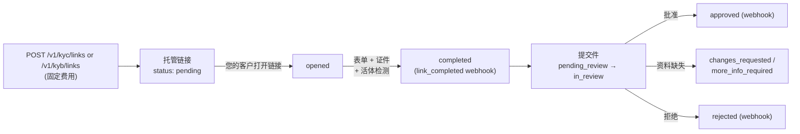
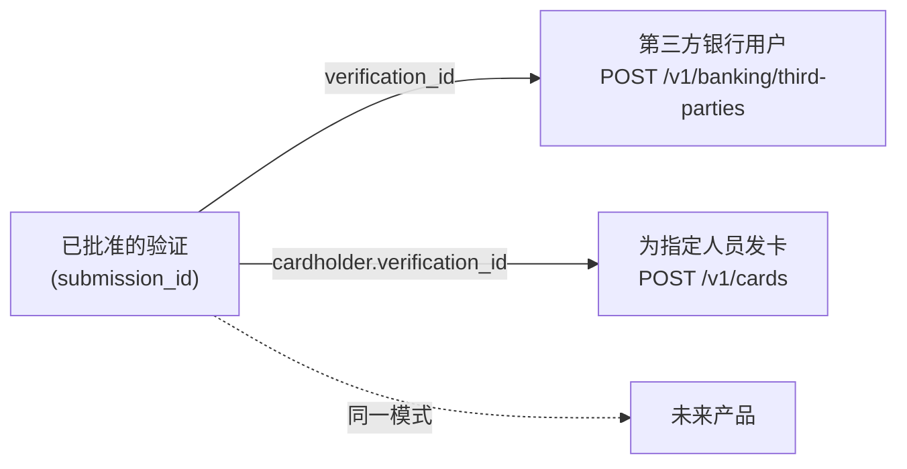

> **环境：** 测试 `https://cryptobank.qbank.cl/platform` (`pk_test_...`) - 正式 `https://api.qbank.cl/platform` (`pk_...`).

**身份验证**通过真实证据证明个人（KYC）或企业（KYB）确为其所声称的身份：完整的表单、经 OCR 校验的证件上传，以及**视频活体检测**。它包含两个方面：

1. **您自己的验证（入驻）**——强制要求：在获批之前，您的账户只能**入金**（收款、加密货币充值、转入的内部转账）和读取数据。个人 ⇒ KYC；企业 ⇒ KYB。
2. **验证您的客户（仅限企业账户）**——生成托管链接或通过 API 提交数据来验证您自己的终端客户，每次验证收取固定费用。



## 您自己的验证（入驻）

注册后，您的账户初始为未验证状态（`kyc_status: none`），**只能入金和读取数据**。任何资金流出操作（付款、内部转账、提现、银行服务、卡片）在您获批之前都会返回 `403 verification_required`。

### 申请您的验证链接

```bash
curl -X POST https://api.qbank.cl/platform/v1/me/verification/link \
  -H "Authorization: Bearer <token>"
```

`201` 响应（如果您已有一个未关闭的链接，则返回同一个链接并响应 `200`）：

```json
{
  "link_id": "a1b2c3d4-e5f6-4a7b-8c9d-0e1f2a3b4c5d",
  "kind": "kyc",
  "url": "https://…/on/usd/individual/new?invite=abc123…",
  "status": "pending",
  "label": "Ana Pérez",
  "created_at": "2026-07-10T12:00:00Z",
  "updated_at": "2026-07-10T12:00:00Z"
}
```

`kind` 由您的账户类型决定：个人 ⇒ `kyc`，企业 ⇒ `kyb`。入驻验证对您**免费**。
### 完成向导

打开 `url`：托管向导会引导您完成表单、证件上传（身份证明、居住证明；企业需提供公司文件），KYC 还包括摄像头活体检测。
### 等待审核

随时查询您的状态：

```bash
curl https://api.qbank.cl/platform/v1/me/verification \
  -H "Authorization: Bearer <token>"
```

```json
{
  "kyc_status": "pending",
  "required_kind": "kyc",
  "verified": false,
  "link": { "link_id": "a1b2c3d4-…", "kind": "kyc", "url": "https://…", "status": "completed" },
  "submission": { "submission_id": "f0e1d2c3-…", "kind": "kyc", "status": "in_review", "liveness_pending": false }
}
```

合规团队批准后，您的 `kyc_status` 会**自动**变为 `approved`，所有服务随即解锁（您会收到带 `self_onboarding: true` 的 `kyc_verification_status_changed` webhook）。

> **注**
**自动判定引擎：** 完全干净的申请（证件读取正确、活体检测通过、无制裁或 PEP 命中、无任何风险信号）将在**数秒内无需人工干预**即获批准。存在灰色地带的申请（同名 AML 命中、PEP、中等风险等级、高风险国家、证件无法辨认等）将进入运营方的人工审核队列，严重情形则会被直接拒绝。状态 webhook 中的 `decision_source` 字段（`"auto"` / `"admin"`）会告知判定者是谁。
批准后还会**用已验证的身份回填您的账户档案**：`display_name`（个人 =
名 + 姓；企业 = 法定名称）、`tax_id` 和 `country` 均取自验证结果，此后
通过 `PATCH /v1/me` 修改将返回 `409 identity_locked` —— 已验证的身份即为
数据的最终来源。
> **注**
等待期间您可以正常入金：所有方式的收款、加密货币充值和转入的内部转账从第一天起即可使用。如果您的验证被拒绝（`kyc_status: rejected`），请联系您的运营方——他们可能会要求您通过新链接重试。
## 验证您的客户（仅限企业账户）

已通过验证的**企业**账户可以验证其自己的终端客户。每创建一次验证都会计收所配置的固定费用（`kyc_verification` / `kyb_verification`；0 = 免费），若创建失败则**自动退款**。个人账户会收到 `403 company_account_required`。

### 方式 A——托管链接（推荐）

您的客户在白标向导中完成全部流程：表单、证件和活体检测。您只需生成链接并等待 webhook。

```bash KYC link (person)
curl -X POST https://api.qbank.cl/platform/v1/kyc/links \
  -H "Authorization: Bearer <token>" \
  -H "Content-Type: application/json" \
  -d '{
    "external_customer_id": "cust_123",
    "label": "Ana Pérez",
    "expires_in_days": 14,
    "idempotency_key": "kyc-link-cust-123-1"
  }'
```

```bash KYB link (company, with country)
curl -X POST https://api.qbank.cl/platform/v1/kyb/links \
  -H "Authorization: Bearer <token>" \
  -H "Content-Type: application/json" \
  -d '{
    "external_customer_id": "cust_456",
    "country": "cl",
    "label": "Comercial Andina SpA",
    "expires_in_days": 14,
    "idempotency_key": "kyb-link-cust-456-1"
  }'
```

- `external_customer_id`（必填）：您对被验证客户的自有引用——会在每个 webhook 和查询中原样返回。等于 `self` 或以 `:self` 结尾的值保留给账户入驻使用，会被拒绝并返回 `400 invalid_payload`。
- `idempotency_key`（必填）：使用相同 key 的重试会返回原始链接，**绝不会重复扣费**。
- `country`（仅 KYB）：`us`、`cl`、`ve`、`br`、`mx`、`co`、`pe`、`bo`、`py`、`ar` 或 `generic`（配合 ISO alpha-2 的 `generic_country`，例如 `"ES"`）。个人 KYC 不需要国家。
- `expires_in_days`（可选，1–30）：省略时链接永不过期。

`201` 响应：

```json
{
  "link_id": "b2c3d4e5-f6a7-4b8c-9d0e-1f2a3b4c5d6e",
  "kind": "kyb",
  "external_customer_id": "cust_456",
  "url": "https://…/on/cl/business/new?invite=abc123…",
  "status": "pending",
  "country": "cl",
  "label": "Comercial Andina SpA",
  "expires_at": 1721209600,
  "verification_fee": "2.000000",
  "created_at": "2026-07-10T12:00:00Z",
  "updated_at": "2026-07-10T12:00:00Z"
}
```

查询与历史（每个 POST 都有对应的 GET）：

```bash
# Filtered listing
curl "https://api.qbank.cl/platform/v1/kyb/links?from=2026-07-01&to=2026-07-10&status=completed&page=1&page_size=50" \
  -H "Authorization: Bearer <token>"

# Detail (live link state)
curl https://api.qbank.cl/platform/v1/kyb/links/{link_id} \
  -H "Authorization: Bearer <token>"
```

| 链接状态 | 含义 |
|---|---|
| `pending` | 已创建，您的客户尚未打开 |
| `opened` | 您的客户已打开向导 |
| `completed` | 表单已提交——生成提交件（`kyb_link_completed` / `kyc_link_completed` webhook） |
| `expired` | 未完成即已过期 |

### 方式 B——通过 API 提交数据

如果您已持有客户的数据，可直接创建验证（无需向导）。提交件会进入同一个审核队列：

```bash
curl -X POST https://api.qbank.cl/platform/v1/kyc/submissions \
  -H "Authorization: Bearer <token>" \
  -H "Content-Type: application/json" \
  -d '{
    "external_customer_id": "cust_789",
    "idempotency_key": "kyc-sub-cust-789-1",
    "person": {
      "first_name": "Ana",
      "last_name": "Pérez",
      "email": "ana@example.com",
      "phone": "+56912345678",
      "nationality": "CHL",
      "date_of_birth": "1990-04-12",
      "tax_id": "12.345.678-5",
      "id_type": "id_card",
      "id_number": "12345678",
      "address": {
        "line1": "Av. Siempre Viva 123",
        "city": "Santiago",
        "state": "RM",
        "postal_code": "8320000",
        "country": "CHL"
      },
      "primary_purpose": "personal_or_living_expenses",
      "most_recent_occupation": "Engineer",
      "source_of_funds": "salary"
    }
  }'
```

数据模式注意事项：

- 国家使用 **ISO alpha-3**（`CHL`、`USA`、`VEN`…）；日期格式 `YYYY-MM-DD`；`id_type`：`passport | id_card | drivers_license`。
- KYB：在 `POST /v1/kyb/submissions` 上使用请求体 `{ external_customer_id, country?, business: {…}, ubos?, directors?, signers?, bank_info?, metadata? }`。
- **创建时不要求活体检测**：KYC 提交件带有 `liveness_pending: true`；通过[活体检测链接](#liveness-check-liveness-link)来完成它。
- 在提交件处于开放状态（`pending_review`、`changes_requested`、`more_info_required`）时使用相同的 `external_customer_id` 重新发送，会**更新**同一个提交件，不会再次扣费。

`201` 响应：

```json
{
  "submission_id": "c3d4e5f6-a7b8-4c9d-0e1f-2a3b4c5d6e7f",
  "kind": "kyc",
  "external_customer_id": "cust_789",
  "status": "pending_review",
  "liveness_pending": true,
  "verification_fee": "1.500000",
  "created_at": "2026-07-10T12:05:00Z",
  "updated_at": "2026-07-10T12:05:00Z"
}
```

查询与历史：

```bash
curl "https://api.qbank.cl/platform/v1/kyc/submissions?from=2026-07-01&to=2026-07-10&status=approved&page=1&page_size=50" \
  -H "Authorization: Bearer <token>"

curl https://api.qbank.cl/platform/v1/kyc/submissions/{submission_id} \
  -H "Authorization: Bearer <token>"
```

详情中会附加合规团队要求的内容：`pending_documents`、`rejection_reason`、`changes_requested_comments`；KYC 还包含 `liveness_pending` 和 `documents_received`；KYB 包含 `aml_decision`。

| 提交件状态 | 含义 |
|---|---|
| `pending_review` | 已接收，处于合规队列中 |
| `in_review` | 合规团队已受理该案例 |
| `changes_requested` | 需要修正数据并重新提交 |
| `more_info_required` | 缺少证件（[通过 API 上传](#documents-through-the-api)） |
| `escalated` | 已升级至高级审核 |
| `approved` / `approved_partial` | 已批准（最终态） |
| `rejected` | 已拒绝（最终态） |

### 通过 API 上传证件

创建时证件为可选项（如缺失，合规团队会通过 `more_info_required` 要求补充）。三步流程：

### 预签名

```bash
curl -X POST https://api.qbank.cl/platform/v1/kyc/submissions/{submission_id}/documents \
  -H "Authorization: Bearer <token>" \
  -H "Content-Type: application/json" \
  -d '{
    "category": "identity",
    "filename": "cedula.jpg",
    "content_type": "image/jpeg",
    "file_size": 482133
  }'
```

```json
{ "upload_url": "https://storage…", "key": "public-api/…", "expires_in": 900 }
```

类别——KYC：`identity`、`proofOfResidence`；KYB：`legalPresence`、`ownershipStructure`、`controlStructure`、`companyDetails`。文件类型：`application/pdf`、`image/png`、`image/jpeg`；最大 15 MB；上传 URL 15 分钟后过期。
### 上传

使用相同的 `Content-Type` 将二进制文件直接 `PUT` 到 `upload_url`。
### 确认

```bash
curl -X POST https://api.qbank.cl/platform/v1/kyc/submissions/{submission_id}/documents/confirm \
  -H "Authorization: Bearer <token>" \
  -H "Content-Type: application/json" \
  -d '{ "key": "public-api/…", "category": "identity", "filename": "cedula.jpg", "content_type": "image/jpeg" }'
```

```json
{ "status": "received", "ocr": "queued" }
```

确认后 OCR 校验进入队列；结果通过 `kyc_document_validated` / `kyb_document_validated` webhook 送达，并可用 GET 查询：

```bash
curl https://api.qbank.cl/platform/v1/kyc/submissions/{submission_id}/documents \
  -H "Authorization: Bearer <token>"
```

```json
{
  "items": [
    {
      "id": "9c9b0f1e-4b3c-4f6a-9f6d-2f0a1b2c3d4e",
      "category": "identity",
      "status": "completed",
      "outcome": "MATCH",
      "effective_outcome": "MATCH",
      "score": 0.97,
      "summary": "Document matches the submitted identity",
      "filename": "cedula.jpg"
    }
  ],
  "meta": { "retrieved": 1 }
}
```

`outcome`：`MATCH`、`REVIEW`（人工审核）、`NO_MATCH`。每项还包含：

- `id`：校验标识符（合规团队使用它进行审核）。
- `effective_outcome`：当前生效的结果 — 如果管理员已在管理面板中人工处理了该校验，则为人工结果；否则为 OCR 引擎结果。在提交详情（`GET /v1/kyc/submissions/{id}`）中，`documents_gate` 块汇总了所有文档是否已解决（`ok: true`），包含 `matched`/`total` 以及未解决项的 `unresolved` 列表。
- `manual_review`：仅当管理员在管理面板中人工处理了该校验时出现。账户视图中仅包含 `outcome` 和 `reviewed_at`（不含内部备注和审核人）。

> **注**
人工处理文档校验是管理面板（CBPay Admin）的专属操作，不通过公共 API 提供。合规团队应用后，你的账户会在 `effective_outcome` 和 `manual_review` 中看到更新后的结果，并收到相应的 `kyc_document_validated` / `kyb_document_validated` webhook。
### 活体检测（活体检测链接）

通过 API 创建的 KYC 提交件初始带有 `liveness_pending: true`（活体检测是一个浏览器摄像头流程）。为您的客户生成一个精简的托管链接来完成它：

```bash
curl -X POST https://api.qbank.cl/platform/v1/kyc/submissions/{submission_id}/liveness_link \
  -H "Authorization: Bearer <token>" \
  -H "Content-Type: application/json" \
  -d '{ "expires_in_days": 7 }'
```

```json
{ "url": "https://…/on/liveness/<token>", "status": "pending", "expires_at": 1751234567 }
```

- 免费（该服务在创建提交件时已计费）。如已存在未关闭的链接，POST 会返回同一个；如检测已通过，则返回 `400 liveness_already_completed`。
- `GET .../liveness_link` 返回最新的链接和当前检测状态（`{ "liveness": { "status", "outcome", "passed" } }`）。
- 通过时（outcome 为 `PASS` 或 `REVIEW`）：提交件清除 `liveness_pending`，并触发 `kyc_liveness_completed` webhook。

## 一次验证通行所有产品（可复用身份）

客户已批准的验证就是其在 CBPay 内的**唯一身份**：在任何其他产品中，您都无需重新录入其数据或重新上传其证件。



- **第三方银行服务**：`POST /v1/banking/third-parties` 需要该第三方一条**已批准**验证的 `verification_id`。类型（`INDIVIDUAL`/`COMPANY`）由验证种类决定（KYC ⇒ 个人，KYB ⇒ 企业），数据（姓名、邮箱、地址）会从已验证的档案自动填充，且已校验的证件会自动重新递交给银行服务提供方（响应中的 `documents_synced`）。详见[银行服务](https://docs.cbpayapp.com/zh/guides/banking#third-party-banking-users-companies-only)。
- **为指定人员发卡**：`POST /v1/cards` 使用个人 `cardholder` 时，需要该人员**已批准 KYC** 的 `cardholder.verification_id`。持卡人的身份和证件来自该验证；您只需补充发卡方专属字段（`occupation`、`salary_usd`）。详见[卡片](https://docs.cbpayapp.com/zh/guides/cards)。
- **您自己的账户**：您已批准的入驻验证同样可以复用——在创建您的银行客户档案或首张卡片时，缺失的数据和证件会从您的验证中自动填充。

请求中显式提供的字段**始终优先于**自动填充。

> **重要**
若第三方没有已批准的验证，银行注册和指定人员发卡都会返回 `422 verification_required`。请先完成验证（托管链接或 API 数据方式），再将已批准的 `submission_id` 作为 `verification_id` 使用。
## 合规报告（仅 KYB）

对于每一条 KYB 验证，您都可以下载**签名的合规报告**（PDF，可作为提供给您自己审计方的证据）：

```bash
curl -o report.pdf https://api.qbank.cl/platform/v1/kyb/submissions/{submission_id}/report \
  -H "Authorization: Bearer <token>"
```

该报告免费（该服务在创建验证时已计费）。

## 验证报告（PDF + JSON）

除处理方的报告外，每条已决定的 KYC 或 KYB 提交件都有由平台生成的**验证报告**。它是完整的档案，而不是摘要：已验证身份（个人或企业）、申报的经济概况、风险声明、脱敏的银行账户、决定生命周期、带证件校验结果的证件、活体检测、**带各自筛查的关联方**（KYB）以及含每一条匹配明细的 AML 筛查——全部附完整性哈希和公开验证码。支持两种格式（`?format=pdf|json`，默认 `pdf`）和三种语言（`?lang=en|es|zh`，默认 `en`）。它是免费的：这是对您已付费验证的读取。

报告章节：

| 章节 | 内容 |
|---|---|
| 主体 | 已验证身份：个人（证件、国籍、税务居住地、职业）或企业（注册、成立、司法辖区、ISIC 行业、网站） |
| 经济概况 | 资金来源、业务关系目的、预期交易量与收入、预期链 |
| 声明 | 申报的风险问答（货币服务、第三方资金、高风险活动、禁止国家） |
| 银行账户 | 银行、持有人及**在来源处即已脱敏**的账号（绝不完整展示） |
| 证件 | 类别、文件、状态、校验结果、评分、校验时间与拒绝原因。当提供商交付证件照片时，PDF 会加入**身份证件照片**（若无则省略该区块） |
| 活体检测 | 按角色（持有人、UBO N）：结果、门槛、活体 / 防伪 / 人脸相似度评分。**每个会话一行** —— 同一主体可能既有开通门槛检测 `gate`，也有一次或多次后续证据补录 `media_recapture`，每个会话都有各自的 `session_id` 与 `purpose`。存在可用媒体时 PDF 嵌入自拍/手势帧；JSON 仅声明元数据（`has_selfie`、`has_video`、`frame_gestures`、哈希），不含 URL |
| 关联方 | 仅 KYB：UBO、控制人与签署人，每位均含身份、持股、其证件、**其全部活体检测会话**（`liveness_sessions[]`）以及**各自的 AML 筛查** |
| AML 筛查 | 风险等级、指标、含别名的匹配项、带来源与有效期的制裁名单、PEP 职位、RCA 关联与负面媒体。存在筛查时 PDF 结尾包含完整 AML 附录（归属声明与数据源） |

> **注**
**活体检测按会话计数，而不是按主体计数。** `gate` 会话是开通入驻的门槛检测——
通常只带自拍照。`media_recapture` 会话是后续的证据补录，携带完整素材包
（自拍 + 每个手势一帧 + 视频）。以 `outcome: "FAIL"` 结束的 `media_recapture`
依然重要——它可能是唯一带可用视频的会话——因此请**遍历整个 `liveness[]`
数组**，而不是只读取 `liveness[0]`；主体当前的判定始终以 `gate` 会话的
`outcome` 为准。在 KYB 中，`parties[].liveness`（单数）出于兼容性保留，
始终指向该关联方的 `gate` 会话，而 `parties[].liveness_sessions[]` 携带该
关联方的全部会话。
> **注**
**如何阅读该 PDF。** 报告首页为**可导航封面**：索引卡片包含图标、标题与页码，
**可点击**并跳转到对应章节。每个章节都带有自己的图标与强调条（与 AML 报告一致的
视觉语言），证件照片与活体检测照片保持真实比例，任何标题都不会单独留在页面底部。
AML 附录中的负面媒体条目带有**“查看来源”**标签，结尾处的公开验证链接可点击——
出于安全考虑**仅嵌入 `http` 与 `https` 链接**，其他协议一律丢弃，文本保持不可
点击。
### 您的第三方（企业账户）

```bash
# 西班牙语 PDF
curl -o report.pdf "https://api.qbank.cl/platform/v1/kyb/submissions/{submission_id}/verification-report?lang=es" \
  -H "Authorization: Bearer <token>"

# JSON（与 PDF 内容相同）
curl "https://api.qbank.cl/platform/v1/kyc/submissions/{submission_id}/verification-report?format=json" \
  -H "Authorization: Bearer <token>"
```

第三方的报告是**完整的**：AML 部分包含风险等级、指标和匹配项（名称、制裁名单、PEP、负面媒体）。您对客户执行尽职调查，这份报告就是您的证据。

`format=json` 响应（结构摘要——PDF 由同一模型渲染）：

```json
{
  "report_id": "IDR-C3D4E5F6A7B8",
  "kind": "kyb",
  "scope": "third_party",
  "generated_at": "2026-07-27T19:04:11Z",
  "generated_by": "CBPay",
  "language": "es",
  "aml_detail": true,
  "submission_id": "c3d4e5f6-a7b8-4c9d-0e1f-2a3b4c5d6e7f",
  "external_customer_id": "cust_789",
  "status": "approved",
  "risk_band": "low",
  "aml_decision": "no_match",
  "subject": {
    "type": "company",
    "name": "Importadora Andina SpA",
    "company": {
      "legal_name": "Importadora Andina SpA",
      "registration_number": "77.123.456-7",
      "incorporation_date": "2019-04-12",
      "incorporation_country": "CHL",
      "website": "https://andina.example",
      "countries_of_operation": ["CL", "PE"]
    },
    "address": { "city": "Santiago", "country": "CL" },
    "registered_address": { "line1": "Av. Apoquindo 1234", "city": "Santiago", "country": "CL" },
    "industry": { "code": "G4690", "label": "批发贸易" },
    "economic_profile": {
      "source_of_funds": "business_revenue",
      "primary_purpose": "supplier_payments",
      "annual_revenue_usd": "250000",
      "monthly_payments_usd": "40000",
      "expected_chains": ["tron", "ethereum"]
    },
    "attestations": [
      { "key": "att_money_services", "value": false },
      { "key": "att_high_risk_activities", "items": [] }
    ],
    "bank_account": {
      "bank_name": "Banco de Chile",
      "account_holder": "Importadora Andina SpA",
      "account_masked": "****4321",
      "country": "CL",
      "currency": "CLP"
    }
  },
  "parties": [
    {
      "source": "ubo",
      "index": 0,
      "kind": "ubo",
      "name": "Javier Villablanca",
      "person": {
        "first_name": "Javier",
        "last_name": "Villablanca",
        "date_of_birth": "1985-03-04",
        "nationality": "CL",
        "id_type": "national_id",
        "id_number": "12345678-9"
      },
      "address": { "city": "Santiago", "country": "CL" },
      "ownership_percent": "60",
      "has_ownership": true,
      "has_control": true,
      "documents": [
        { "category": "uboIdentity:0", "status": "validated", "outcome": "MATCH", "party_index": 0 }
      ],
      "liveness": {
        "role": "ubo:0",
        "session_id": "lv_e763e3465bf34f1dab826a263c1eaaaa",
        "purpose": "gate",
        "status": "completed",
        "outcome": "PASS",
        "passed_gate": true,
        "liveness_score": "0.86",
        "media": { "has_selfie": true, "has_video": false, "expires_in_sec": 900 }
      },
      "liveness_sessions": [
        {
          "role": "ubo:0",
          "session_id": "lv_e763e3465bf34f1dab826a263c1eaaaa",
          "purpose": "gate",
          "status": "completed",
          "outcome": "PASS",
          "passed_gate": true,
          "liveness_score": "0.86",
          "media": { "has_selfie": true, "has_video": false, "expires_in_sec": 900 }
        },
        {
          "role": "ubo:0",
          "session_id": "lv_4cdd3a82903940cebd8cc95a77cdacb3",
          "purpose": "media_recapture",
          "status": "completed",
          "outcome": "FAIL",
          "passed_gate": false,
          "liveness_score": "0.98",
          "reasons": ["未检测到微笑。"],
          "media": {
            "has_selfie": true,
            "has_video": true,
            "frame_gestures": ["center", "turn_right", "smile"],
            "video_mime_type": "video/mp4",
            "expires_in_sec": 900
          }
        }
      ],
      "aml": {
        "screening_id": "d5f6a7b8-9c0d-4e1f-2a3b-4c5d6e7f8a9b",
        "risk_level": "no_risk",
        "sanctions": "clear",
        "pep": "clear",
        "adverse_media": "clear",
        "monitor": true,
        "matches_total": 0
      }
    }
  ],
  "documents": [
    {
      "category": "registration",
      "filename": "deed.pdf",
      "status": "validated",
      "outcome": "MATCH",
      "score": "0.97",
      "validated_at": "2026-07-26T14:02:00Z"
    }
  ],
  "liveness": [
    {
      "role": "ubo:0",
      "session_id": "lv_e763e3465bf34f1dab826a263c1eaaaa",
      "purpose": "gate",
      "status": "completed",
      "outcome": "PASS",
      "passed_gate": true,
      "liveness_score": "0.86",
      "media": { "has_selfie": true, "has_video": false, "expires_in_sec": 900 }
    },
    {
      "role": "ubo:0",
      "session_id": "lv_4cdd3a82903940cebd8cc95a77cdacb3",
      "purpose": "media_recapture",
      "status": "completed",
      "outcome": "FAIL",
      "passed_gate": false,
      "liveness_score": "0.98",
      "reasons": ["未检测到微笑。"],
      "media": {
        "has_selfie": true,
        "has_video": true,
        "frame_gestures": ["center", "turn_right", "smile"],
        "video_mime_type": "video/mp4",
        "expires_in_sec": 900
      }
    }
  ],
  "aml": {
    "screening_id": "b7e1c2d3-4f5a-6b7c-8d9e-0f1a2b3c4d5e",
    "risk_level": "no_risk",
    "status": "no_hits",
    "monitor": true,
    "screened_at": "2026-07-26T14:05:12Z",
    "sanctions": "clear",
    "pep": "clear",
    "adverse_media": "clear",
    "screening_result": "no_hits",
    "indicators": [
      { "key": "ind_sanctions", "hit": false },
      { "key": "ind_pep", "hit": false },
      { "key": "ind_adverse_media", "hit": false }
    ],
    "subject_rows": [
      { "key": "legal_name", "value": "Importadora Andina SpA" }
    ],
    "matches_total": 0
  },
  "content_sha256": "9f2b4c…",
  "verification_code": "Bc3d4e5f6a7b84c9d0e1f2a3b4c5d6e7f9f2b4c6d8e0a1b3c5d7",
  "verification_url": "https://api.qbank.cl/platform/verify/reports/Bc3d4e5f6a7b84c9d0e1f2a3b4c5d6e7f9f2b4c6d8e0a1b3c5d7"
}
```

> **注**
如果该验证尚未关联 AML 筛查（较早的验证），首次下载会自动**免费**执行筛查。若此时筛查不可用，报告仍会生成，并带有 `"partial": ["aml_unavailable"]` —— 该部分绝不会被虚构。
### 关联方及其筛查（KYB）

在企业验证中，档案里的每一位 UBO、控制人与签署人都会作为一条 `parties[]` 记录输出，包含其完整身份、持股比例、归属于其的证件与活体检测，以及**开启持续监控的独立 AML 筛查**。`(source, index)` 组合是该关联方在档案内的稳定标识：它用于关联其证件（`uboIdentity:0`），也确保无论您下载多少次报告，其筛查始终是同一条。

关联方筛查是**免费**的（这是尽职调查义务，而非可计费产品），并处于持续监控之下：若某位 UBO 在入驻之后进入制裁名单，告警会自动出现。

> **注**
若下载时某关联方尚无筛查结果，报告仍会生成并带有 `"partial": ["party_aml_unavailable"]`，缺失的筛查会在后台执行：下一次下载即会包含。
### 您自己的入驻验证

```bash
curl -o report.pdf "https://api.qbank.cl/platform/v1/me/verification/report?lang=zh" \
  -H "Authorization: Bearer <token>"
```

在您自己验证的报告中，AML 部分为**汇总形式**（`aml_detail: false`）：您会看到每个类别的状态——`sanctions`、`pep` 和 `adverse_media` 为 `clear` 或 `under_review`——但不含匹配项明细。关联方的筛查同样如此：其 AML 部分也是汇总形式。档案的其余内容（身份、经济概况、证件、活体检测、关联方）均为完整版。

### 报告的公开验证

每份报告都带有 `verification_code`（印在 PDF 上，旁边有二维码）。任何人无需凭证即可确认其真实性：

```bash
curl "https://api.qbank.cl/platform/verify/reports/Bc3d4e5f6a7b84c9d0e1f2a3b4c5d6e7f9f2b4c6d8e0a1b3c5d7"
```

```json
{
  "valid": true,
  "type": "verification_report",
  "kind": "kyb",
  "status": "approved",
  "decision": "approved",
  "date": "2026-07-27",
  "issued_by": "CBPay"
}
```

公开页面仅确认类型、决定的当前状态、日期和签发品牌——绝不会显示主体数据。在浏览器中它会返回带有您品牌的 HTML 页面。

## Webhooks

| 事件 | 触发时机 |
|---|---|
| `kyc_verification_status_changed` / `kyb_verification_status_changed` | 提交件状态发生变化（覆盖整个生命周期：已接收、审核中、要求修改、已批准、已拒绝…） |
| `kyc_link_completed` / `kyb_link_completed` | 您的客户完成了一个托管链接 |
| `kyc_document_validated` / `kyb_document_validated` | 通过 API 上传的证件完成了 OCR 校验 |
| `kyc_liveness_completed` | 通过活体检测链接完成了活体检测 |

示例载荷（`kyc_verification_status_changed`）：

```json
{
  "account_id": "9b1deb4d-3b7d-4bad-9bdd-2b0d7b3dcb6d",
  "kind": "kyc",
  "event": "approved",
  "submission_id": "c3d4e5f6-a7b8-4c9d-0e1f-2a3b4c5d6e7f",
  "external_customer_id": "cust_789",
  "status": "approved",
  "risk_band": "low",
  "decision": "approved"
}
```

您自己的入驻验证事件会带 `"self_onboarding": true` 而不是 `external_customer_id`。订阅方式与其他事件相同（参见 [Webhooks](https://docs.cbpayapp.com/zh/webhooks)）。

## 费用（由您的运营方配置，可以为 0）

| 服务 | 计费时机 |
|---|---|
| `kyc_verification` | 创建第三方 KYC 链接或提交件时 |
| `kyb_verification` | 创建第三方 KYB 链接或提交件时 |

费用从您的默认结算余额中扣除，创建失败时会退款，且**您自己的入驻验证永不计费**。重新发送处于开放状态的提交件以及活体检测链接均不会再次扣费。

## 错误

| HTTP | `error` | 原因 | 解决方案 |
|---|---|---|---|
| 400 | `idempotency_key_required` | 创建类 POST 未携带 key | 发送 `idempotency_key`（请求体或请求头） |
| 400 | `invalid_payload` | 缺少 `external_customer_id` 或其他必填字段 | 检查请求体 |
| 400 | `liveness_already_completed` | 活体检测已通过 | 无需处理 |
| 400 | `invalid_format` | 请求验证报告时 `format` 无效 | 使用 `pdf` 或 `json` |
| 400 | `invalid_language` | 请求验证报告时 `lang` 无效 | 使用 `en`、`es` 或 `zh` |
| 402 | `insufficient_funds` | 余额不足以支付费用 | 为账户充值后重试 |
| 403 | `verification_required` | 您的账户尚未通过自身的验证 | 完成您的[入驻](#your-own-verification-onboarding) |
| 403 | `company_account_required` | 个人账户尝试验证第三方 | 仅限企业账户 |
| 403 | `service_disabled` | 您的账户已禁用 `kyc` 服务 | 联系您的运营方 |
| 404 | `not_found` | 链接/提交件不存在或不属于您 | 检查 id |
| 404 | `verification_not_found` | 在没有已登记验证的情况下请求自己的报告 | 请先完成您的入驻验证 |
| 409 | `already_verified` | 已批准的账户又申请入驻链接 | 无需处理 |
| 503 | `verifications_unavailable` | 身份验证暂时不可用 | 稍后重试 |

## 常见问题

#### 为什么注册后不能立即创建付款？
每个账户在向外转出资金前都必须先通过身份验证（监管要求）。在此期间您可以入金（收款、加密货币充值、转入的内部转账）并探索 API。使用 `POST /v1/me/verification/link` 申请您的链接并完成它——批准后所有功能会自动解锁。
#### 托管链接与通过 API 提交数据——该选哪个？
使用链接时，您的客户在向导中完成全部流程（表单 + 证件 + 活体检测），您完全不接触敏感数据。使用 API 数据方式时，您提交字段并通过预签名上传证件——如果您有自己的表单会很有用——但活体检测仍需要一个活体检测链接（它是摄像头流程，无法在服务器之间完成）。
#### 费用在什么时候计收，什么时候不计收？
在创建第三方链接或提交件时计费（正式模式）。不计费的情形：您自己的入驻验证、重新发送处于开放状态的提交件（相同的 external_customer_id）、活体检测链接、查询和证件操作。若创建失败，费用会自动退款。
#### 为什么我的个人账户不能创建链接？
第三方验证是面向集成方（企业账户）的 B2B 工具。个人账户只需要自己的入驻验证，它是免费的，位于 /v1/me/verification。
#### 合规团队要求补充更多证件——如何提交？
您会收到 `more_info_required`，提交件详情中带有 `pending_documents`。按本页的预签名 → 上传 → 确认流程上传每份证件；确认后提交件会返回审核队列。
#### 这能替代 AML 筛查吗？
不能：两者互为补充。身份验证用证据（证件、视频）证明身份；[AML 筛查](https://docs.cbpayapp.com/zh/guides/aml)则将该身份与制裁/PEP/负面媒体名单比对，并可对其进行持续监控。
#### 我可以在其他产品中复用客户的验证吗？
可以——这正是设计初衷：一条已批准的验证即为唯一身份。在注册第三方银行用户或为指定人员发卡时，将其 `submission_id` 作为 `verification_id` 传入：数据和证件会自动填充。参见[可复用身份](#one-verification-for-everything-reusable-identity)。
#### 验证通过或被拒绝时，我会收到邮件通知吗？
如果该验证是您自己账户的验证（自助入驻——如果您是从企业账户验证第三方，则不适用），当决定结果为已批准、已拒绝或需要补充材料时，您会在注册邮箱收到一封自动邮件。该邮件使用您所属机构的品牌样式（默认为 CBPay 品牌），出于安全和隐私考虑不会包含拒绝的具体合规原因，操作按钮会跳转到该机构的网站。如果您是在验证第三方（例如您的企业在验证某个客户或供应商），该第三方**不会**收到此邮件——此时的通知仍然是您已接入的 `kyc_status_changed`/`kyb_status_changed` webhook。
