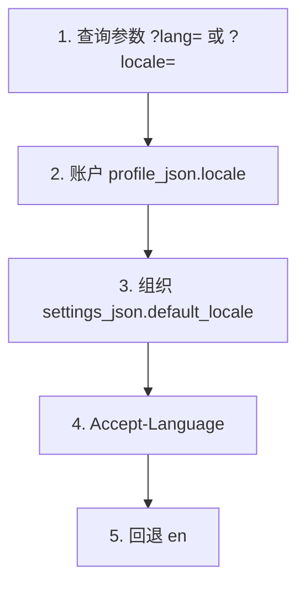

> **环境：** 测试 `https://cryptobank.qbank.cl/platform` (`pk_test_...`) - 正式 `https://api.qbank.cl/platform` (`pk_...`).

平台的人工界面（托管页面、PDF、CSV **表头**）会解析 locale：`en`、`es`
或 `zh`。**默认语言为英语**。无论 locale 如何，JSON API 响应和 webhook
始终使用英语（标签、错误码和 `message`）。

> **注**
账户上的 `locale` 是人工偏好，不会翻译 JSON 契约。若需要西班牙语 PDF，请传
`?lang=es` 或设置账户 locale —— `GET /v1/payouts/{id}` 的响应体仍为英语。
## 解析链

已认证 API 调用（`resolveRequestLocale`）按下列顺序取值，停在第一个
**有效**值。无效的 `?lang=` / `?locale=` 会被**忽略**（绝不会返回
`400`），由下一步决定。



公开页面（checkout、跟踪页、回单、状态页、卡片托管页）会在查询参数与账户
之间插入一步：付款人 cookie `cbpay_pay_locale`（见[两个 cookie](#两个-cookie)）。

后台任务、回单邮件以及无请求上下文生成的 PDF 使用账户 locale，然后是组织
默认值，最后是英语。

## 设置账户 locale

`GET /v1/me` 会暴露 `locale`（`en` | `es` | `zh`）。缺失或无效的存储值
返回为 `en`。

`PATCH /v1/me` 接受 `locale`（字符串）。KYC/KYB 获批后仍可修改 —— 与
`display_name`、`tax_id` 和 `country` 不同。

| 请求体 | 效果 |
|---|---|
| 省略 | 不改动档案中的 locale |
| `""`（空字符串） | 存为 `en` |
| `en` / `es` / `zh`（或 `en-US`、`es-CL`、`zh-CN` 等变体） | 规范化后存储 |
| 其他值 | `400 invalid_locale` — `"locale must be en, es or zh"` |

```bash
curl -X PATCH "https://api.qbank.cl/platform/v1/me" \
  -H "Authorization: Bearer <token>" \
  -H "Content-Type: application/json" \
  -d '{"locale": "zh"}'
```

```json
{
  "id": "9b1deb4d-3b7d-4bad-9bdd-2b0d7b3dcb6d",
  "org_id": "1c9e7a2b-5f6d-4e3a-8c1b-2a9d8e7f6a5b",
  "type": "person",
  "status": "active",
  "kyc_status": "approved",
  "email": "ana@example.com",
  "display_name": "Ana Perez",
  "tax_id": "12345678-9",
  "phone": "+56987654321",
  "country": "CL",
  "locale": "zh",
  "created_at": "2026-07-07T12:00:00Z",
  "updated_at": "2026-08-17T15:00:00Z"
}
```

注册（`POST /v1/auth/register`）和管理员创建的账户在开户时盖章 locale：
请求体中的显式 `locale` > `Accept-Language` > 组织 `default_locale` >
英语。注册时非空且无效的 `locale` 同样返回 `400 invalid_locale`。

## 现有账户与新账户

一次性部署迁移（`db/platform/092_account_locale_es_preconfig.sql`）会为
**尚无** locale 的账户设置 `locale=es`。这**不是** API。该部署之后：

- **现有**账户保持西班牙语，直到持有人 PATCH `locale`。
- **新**账户默认英语，除非请求体、`Accept-Language` 或组织默认值另有指定。

## 组织默认值

平台管理员通过 `PUT /v1/admin/orgs/{orgID}/settings` 设置
`default_locale`（`key: default_locale`，值为 `"en"`、`"es"` 或
`"zh"`）。`""` 会清除覆盖，组织回退为英语。无效值返回
`400 invalid_value`（不是 `invalid_locale`）。`cbpay` 组织不携带此设置
—— 该组织下的账户使用解析链的其余步骤。

## 公开页面、checkout 与跟踪页

托管页面按以下顺序取值：`?lang=` / `?locale=` → cookie
`cbpay_pay_locale` →（若有会话）账户 locale → 组织默认 →
`Accept-Language` → `en`。HTML 带有 `<html lang="...">`。

无效查询参数绝不会变成 `400`：忽略并继续解析链。

回单与对账单 PDF 接受 `?lang=en|es|zh`（默认**英语**）。文件名随 locale
变化：`statement_…` / `receipt_…`（en）、`cartola_…` / `comprobante_…`
（es）、`对账单_…` / `收据_…`（zh）。

面向人工的 HTTP 响应会盖章 `Content-Language` 和 `Vary: Accept-Language`。

## 两个 cookie

| Cookie | 谁设置 | 谁读取 |
|---|---|---|
| `cbpay_pay_locale` | 平台，在公开付款人页面上（`SetPayerLocaleCookie`：`Secure`、`SameSite=Lax`、`HttpOnly=false`、30 天、`Path=/`） | 后端，**仅**公开 / checkout / 付款人页面 |
| `cbpay_lang` | 门户的 Front SSR（原已存在） | 仅前端。**后端从不读取** |

请勿发送 `cb_locale` cookie —— 它不属于本 API。

## CSV 导出

平台 CSV 下载（资金流水、出款、入款、转账、收入、审计日志、Qscore 批次
结果、卡片调查、防火墙导出）会按调用方 locale 本地化**表头**标签。单元格
保持原始值（ID、金额、状态码）。本版本不改费用 CSV。

英语 Qscore 批次表头示例：

```csv
Document ID,Subject type,Status,Score,Band,Verify code,Report ID,Error code
12.345.678-5,person,ready,715,B,Q3f5c9f2d7d214b8c9a2d2d5f6a1b8c01a1b2c3d4e5f60718293a,3f5c9f2d-7d21-4b8c-9a2d-2d5f6a1b8c01,
```

## 不在范围内

Telegram 通知、发卡行的 3-D Secure **挑战**页，以及从右到左的文字方向，
均不由本解析链本地化。

## 错误

| HTTP | `error` | 何时 | 如何处理 |
|---|---|---|---|
| 400 | `invalid_locale` | `PATCH /v1/me` 或注册发送了非空且不属于 `en`/`es`/`zh` 的 locale | 发送 `en`、`es` 或 `zh`（空字符串存储为英语） |
| 400 | `invalid_value` | 组织设置 `default_locale` 不是 `en`/`es`/`zh` 或 `""` | 仅平台管理员；见[错误](https://docs.cbpayapp.com/zh/errors) |
| 400 | `invalid_language` | **PDF 报告**的 `lang`（AML / 身份验证）不是 `en`/`es`/`zh` | 另一错误码 —— 报告语言，不是账户 locale |

完整目录：[错误](https://docs.cbpayapp.com/zh/errors)。档案字段：[您的档案](https://docs.cbpayapp.com/zh/guides/profile)。

## 常见问题

#### 为什么现有账户在本版本后变成西班牙语？
此前已存在的账户由一次性部署迁移预配置为 `locale=es`。新账户默认为英语。
请用 `PATCH /v1/me` 切换 locale。
#### 更改 locale 会翻译 API JSON 吗？
不会。JSON 响应体和 webhook 仍为英语。locale 适用于托管 HTML、PDF、CSV
**表头**以及类似的人工文档。
#### 为什么无效的 ?lang=es-MX 没有返回 400？
查询参数 locale 是尽力而为。不支持的值会被忽略，解析链进入下一步。只有
`PATCH /v1/me` / 注册会持久化 locale，并以 `invalid_locale` 拒绝非法值。
#### 我的 checkout 应该设置哪个 cookie？
付款人 cookie 是 `cbpay_pay_locale`。门户 cookie `cbpay_lang` 仅供前端
使用，不影响 API。
