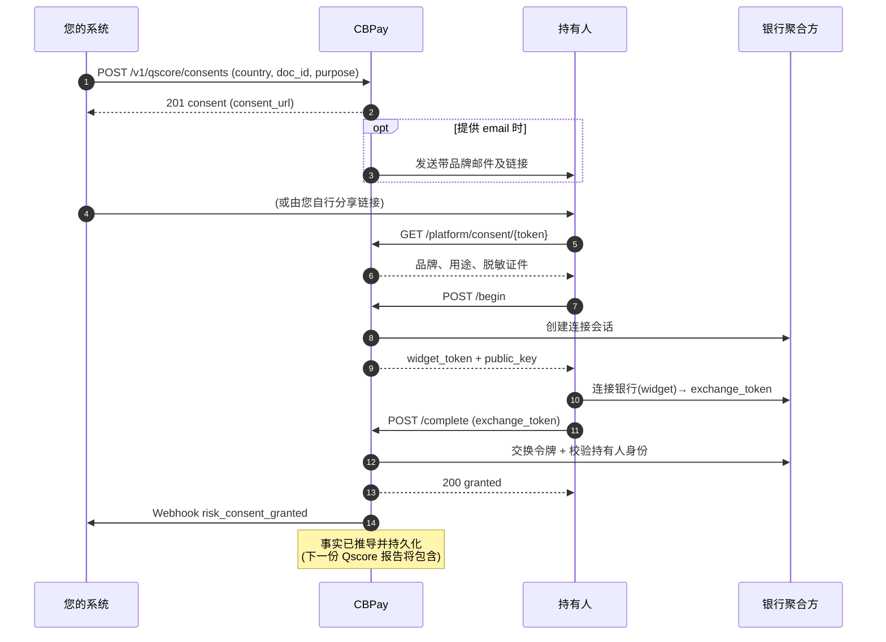

## 功能简介与适用场景

**授权链接**是您为主体(通过证件识别的个人或企业)创建的 URL,**持有人**可通过它经安全连接流程授权读取其银行数据。持有人授予后,CBPay 会推导**正面事实**(账户、余额、近 90 天的收入与支出活动),并将其计入主体的信用档案 — 下一份 Qscore 报告即会体现。

当主体几乎没有征信记录、而其银行活动是衡量真实还款能力的最有力证据时,此功能尤为适用 — 例如没有征信记录的租户,或希望获得更优商业条款的供应商。

- **您**创建链接(可选由平台以您组织的品牌邮件发送给持有人)。
- **持有人**打开链接,看到您的品牌与声明的用途,通过安全组件连接其银行并确认 — 或拒绝。
- **CBPay** 校验银行验证的证件与主体的 `doc_id` **完全一致**(属于其他证件的账户永远无法完成授权),推导事实并通过 webhook 通知您。

> **环境：** 测试 `https://cryptobank.qbank.cl/platform` (`pk_test_...`) - 正式 `https://api.qbank.cl/platform` (`pk_...`).

## 流程说明



该链接是**能力型 URL**:URL 中的 128 位令牌即为查看和决定的授权。无需登录即可使用,仅展示您的品牌、用途及持有人脱敏证件(仅末 4 位),并在您选择的 TTL 到期后失效(默认 7 天,最长 30 天)。

## 分步操作

### 创建授权链接

`POST /v1/qscore/consents` — 需要 `risk` 服务开关及已验证账户。`idempotency_key` 为**必填**:提供 `email` 时创建会触发邮件发送;使用相同密钥重试会返回原有授权并附带 `idempotency_hit: true`,不会重复创建。

```json Request
{
  "country": "CL",
  "doc_id": "11111111-1",
  "subject_type": "person",
  "purpose": "tenant_screening",
  "email": "maria.torres@example.cl",
  "expires_in_days": 7,
  "idempotency_key": "consent-maria-torres-2026-08-09"
}
```

```json Response 201
{
  "consent_id": "9f2c1ab4-7d3e-4c1a-8f55-2b9e0c4d6a71",
  "subject_id": "5d2a8f19-3b7c-4e92-a1d4-6c8b0f2e5a93",
  "channel": "link",
  "status": "pending",
  "purpose": "tenant_screening",
  "consent_url": "https://api.qbank.cl/platform/consent/cns_3f8a1c94e2b745109d6f8a0c2e5b7d19",
  "email": "maria.torres@example.cl",
  "created_at": "2026-08-09T14:32:10Z",
  "updated_at": "2026-08-09T14:32:10Z",
  "expires_at": "2026-08-16T14:32:10Z"
}
```

- `country` — ISO alpha-2,必填。当前覆盖:`CL`。
- `doc_id` — 必填,按该国校验位规则验证(智利 RUT,如 `11111111-1`)。
- `subject_type` — `person` 或 `company`;省略时按证件推断。
- `purpose` — 必填:`credit_evaluation`、`tenant_screening`、`hiring`、`supplier_onboarding` 或 `other`。数据保护法规要求声明用途。此处**拒绝** `self_access` — 查询本人报告请使用 `POST /v1/qscore/my-report`。
- `email` — 可选;提供时,持有人会收到一封以您组织品牌发送的邮件。
- `expires_in_days` — 可选;默认 7,最长 30。

将 `consent_url` 分享给持有人(或由邮件送达)。
### 持有人打开链接

公开页面首先加载 `GET /platform/consent/{token}`(无需认证),展示您的品牌、声明的用途及脱敏证件:

```json Response 200
{
  "status": "pending",
  "purpose": "tenant_screening",
  "country": "CL",
  "subject_type": "person",
  "doc_id": "******11-1",
  "org": {
    "name": "Arriendos del Sur",
    "website": "https://arriendosdelsur.cl",
    "logo_url": "https://cdn.cbpayapp.com/org/arriendos-del-sur/logo.png"
  },
  "expires_at": "2026-08-16T14:32:10Z"
}
```

公开视图绝不暴露持有人的邮箱、完整证件、内部 ID 或令牌本身。
### 持有人连接其银行

点击**授权**会调用 `POST /platform/consent/{token}/begin`,开启一个安全的银行连接会话:

```json Response 200
{
  "widget_token": "wgt_6f1c9a2d8e4b4c0a9f3d5e7b1a2c4d6e",
  "public_key": "wpk_9d8c7b6a5f4e3d2c1b0a9f8e7d6c5b4a",
  "expires_at": "2026-08-09T14:47:10Z"
}
```

页面使用这些凭证加载银行连接组件;持有人向其银行完成认证并授权连接。组件随后将 `exchange_token` 返回给页面。
### 授权完成

页面携带 `exchange_token` 调用 `POST /platform/consent/{token}/complete`:

```json Request
{ "exchange_token": "ext_2b4d6f8a0c1e3a5c7e9b1d3f5a7c9e1b" }
```

```json Response 200
{
  "status": "granted",
  "granted_at": "2026-08-09T14:46:02Z",
  "holder_name": "María Torres"
}
```

在完成授权前,CBPay 会验证两项条件,不满足则拒绝:

- 银行连接处于 `active` 状态 — 否则返回 `409 link_inactive`;
- 银行验证的证件与主体的 `doc_id` **完全一致**(双方均规范化)— 否则返回 `409 holder_mismatch`。

授权完成后,CBPay 在后台推导正面事实并发出 `risk_consent_granted` webhook。
### 跟踪授权状态

```bash
curl "https://api.qbank.cl/platform/v1/qscore/consents?status=pending&from=2026-08-01&to=2026-08-31&page=1&page_size=50" \
  -H "Authorization: Bearer pk_live_..."
```

```json Response 200
{
  "consents": [
    {
      "consent_id": "9f2c1ab4-7d3e-4c1a-8f55-2b9e0c4d6a71",
      "subject_id": "5d2a8f19-3b7c-4e92-a1d4-6c8b0f2e5a93",
      "channel": "link",
      "status": "pending",
      "purpose": "tenant_screening",
      "consent_url": "https://api.qbank.cl/platform/consent/cns_3f8a1c94e2b745109d6f8a0c2e5b7d19",
      "email": "maria.torres@example.cl",
      "created_at": "2026-08-09T14:32:10Z",
      "updated_at": "2026-08-09T14:32:10Z",
      "expires_at": "2026-08-16T14:32:10Z"
    }
  ],
  "total": 1,
  "page": 1,
  "page_size": 50
}
```

`GET /v1/qscore/consents/{id}` 返回单个授权(其他账户的授权返回 `404 not_found`)。已过 `expires_at` 的 `pending` 链接会在下次读取时标记为 `expired`。
### 按需撤销

`POST /v1/qscore/consents/{id}/revoke` 取消授权(例如业务取消时)。已授予、已撤销或已过期的授权会返回 `409 already_decided`。撤销会发出 `risk_consent_revoked` webhook。

```json Response 200
{
  "consent_id": "9f2c1ab4-7d3e-4c1a-8f55-2b9e0c4d6a71",
  "subject_id": "5d2a8f19-3b7c-4e92-a1d4-6c8b0f2e5a93",
  "channel": "link",
  "status": "revoked",
  "purpose": "tenant_screening",
  "consent_url": "https://api.qbank.cl/platform/consent/cns_3f8a1c94e2b745109d6f8a0c2e5b7d19",
  "email": "maria.torres@example.cl",
  "created_at": "2026-08-09T14:32:10Z",
  "updated_at": "2026-08-09T15:05:41Z",
  "expires_at": "2026-08-16T14:32:10Z",
  "revoked_at": "2026-08-09T15:05:41Z"
}
```
## 状态说明

| 状态 | 含义 | 处理方式 |
|---|---|---|
| `pending` | 已创建,等待持有人操作 | 等待 webhook,或再次分享链接 |
| `granted` | 持有人已连接银行且身份校验通过 | 事实自动推导;随后生成 Qscore 报告即可 |
| `revoked` | 持有人拒绝,或您主动撤销 | 链接失效 — 如仍需授权请创建新链接 |
| `expired` | 超过 TTL 仍未处理 | 创建新链接(必要时延长 `expires_in_days`) |

授权**仅可决定一次**:任何终态都会以 `409 already_decided` 拒绝后续状态变更。

## 错误码

公开(持有人)端点与验证类接口共享按 IP 的限流:**每 IP 每分钟 30 次请求** — 返回 `429 rate_limited` 表示需要降低频率。不存在或格式错误的令牌一律返回通用的 `404 not_found`(防枚举)。

| HTTP | `error` | 处理方式 |
|---|---|---|
| 400 | `invalid_payload` | 请求体缺失/无效 — 检查 `country`、`doc_id`、`exchange_token` 的格式 |
| 400 | `purpose_required` | 创建链接时 `purpose` 必填 — 请声明用途 |
| 400 | `invalid_purpose` | `purpose` 必须为 `credit_evaluation`、`tenant_screening`、`hiring`、`supplier_onboarding`、`other` 之一;此处拒绝 `self_access`(查询本人数据请用 `POST /v1/qscore/my-report`) |
| 400 | `invalid_doc_id` | 证件未通过该国校验(校验位错误)— 修正格式 |
| 400 | `invalid_subject_type` | 请显式传入 `person` 或 `company` |
| 400 | `invalid_email` | `email` 格式错误 — 修正或省略(链接不需要邮箱也可用) |
| 400 | `idempotency_key_required` | 创建请求必须携带 `idempotency_key`(使用相同密钥重试不会重复创建或重复发送邮件) |
| 403 | `verification_required` | 您的账户需先通过 KYC/KYB 审核才能创建授权链接 |
| 404 | `not_found` | 不存在该 id/token 的授权(其他账户的授权也返回此错误) |
| 409 | `already_decided` | 链接已被处理(`granted`、`revoked`、`expired`)— 请创建新链接 |
| 409 | `link_inactive` | 银行连接未处于 `active` 状态 — 持有人需通过同一链接重新连接 |
| 409 | `holder_mismatch` | 银行验证的证件与主体的 `doc_id` 不一致 — 请确认为正确的证件创建了链接 |
| 429 | `rate_limited` | 公开端点限流 — 请降低请求频率 |
| 502 | `provider_error` | 数据提供方无法创建或完成银行会话 — 请重试;若持续失败请联系支持 |
| 503 | `org_credential_missing` | 您的组织尚未完成此功能的配置 — 请联系 CBPay 支持 |

完整列表见[错误目录](https://docs.cbpayapp.com/zh/errors)。

## Webhooks

订阅以下事件,在持有人做出决定时获得通知:

| 事件 | 触发时机 |
|---|---|
| `risk_consent_granted` | 持有人连接银行且授权完成 |
| `risk_consent_revoked` | 持有人拒绝,或授权被 API 撤销 |

```json risk_consent_granted
{
  "event_type": "risk_consent_granted",
  "consent_id": "9f2c1ab4-7d3e-4c1a-8f55-2b9e0c4d6a71",
  "subject_id": "5d2a8f19-3b7c-4e92-a1d4-6c8b0f2e5a93",
  "country": "CL",
  "doc_id": "11111111-1",
  "subject_type": "person",
  "purpose": "tenant_screening",
  "status": "granted",
  "previous_status": "pending",
  "holder_name": "María Torres",
  "openfinance_link_id": "lnk_8f7e6d5c4b3a29180f7e6d5c4b3a2918",
  "granted_at": "2026-08-09T14:46:02Z"
}
```
```json risk_consent_revoked
{
  "event_type": "risk_consent_revoked",
  "consent_id": "9f2c1ab4-7d3e-4c1a-8f55-2b9e0c4d6a71",
  "subject_id": "5d2a8f19-3b7c-4e92-a1d4-6c8b0f2e5a93",
  "country": "CL",
  "doc_id": "11111111-1",
  "subject_type": "person",
  "purpose": "tenant_screening",
  "status": "revoked",
  "previous_status": "pending",
  "revoked_at": "2026-08-09T15:05:41Z"
}
```
Webhook 中的 `doc_id` 为**完整**值(属于您自己账户的数据),便于与您创建链接时的主体进行对账。

## 如何计入 Qscore

授权完成后会触发后台推导:CBPay 读取链接的账户与活动(近 90 天),汇总正面事实 — 账户数量、可用余额与当前余额、收入与支出总额 — 并持久化到主体的信用档案。原始交易明细绝不存储,也不对外暴露(数据最小化)。

此后生成的每一份 Qscore 报告都会重新推导该主体的 `granted` 授权,因此每份报告中的正面数据都是最新的。您无需额外调用任何接口。

## 常见问题

#### 持有人需要 CBPay 账户吗?
    不需要。链接完全公开,无需登录 — URL 中的 128 位令牌即为授权。持有人只能看到您的品牌、用途及其脱敏证件。
#### 如果持有人连接了他人名下的账户会怎样?
    授权会被拒绝并返回 `409 holder_mismatch`:银行验证的证件必须与主体的 `doc_id` 完全一致。属于其他证件的账户永远无法完成授权 — 这正是该流程的身份证明机制。
#### 授权完成后还能撤销吗?
    已授予的授权是终态,拒绝任何状态变更(`409 already_decided`)。如需停止使用数据,请停止为该主体生成报告;银行连接本身由持有人在其银行侧管理。
#### 链接有效期多久?
    默认 7 天,可通过 `expires_in_days` 配置,最长 30 天。过期链接会被标记为 `expired` 且不可再使用 — 请创建新链接。
#### 必须提供邮箱吗?
    不是。不提供 `email` 时,响应中会返回 `consent_url`,您可自行分享(WhatsApp、短信、自己的邮件)。提供 `email` 时,CBPay 会以您的品牌代发邮件。两种情况下创建请求都必须携带 `idempotency_key`。
#### 覆盖哪些国家?
    当前覆盖:智利(`CL`)。随着各国银行聚合能力接入,会陆续增加更多走廊 — 为未覆盖的国家创建链接会在连接时返回 `502 provider_error`。
#### 具体推导哪些数据?
    仅汇总事实:账户数量、可用/当前余额总额、币种、机构、首次观测日期,以及 90 天内的收入/支出/交易总额。单笔交易明细绝不存储,也不对外暴露。
