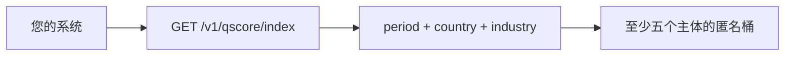

> **环境：** 测试 `https://cryptobank.qbank.cl/platform` (`pk_test_...`) - 正式 `https://api.qbank.cl/platform` (`pk_...`).

Qscore Index 是季度评分分布的公开聚合视图，不是个人或企业查询。响应不会
暴露 RUT、账户 ID，也不会发布少于最小样本数的总体。



## 读取指数

`GET /v1/qscore/index` 无需认证。如果省略 `period`，API 使用最近关闭的
UTC 季度。可选筛选：

| Query | 说明 |
|---|---|
| `period` | 精确格式 `YYYY-Q1` 到 `YYYY-Q4`。 |
| `country` | ISO 3166-1 alpha-2 国家。 |
| `industry_code` | 行业/ISIC 代码。 |

```bash 公开指数
curl "https://api.qbank.cl/platform/v1/qscore/index?period=2026-Q2&country=CL&industry_code=6499"
```

```json 200 OK
{"period":"2026-Q2","country":"CL","industry_code":"6499","items":[{"period":"2026-Q2","country":"CL","industry_code":"6499","band":"B","subject_count":12,"avg_score":742,"created_at":"2026-07-01T00:00:00Z"}],"methodology":"quarterly anonymous buckets; each bucket requires at least five subjects"}
```

`items` 按国家、行业代码和等级排序。该端点没有分页。

## 响应状态、方法与隐私

| HTTP | 含义 | 处理 |
|---:|---|---|
| `200` | 筛选后的季度快照 | 读取匿名 `items` |
| `400 invalid_period` | 时期格式错误或不受支持 | 发送已关闭季度 `YYYY-Qn` |

季度结束时，系统取每个主体在季度结束前的最新评分，按国家、行业和等级
（`A`、`B`、`C`、`D`、`E` 或 `SC`）分组。只有至少 **5 个主体**的桶才会发布；
`avg_score` 是该桶评分的四舍五入整数平均值。快照按季度和桶追加保存，不支持
单个主体的反查。

请参阅[错误目录](https://docs.cbpayapp.com/zh/errors)。

## 认证版本

`GET /v1/qscore/index/account` 为已认证账户或组织管理员读取范围返回相同快照
和筛选。账户调用需要启用 `risk` 服务；管理员读取不依赖单个账户标志。

指数不收费、不发送 webhook，也不发送邮件。时期格式错误返回
`400 invalid_period`。

## 常见问题

#### 可以从桶识别主体吗？
    不可以。少于五个主体的桶会被隐藏，响应不含证件或账户标识。
#### 省略 period 是当前季度吗？
    不是，而是最近关闭的 UTC 季度。
#### 可以只请求一个行业吗？
    可以，发送 `industry_code`、`country` 和 `period`。
