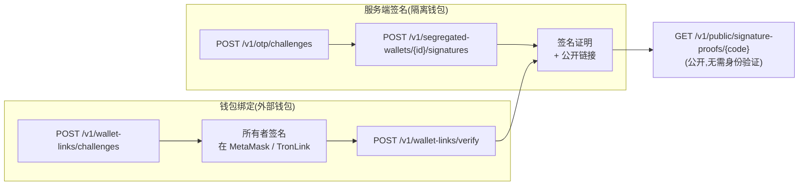

> **环境：** 测试 `https://cryptobank.qbank.cl/platform` (`pk_test_...`) - 正式 `https://api.qbank.cl/platform` (`pk_...`).

**签名证明**是一种加密证据,用于证明某个钱包属于您的账户,**无需转移资金,也无需链上交易**。CBPay 构建一个结构化、可读性强的**防钓鱼信封**(标题、用途、钱包、随机数和有效期窗口),钱包使用
**EIP-191**(以太坊)或 **TIP-191**(波场)对其进行签名,任何人都可以通过**公开链接**验证结果 — 无需身份验证。

生成证明有两种方式:

| 流程 | 签名者 | 适用场景 |
|---|---|---|
| **服务端签名** | CBPay 使用您的**隔离钱包**(托管 `cbpay`)签名 | 钱包由 CBPay 托管,您需要按需获取证明 |
| **钱包绑定** | 所有者在**自己的钱包**中签名(MetaMask、TronLink 等) | 您需要证明一个不由 CBPay 托管的**外部**钱包的所有权 |

> **注**
每个证明在签发后 **10 分钟**过期(`expires_at`)。证明仅证明某个时间点;如果对方需要新的证明,请创建新的签名。


## 防钓鱼信封

CBPay 从不签署自由格式的消息。两种流程都构建相同的结构化信封,因此签名者始终能看到**正在证明什么**、**哪个**钱包在签名以及**有效期到何时**:

```text
CBPay Signature Proof
Domain: https://api.qbank.cl/platform
Purpose: wallet_ownership
Wallet: 0x71C7656EC7ab88b098defB751B7401B5f6d8976F
Nonce: 9f2c4a7d1e5b48c0a3f69d2e7b1c4a58
Issued: 2026-08-20T14:03:22Z
Expires: 2026-08-20T14:13:22Z
Statement: I control this wallet
```

`wallet_link` 用途会添加一行 `Account:`,其中包含您账户 ID 的掩码。如果签名对应的信封已过期、尚未生效或绑定到其他钱包,则会被拒绝。

## 1. 服务端签名(隔离钱包)

使用由 CBPay 托管的[隔离钱包](https://docs.cbpayapp.com/zh/guides/segregated-wallets)(`custody: cbpay`)进行签名。由于此流程使用托管密钥生成签名,因此需要 **KYC 已批准**和 **OTP** 挑战。

### 创建 OTP 挑战

为 `sign_message` 操作请求一次性验证码,并进行验证以获取 `X-OTP-Token`(参见 [OTP](https://docs.cbpayapp.com/zh/security-2fa))。
### 请求签名

```bash
curl -X POST https://api.qbank.cl/platform/v1/segregated-wallets/b7e3f1a2-4c5d-4e6f-8a9b-0c1d2e3f4a5b/signatures \
  -H "Authorization: Bearer <token>" \
  -H "X-OTP-Token: <otp-token>" \
  -H "Content-Type: application/json" \
  -d '{
    "purpose": "wallet_ownership",
    "statement": "I control this wallet"
  }'
```

`purpose` 为 `wallet_ownership` 或 `treasury_attestation`。`statement` 是可选的自由文本行(最多 **140** 个字符),嵌入在信封中。

```json 201
{
  "proof_id": "c41d8f2e-9a3b-4c7d-ae1f-5b6c8d0e2f4a",
  "wallet_id": "b7e3f1a2-4c5d-4e6f-8a9b-0c1d2e3f4a5b",
  "chain": "eth",
  "address": "0x71C7656EC7ab88b098defB751B7401B5f6d8976F",
  "purpose": "wallet_ownership",
  "statement": "I control this wallet",
  "envelope": "CBPay Signature Proof\nDomain: https://api.qbank.cl/platform\nPurpose: wallet_ownership\nWallet: 0x71C7656EC7ab88b098defB751B7401B5f6d8976F\nNonce: 9f2c4a7d1e5b48c0a3f69d2e7b1c4a58\nIssued: 2026-08-20T14:03:22Z\nExpires: 2026-08-20T14:13:22Z\nStatement: I control this wallet",
  "message_hash": "4a5b6c7d8e9f0a1b2c3d4e5f6a7b8c9d0e1f2a3b4c5d6e7f8a9b0c1d2e3f4a5b",
  "signature": "9f2c4a7d1e5b48c0a3f69d2e7b1c4a589f2c4a7d1e5b48c0a3f69d2e7b1c4a589f2c4a7d1e5b48c0a3f69d2e7b1c4a589f2c4a7d1e5b48c0a3f69d2e7b1c1b",
  "proof_code": "G9f2c4a7d1e5b48c0a3f69d2e7b1c4a58c41d8f2e9a3b4c7dae",
  "verify_url": "https://api.qbank.cl/platform/v1/public/signature-proofs/G9f2c4a7d1e5b48c0a3f69d2e7b1c4a58c41d8f2e9a3b4c7dae",
  "status": "signed",
  "issued_at": "2026-08-20T14:03:22Z",
  "signed_at": "2026-08-20T14:03:22Z",
  "expires_at": "2026-08-20T14:13:22Z"
}
```
### 分享公开链接

将 `verify_url` 发送给对方。他们无需凭证即可打开并查看证明、其状态和签名。
每次签名还会触发向账户所有者发送**安全电子邮件**以及 `wallet_signature_created` webhook。

### 列表、详情和撤销

```bash
# 列出钱包的证明
curl "https://api.qbank.cl/platform/v1/segregated-wallets/b7e3f1a2-4c5d-4e6f-8a9b-0c1d2e3f4a5b/signatures?page=1&page_size=50" \
  -H "Authorization: Bearer <token>"

# 账户的所有证明(分页,from/to 过滤)
curl "https://api.qbank.cl/platform/v1/signature-proofs?from=2026-08-01&to=2026-08-20" \
  -H "Authorization: Bearer <token>"

# 详情
curl "https://api.qbank.cl/platform/v1/signature-proofs/c41d8f2e-9a3b-4c7d-ae1f-5b6c8d0e2f4a" \
  -H "Authorization: Bearer <token>"

# 撤销(公开链接仍然有效,并显示状态 revoked)
curl -X POST "https://api.qbank.cl/platform/v1/signature-proofs/c41d8f2e-9a3b-4c7d-ae1f-5b6c8d0e2f4a/revoke" \
  -H "Authorization: Bearer <token>"
```

## 2. 绑定外部钱包(MetaMask / TronLink)

要证明您持有密钥的钱包(非 CBPay 托管)的所有权,请完成签名挑战:

### 创建挑战

```bash
curl -X POST https://api.qbank.cl/platform/v1/wallet-links/challenges \
  -H "Authorization: Bearer <token>" \
  -H "Content-Type: application/json" \
  -d '{ "chain": "eth", "address": "0x71C7656EC7ab88b098defB751B7401B5f6d8976F" }'
```

```json 201
{
  "link_id": "d52e9c41-7b3a-4e8f-b2d6-1a9c5e7f3b8d",
  "chain": "eth",
  "address": "0x71C7656EC7ab88b098defB751B7401B5f6d8976F",
  "nonce": "9f2c4a7d1e5b48c0a3f69d2e7b1c4a58",
  "envelope": "CBPay Signature Proof\nDomain: https://api.qbank.cl/platform\nPurpose: wallet_link\nWallet: 0x71C7656EC7ab88b098defB751B7401B5f6d8976F\nAccount: ae8c…\nNonce: 9f2c4a7d1e5b48c0a3f69d2e7b1c4a58\nIssued: 2026-08-20T14:03:22Z\nExpires: 2026-08-20T14:13:22Z",
  "status": "pending",
  "expires_at": "2026-08-20T14:13:22Z"
}
```
### 在钱包中签名信封

向所有者显示 `envelope` 文本,并要求他们使用 `address` 对应的钱包**按原样**签名(以太坊使用 MetaMask `personal_sign`,波场使用 TronLink)。挑战将在 **10 分钟**后过期。
### 提交签名

```bash
curl -X POST https://api.qbank.cl/platform/v1/wallet-links/verify \
  -H "Authorization: Bearer <token>" \
  -H "Content-Type: application/json" \
  -d '{
    "link_id": "d52e9c41-7b3a-4e8f-b2d6-1a9c5e7f3b8d",
    "signature": "9f2c4a7d1e5b48c0a3f69d2e7b1c4a589f2c4a7d1e5b48c0a3f69d2e7b1c4a589f2c4a7d1e5b48c0a3f69d2e7b1c4a589f2c4a7d1e5b48c0a3f69d2e7b1c1b"
  }'
```

```json 200
{
  "link_id": "d52e9c41-7b3a-4e8f-b2d6-1a9c5e7f3b8d",
  "chain": "eth",
  "address": "0x71C7656EC7ab88b098defB751B7401B5f6d8976F",
  "status": "linked",
  "linked_at": "2026-08-20T14:05:10Z",
  "proof_id": "c41d8f2e-9a3b-4c7d-ae1f-5b6c8d0e2f4a",
  "verify_url": "https://api.qbank.cl/platform/v1/public/signature-proofs/G9f2c4a7d1e5b48c0a3f69d2e7b1c4a58c41d8f2e9a3b4c7dae"
}
```
验证成功会创建一个签名证明(`purpose: wallet_link`)并触发 `wallet_linked` webhook。列出和撤销绑定:

```bash
curl "https://api.qbank.cl/platform/v1/wallet-links" -H "Authorization: Bearer <token>"
curl -X DELETE "https://api.qbank.cl/platform/v1/wallet-links/d52e9c41-7b3a-4e8f-b2d6-1a9c5e7f3b8d" -H "Authorization: Bearer <token>"
```

## 3. 公开验证

任何拥有链接的人都可以验证证明 — 无需账户,无需令牌:

```bash
curl "https://api.qbank.cl/platform/v1/public/signature-proofs/G9f2c4a7d1e5b48c0a3f69d2e7b1c4a58c41d8f2e9a3b4c7dae"
```

```json 200
{
  "proof_code": "G9f2c4a7d1e5b48c0a3f69d2e7b1c4a58c41d8f2e9a3b4c7dae",
  "status": "signed",
  "valid": true,
  "chain": "eth",
  "address": "0x71C7656EC7ab88b098defB751B7401B5f6d8976F",
  "purpose": "wallet_ownership",
  "statement": "I control this wallet",
  "issued_at": "2026-08-20T14:03:22Z",
  "signed_at": "2026-08-20T14:03:22Z",
  "expires_at": "2026-08-20T14:13:22Z",
  "message_hash": "4a5b6c7d8e9f0a1b2c3d4e5f6a7b8c9d0e1f2a3b4c5d6e7f8a9b0c1d2e3f4a5b",
  "signature": "9f2c4a7d1e5b48c0a3f69d2e7b1c4a589f2c4a7d1e5b48c0a3f69d2e7b1c4a589f2c4a7d1e5b48c0a3f69d2e7b1c4a589f2c4a7d1e5b48c0a3f69d2e7b1c1b",
  "verified_live": true
}
```

只有当证明已签名、未撤销、未过期且签名仍与信封匹配时,`valid` 才为 `true`(`verified_live` 会在每次调用时重新检查加密算法)。未知或格式错误的代码将返回 `404 not_found`。

## 状态

| 状态 | 含义 | 是否终止? |
|---|---|---|
| `pending` | 挑战已创建,等待所有者签名(仅限钱包绑定) | 否 — 10 分钟后过期 |
| `signed` | 证明已签名且有效 | 否 — 可撤销或过期 |
| `revoked` | 账户已撤销证明 | 是 |
| `expired` | 10 分钟窗口已过 | 是 |

## 错误

| HTTP | 代码 | 解决方案 |
|---|---|---|
| 400 | `invalid_json` / `invalid_payload` | 请求体格式错误;检查 JSON |
| 400 | `invalid_purpose` | 使用 `wallet_ownership` 或 `treasury_attestation` |
| 400 | `invalid_statement` | 声明超过 280 个字符 |
| 400 | `unsupported_chain` | 链必须是 `eth` 或 `tron` |
| 400 | `invalid_address` | 地址与链格式不匹配 |
| 403 | `verification_required` | 账户需要 KYC 批准 |
| 403 | `otp_required` / `otp_invalid` | 创建并验证 OTP 挑战,发送 `X-OTP-Token` |
| 404 | `not_found` | 钱包/链接/证明 ID 错误,或证明代码未知 |
| 409 | `custody_transferred` | 钱包已导出;不再支持服务端签名 |
| 409 | `challenge_consumed` | 挑战已被使用;请创建新挑战 |
| 409 | `proof_not_signable` | 证明不处于可签名状态 |
| 410 | `challenge_expired` | 挑战的 10 分钟窗口已过;请创建新挑战 |
| 422 | `sign_rejected` | 声明不适合信封(最多 140 个字符) |
| 422 | `signature_mismatch` | 签名与地址/信封不匹配 |
| 429 | `too_many_attempts` | 公开验证速率限制;请等待并重试 |
| 502 | `signer_unavailable` / `verification_failed` | 签名/验证暂时失败;请重试 |

## Webhooks

订阅这些事件(参见 [Webhooks](https://docs.cbpayapp.com/zh/webhooks)):

```json wallet_signature_created
{
  "proof_id": "c41d8f2e-9a3b-4c7d-ae1f-5b6c8d0e2f4a",
  "account_id": "ae8c5f21-3b7d-4a9e-c6f2-8d1b4e6a9c3f",
  "wallet_id": "b7e3f1a2-4c5d-4e6f-8a9b-0c1d2e3f4a5b",
  "chain": "eth",
  "address": "0x71C7656EC7ab88b098defB751B7401B5f6d8976F",
  "purpose": "wallet_ownership",
  "proof_code": "G9f2c4a7d1e5b48c0a3f69d2e7b1c4a58c41d8f2e9a3b4c7dae",
  "verify_url": "https://api.qbank.cl/platform/v1/public/signature-proofs/G9f2c4a7d1e5b48c0a3f69d2e7b1c4a58c41d8f2e9a3b4c7dae"
}
```

```json wallet_linked
{
  "link_id": "d52e9c41-7b3a-4e8f-b2d6-1a9c5e7f3b8d",
  "account_id": "ae8c5f21-3b7d-4a9e-c6f2-8d1b4e6a9c3f",
  "chain": "eth",
  "address": "0x71C7656EC7ab88b098defB751B7401B5f6d8976F",
  "proof_id": "c41d8f2e-9a3b-4c7d-ae1f-5b6c8d0e2f4a"
}
```

## 常见问题

#### 签名证明会转移资金或消耗 gas 吗?
    不会。签名消息纯粹是加密操作:无链上交易,无网络费用,无余额变动。
#### 证明有效期是多久?
    从 `issued_at` 起 10 分钟。之后公开链接会显示证明已过期。需要新的证明时,请创建新的签名。
#### 我可以撤销证明吗?
    可以 — `POST /v1/signature-proofs/{proofID}/revoke`。公开链接仍然有效,并报告 `status: revoked`,因此过去的验证仍可审计。
#### 哪些钱包可以在钱包绑定流程中签名?
    任何支持以太坊 `personal_sign`(EIP-191)或波场消息签名(TIP-191)的钱包 — MetaMask、TronLink 及兼容钱包。
#### 为什么我的声明被拒绝了?
    信封最多接受 140 个字符的声明。超过 280 个字符的请求会以 `invalid_statement` 失败;在 141 到 280 个字符之间,信封会以 `sign_rejected` 拒绝。
