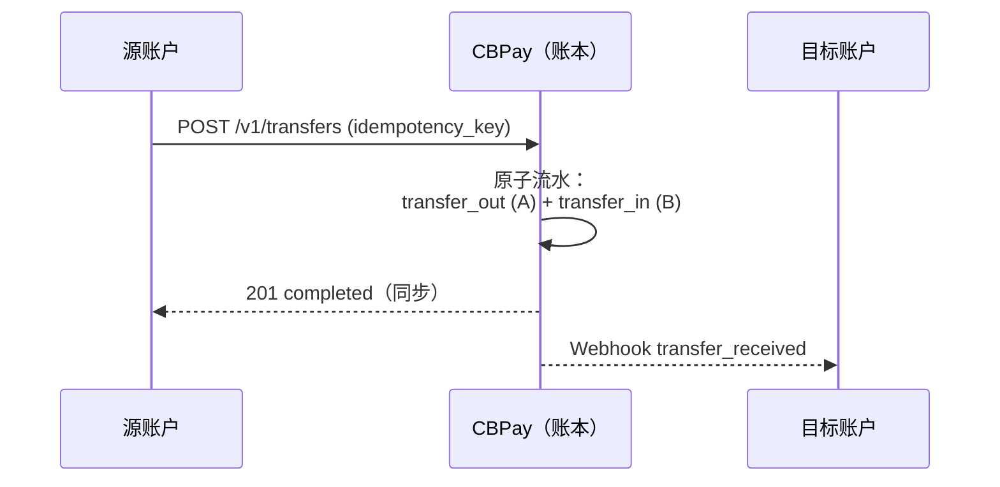

> **环境：** 测试 `https://cryptobank.qbank.cl/platform` (`pk_test_...`) - 正式 `https://api.qbank.cl/platform` (`pk_...`).

内部转账在两个 **CBPay 账户**之间转移余额，在账本中原子完成且**始终免费** — 资金从不离开生态系统。它支持全部四种货币（`USDT`、`USDC`、`BTC`、`GOLD`），并且始终**在同币种余额之间**进行：你发送的 `asset` 就是目标账户收到的 `asset`，没有任何兑换。



它适用于**任意账户组合**：

| 从 | 到 | 手续费 |
|---|---|---|
| 个人 | 个人 | 0 |
| 个人 | 企业 | 0 |
| 企业 | 个人 | 0 |
| 企业 | 企业 | 0 |

## 创建转账

目标账户可通过 `to_account_id`、`to_email`、**`to_phone`**（已验证的手机号）或 **`to_contact_id`**（你通讯录中的[联系人](https://docs.cbpayapp.com/zh/guides/contacts)）来标识：

```bash By phone (verified)
curl -X POST https://api.qbank.cl/platform/v1/transfers \
  -H "Authorization: Bearer <token>" \
  -H "Content-Type: application/json" \
  -d '{
    "to_phone": "+56987654321",
    "amount": "25.000000",
    "description": "Lunch",
    "idempotency_key": "lunch-2026-07-10-a"
  }'
```

```bash By contact
curl -X POST https://api.qbank.cl/platform/v1/transfers \
  -H "Authorization: Bearer <token>" \
  -H "Content-Type: application/json" \
  -d '{
    "to_contact_id": "3f8a1b2c-…",
    "amount": "10.000000",
    "idempotency_key": "t-991"
  }'
```

```bash By email (person → person)
curl -X POST https://api.qbank.cl/platform/v1/transfers \
  -H "Authorization: Bearer <token>" \
  -H "Content-Type: application/json" \
  -d '{
    "to_email": "carlos@example.com",
    "amount": "25.000000",
    "description": "Expense split",
    "idempotency_key": "split-2026-07-06-a"
  }'
```

```bash By account_id (person → company)
curl -X POST https://api.qbank.cl/platform/v1/transfers \
  -H "Authorization: Bearer <token>" \
  -H "Content-Type: application/json" \
  -d '{
    "to_account_id": "ae8cf540-22a9-414d-82cc-8ac04732be4f",
    "amount": "120.500000",
    "description": "Monthly service payment",
    "idempotency_key": "serv-2026-07-a"
  }'
```

```bash Company → person (payroll)
curl -X POST https://api.qbank.cl/platform/v1/transfers \
  -H "Authorization: Bearer <company token>" \
  -H "Content-Type: application/json" \
  -d '{
    "to_email": "employee@example.com",
    "amount": "850.000000",
    "description": "July salary",
    "idempotency_key": "payroll-2026-07-emp01"
  }'
```

```bash In another currency (GOLD, grams of gold)
curl -X POST https://api.qbank.cl/platform/v1/transfers \
  -H "Authorization: Bearer <token>" \
  -H "Content-Type: application/json" \
  -d '{
    "to_email": "carlos@example.com",
    "asset": "GOLD",
    "amount": "2.500000",
    "description": "Gold gift",
    "idempotency_key": "gold-2026-07-09-a"
  }'
```

对于任何组合（个人或企业、任一方向），请求结构完全相同 — 只有调用凭据不同。`asset` 为可选，默认 `USDT`；它接受 `USDT`、`USDC`、`BTC` 或 `GOLD`，目标账户会**以同一币种**收到。

响应 `201` — 转账是**同步且即时**的：

```json
{
  "transfer_id": "77b1…",
  "from_account_id": "…",
  "to_account_id": "…",
  "asset": "USDT",
  "amount": "25.000000",
  "description": "Expense split",
  "status": "completed",
  "created_at": "2026-07-06T20:10:00Z"
}
```

使用相同的 `idempotency_key` 重放 — 返回 `200` 及原始转账记录：

```json
{
  "transfer_id": "77b1…",
  "amount": "25.000000",
  "status": "completed",
  "idempotency_hit": true
}
```

收款方可通过 `transfer_received` webhook 收到通知，双方都会在各自的历史记录中看到这笔流水（`transfer_out` / `transfer_in`）。

> **注**
每笔转账都会自动将收款人保存为[联系人](https://docs.cbpayapp.com/zh/guides/contacts)（发送 `"save_contact": false` 可跳过）。出于安全考虑，`to_phone` 只解析手机号经过 **OTP 验证**的账户；如果多个账户共用同一号码，会返回 `422 recipient_ambiguous`。
## 查询转账

列出你账户的转账记录（发出和收到），支持分页和日期筛选：

```bash
curl "https://api.qbank.cl/platform/v1/transfers?from=2026-07-01&to=2026-07-07&page_size=50" \
  -H "Authorization: Bearer <token>"
```

或按 ID 获取单笔（仅交易双方可见）：

```bash
curl https://api.qbank.cl/platform/v1/transfers/77b1… \
  -H "Authorization: Bearer <token>"
```

每一行都携带从你的视角出发的 `direction`（`sent` 或 `received`）。

## 规则

- 仅限**活跃**的 CBPay 账户之间；系统内部账户不能接收。
- 双方始终为**同一币种**：余额之间没有兑换（`USDT`→`USDT`、`GOLD`→`GOLD`……）。
- 不能给自己转账（`400 self_transfer`）。
- 需要 `idempotency_key`（请求体或 `Idempotency-Key` 请求头）；重放返回 `200` 及 `idempotency_hit: true`。
- `amount` 最多接受该币种的小数位数：`USDT`/`USDC`/`GOLD` 为 6 位，`BTC` 为 8 位。

## 错误

| HTTP | `error` | 原因 |
|---|---|---|
| 400 | `recipient_required` | 缺少 `to_account_id`、`to_email`、`to_phone` 和 `to_contact_id` |
| 400 | `invalid_amount` | 金额无效、小数位过多或不支持的 `asset` |
| 400 | `invalid_phone` | `to_phone` 无法规范化为 E.164 格式 |
| 400 | `self_transfer` | 源账户与目标账户相同 |
| 402 | `insufficient_funds` | 该币种可用余额不足 |
| 404 | `recipient_not_found` | 邮箱/ID 未匹配到 CBPay 账户，或没有匹配的已验证手机号 |
| 422 | `recipient_ambiguous` | 多个账户共用该手机号（请使用 `to_account_id` 或 `to_email`） |
| 422 | `contact_not_linked` | 该联系人未关联 CBPay 账户 |
| 422 | `recipient_unavailable` | 目标账户已被冻结/关闭 |
## 常见问题

#### 内部转账有费用吗？
没有 —— 你组织内账户之间的转账免费且即时。
#### 可以在不同资产之间转账吗？
不可以 —— 两端移动的是**同一**资产（USDT 对 USDT、USDC 对 USDC……）。
要更换资产，请先用[兑换](https://docs.cbpayapp.com/zh/guides/swaps)转换。
#### 转账可以撤销吗？
不可以 —— 转账即时且不可逆。如果转错了账户，请与对方协调退回。
#### 按手机号发送是如何运作的？
`to_phone` 只解析你组织内**已验证**的手机号。未验证或未知的号码返回
404；如果多个账户匹配则返回 `recipient_ambiguous`（422）—— 改用
`to_alias` 或账户 ID。
#### to_alias 和 to_qr_token 是什么？
替代收款方式：账户的不可变别名和其个人资料 QR 令牌
（`GET /v1/me/qr`）。全部只在你的组织内解析。
#### checkout_token 有什么用？
通过内部转账结算一个[收款链接](https://docs.cbpayapp.com/zh/guides/checkout)：目标被强制为链接
所属账户，金额必须覆盖报价应付额（否则 `checkout_amount_mismatch`，
422）。
