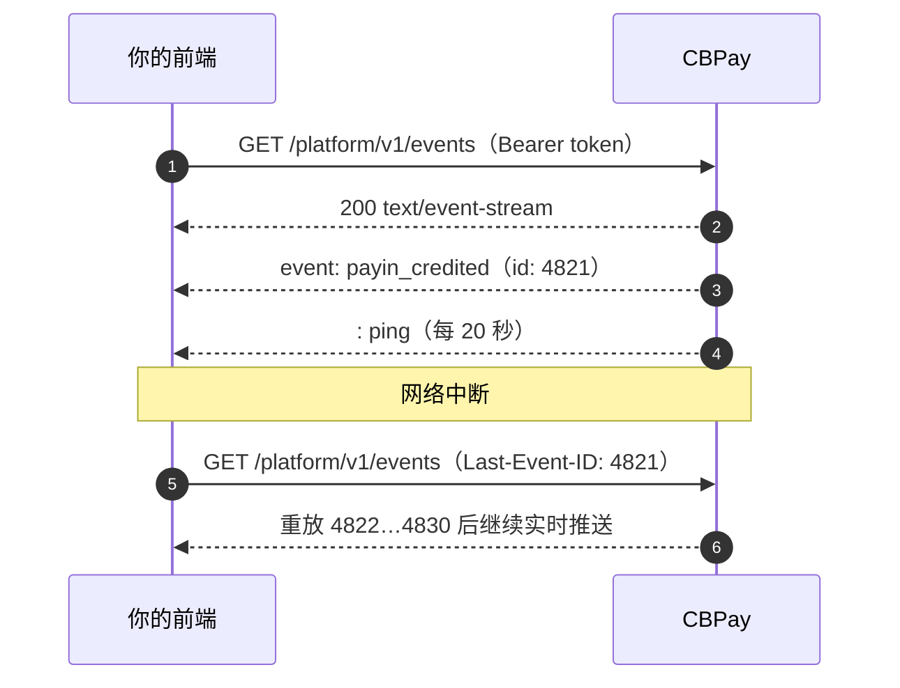

Webhook 把事件推送到**你的服务器**，实时事件流把事件推送到**你的前端**：一条长连接的
`GET` 请求即可实时收到每个事件；连接中断时还能保证重放。

用事件流保持仪表盘实时更新（余额、入金到账、出金结算、卡授权、面向管理员的 KYT 警报）；
用 [Webhook](https://docs.cbpayapp.com/zh/webhooks) 处理那些即使用户关闭浏览器也必须完成的逻辑。两个通道传递
**完全相同的事件、相同的载荷和相同的 `event_id`**，因此你只需要写一套映射。



## 打开事件流

该端点使用与其余 API 相同的 `Authorization: Bearer` 凭证，因此浏览器原生的
`EventSource`（无法发送自定义请求头）**不适用**。请使用 `fetch` 并以流的方式读取响应体：

```js 浏览器（fetch）
const res = await fetch("https://api.qbank.cl/platform/v1/events", {
  headers: {
    Authorization: `Bearer ${token}`,
    Accept: "text/event-stream",
  },
});

const reader = res.body.pipeThrough(new TextDecoderStream()).getReader();
let buffer = "";
let lastEventId = null;

while (true) {
  const { value, done } = await reader.read();
  if (done) break;
  buffer += value;

  // SSE 帧之间以空行分隔
  let sep;
  while ((sep = buffer.indexOf("\n\n")) !== -1) {
    const frame = buffer.slice(0, sep);
    buffer = buffer.slice(sep + 2);
    if (frame.startsWith(":")) continue; // 心跳

    const id = frame.match(/^id: (.+)$/m)?.[1];
    const type = frame.match(/^event: (.+)$/m)?.[1];
    const data = frame.match(/^data: (.+)$/m)?.[1];
    if (id) lastEventId = id; // 保存它：这是你的重放游标
    handle(type, data ? JSON.parse(data) : null);
  }
}
```

```bash curl
curl -N https://api.qbank.cl/platform/v1/events \
  -H "Authorization: Bearer <token>" \
  -H "Accept: text/event-stream"
```

```text 响应
: cbpay event stream

retry: 3000

id: 4821
event: payin_credited
data: {"event_id":"9f1c…","type":"payin_credited","account_id":"ae8c…","created_at":"2026-07-25T18:42:07Z","cursor":"4821","data":{"payin_id":"7d2f…","usdt_credited":"99.700000","status":"credited"}}

: ping
```

每个事件帧包含三行：

| 行 | 含义 |
|---|---|
| `id:` | 事件日志的单调游标。保存最后处理的值，它就是你的 `Last-Event-ID`。 |
| `event:` | 事件类型（`payin_credited`、`payout_status_changed` 等），与 Webhook 目录完全一致。 |
| `data:` | JSON 信封：`event_id`、`type`、`account_id`、`created_at`、`cursor` 以及 `data`（与 Webhook 投递**完全相同的载荷**）。 |

## 无缝重连

连接中断后，携带最后处理的游标重新连接。服务端会先从日志中重放你错过的事件，再恢复实时推送，
因此不稳定的网络也不会丢事件。

```js 请求头
await fetch("https://api.qbank.cl/platform/v1/events", {
  headers: {
    Authorization: `Bearer ${token}`,
    "Last-Event-ID": lastEventId, // 例如 "4821"
  },
});
```

```bash 查询参数
curl -N "https://api.qbank.cl/platform/v1/events?last_event_id=4821" \
  -H "Authorization: Bearer <token>"
```

> **注**
重放上限为 **1000 条事件**。如果断线时间过长、错过的事件更多，事件流会发送控制事件
`replay_truncated`；此时应使用 `?snapshot=true` 或
[`GET /v1/events/history`](#可查询的历史) 进行对账，而不要假设数据连续。
## 初始快照

以 `?snapshot=true` 打开会先发送**当前状态**，然后才是增量。这消除了经典的竞态问题
（“先读 REST 接口再订阅，中间发生的事件就丢了”）：游标是在订阅已经建立之后取的，
不会有任何遗漏。

```bash
curl -N "https://api.qbank.cl/platform/v1/events?snapshot=true" \
  -H "Authorization: Bearer <token>"
```

```text
id: 4820
event: snapshot
data: {"generated_at":"2026-07-25T18:42:00Z","scope":{"org_admin":false,"account_id":"ae8c…","types":[]},"balances":[{"asset":"USDT","available":"1025.000000","held":"0.000000"}]}

id: 4821
event: payin_credited
data: {…}
```

快照是**绝对状态**而非增量，重复应用不会产生副作用。账户凭证会得到 `balances`
（字段与 [`GET /v1/balances`](https://docs.cbpayapp.com/zh/guides/analytics) 相同）；组织管理员还会得到运营
`health` 计数。

## 按事件类型过滤

`?types=` 用于缩小接收范围。它只能**收窄**凭证已经可见的范围，绝不会扩大。未知类型会返回
`400 invalid_event_type`，而不是让你一直等待永远不会到达的事件。

```bash
curl -N "https://api.qbank.cl/platform/v1/events?types=payin_credited,payout_status_changed" \
  -H "Authorization: Bearer <token>"
```

## 范围：账户与组织管理员

| 凭证 | 事件流内容 |
|---|---|
| 账户（`pk_…` 或成员会话） | 仅该账户的事件。 |
| 拥有 `ops:read` 的组织管理员 | 组织内所有账户的事件，外加组织级事件（KYT 警报、通道健康、审批）。可用 `?account_id=` 在组织内过滤。 |

一个账户永远看不到其他账户的事件，也看不到组织级合规视图。事件流绝不会返回该凭证通过 REST
无法读取的字段。

## 控制事件

除业务事件外，事件流还会发送协议事件。除 `snapshot` 外，它们不带 `id:`，因此不会推进重放游标。

| `event:` | 触发时机 | 处理方式 |
|---|---|---|
| `snapshot` | 使用 `?snapshot=true` 打开连接 | 用该载荷替换本地状态。 |
| `reconnect` | 达到最长连接时间（30 分钟）或服务端缓冲区已满 | 携带 `Last-Event-ID` 重连。 |
| `unauthorized` | 会话被吊销、密钥被停用或账户被冻结 | 重新认证。 |
| `replay_truncated` | 错过的事件超过 1000 条 | 用 `?snapshot=true` 或历史接口对账。 |
| `error` | 无法构建重放或快照 | 重试；必要时回退到 REST。 |

每 20 秒会发送一条 `: ping` 注释，避免代理断开空闲连接——请忽略以 `:` 开头的行。

## 限制

| 限制 | 取值 | 原因 |
|---|---|---|
| 每账户并发流 | 5 | 每台设备一个标签页足够；泄漏的连接是缺陷。 |
| 每组织并发流 | 50 | 保护共享的分发中心。 |
| 连接寿命 | 30 分钟 | 以 `reconnect` 结束；游标使其对用户无感。 |
| 心跳 | 每 20 秒 | 远低于代理的读取超时。 |
| 凭证重新校验 | 每 60 秒 | 被吊销的会话会立即停止接收事件。 |

超出并发上限会返回 `429 too_many_streams`。

## 可查询的历史

驱动事件流的同一份日志也可以通过 REST 读取——适用于审计、"我错过了什么"视图，或重放被截断时的对账。

```bash
curl "https://api.qbank.cl/platform/v1/events/history?from=2026-07-01&to=2026-07-25&event_type=payin_credited&page=1&page_size=50" \
  -H "Authorization: Bearer <token>"
```

```json
{
  "page": 1,
  "page_size": 50,
  "total": 3,
  "events": [
    {
      "event_id": "9f1c0d3a-6b52-4c81-9f0e-2a7d5b1c8e44",
      "type": "payin_credited",
      "account_id": "ae8c…",
      "created_at": "2026-07-25T18:42:07Z",
      "cursor": "4821",
      "data": { "payin_id": "7d2f…", "usdt_credited": "99.700000" }
    }
  ]
}
```

按公开 id 查询单个事件：

```bash
curl https://api.qbank.cl/platform/v1/events/9f1c0d3a-6b52-4c81-9f0e-2a7d5b1c8e44 \
  -H "Authorization: Bearer <token>"
```

> **重要**
事件日志保留 **90 天**。它是通知缓冲区，不是财务记录：余额、入金、出金、转账和分类账分录
均不可变，会在各自的端点和[对账单](https://docs.cbpayapp.com/zh/guides/statement)中按监管要求的期限继续保留。
## 错误

| HTTP | 代码 | 解决方法 |
|---|---|---|
| 400 | `invalid_event_type` | 使用 [Webhook 目录](https://docs.cbpayapp.com/zh/webhooks)中的类型。 |
| 400 | `invalid_range` | 历史接口必须提供 `from`/`to`（`YYYY-MM-DD`，且 `from` 早于 `to`）。 |
| 404 | `not_found` | 事件不存在或属于其他账户。 |
| 429 | `too_many_streams` | 先关闭一个已打开的流再新建。 |
| 503 | `stream_unavailable` | 按退避策略重试；事件流暂时不可用。 |

完整列表见[错误](https://docs.cbpayapp.com/zh/errors)。

## 常见问题

#### 事件流可以取代 Webhook 吗？
    不可以。事件流只在页面打开时存在；Webhook 即使无人在线也会送达你的后端。UI 使用事件流，
    触发业务逻辑（对账、记账、通知）的部分使用 Webhook。
#### 同一个事件会收到两次吗？
    会。重连后的重放可能重复投递边界事件，而且两个通道（Webhook 与事件流）共享同一个
    `event_id`。请按 `event_id` 去重，并把每个载荷视为绝对状态。
#### 为什么连接在 30 分钟后关闭？
    这是设计使然。没有寿命上限的流会掩盖连接泄漏。服务端会先发送 `reconnect` 控制事件，
    携带 `Last-Event-ID` 重连即可从中断处继续。
#### 需要像 Webhook 那样创建订阅吗？
    不需要。事件流无需配置：它会推送凭证可见的全部事件。Webhook 订阅只控制发往你服务器的
    HTTP 投递。
#### 什么都收不到，连心跳也没有。
    检查你的 HTTP 客户端是否缓冲了响应（在 `fetch` 中应以流方式读取 `res.body`，而不是等待
    `res.text()`），以及你自己的代理是否缓冲了 `text/event-stream`。CBPay 侧已关闭缓冲。
#### 组织管理员可以只跟踪一个账户吗？
    可以，使用 `?account_id=`。该过滤器只在你自己的组织内生效；其他情况返回 404。
