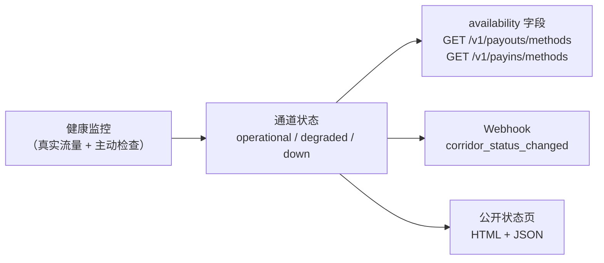

> **环境：** 测试 `https://cryptobank.qbank.cl/platform` (`pk_test_...`) - 正式 `https://api.qbank.cl/platform` (`pk_...`).

支付通道可能出现降级或中断——银行网络故障、渠道维护窗口、上游事故。平台会**实时**监控每条通道（国家 / 币种 / 方式）的健康状况，结合真实流量的结果与主动健康检查，并通过三种方式向你暴露该状态，让你的产品先于用户做出反应：

1. **方法目录中的 `availability` 字段** —— 在渲染时决定显示、提示还是隐藏某条通道。
2. **`corridor_status_changed` webhook** —— 通道状态一变化即推送，无需轮询。
3. **公开状态页** —— 一个托管的品牌化页面（HTML + JSON），可从你的应用或自有状态工具中链接。



> **注**
监控是**可观测性，不是闸门**：`down` 状态的通道不会阻止你的请求。控制权在你手中——你可以继续发送（请求会以常见的错误码失败，退款照常处理），也可以在你的界面中暂停该通道直到恢复。
## 通道状态

| 状态 | 含义 | 应对方式 |
|---|---|---|
| `operational` | 通道正常处理。 | 无需操作——照常运营。 |
| `degraded` | 近期窗口内检测到基础设施错误率升高。部分操作可能失败或耗时更长。 | 考虑在界面中显示提示；使用相同 `idempotency_key` 重试是安全的。 |
| `down` | 连续的基础设施故障或健康检查失败。新发起的操作极可能失败。 | 建议在界面中隐藏或禁用该通道直到恢复；已发送的操作会照常到达最终状态（失败的操作照常退款）。 |

状态转换带有滞回机制：单个超时绝不会宣告中断，恢复也需要持续的稳定窗口——你读到的状态是有意义的，而非噪声。

## 1. 方法目录中的 availability

`GET /v1/payouts/methods` 与 `GET /v1/payins/methods` 现在为每条通道包含增量字段 `availability`。其余结构保持不变。

```bash
curl "https://api.qbank.cl/platform/v1/payouts/methods" \
  -H "Authorization: Bearer pk_..."
```

```json
{
  "items": [
    {
      "country": "VE",
      "currency": "VES",
      "method": "bank_transfer",
      "availability": "down"
    },
    {
      "country": "MX",
      "currency": "MXN",
      "method": "bank_transfer",
      "availability": "operational"
    }
  ]
}
```

没有记录过事故的通道始终为 `operational`——监控只持久化实际观测到的内容。

## 2. `corridor_status_changed` webhook

将你的端点订阅到 `corridor_status_changed` 事件（[webhook 指南](https://docs.cbpayapp.com/zh/webhooks)），每次状态转换发生时你都会立即收到——中断**与**恢复都会推送：

```json
{
  "event_type": "corridor_status_changed",
  "data": {
    "flow": "payout",
    "country": "VE",
    "currency": "VES",
    "method": "bank_transfer",
    "status": "down",
    "previous_status": "operational",
    "since": "2026-07-24T22:10:00Z",
    "reason": "consecutive infrastructure failures"
  }
}
```

| 字段 | 说明 |
|---|---|
| `flow` | `payout` 或 `payin` —— 受影响通道的方向。 |
| `country` / `currency` / `method` | 通道键，与方法目录中的完全一致。 |
| `status` | 新状态：`operational`、`degraded` 或 `down`。 |
| `previous_status` | 转换前的状态。 |
| `since` | 新状态的开始时间（RFC 3339，UTC）。 |
| `reason` | 简短的可读原因（绝不包含内部渠道身份）。 |

该事件是**广播**：不与你的某笔操作绑定，因此不携带 `account_id`。与所有 webhook 一样需要幂等消费（按投递 id 去重）。

## 3. 公开状态页

你的机构拥有一个托管状态页，展示每条通道的实时状态、最近 90 天的正常运行率以及事故历史。页面公开（无需认证）、使用你机构的品牌形象，可放心分享给你自己的客户。

- **HTML**：`GET /status/{orgToken}` —— 自包含页面，可直接链接或嵌入。
- **JSON**：`GET /v1/status/{orgToken}` —— 同样的数据，供你自己的状态工具或监控使用。

页面会自动使用你机构的 logo、颜色和网站，并为每条通道展示国家国旗、支付方式图标、最近 90 天的逐日可用性条以及当前状态。顶部的概览卡片显示总体状态、正常/降级/中断的通道数量与平均可用率；底部的事件时间线用通俗语言说明每次变更的原因。该 HTML 不加载 JavaScript，也不引用任何外部资源，可以安全地嵌入 iframe。

`orgToken` 是运营方共享给你的不透明令牌（机构管理员可在 `GET /v1/org/branding` 中读取 `status_page_url`）。

```bash
curl "https://api.qbank.cl/platform/v1/status/{orgToken}"
```

```json
{
  "status": "degraded",
  "generated_at": "2026-07-24T22:15:00Z",
  "corridors": [
    {
      "flow": "payout",
      "country": "VE",
      "currency": "VES",
      "method": "bank_transfer",
      "status": "down",
      "since": "2026-07-24T22:10:00Z",
      "uptime_90d_pct": 99.62
    }
  ],
  "incidents": [
    {
      "flow": "payout",
      "country": "VE",
      "currency": "VES",
      "method": "bank_transfer",
      "from_status": "operational",
      "to_status": "down",
      "reason": "consecutive infrastructure failures",
      "at": "2026-07-24T22:10:00Z"
    }
  ]
}
```

| 字段 | 说明 |
|---|---|
| `status` | 页面整体状态：所有通道中最差的状态。 |
| `corridors[]` | 每条通道的当前状态，附 `uptime_90d_pct`（最近 90 天处于 `operational` 的时间百分比）。 |
| `incidents[]` | 最近的状态转换（中断与恢复），最新的排在最前。 |

未知或格式错误的令牌返回 `404`——令牌不会泄露机构是否存在。该端点按 IP 限流。

## 常见问题

#### down 状态的通道会拒绝我的请求吗？
    不会。监控绝不阻止发起操作。`down` 意味着新操作极可能以常见错误码失败（`channel_unavailable`、渠道拒绝、超时相关状态）——失败的操作照常全额退款。请使用 `availability` 决定界面上展示什么。
#### 中断多快能被检测到？
    监控持续评估，将每笔真实发起的操作与周期性的主动健康检查结合，因此即使在流量很少的通道上，中断通常也能在几分钟内被检测到。滞回机制避免单个超时导致状态抖动。
#### 我需要轮询目录来跟踪可用性吗？
    不需要——订阅 `corridor_status_changed` 即可收到每次状态转换的推送。目录适合在渲染时读取快照；webhook 才是变更流。
#### 通道中断时在途的操作会怎样？
    它们会自行收敛：每笔操作通过既有的 webhook 与对账机制到达最终状态（`completed` 或 `failed` 并退款）。你永远不需要重新发送——使用相同 `idempotency_key` 重试始终是安全的。
#### 状态页可以白标吗？
    可以。页面自动使用你机构的品牌（logo、颜色、名称）——与凭证和托管页面使用同一套配置。向你的运营方索取机构状态页 URL，或者如果你是机构管理员，可从 <code>GET /v1/org/branding</code> 中读取。
#### 为什么看不到事故背后的服务商？
    平台在设计上与服务商无关：通道仅以国家、币种和方式标识。事故原因经过归一化处理，绝不包含内部渠道身份。
