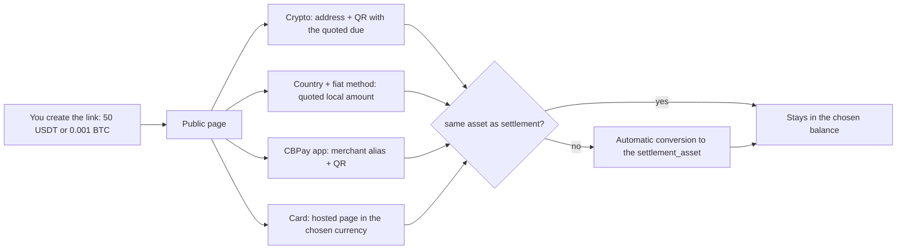

> **Environments:** Test `https://cryptobank.qbank.cl/platform` (`pk_test_...`) - Live `https://api.qbank.cl/platform` (`pk_...`).

Create a **universal checkout link**: a single `POST /v1/payins` with
`method: "checkout"` returns a branded public URL where the payer chooses
how to pay. The charge is denominated in the **virtual balance you
choose** (`settlement_asset`: `USDT`, `USDC`, `BTC` or `GOLD`, default
`USDT`) and every payment is converted **automatically** to that balance
when it credits — unless the payer pays in the same asset, in which case
there is no conversion.

The page organizes the payment into **four tabs**:

- **CBPay** — direct payment with the app: the merchant's alias and QR;
  scanning with the app pays instantly through an internal transfer, in
  any of the 4 balances.
- **Crypto** — the available coins grouped by network (today USDT on
  TRON and Ethereum, USDC on Ethereum and BTC; new networks show up on
  their own once enabled), each with a deposit address exclusive to that
  charge and a **scannable QR** compatible with external wallets (Trust
  Wallet, MetaMask, Binance and similar apps).
- **Fiat** — the payer picks their country among **every country with a
  live payin corridor** and sees the available methods (QR, bank
  transfer, hosted payment) with the local amount quoted on the spot.
- **Card** — credit or debit card payment on a secure hosted page,
  listed **by charge currency** (today BOB and USD; currencies from
  future acquirers show up on their own). Each currency is an
  independent payment option with its own quoted amount.



```bash
curl -X POST https://api.qbank.cl/platform/v1/payins \
  -H "Authorization: Bearer <token>" \
  -H "Content-Type: application/json" \
  -d '{
    "method": "checkout",
    "amount": "50",
    "settlement_asset": "USDT",
    "description": "Order 8841",
    "country": "CL",
    "success_url": "https://your-app.com/payment/ok",
    "failure_url": "https://your-app.com/payment/error",
    "expires_in": 86400,
    "idempotency_key": "order-8841"
  }'
```

- `amount` is denominated **in the `settlement_asset`**: `"50"` with
  `USDT` means 50 USDT; `"0.001"` with `BTC` means 0.001 BTC; `"2"` with
  `GOLD` means 2 grams of gold. Do not send `currency` — that is the old
  contract and responds `400` (the charge is no longer tied to a local
  currency).
- `country` is **optional** and only preselects the country on the page;
  the payer can change it.
- `GOLD` has no payment rail of its own: the charge is always reached
  through automatic conversion from whatever the customer pays with.

Response `201`:

```json
{
  "payin_id": "d0135ed5-8e9c-4f8b-a522-8ec100470426",
  "kind": "checkout",
  "status": "pending",
  "settlement_asset": "USDT",
  "asset_amount": "50",
  "country": "CL",
  "description": "Order 8841",
  "reference": "CB68JZCT46QE",
  "checkout_url": "https://api.qbank.cl/platform/pay/fc4981b8e7c7…",
  "expires_at": "2026-07-17T17:57:44Z",
  "receipt_url": "https://api.qbank.cl/platform/v1/payins/d0135ed5-…/receipt"
}
```

Share the `checkout_url` (link, email, WhatsApp, printed QR). The page
requires no login, carries your organization's branding and updates by
itself: once the payment is confirmed through any method it shows "paid"
and redirects to your `success_url` if you set one.

## How each rail pays

- **Multi-country fiat**: the payer picks a country and a method; the
  local amount is quoted on the spot (target → USD → local currency using
  your corridor's `payin_rate`, rounded up) and is **frozen** when the
  method is chosen. The credit arrives with the normal payin conversion
  and fees, and is then converted to the `settlement_asset`. An announced
  payment SMALLER than the frozen quote still credits (the money is real)
  but does **not** mark the link as paid. When a country offers the same
  method in **several currencies** (e.g. Bolivia with QR in BOB and in
  USD), the page lists each currency as an independent option. On bank
  transfers in Mexico the link issues a **dedicated CLABE exclusive to
  that charge**: the payer transfers the exact amount **with no reference
  needed** — the deposit is detected and settled automatically because
  the account itself identifies the link. If a dedicated account cannot
  be issued at that moment, the page degrades to the classic path (the
  merchant's general account plus a mandatory reference in the transfer
  description).
- **Pull collections (Venezuela)**: `c2p` and `debito_inmediato` charge
  the payer's account directly. The page asks for bank, document, phone
  (C2P) or account (immediate debit) and the OTP — generated in their
  banking app for C2P, or sent on demand for immediate debit ("Request
  key" button). The amount is ALWAYS the one frozen at quote time; if
  the rail confirms synchronously the link is paid instantly. A
  rejection does not kill the link: the payer fixes the data or picks
  another method.
- **Card (multi-currency)**: the tab lists every available charge
  currency with its quoted amount; picking one opens the hosted payment
  page in that currency. Each currency is an independent materialization
  (you can quote BOB and USD on the same link; the first one to complete
  pays it). On the payment page the payer can use a **saved card**: they
  type their email, verify it with a code and pick one — with "Remember
  this device" they skip the code for 30 days (see
  [stored cards](https://docs.cbpayapp.com/en/guides/stored-cards-subscriptions#the-payer-discovers-their-cards-on-the-payment-page)).
- **Crypto (wallet per charge)**: choosing a currency generates an
  exclusive address with its `qr_payload` and `qr_png_base64` — the QR
  always carries the raw address (BTC bech32, TRON base58, ETH hex) for
  maximum wallet and exchange compatibility (Binance and similar apps
  reject BIP-21/EIP-681 URIs); the exact amount is shown next to it with
  a copy button. If the paid asset differs from the
  `settlement_asset`, the quoted due **already includes the conversion**
  (the payer covers it; you receive your exact target). Partial payments
  accumulate and the page shows what's missing. Quotes involving BTC/GOLD
  refresh every 15 minutes.
- **CBPay app**: the merchant QR embeds the link
  (`cbpay:pay?to=…&checkout=…`). The app pays through an internal
  transfer in any of the 4 balances: same asset ⇒ exact target; different
  ⇒ due with the conversion included. The amount is validated server-side
  against a fresh quote — if it does not cover the charge it responds
  `422 checkout_amount_mismatch` with the current due. Integrators:
  `POST /v1/transfers` accepts the optional `checkout_token` field (or
  the extended QR in `to_qr_token`); the destination is forced to the
  link's account.

## Automatic conversion to the chosen balance

Every credit in an asset different from the `settlement_asset` is
converted with your account's conversion engine (same spreads and limits
as `POST /v1/swaps`). The aggregate state travels in `conversion_status`:

| `conversion_status` | Meaning |
|---|---|
| _(absent)_ | No conversion happened (you were paid in the same asset) |
| `done` | Every conversion of the link executed |
| `pending_retry` | A conversion failed temporarily (price unavailable or limit); funds stay in the received asset and it retries automatically |

## Public link endpoints (no auth, rate-limited)

- `GET {checkout_url}/state` — link state: `status`, `paid_method`,
  `settlement_asset`, `asset_amount`, frozen fiat materializations
  (`fiat_methods`), crypto progress (`crypto` with `due`/`received`) and
  `conversion_status`.
- `GET {checkout_url}/quote` — quotes BEFORE choosing: `countries`
  (catalog per country; each country lists its corridors in `options[]`
  — one row per method+currency, with `collect: true` on pull methods),
  `cards` (card options per country and currency with their
  `local_amount`), `crypto` (indicative due per pair) and `cbpay`
  (alias + dues per asset). With `?country=XX` it adds `country_quote`
  with that country's local amount per option.
- `POST {checkout_url}/methods/{method}` — materializes the chosen
  option. Fiat methods require `?country=XX`; when the country offers
  the method in more than one currency (cards, QR BOB/USD in Bolivia)
  it also requires `&currency=YYY`; crypto uses
  `crypto:<chain>:<asset>` (e.g. `crypto:tron:usdt`) without a country.
  Pull methods return the payer form (`banks[]`,
  `requires_otp_request`) with the frozen quote. Re-POSTing the same
  combination returns the SAME materialization.
- `POST {checkout_url}/collect/otp` — requests the OTP of a pull
  collection when the rail sends it on demand
  (`requires_otp_request: true`, e.g. VE immediate debit). Returns the
  `otp_reference` that accompanies the final charge. Strictly rate
  limited (each call is a real SMS/push).
- `POST {checkout_url}/collect` — runs the pull charge with the payer's
  data (bank, document, phone or account, OTP). The amount is always
  the frozen one; if the rail confirms synchronously it responds
  `paid: true` and the link is settled in the same call.

Useful if you prefer to render your own payment page on top of the same
link.

## Link rules

- **One link = one charge**: the first method that completes the payment
  wins; a later payment through another rail is not credited (picking a
  method does NOT lock the others while nobody has paid).
- `expires_in` accepts 600 to 604800 seconds (10 minutes to 7 days;
  default 24 hours). If it expires unpaid the payin flips to `expired`
  and you receive the `payin_expired` webhook.
- A retry with the same `idempotency_key` returns the **same link** (the
  URL never changes); a second charge is never opened.
- The `settlement_asset` must be enabled for your organization; if it is
  disabled the creation responds `422 settlement_asset_disabled`.

When the charge is paid you receive the `payin_credited` with
`settled_via` (e.g. `crypto:tron:usdt`, `qr`, `cbpay`),
`settlement_asset` and `asset_amount`; crypto payments add
`crypto_amount` and CBPay app payments add `transfer_id`, `asset` and
`amount`.

> **Note**
A charge paid **by card** follows your organization's card settlement
delay (the `settlement_hours` of the `payin_card` fee): the payin confirms
as `credited` and the link closes as paid right away, but the **balance**
lands at `settle_at` — the payin carries `settlement_pending: true` until
then. Charges paid through any other method (QR, crypto, CBPay app,
fintoc) credit immediately, as always. See
[fees — card payin settlement delay](https://docs.cbpayapp.com/en/concepts/fees#card-payin-settlement-delay).
In `GET /v1/payins` and `GET /v1/payins/{payin_id}` checkout payins
always carry their denomination — `settlement_asset` + `asset_amount` —
in every status (pending, expired and credited); `currency`/`local_amount`
stay empty until a local payment method is used. A charge settled in
crypto or via the CBPay app exposes its `usdt_credited` without an
`fx_rate` (no FX quote applies).

Link-specific errors (seen by whoever opens the page):

| HTTP | `error` | Meaning |
|---|---|---|
| 404 | `not_found` | Invalid token or non-existent link |
| 400 | `country_required` | Fiat method without `?country=XX` |
| 400 | `currency_required` | The country offers the method in several currencies; `?currency=YYY` is missing |
| 409 | `already_paid` | The link was already paid through another method |
| 410 | `checkout_expired` | The link expired unpaid |
| 422 | `method_unavailable` | That method is not available for this link or country |
| 422 | `country_unavailable` | That country has no available payment methods |
| 422 | `checkout_amount_mismatch` | The CBPay transfer does not cover the charge's current due |
| 422 | `collect_otp_failed` | The rail rejected the OTP delivery (check the data) |
| 422 | `collect_rejected` | The rail rejected the pull charge (invalid OTP or wrong data); the link stays pending |
| 429 | `too_many_attempts` | Per-IP rate limit of the public page |
| 503 | `pricing_unavailable` | Pricing temporarily unavailable; retry in a moment |

## Language

The hosted checkout page follows the public locale chain: `?lang=` / `?locale=` (invalid values are ignored),
then the payer cookie `cbpay_pay_locale`, then the merchant account, then the org `default_locale`, then `Accept-Language`, then English.
JSON of the API stays in English. Details: [Locale and language](https://docs.cbpayapp.com/en/guides/locale).

## FAQ

#### Can the same link be paid twice?
No. One link = one charge: the first rail that pays wins (`already_paid`,
409). A crypto deposit that arrives after the link was settled by another
rail is **not** credited — it is held for reconciliation.
#### What if the payer sends less (or more) crypto than the quote?
Partial crypto payments **accumulate**: the page shows how much is missing
until the quoted amount is covered. Late payments that arrive after the link
expired still credit your account.
#### How long does a link live?
`expires_in` between 600 s and 7 days (default 24 h). When it expires you
receive the `payin_expired` webhook and the public page answers
`checkout_expired` (410).
#### What happens if the conversion to my settlement asset fails?
The funds stay safe in USDT and the payin reports
`conversion_status: pending_retry`; the platform retries automatically until
the swap succeeds — you never lose money nor get converted twice.
#### Can the payer switch payment method after choosing one?
Yes. Each method materializes independently; re-requesting the same method
returns the same materialization. Whichever rail pays first settles the
link.
#### Can I retry the link creation safely?
Yes — retry `POST /v1/payins` with the **same** `idempotency_key` and you
get the same link back. A new key creates a new, independent link.
