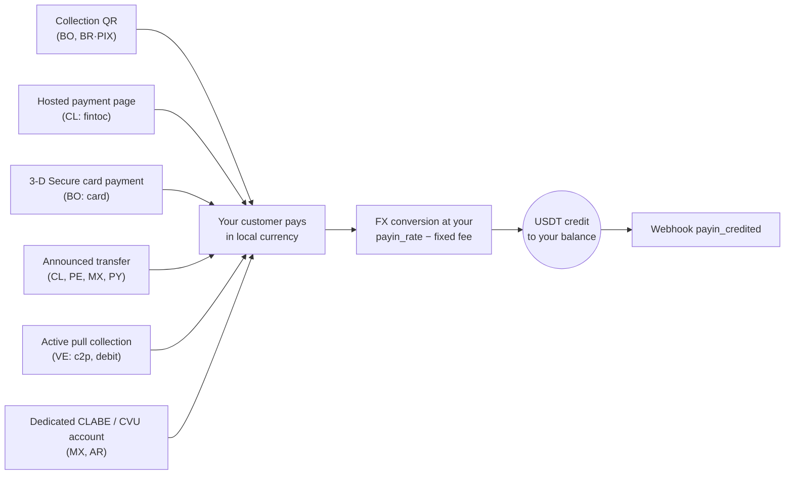

> **Environments:** Test `https://cryptobank.qbank.cl/platform` (`pk_test_...`) - Live `https://api.qbank.cl/platform` (`pk_...`).

A payin is a fiat collection: your customer pays in local currency and your
account gets credited in USDT automatically, converted at **your payin
rate** (`payin_rate` in `GET /v1/rates`) minus the fixed payin fee when
configured for your account.

Whatever the mode, every path ends the same way — automatic credit +
webhook:



## 1. Discover the available corridors

The available countries, currencies and collection modes are defined by
CBPay. Always check the catalog:

```bash
curl https://api.qbank.cl/platform/v1/payins/methods \
  -H "Authorization: Bearer <token>"
```

```json
{
  "items": [
    { "country": "BO", "currency": "BOB", "method": "qr", "delivery": "push" },
    { "country": "VE", "currency": "VES", "method": "c2p", "delivery": "push+polling" },
    { "country": "MX", "currency": "MXN", "method": "bank_transfer", "delivery": "push" }
  ],
  "meta": { "retrieved": 3 }
}
```

`delivery` describes how the payment is confirmed on CBPay's side (bank
notification, polling or both) — it changes nothing in your integration:
you always receive the `payin_credited` webhook.

Collection corridors and modes:

| Country | Currency | Modes |
|---|---|---|
| Chile | CLP | Hosted payment page (`fintoc`), announced bank transfer |
| Peru | PEN | Announced bank transfer |
| Mexico | MXN | Dedicated CLABE account, announced bank transfer |
| Venezuela | VES | Active collection `c2p` and `debito_inmediato` (pull) |
| Bolivia | BOB / USD | Collection QR, card payment page (`card`) |
| Paraguay | PYG | Announced bank transfer |
| Brazil | BRL | Dynamic PIX QR |
| Argentina | ARS | Dedicated CVU account |
| United States | USD | International card payment page (`card`) |

Availability may vary; the catalog (`GET /v1/payins/methods`) is always the
source of truth. In every case the credit works the same way: converted to
USDT at your current `payin_rate` and credited net of the fixed payin fee.
If you'd rather keep your collections in another balance (USDC, BTC or
GOLD), configure `default_payin_asset` — see
[the money model](https://docs.cbpayapp.com/en/concepts/money-model#choose-which-balance-receives-your-payins).

## 2. Pick the mode and create the charge

Each country has its own collection mode. The real request and response of
each one:

#### Chile

**Hosted payment page (`fintoc`)** — recommended: you get a `payment_url`;
the payer opens it and transfers from **any Chilean bank or wallet** (Banco
Estado, Santander, Mach, Tenpo, Mercado Pago…). The payment is
detected and validated automatically — no manual references.

```bash
curl -X POST https://api.qbank.cl/platform/v1/payins \
  -H "Authorization: Bearer <token>" \
  -H "Content-Type: application/json" \
  -d '{
    "country": "CL",
    "currency": "CLP",
    "method": "fintoc",
    "amount": "150000",
    "description": "Top-up order 8841",
    "idempotency_key": "topup-8841"
  }'
```

Response `201`:

```json
{
  "payin_id": "7a2b…",
  "status": "pending",
  "reference": "7a2b…",
  "payment_url": "https://pay.fintoc.com/plink_K2zwNNSxPyx8w3GZ",
  "expires_at": "2026-07-08T18:48:25Z",
  "note": "share the payment_url with the payer; the deposit is credited automatically once the transfer is detected"
}
```

Share the `payment_url` with the payer (link, redirect or WebView). Once
the payment is confirmed your account is credited in USDT and you receive
the `payin_credited` webhook. The CLP amount must be an integer (the
Chilean peso has no decimals) and the payment session expires after 24
hours by default. A retry with the same `idempotency_key` returns the same
payin and the same URL — it never opens a second payment session.

**Announced bank transfer** (manual alternative): announce the incoming
deposit and share the reference with the sender.

```bash
curl -X POST https://api.qbank.cl/platform/v1/payins \
  -H "Authorization: Bearer <token>" \
  -H "Content-Type: application/json" \
  -d '{
    "country": "CL",
    "currency": "CLP",
    "method": "bank_transfer",
    "amount": "500000"
  }'
```

Response `201`:

```json
{
  "payin_id": "4f81…",
  "status": "pending",
  "reference": "CBJ6T3W9M2K5",
  "note": "include the reference in the transfer description so the deposit is credited automatically"
}
```

When the transfer arrives it is matched by the reference in the transfer
description and your account is credited automatically. If the reference
does not travel, the payer's document backs it up — see
[matching an announced transfer](#matching-an-announced-transfer).

#### Peru

**Announced bank transfer**, same as Chile but in soles:

```bash
curl -X POST https://api.qbank.cl/platform/v1/payins \
  -H "Authorization: Bearer <token>" \
  -H "Content-Type: application/json" \
  -d '{
    "country": "PE",
    "currency": "PEN",
    "method": "bank_transfer",
    "amount": "1800.00"
  }'
```

Response `201`:

```json
{
  "payin_id": "6d20…",
  "status": "pending",
  "reference": "CBK7M2Q9X4T3",
  "note": "include the reference in the transfer description so the deposit is credited automatically"
}
```

The `reference` is a **short 12-character alphanumeric code** (it fits any
bank concept field) and must travel in the transfer description for the
automatic match. Send `payer_document` as a backup —
[how matching works](#matching-an-announced-transfer).

#### Mexico

**Dedicated CLABE account** (recommended): create a fixed CLABE bound to
your account — every SPEI arriving to it is credited automatically, no
references needed:

```bash
curl -X POST https://api.qbank.cl/platform/v1/payins/deposit-accounts \
  -H "Authorization: Bearer <token>" \
  -H "Content-Type: application/json" \
  -d '{ "country": "MX", "currency": "MXN" }'
```

Response `201`:

```json
{
  "instrument_id": "a1d4…",
  "account_id": "…",
  "country": "MX",
  "currency": "MXN",
  "method": "bank_transfer",
  "instrument": "734180000151000006",
  "status": "active"
}
```

`instrument` is the CLABE you share with your payers. Creation is free;
each deposit pays the regular payin fee. List your accounts with
`GET /v1/payins/deposit-accounts`.

You can also use a one-off **announced bank transfer**
(`POST /v1/payins` with `method: "bank_transfer"`, `country: "MX"`).

#### Venezuela

**Active collection (pull)**: you charge the payer directly with their
authorization. The result is **synchronous** — if the charge is approved,
the credit lands in the same call.

For `debito_inmediato`, request the OTP first (free):

```bash
curl -X POST https://api.qbank.cl/platform/v1/payins/collect/otp \
  -H "Authorization: Bearer <token>" \
  -H "Content-Type: application/json" \
  -d '{
    "method": "debito_inmediato",
    "amount": "1200.00",
    "payer_document": "V12345678",
    "payer_phone": "04141234567",
    "payer_bank": "0102",
    "payer_account": "01020123456789012345"
  }'
```

```json
{
  "method": "debito_inmediato",
  "result": { "status": "sent", "otp_reference": "OTP-5521" }
}
```

Then execute the collection:

```bash c2p (phone + ID + payer's OTP)
curl -X POST https://api.qbank.cl/platform/v1/payins/collect \
  -H "Authorization: Bearer <token>" \
  -H "Content-Type: application/json" \
  -d '{
    "method": "c2p",
    "amount": "1200.00",
    "description": "Order 5512",
    "payer_document": "V12345678",
    "payer_phone": "04141234567",
    "payer_bank": "0102",
    "otp": "12345678",
    "idempotency_key": "order-5512"
  }'
```

```bash debito_inmediato (account + previously requested OTP)
curl -X POST https://api.qbank.cl/platform/v1/payins/collect \
  -H "Authorization: Bearer <token>" \
  -H "Content-Type: application/json" \
  -d '{
    "method": "debito_inmediato",
    "amount": "1200.00",
    "description": "Order 5512",
    "payer_document": "V12345678",
    "payer_account": "01020123456789012345",
    "payer_bank": "0102",
    "payer_account_type": "CNTA",
    "otp": "87654321",
    "otp_reference": "OTP-5521",
    "idempotency_key": "order-5512"
  }'
```

> **Note**
An active collection executes a real charge against the payer, so
`idempotency_key` is **required** (body or `Idempotency-Key` header): a
retry with the same key returns the original result with `idempotency_hit`
and never re-charges.
Response `200` (charge approved and credited):

```json
{
  "payin_id": "7b3c…",
  "kind": "collect",
  "method": "c2p",
  "status": "credited",
  "local_amount": "1200.00",
  "fx_rate": "36.50",
  "usdt_gross": "32.876712",
  "fee": "0.300000",
  "usdt_credited": "32.576712",
  "paid": true,
  "provider_reference": "…"
}
```

If the payer declines or the authorization fails, `paid` is `false`, the
payin is marked `failed`, and nothing is charged. The exact rejection
reason is persisted on the payin and exposed in the `failure` object (in
the synchronous response, in `GET /v1/payins/{payin_id}`, and on the
idempotent replay):

```json
{
  "payin_id": "7b3c…",
  "kind": "collect",
  "method": "c2p",
  "status": "failed",
  "paid": false,
  "failure": {
    "source": "provider",
    "code": "provider_rejected",
    "message": "Documento de identidad del receptor errado"
  }
}
```

- `source` tells you where the rejection originated (`provider` = the
  payer's bank declined; `core` = the pre-charge validation).
- `code` and `message` carry the concrete reason (invalid or expired OTP,
  wrong document, insufficient payer funds, etc.) so you can tell the
  payer what to fix before retrying with a new idempotency key.

#### Bolivia

**Collection QR** (the local interoperable standard): you generate the QR
and your customer scans it with their banking app.

```bash
curl -X POST https://api.qbank.cl/platform/v1/payins \
  -H "Authorization: Bearer <token>" \
  -H "Content-Type: application/json" \
  -d '{
    "country": "BO",
    "currency": "BOB",
    "method": "qr",
    "amount": "700.00",
    "description": "App top-up",
    "expires_in": 3600
  }'
```

Response `201`:

```json
{
  "payin_id": "9c2a…",
  "status": "pending",
  "charge": {
    "charge_id": "…",
    "qr_image": "<base64>",
    "qr_image_url": "https://cdn.cbpayapp.com/public/payin-qr/<charge_id>.png",
    "qr_payload": "<QR content>",
    "our_reference": "482915073",
    "status": "pending"
  }
}
```

Display the QR to your customer — `qr_image_url` is a public CDN URL ready
for an `` tag (prefer it over the base64 `qr_image`); when they pay,
your account is credited automatically. It also works in USD
(`currency: "USD"`).

**Card payment page (`card`)**: you receive a `payment_url` for a hosted
3-D Secure checkout — the payer enters their card on a secure page branded
with your organization's identity and, when their bank requires it,
completes the authentication challenge right there. Card data never touches
your system or your integration.

```bash
curl -X POST https://api.qbank.cl/platform/v1/payins \
  -H "Authorization: Bearer <token>" \
  -H "Content-Type: application/json" \
  -d '{
    "country": "BO",
    "currency": "BOB",
    "method": "card",
    "amount": "700.00",
    "description": "App top-up",
    "customer": { "email": "payer@example.com", "first_name": "Ana", "last_name": "Rojas" },
    "success_url": "https://your-app.com/payment/ok",
    "failure_url": "https://your-app.com/payment/error",
    "idempotency_key": "topup-7719"
  }'
```

Response `201`:

```json
{
  "payin_id": "b41c…",
  "status": "pending",
  "reference": "b41c…",
  "payment_url": "https://api.qbank.cl/pay/cards/9f3XkT…",
  "expires_at": "2026-07-16T18:30:00Z",
  "note": "share the payment_url with the payer; the balance is credited automatically once the card payment is approved"
}
```

Share the `payment_url` (link, redirect or WebView). Flow details:

- `customer` is an **optional** prefill of the billing details (`email`,
  `first_name`, `last_name`, `address`, `city`, `country` — plain text,
  max 120 chars per field); the payer can complete/correct them on the
  page.
- `success_url` / `failure_url` (optional, public https) redirect the payer
  when done; without them the page shows the final result.
- `expires_at` (optional, RFC3339, at least 15 minutes ahead) shortens the
  session lifetime; the default is 24 hours. If it expires unpaid, the
  payin moves to `expired` and you receive the `payin_expired` webhook.
- The payer has a limited number of attempts; an issuer decline lets them
  retry with another card within the same session.
- Approval is online: once the charge is approved your account is credited
  in USDT at your `payin_rate` and you receive `payin_credited` — same as
  every other mode.
- A retry with the same `idempotency_key` returns the same payin and the
  same `payment_url`; it never opens a second payment session.
- It also works in USD (`currency: "USD"`).

#### Paraguay

**Announced bank transfer** in guaraníes: you announce the deposit, your
payer transfers (interbank SIPAP or an internal transfer at the receiving
bank) with the reference in the transfer concept, and the credit is
detected automatically.

```bash
curl -X POST https://api.qbank.cl/platform/v1/payins \
  -H "Authorization: Bearer <token>" \
  -H "Content-Type: application/json" \
  -d '{
    "country": "PY",
    "currency": "PYG",
    "method": "bank_transfer",
    "amount": "596000"
  }'
```

Response `201`:

```json
{
  "payin_id": "8f41…",
  "status": "pending",
  "reference": "CBW4N8R2T6P9",
  "note": "include the reference in the transfer description so the deposit is credited automatically"
}
```

> **Note**
Guaraníes use no decimals: announce the **exact integer amount** your
payer will transfer (e.g. `"596000"`). The `reference` is a short
12-character alphanumeric code — designed for the SIPAP concept field,
which accepts **at most 20 characters and no special characters** — and
putting it in the concept ensures the automatic match. Send
`payer_document` as a backup — see
[matching an announced transfer](#matching-an-announced-transfer).
#### Brazil

**Dynamic PIX QR**: the same endpoint generates a PIX QR with the amount
embedded.

```bash
curl -X POST https://api.qbank.cl/platform/v1/payins \
  -H "Authorization: Bearer <token>" \
  -H "Content-Type: application/json" \
  -d '{
    "country": "BR",
    "currency": "BRL",
    "method": "qr",
    "amount": "120.00",
    "description": "Order 7719",
    "expires_in": 1800
  }'
```

In the response, `charge.qr_payload` is the PIX **"copia e cola"** code,
so the payer can paste it into their banking app instead of scanning the
image (`charge.qr_image` base64 or `charge.qr_image_url`, the public CDN
URL). The QR expires per `expires_in` (default 1
hour); the payment is credited automatically once confirmed on the rail
(continuous reconciliation — check on demand with
`GET /v1/payins/{charge_id}`).

> **Note**
In Brazil collections work exclusively through dynamic PIX QR (one QR = one
payment, exact amount embedded). Announced bank transfers will come later.
#### Argentina

**Dedicated CVU account**: create a fixed CVU bound to your account —
every ARS transfer arriving to it (from any CBU or CVU in the Argentine
system) is credited automatically, no references needed:

```bash
curl -X POST https://api.qbank.cl/platform/v1/payins/deposit-accounts \
  -H "Authorization: Bearer <token>" \
  -H "Content-Type: application/json" \
  -d '{ "country": "AR", "currency": "ARS" }'
```

Response `201`:

```json
{
  "instrument_id": "f2b8…",
  "account_id": "…",
  "country": "AR",
  "currency": "ARS",
  "method": "bank_transfer",
  "instrument": "0000079900000000132537",
  "status": "active"
}
```

`instrument` is the 22-digit CVU you share with your payers. Creation is
free; every deposit pays the regular payin fee. List your accounts with
`GET /v1/payins/deposit-accounts`.

> **Note**
The CVU works in **ARS only** and is deposit-only (receive-only): no
third party can debit it. Direct debit attempts (DEBIN) against a deposit
CVU are rejected automatically.
#### United States

**International card payment page (`card`)**: charge in US dollars with
Visa, Mastercard, American Express, Discover and Diners cards issued
anywhere. You get a `payment_url` for a hosted checkout with 3-D Secure
branded with your organization; card data is typed into the processor's
secure fields embedded in that page and **never touches your system or your
integration**.

```bash
curl -X POST https://api.qbank.cl/platform/v1/payins \
  -H "Authorization: Bearer <token>" \
  -H "Content-Type: application/json" \
  -d '{
    "country": "US",
    "currency": "USD",
    "method": "card",
    "amount": "49.90",
    "description": "Pro plan",
    "customer": { "email": "payer@example.com", "first_name": "Ana", "last_name": "Rojas" },
    "success_url": "https://your-app.com/payment/ok",
    "failure_url": "https://your-app.com/payment/error",
    "save_card": true,
    "payer_reference": "customer-7719",
    "idempotency_key": "pro-plan-7719"
  }'
```

Response `201`:

```json
{
  "payin_id": "3ab7…",
  "status": "pending",
  "reference": "3ab7…",
  "payment_url": "https://api.qbank.cl/pay/cards/Kt9XmQ…",
  "expires_at": "2026-07-26T18:30:00Z",
  "note": "share the payment_url with the payer; the balance is credited automatically once the card payment is approved"
}
```

The contract is the **same** as the Bolivian card page (optional `customer`,
`success_url`/`failure_url`, `expires_at`, limited attempts, an idempotent
retry returns the same `payment_url`). What is specific to the international
corridor:

- 3-D Secure runs inside the page: if the issuer asks for a challenge, the
  payer completes it right there without leaving the checkout.
- Most charges are approved online; if the issuer leaves the charge under
  verification, the credit lands as soon as the rail confirms it — you still
  get `payin_credited`, just a few minutes later.
- `save_card: true` plus `payer_reference` store the card with the payer's
  consent for later charges (see
  [stored cards and subscriptions](https://docs.cbpayapp.com/en/guides/stored-cards-subscriptions)).

> **Note**
The international card corridor is enabled per account. Check
`GET /v1/payins/methods` — it is the source of truth for what your account
can collect today.
## Universal checkout link (`checkout`)

The universal payment link now lives in its own guide, covering the quote
engine, every rail and the public endpoints:

- **Checkout** - One link where the payer chooses how to pay - fiat in every live country, crypto, card or the CBPay app - settled in the balance you choose.

## Saved cards and recurring charges (card)

Stored credentials (COF) and scheduled subscriptions moved to their own
guide:

- **Stored cards & subscriptions** - Save cards with the payer's consent, charge them one-click or without the payer present, and schedule recurring subscriptions.

## Refunds (card)

A credited card payin can be refunded in full or in part from your balance,
with its own ledger entry, receipt and webhook:

- **Payin refunds** - Refund a card payin fully or partially, void a same-day charge, and understand how a chargeback is applied.

## Matching an announced transfer

An announced transfer (`method: "bank_transfer"`) has no payment session:
the payer moves the money from their own bank, so the deposit is recognized
when it lands. Matching runs in this order and stops at the first hit:

1. **`reference`** — the 12-character code in the transfer description.
2. **Payer document** — the announcement's `payer_document` against the
   payer the bank reports (dots, dashes and check digit are ignored).
3. **Single candidate** — exactly one pending announcement for that amount
   and currency.

> **Important**
If none of the three resolves to **one** announcement — two pending
announcements for the same amount, no reference, no payer document — the
deposit is **not** credited on a guess: it lands as `unassigned` and your
CBPay operator routes it. No money is lost; it is already in the collection
account.
### Identify the payer (optional, recommended)

`method: "bank_transfer"` accepts the payer's data. Every field is optional
and additive — existing integrations keep working unchanged:

| Field | Matched against |
|---|---|
| `payer_document` | Tax ID / national ID reported by the bank (dots, dashes and check digit ignored) |
| `payer_name` | Payer name, by tokens (`JUAN PEREZ` matches `PEREZ JUAN SOTO`) |
| `payer_account` | Payer account number, by its digits |

```bash Request
curl -X POST https://api.qbank.cl/platform/v1/payins \
  -H "Authorization: Bearer <token>" \
  -H "Content-Type: application/json" \
  -d '{
    "country": "CL",
    "currency": "CLP",
    "method": "bank_transfer",
    "amount": "500000",
    "payer_document": "17438319-7"
  }'
```

```json Response 201
{
  "payin_id": "4f81…",
  "status": "pending",
  "reference": "CBJ6T3W9M2K5",
  "note": "include the reference in the transfer description so the deposit is credited automatically",
  "payer_source": "declared",
  "payer_document": "17438319-7"
}
```
`payer_source` always comes back so your checkout knows what to ask the
payer for:

| Value | Meaning |
|---|---|
| `declared` | You sent payer data — the document backs up the reference |
| `account_identity` | No payer sent: the verified tax ID of your account is used (the holder deposits to themselves) |
| `none` | No identity available — **insist on the reference**, it is the only strong signal left |

> **Note**
A document shorter than 5 characters or with no digits is dropped as a
signal (it cannot be told apart from an amount or a bank code). The
announcement is still created and `payer_source` reports the real coverage.
### Retries and idempotency

The announcement accepts `idempotency_key` (body) or the `Idempotency-Key`
header. A retry with the same key returns the **original** announcement —
same `reference` — with `idempotency_hit: true` and HTTP `200` instead of
creating a second one.

```bash Request (retry)
curl -X POST https://api.qbank.cl/platform/v1/payins \
  -H "Authorization: Bearer <token>" \
  -H "Content-Type: application/json" \
  -H "Idempotency-Key: topup-9912" \
  -d '{
    "country": "CL",
    "currency": "CLP",
    "method": "bank_transfer",
    "amount": "500000",
    "payer_document": "17438319-7"
  }'
```

```json Response 200
{
  "payin_id": "4f81…",
  "status": "pending",
  "reference": "CBJ6T3W9M2K5",
  "note": "include the reference in the transfer description so the deposit is credited automatically",
  "payer_source": "declared",
  "payer_document": "17438319-7",
  "idempotency_hit": true
}
```
> **Important**
Two live announcements that look identical (same account, currency, amount
and payer) are exactly the case matching refuses to resolve: the real
deposit matches both and lands `unassigned`. That is why a POST **without**
a key reuses a live identical announcement instead of duplicating it (also
`200` with `idempotency_hit: true`).

To collect **two real payments** of the same amount from the same payer,
send a different `idempotency_key` for each one — each key creates its own
announcement with its own `reference`.
## 3. Receiving the credit

When the payment arrives (through any of the modes), your account is
credited automatically and the `payin_credited` webhook fires:

```json
{
  "payin_id": "9c2a…",
  "account_id": "…",
  "country": "BO",
  "currency": "BOB",
  "local_amount": "700.00",
  "fx_rate": "6.91",
  "usdt_credited": "100.302460",
  "fee": "1.000000"
}
```

`fx_rate` is your `payin_rate` at credit time — the conversion happens at
exactly that rate: `usdt_gross = 700.00 / 6.91`.

The payin object keeps the full detail:

```bash
curl https://api.qbank.cl/platform/v1/payins/9c2a… \
  -H "Authorization: Bearer <token>"
```

```json
{
  "payin_id": "9c2a…",
  "kind": "qr",
  "status": "credited",
  "local_amount": "700.00",
  "fx_rate": "6.91",
  "usdt_gross": "101.302460",
  "fee": "1.000000",
  "usdt_credited": "100.302460"
}
```

## Statuses

| Status | Meaning |
|---|---|
| `pending` | Charge created, waiting for the payment |
| `credited` | Payment received and credited in USDT |
| `unassigned` | Deposit received without an automatic match (routed by the administrator) |
| `expired` | The charge expired unpaid |
| `failed` | The collection failed |

> **Note**
A deposit that cannot be resolved to a single announcement stays
`unassigned` until the CBPay team routes it to an account (see
[matching an announced transfer](#matching-an-announced-transfer)). Once
assigned, it is credited with the destination account's rate and fees, and
the announcement it belonged to is closed.
> **Note**
When an active charge (QR or checkout) dies unpaid, the payin moves from
`pending` to `expired` (or `failed`) automatically and you receive the
[`payin_expired`](https://docs.cbpayapp.com/en/webhooks) webhook. No funds move: to retry the
collection, create a new payin.
## Reads and history

```bash
# One payin
curl https://api.qbank.cl/platform/v1/payins/9c2a… \
  -H "Authorization: Bearer <token>"

# History with filters
curl "https://api.qbank.cl/platform/v1/payins?from=2026-07-01&to=2026-07-08&status=credited&country=BO&page_size=50" \
  -H "Authorization: Bearer <token>"
```

`from`/`to` use `YYYY-MM-DD` (UTC); an invalid date responds
`400 invalid_range`.

## Common errors

| HTTP | `error` | What to do |
|---|---|---|
| 400 | `invalid_request` | Check `method` (qr, bank_transfer, fintoc, card; collect has its own endpoint) |
| 400 | `idempotency_key_required` | Collect requires an idempotency key (real debit against the payer) |
| 403 | `service_disabled` | Payins is not enabled for your account — see [services](https://docs.cbpayapp.com/en/concepts/services) |
| 422 | `core_rejected` | The processor rejected the charge; check the message |
| 502 | `core_unavailable` | The charge could not be created; retry the creation (nothing was charged) |
## FAQ

#### How do I know a payin was credited?
Subscribe to `payin_credited`: it carries the FX rate applied, the fee and
the exact `usdt_credited`. You can also poll `GET /v1/payins/{id}`.
#### Which FX rate applies to my payin?
The `payin_rate` in force at credit time (see `GET /v1/rates`). Your
agreed spread is already inside the rate — it is never itemized.
#### Can payins land in a balance other than USDT?
Yes — set `default_payin_asset` with `PUT /v1/settlement`. The credit still
enters in USDT and is converted right after at the real price;
`conversion_status` reports `done` or `pending_retry` (auto-retried).
#### What happens when a charge (QR, checkout) expires unpaid?
You receive `payin_expired` and the payin closes without moving money.
Create a new charge — nothing was debited or credited.
#### The payer transferred a different amount than announced — what now?
The reference still matches the announcement, but the amount that arrived is
what gets credited. A transfer that resolves to no announcement stays
`unassigned` for reconciliation; your CBPay team can assign it to the right
payin manually.
#### Two clients announced the same amount and neither sent the reference — who gets the money?
Nobody by chance. If the payer document does not tell them apart, both
announcements stay `pending` and the deposit lands as `unassigned` for the
operator to route. Sending `payer_document` in the announcement is what
turns this case into an automatic credit.
#### Do I have to send payer_document now?
No — it is optional and nothing breaks without it. When you omit it, the
verified tax ID of the account is used (`payer_source: account_identity`),
which covers self-deposits. Send it whenever a third party pays for your
client, and always show the `reference` to the payer.
#### I retried the announcement POST — did I create two announcements?
No. With `idempotency_key` (body or `Idempotency-Key` header) the retry
returns the original announcement with `idempotency_hit: true`. Even without
a key, a POST that is identical to a live announcement (same account,
currency, amount and payer) reuses it — duplicating it would leave the real
deposit `unassigned` for ambiguity. Send different keys only when you really
want to collect twice.
#### Why did my collect (pull) charge fail?
The response and `GET /v1/payins/{id}` persist a `failure` block with the
rail's code and message (for example, a document that does not match the
payer's bank registration). Fix the input and retry with a new key.
