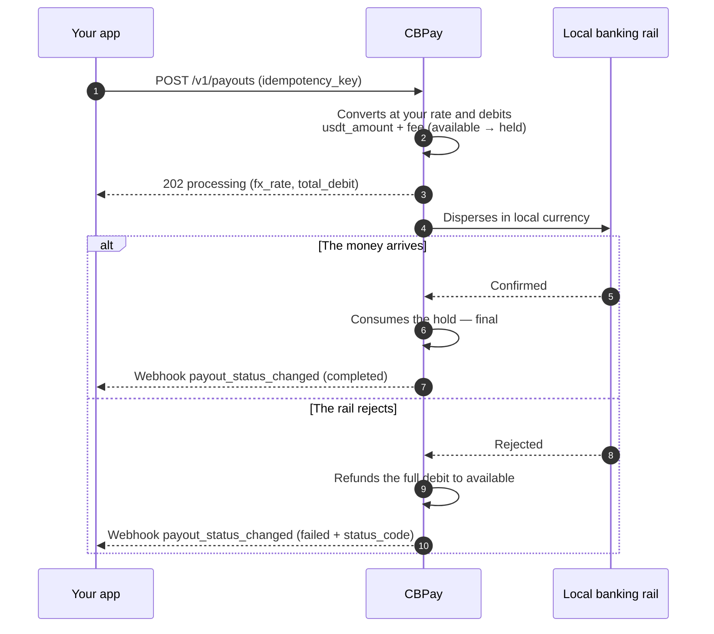

> **Environments:** Test `https://cryptobank.qbank.cl/platform` (`pk_test_...`) - Live `https://api.qbank.cl/platform` (`pk_...`).

A payout sends money in local currency to a bank account in the destination
country. The amount converts from local currency to USDT at **your
account's rate** (the one from `GET /v1/rates`) and `usdt_amount + fee`
(the fixed fee, when configured) is debited from your balance.

This is the full lifecycle, including what happens to your balance at each
step:



## 1. Discover the available corridors

Countries, currencies and methods are defined by CBPay. Always check
the catalog:

```bash
curl https://api.qbank.cl/platform/v1/payouts/methods \
  -H "Authorization: Bearer <token>"
```

```json
{
  "items": [
    { "country": "CL", "currency": "CLP", "method": "bank_transfer" },
    { "country": "PE", "currency": "PEN", "method": "bank_transfer" },
    { "country": "PE", "currency": "PEN", "method": "yape" },
    { "country": "BO", "currency": "BOB", "method": "qr" }
  ],
  "meta": { "retrieved": 4 }
}
```

Available corridors and methods:

| Country | Currency | Methods |
|---|---|---|
| Chile | CLP | `bank_transfer` |
| Peru | PEN | `bank_transfer`, `yape` |
| Mexico | MXN | `bank_transfer` (SPEI: CLABE or debit card) |
| Venezuela | VES | `bank_transfer`, `pago_movil` |
| Bolivia | BOB / USD | `bank_transfer`, `qr` (see [QR payout](#qr-payout)) |
| Brazil | BRL | `pix` (by key or to account), `qr` (PIX QR — see [QR payout](#qr-payout)) |
| Ecuador | USD | `bank_transfer`, `deuna`, `cash_pickup`, `cnb` |
| Paraguay | PYG | `bank_transfer` |
| Argentina | ARS / USD | `bank_transfer` (CBU or CVU) |
| United States | USD | `ach`, `wire`, `swift` |

Availability may vary; the catalog (`GET /v1/payouts/methods`) is always
the source of truth. If a country has a single method, `method` is
optional. Every method is charged the same way: your rate + fixed fee.

For bank transfers you also need the banks catalog (that is where the
beneficiary's `bank_code` comes from):

```bash
curl "https://api.qbank.cl/platform/v1/payouts/banks?country=CL" \
  -H "Authorization: Bearer <token>"
```

```json
{
  "items": [
    { "code": "001", "name": "Banco de Chile" },
    { "code": "012", "name": "Banco del Estado de Chile" },
    { "code": "016", "name": "Banco de Crédito e Inversiones" }
  ],
  "meta": { "retrieved": 3 }
}
```

## 2. Create the payout

```bash
curl -X POST https://api.qbank.cl/platform/v1/payouts \
  -H "Authorization: Bearer <token>" \
  -H "Content-Type: application/json" \
  -d '{
    "country": "MX",
    "currency": "MXN",
    "method": "bank_transfer",
    "amount": "1500.00",
    "beneficiary": {
      "name": "Maria Lopez",
      "account_type": "clabe",
      "account_number": "012180001234567895"
    },
    "description": "Invoice 8841",
    "idempotency_key": "invoice-8841"
  }'
```

> **Important**
`beneficiary` is a key/value object whose required fields depend on the
corridor (RUT and bank in Chile, CLABE in Mexico, CCI in Peru, PIX key in
Brazil, etc.). The methods catalog documents each one.
> **Note**
Every payout saves the beneficiary as a [contact](https://docs.cbpayapp.com/en/guides/contacts)
automatically (`"save_contact": false` to skip it). To pay them again
without re-typing their data, send `"beneficiary_contact_id"` instead of
`beneficiary` — their most recent saved beneficiary for that country and
method is used (`422 no_saved_destination` if there is none).
Response `202 Accepted`:

```json
{
  "payout_id": "0d4f…",
  "account_id": "…",
  "idempotency_key": "invoice-8841",
  "country": "MX",
  "currency": "MXN",
  "method": "bank_transfer",
  "local_amount": "1500.00",
  "fx_rate": "17.50",
  "usdt_amount": "85.714286",
  "fee": "0.300000",
  "total_debit": "86.014286",
  "settlement_asset": "USDT",
  "settlement_amount": "86.014286",
  "settlement_rate": "1",
  "status": "processing",
  "bank_reference": "",
  "created_at": "2026-07-06T20:00:00Z"
}
```

At that moment your balance already reflects the debit: `total_debit` moved
from `available` into `held` (on the `settlement_asset` balance).

> **Note**
**`bank_reference` — the bank's own id for the transfer.** While the payout
is in flight it comes back empty (`""`); once the payout is `completed`, it
carries the transaction id assigned by the destination bank/rail. It is the
value the beneficiary can use to cross-check the payment with their bank,
and it also appears in the `payout_status_changed` webhook, the PDF receipt,
the payouts CSV export and the statement.
### Paying from another balance (`settlement_asset`)

By default the debit comes from your default settlement asset (USDT unless
you change it via `PUT /v1/settlement`). To pay a single operation from
another balance, add `settlement_asset` to the request. Example: a 100,000
CLP payout paid from the BTC balance goes through four transformations,
all recorded on the response:

1. **CLP → USDT** at your rate: `100000 / 950.25 = 105.235465 USDT`.
2. **+ fixed fee**: `105.235465 + 0.30 = 105.535465 USDT` (`total_debit`).
3. **USDT → BTC** at the effective settlement price (`settlement_rate`
   `109029.34070000`): `105.535465 / 109029.3407 = 0.00096795 BTC`
   (rounded up to the satoshi).
4. **Debit and hold in BTC**: `settlement_amount` `0.00096795` leaves your
   BTC balance; the beneficiary receives their 100,000 CLP exactly as
   always.

```json
{
  "country": "CL",
  "currency": "CLP",
  "local_amount": "100000",
  "fx_rate": "950.25",
  "usdt_amount": "105.235465",
  "fee": "0.300000",
  "total_debit": "105.535465",
  "settlement_asset": "BTC",
  "settlement_amount": "0.00096795",
  "settlement_rate": "109029.34070000",
  "status": "processing",
  "bank_reference": ""
}
```

If the payout fails, the exact `settlement_amount` is refunded to your BTC
balance — never re-quoted. If the BTC/GOLD execution price is unavailable
at that moment you get `503 pricing_unavailable`, and volatile assets have
a per-operation limit (`422 settlement_limit_exceeded`; check it in
`GET /v1/settlement`).

## 3. Receive the final state

Subscribe to the `payout_status_changed` event ([webhooks](https://docs.cbpayapp.com/en/webhooks)):

```json
{
  "payout_id": "0d4f…",
  "account_id": "…",
  "country": "MX",
  "currency": "MXN",
  "local_amount": "1500.00",
  "usdt_amount": "85.714286",
  "total_debit": "86.014286",
  "status": "completed",
  "status_code": "",
  "bank_reference": "00761123456"
}
```

- **`completed`**: the money arrived; the hold is consumed.
- **`failed`**: the full debit is refunded automatically (`payout_refund`
  in your ledger).

You can also query at any time:

```bash
curl https://api.qbank.cl/platform/v1/payouts/0d4f… \
  -H "Authorization: Bearer <token>"
```

### Payout statuses

| Status | Meaning | Your balance |
|---|---|---|
| `processing` | Accepted and executing on the local rail | Debit held in `held` |
| `completed` | The money reached the beneficiary | Hold consumed — final |
| `failed` | The corridor rejected it or it failed | **Full automatic refund** (amount + fee) |

## Reads and history

Every payout can be read individually and the listing accepts filters:

```bash
# One payout
curl https://api.qbank.cl/platform/v1/payouts/0d4f… \
  -H "Authorization: Bearer <token>"

# History with filters: dates, status, country and pagination
curl "https://api.qbank.cl/platform/v1/payouts?from=2026-07-01&to=2026-07-08&status=failed&country=MX&page=1&page_size=50" \
  -H "Authorization: Bearer <token>"
```

```json
{
  "page": 1,
  "page_size": 50,
  "payouts": [
    {
      "payout_id": "0d4f…",
      "country": "MX",
      "currency": "MXN",
      "method": "bank_transfer",
      "local_amount": "1500.00",
      "fx_rate": "17.50",
      "usdt_amount": "85.714286",
      "fee": "0.300000",
      "total_debit": "86.014286",
      "status": "failed",
      "status_code": "core_rejected",
      "status_message": "beneficiary account does not exist",
      "bank_reference": "",
      "created_at": "2026-07-06T20:00:00Z"
    }
  ]
}
```

`from`/`to` use `YYYY-MM-DD` (UTC, both inclusive); an invalid date
responds `400 invalid_range`.

## Examples by country

Every corridor with its exact `beneficiary`, the full request and the real
response. Rates (`fx_rate`) are illustrative — your account's rates from
`GET /v1/rates` always apply; the debit is `usdt_amount + fee` (fixed,
when configured; `0.30` here).

### Beneficiary fields per corridor

| Country | Method | `beneficiary` fields |
|---|---|---|
| CL | `bank_transfer` | `name`, `tax_id` (RUT), `bank_code`, `account_type`, `account_number` |
| PE | `bank_transfer` | `name`, `account_number` (20-digit CCI) |
| PE | `yape` | `name`, `phone` (`51XXXXXXXXX`) |
| MX | `bank_transfer` | `name`, `account_type` (`clabe`/`debit_card`), `account_number` (+ `bank_code` for cards) |
| VE | `pago_movil` | `phone`, `bank_code` (SUDEBAN), `document_value` |
| VE | `bank_transfer` | `name`, `account_number` (20 digits), `document_value` |
| BO | `bank_transfer` | `name`, `tax_id`, `bank_code`, `account_number` |
| BR | `pix` | `name`, `tax_id` + (`pix_key` and `pix_key_type`) or (`bank_code` ISPB, `branch_code`, `account_number`) |
| EC | `bank_transfer` | `name`, `document_value` (cédula), `sender_name`, `account_number` (+ `bank_code` and `account_type` for other banks) |
| EC | `deuna` | `name`, `document_value`, `sender_name`, `phone` (wallet mobile number) |
| EC | `cash_pickup` / `cnb` | `name`, `document_value`, `sender_name` — the beneficiary withdraws with their ID |
| PY | `bank_transfer` | `name` (max 35 chars), `tax_id`, `bank_code`, `account_number` |
| AR | `bank_transfer` | `name`, `tax_id` (11-digit CUIT/CUIL), `account_number` (22-digit CBU or CVU; USD is CBU-only) |
| US | `ach` / `wire` / `swift` | `name`, `account_number`, `email`, `country_code`, `address`, `city`, `postal_code`, `bank_name`, `bank_code` (ABA routing for `ach`/`wire`, SWIFT BIC for `swift`; + `account_type` `CHECKING`/`SAVING` for `ach`) |

#### Chile

Bank transfer in CLP. Requires RUT, bank and account:

```bash
curl -X POST https://api.qbank.cl/platform/v1/payouts \
  -H "Authorization: Bearer <token>" \
  -H "Content-Type: application/json" \
  -d '{
    "country": "CL",
    "currency": "CLP",
    "method": "bank_transfer",
    "amount": "100000",
    "beneficiary": {
      "name": "Pedro Soto Fuentes",
      "tax_id": "12.345.678-5",
      "bank_code": "012",
      "account_type": "checking",
      "account_number": "123456789"
    },
    "description": "Supplier payment",
    "idempotency_key": "cl-prov-0091"
  }'
```

```json
{
  "payout_id": "b3e1…",
  "country": "CL",
  "currency": "CLP",
  "method": "bank_transfer",
  "local_amount": "100000",
  "fx_rate": "925.69",
  "usdt_amount": "108.027528",
  "fee": "0.300000",
  "total_debit": "108.327528",
  "status": "processing",
  "bank_reference": ""
}
```

The banks catalog (`GET /v1/payouts/banks?country=CL`) lists the current
`bank_code` values.

#### Peru

Two methods: bank transfer (interbank CCI) and **Yape** (to a phone
number).

```bash bank_transfer (CCI)
curl -X POST https://api.qbank.cl/platform/v1/payouts \
  -H "Authorization: Bearer <token>" \
  -H "Content-Type: application/json" \
  -d '{
    "country": "PE",
    "currency": "PEN",
    "method": "bank_transfer",
    "amount": "1000.00",
    "beneficiary": {
      "name": "Rosa Alvarez Diaz",
      "account_number": "00219300123456789012"
    },
    "idempotency_key": "pe-cci-3310"
  }'
```

```bash yape (phone)
curl -X POST https://api.qbank.cl/platform/v1/payouts \
  -H "Authorization: Bearer <token>" \
  -H "Content-Type: application/json" \
  -d '{
    "country": "PE",
    "currency": "PEN",
    "method": "yape",
    "amount": "150.00",
    "beneficiary": {
      "name": "Luis Ramos Vega",
      "phone": "51987654321"
    },
    "idempotency_key": "pe-yape-8874"
  }'
```

```json
{
  "payout_id": "c7a2…",
  "country": "PE",
  "currency": "PEN",
  "method": "yape",
  "local_amount": "150.00",
  "fx_rate": "3.40",
  "usdt_amount": "44.117648",
  "fee": "0.300000",
  "total_debit": "44.417648",
  "status": "completed",
  "bank_reference": "00761123456"
}
```

For `yape` the phone uses the `51XXXXXXXXX` format (11 digits with country
code). The result is usually synchronous.

#### Mexico

SPEI in MXN, to a CLABE (18 digits) or a debit card:

```bash CLABE
curl -X POST https://api.qbank.cl/platform/v1/payouts \
  -H "Authorization: Bearer <token>" \
  -H "Content-Type: application/json" \
  -d '{
    "country": "MX",
    "currency": "MXN",
    "method": "bank_transfer",
    "amount": "1500.00",
    "beneficiary": {
      "name": "Maria Lopez",
      "account_type": "clabe",
      "account_number": "012180001234567895"
    },
    "idempotency_key": "mx-clabe-8841"
  }'
```

```bash Debit card
curl -X POST https://api.qbank.cl/platform/v1/payouts \
  -H "Authorization: Bearer <token>" \
  -H "Content-Type: application/json" \
  -d '{
    "country": "MX",
    "currency": "MXN",
    "method": "bank_transfer",
    "amount": "800.00",
    "beneficiary": {
      "name": "Jorge Herrera",
      "account_type": "debit_card",
      "account_number": "4152313412341234",
      "bank_code": "40012"
    },
    "idempotency_key": "mx-card-1102"
  }'
```

```json
{
  "payout_id": "0d4f…",
  "country": "MX",
  "currency": "MXN",
  "method": "bank_transfer",
  "local_amount": "1500.00",
  "fx_rate": "17.50",
  "usdt_amount": "85.714286",
  "fee": "0.300000",
  "total_debit": "86.014286",
  "status": "processing",
  "bank_reference": ""
}
```

With a CLABE the destination bank derives from its leading digits; with a
card, `bank_code` is required.

#### Venezuela

Two methods: **Pago Móvil** (phone + bank + ID) and bank transfer
(20-digit account):

```bash pago_movil
curl -X POST https://api.qbank.cl/platform/v1/payouts \
  -H "Authorization: Bearer <token>" \
  -H "Content-Type: application/json" \
  -d '{
    "country": "VE",
    "currency": "VES",
    "method": "pago_movil",
    "amount": "2000.00",
    "beneficiary": {
      "phone": "04141234567",
      "bank_code": "0102",
      "document_value": "V12345678"
    },
    "idempotency_key": "ve-pm-5567"
  }'
```

```bash bank_transfer
curl -X POST https://api.qbank.cl/platform/v1/payouts \
  -H "Authorization: Bearer <token>" \
  -H "Content-Type: application/json" \
  -d '{
    "country": "VE",
    "currency": "VES",
    "method": "bank_transfer",
    "amount": "5000.00",
    "beneficiary": {
      "name": "Carmen Delgado",
      "account_number": "01020123456789012345",
      "document_value": "V87654321"
    },
    "idempotency_key": "ve-bank-7810"
  }'
```

```json
{
  "payout_id": "e9b4…",
  "country": "VE",
  "currency": "VES",
  "method": "pago_movil",
  "local_amount": "2000.00",
  "fx_rate": "666.00",
  "usdt_amount": "3.003004",
  "fee": "0.300000",
  "total_debit": "3.303004",
  "status": "completed",
  "bank_reference": "00761123456"
}
```

`bank_code` uses SUDEBAN codes; for `bank_transfer` it can derive from the
account's first 4 digits.

#### Bolivia

ACH transfer in BOB or USD (besides the [QR](#qr-payout)):

```bash
curl -X POST https://api.qbank.cl/platform/v1/payouts \
  -H "Authorization: Bearer <token>" \
  -H "Content-Type: application/json" \
  -d '{
    "country": "BO",
    "currency": "BOB",
    "method": "bank_transfer",
    "amount": "1382.00",
    "beneficiary": {
      "name": "Juan Quispe Mamani",
      "tax_id": "4567890",
      "bank_code": "1016",
      "account_number": "1234567890"
    },
    "idempotency_key": "bo-ach-2204"
  }'
```

```json
{
  "payout_id": "f2c8…",
  "country": "BO",
  "currency": "BOB",
  "method": "bank_transfer",
  "local_amount": "1382.00",
  "fx_rate": "6.91",
  "usdt_amount": "200.000000",
  "fee": "0.300000",
  "total_debit": "200.300000",
  "status": "processing",
  "bank_reference": ""
}
```

For USD send `currency: "USD"` with the same structure.

#### Brazil

PIX by key (besides the [PIX QR](#qr-payout)):

```bash
curl -X POST https://api.qbank.cl/platform/v1/payouts \
  -H "Authorization: Bearer <token>" \
  -H "Content-Type: application/json" \
  -d '{
    "country": "BR",
    "currency": "BRL",
    "method": "pix",
    "amount": "350.00",
    "beneficiary": {
      "name": "João da Silva",
      "tax_id": "123.456.789-09",
      "pix_key_type": "cpf",
      "pix_key": "12345678909"
    },
    "idempotency_key": "br-pix-3321"
  }'
```

```json
{
  "payout_id": "a6d1…",
  "country": "BR",
  "currency": "BRL",
  "method": "pix",
  "local_amount": "350.00",
  "fx_rate": "5.13",
  "usdt_amount": "68.226121",
  "fee": "0.300000",
  "total_debit": "68.526121",
  "status": "processing",
  "bank_reference": ""
}
```

`pix_key_type`: `cpf`, `cnpj`, `phone`, `email` or `evp` (random key).

**PIX to account (no key)** — when the beneficiary does not have (or share)
a PIX key, send their bank details; it arrives just as fast (same PIX rail,
24/7):

```bash
curl -X POST https://api.qbank.cl/platform/v1/payouts \
  -H "Authorization: Bearer <token>" \
  -H "Content-Type: application/json" \
  -d '{
    "country": "BR",
    "currency": "BRL",
    "method": "pix",
    "amount": "350.00",
    "beneficiary": {
      "name": "Empresa Exemplo Ltda",
      "tax_id": "19.385.062/0001-20",
      "bank_code": "45678923",
      "branch_code": "1",
      "account_number": "765432",
      "account_type": "CACC"
    },
    "idempotency_key": "br-pix-acct-3322"
  }'
```

- `bank_code` is the destination bank's **ISPB** (8 digits), `branch_code`
  the agency, and `account_type` the account type (`CACC` checking —
  default —, `SVGS` savings, `TRAN` payment account, `SLRY` salary).
- The final status arrives through the `payout_status_changed` webhook
  (continuous reconciliation against the rail); check on demand with
  `GET /v1/payouts/{id}`.

#### Ecuador

Remittances in **USD** (1 to 10,000 per operation, up to 2 decimals) with
four methods: bank transfer, the **DE UNA** wallet (by mobile number),
**cash pickup** at a branch (`cash_pickup`) and cash at a **non-bank
correspondent** (`cnb`). This is a remittance corridor: besides the
beneficiary, the rail requires the **sender's** data (who originates the
payment), sent flat inside the same `beneficiary` object with the
`sender_*` prefix.

```bash bank_transfer (to account)
curl -X POST https://api.qbank.cl/platform/v1/payouts \
  -H "Authorization: Bearer <token>" \
  -H "Content-Type: application/json" \
  -d '{
    "country": "EC",
    "currency": "USD",
    "method": "bank_transfer",
    "amount": "250.00",
    "beneficiary": {
      "name": "Carlos Andrade Vera",
      "document_value": "1712345678",
      "account_number": "2203456789",
      "sender_name": "Ana Torres Silva",
      "sender_document_value": "V23456789",
      "sender_country": "US"
    },
    "idempotency_key": "ec-bank-4471"
  }'
```

```bash deuna (wallet)
curl -X POST https://api.qbank.cl/platform/v1/payouts \
  -H "Authorization: Bearer <token>" \
  -H "Content-Type: application/json" \
  -d '{
    "country": "EC",
    "currency": "USD",
    "method": "deuna",
    "amount": "80.00",
    "beneficiary": {
      "name": "Lucia Paredes Mora",
      "document_value": "0923456781",
      "phone": "0998765432",
      "sender_name": "Ana Torres Silva"
    },
    "idempotency_key": "ec-deuna-5520"
  }'
```

```bash cash_pickup (branch)
curl -X POST https://api.qbank.cl/platform/v1/payouts \
  -H "Authorization: Bearer <token>" \
  -H "Content-Type: application/json" \
  -d '{
    "country": "EC",
    "currency": "USD",
    "method": "cash_pickup",
    "amount": "120.00",
    "beneficiary": {
      "name": "Miguel Zambrano Loor",
      "document_value": "1309876543",
      "sender_name": "Ana Torres Silva"
    },
    "idempotency_key": "ec-cash-6612"
  }'
```

```bash cnb (correspondent)
curl -X POST https://api.qbank.cl/platform/v1/payouts \
  -H "Authorization: Bearer <token>" \
  -H "Content-Type: application/json" \
  -d '{
    "country": "EC",
    "currency": "USD",
    "method": "cnb",
    "amount": "60.00",
    "beneficiary": {
      "name": "Rosa Cedeño Vera",
      "document_value": "0801234567",
      "sender_name": "Ana Torres Silva"
    },
    "idempotency_key": "ec-cnb-7703"
  }'
```

```json
{
  "payout_id": "9f3a…",
  "country": "EC",
  "currency": "USD",
  "method": "bank_transfer",
  "local_amount": "250.00",
  "fx_rate": "1",
  "usdt_amount": "250.000000",
  "fee": "0.300000",
  "total_debit": "250.300000",
  "status": "processing",
  "bank_reference": ""
}
```

- Ecuador is dollarized: the local currency IS the USD (`fx_rate: "1"`).
- `document_value` is the beneficiary's cédula; `document_type` accepts
  `IDCD` (national ID, default), `CCPT` (passport) or `TXID` (RUC).
- On `bank_transfer`, omitting `bank_code` targets an account at the
  corridor's issuing bank; for **another bank** send the `bank_code` from
  the catalog (`GET /v1/payouts/banks?country=EC`) plus `account_type`
  (`checking` or `savings`).
- Optional structured names (`given_name`, `middle_name`,
  `first_surname`, `second_surname` and their `sender_*` counterparts):
  send them when you have them — they take precedence over the automatic
  split of `name`.
- The final status arrives via the `payout_status_changed` webhook (with
  periodic reconciliation as backup).

#### Paraguay

Bank transfer in PYG:

```bash
curl -X POST https://api.qbank.cl/platform/v1/payouts \
  -H "Authorization: Bearer <token>" \
  -H "Content-Type: application/json" \
  -d '{
    "country": "PY",
    "currency": "PYG",
    "method": "bank_transfer",
    "amount": "500000",
    "beneficiary": {
      "name": "Sofia Benitez",
      "tax_id": "4123456",
      "bank_code": "0011",
      "account_number": "600123456"
    },
    "idempotency_key": "py-bank-9917"
  }'
```

```json
{
  "payout_id": "d4e7…",
  "country": "PY",
  "currency": "PYG",
  "method": "bank_transfer",
  "local_amount": "500000",
  "fx_rate": "6055.76",
  "usdt_amount": "82.566020",
  "fee": "0.300000",
  "total_debit": "82.866020",
  "status": "processing",
  "bank_reference": ""
}
```

`name` accepts up to 35 characters in this corridor.

#### Argentina

Bank transfer in **ARS** or **USD** to any 22-digit **CBU or CVU** (bank
accounts and virtual wallets). No `bank_code` needed: the CBU/CVU
identifies the bank on its own.

```bash ARS (CBU or CVU)
curl -X POST https://api.qbank.cl/platform/v1/payouts \
  -H "Authorization: Bearer <token>" \
  -H "Content-Type: application/json" \
  -d '{
    "country": "AR",
    "currency": "ARS",
    "method": "bank_transfer",
    "amount": "50000.00",
    "beneficiary": {
      "name": "Julieta Fernandez",
      "tax_id": "27-23456789-1",
      "account_number": "2850590940090418135201"
    },
    "idempotency_key": "ar-ars-3311"
  }'
```

```bash USD (CBU only)
curl -X POST https://api.qbank.cl/platform/v1/payouts \
  -H "Authorization: Bearer <token>" \
  -H "Content-Type: application/json" \
  -d '{
    "country": "AR",
    "currency": "USD",
    "method": "bank_transfer",
    "amount": "100.00",
    "beneficiary": {
      "name": "Julieta Fernandez",
      "tax_id": "27-23456789-1",
      "account_number": "2850590940090418135201"
    },
    "idempotency_key": "ar-usd-3312"
  }'
```

```json
{
  "payout_id": "b7c1…",
  "country": "AR",
  "currency": "ARS",
  "method": "bank_transfer",
  "local_amount": "50000.00",
  "fx_rate": "1250.00",
  "usdt_amount": "40.000000",
  "fee": "0.300000",
  "total_debit": "40.300000",
  "status": "completed",
  "bank_reference": "00761123456"
}
```

- `tax_id` is the destination account holder's **CUIT/CUIL** (11 digits;
  dashes are accepted and normalized).
- **USD works bank-account-to-bank-account only (CBU)**: a CVU (virtual
  wallet) does not support dollars — the payout is rejected before it is
  sent.
- Most payouts confirm in the same call (`status: "completed"`); if the
  rail leaves it `processing`, the final state arrives via the
  `payout_status_changed` webhook.
- Exceptional: the rail can **reverse** an already-credited transfer (for
  example, by order of the receiving bank). If that happens the payout
  moves to `failed`, the debit is fully refunded and you receive the
  `payout_status_changed` webhook.

#### United States

Payouts in **USD** to US bank accounts, with three methods:

- **`ach`** — ACH transfer to a checking or savings account. Submitted for
  **next-day** settlement.
- **`wire`** — domestic wire transfer. Minimum **USD 25.00**.
- **`swift`** — international USD wire via SWIFT. Minimum **USD 25.00**.

The US banking rail requires the beneficiary's **complete identity and
postal address on every transfer** — an incomplete beneficiary is rejected
at creation (`422`, see below). Required and optional fields:

| Field | `ach` | `wire` | `swift` | Notes |
|---|---|---|---|---|
| `name` | required | required | required | Full legal name of the holder |
| `account_number` | required | required | required | US bank account number |
| `email` | required | required | required | The rail registers it for every beneficiary |
| `country_code` | required | required | required | ISO-3166 alpha-2 (`US` for a domestic account) |
| `address`, `city`, `postal_code` | required | required | required | Full postal address of the beneficiary |
| `state` | optional | optional | optional | 2-letter state code |
| `phone` | optional | optional | optional | Beneficiary contact phone |
| `bank_name` | required | required | required | Receiving bank's name |
| `bank_code` | required | required | required | **ABA routing number** (9 digits) for `ach`/`wire`; **SWIFT BIC** for `swift` |
| `account_type` | required | — | — | `CHECKING` or `SAVING` |
| `bank_address`, `bank_city`, `bank_state`, `bank_postal_code`, `bank_country`, `bank_phone` | optional | optional | optional | Receiving bank's address block and phone — send them when you have them |

There is no US banks catalog: `bank_code` is the beneficiary bank's own
ABA routing number (ACH/wire) or SWIFT BIC (swift), which the beneficiary
provides. To autodetect the bank while the sender types it, call
`GET /v1/payouts/bank-directory/lookup` with the routing number or
SWIFT/BIC — it resolves the bank name, city, state and address block from
an embedded public bank directory, so you can prefill `bank_name` and the
optional `bank_*` address fields. A `404 bank_not_found` simply means the
code is not in the directory: keep the form manual.

```bash
curl "https://api.qbank.cl/platform/v1/payouts/bank-directory/lookup?routing_number=021000021" \
  -H "Authorization: Bearer <token>"
```

```json
{
  "routing_number": "021000021",
  "bank_name": "JPMORGAN CHASE",
  "bank_city": "TAMPA",
  "bank_state": "FL",
  "bank_postal_code": "33610",
  "bank_country": "US",
  "bank_phone": "813-432-3700",
  "source": "directory",
  "directory_vintage": "fed_ach_2019"
}
```

```bash ach
curl -X POST https://api.qbank.cl/platform/v1/payouts \
  -H "Authorization: Bearer <token>" \
  -H "Content-Type: application/json" \
  -d '{
    "country": "US",
    "currency": "USD",
    "method": "ach",
    "amount": "250.00",
    "beneficiary": {
      "name": "John Carter",
      "email": "john.carter@example.com",
      "account_number": "123456789012",
      "account_type": "CHECKING",
      "country_code": "US",
      "address": "1200 Brickell Ave",
      "city": "Miami",
      "state": "FL",
      "postal_code": "33131",
      "bank_name": "Example Bank",
      "bank_code": "021000089"
    },
    "description": "Invoice 2210",
    "idempotency_key": "us-ach-2210"
  }'
```

```bash wire
curl -X POST https://api.qbank.cl/platform/v1/payouts \
  -H "Authorization: Bearer <token>" \
  -H "Content-Type: application/json" \
  -d '{
    "country": "US",
    "currency": "USD",
    "method": "wire",
    "amount": "1000.00",
    "beneficiary": {
      "name": "John Carter",
      "email": "john.carter@example.com",
      "account_number": "123456789012",
      "country_code": "US",
      "address": "1200 Brickell Ave",
      "city": "Miami",
      "state": "FL",
      "postal_code": "33131",
      "bank_name": "Example Bank",
      "bank_code": "021000089"
    },
    "description": "Invoice 2211",
    "idempotency_key": "us-wire-2211"
  }'
```

```bash swift
curl -X POST https://api.qbank.cl/platform/v1/payouts \
  -H "Authorization: Bearer <token>" \
  -H "Content-Type: application/json" \
  -d '{
    "country": "US",
    "currency": "USD",
    "method": "swift",
    "amount": "1000.00",
    "beneficiary": {
      "name": "John Carter",
      "email": "john.carter@example.com",
      "account_number": "123456789012",
      "country_code": "US",
      "address": "1200 Brickell Ave",
      "city": "Miami",
      "state": "FL",
      "postal_code": "33131",
      "bank_name": "Example Bank",
      "bank_code": "CHASUS33XXX"
    },
    "description": "Invoice 2212",
    "idempotency_key": "us-swift-2212"
  }'
```

```json
{
  "payout_id": "c5f2…",
  "country": "US",
  "currency": "USD",
  "method": "ach",
  "local_amount": "250.00",
  "fx_rate": "0.9980",
  "usdt_amount": "250.501002",
  "fee": "0.300000",
  "total_debit": "250.801002",
  "status": "processing",
  "bank_reference": ""
}
```

- **First payout to a brand-new beneficiary may stay `processing` longer**:
  the rail reviews new beneficiaries before moving money, so the response
  can come back with `status: "processing"` and
  `status_code: "pending_aml"`. The transfer executes automatically once
  the rail approves the beneficiary — you always get the final state via
  the `payout_status_changed` webhook (with periodic reconciliation as
  backup). Subsequent payouts to the same beneficiary go straight through.
- If the rail **rejects the beneficiary**, the payout ends
  `status: "failed"` with `status_code: "counterparty_rejected"` and the
  debit is refunded automatically.
- **Minimums**: `wire` and `swift` require at least **USD 25.00**; below
  that the creation is rejected with `422` and `status_message`
  `"…payouts require an amount of at least USD 25"`. ACH has no validated
  minimum.
- The rail asks for a **payment purpose declaration** on every transfer.
  The defaults apply unless you override them per operation in `options`
  (values up to 140 characters):

  | `options` key | What it declares | Default |
  |---|---|---|
  | `purpose` | Payment purpose | `Invoice_Payment` |
  | `crypto_activity` | Whether the payment relates to crypto buy/sell activity (`Yes`/`No`) | `No` |
  | `payment_gateway` | Deposit gateway declaration | rail default |

## QR payout

Paying a collection QR (Bolivia, Brazil PIX) now has its own guide:

- **QR payout** - Scan the QR for free, show your user the recipient's data and confirm the payment in a second call - charged like a regular payout.

## Common errors

| HTTP | `error` | What to do |
|---|---|---|
| 400 | `idempotency_key_required` | Send the key in body or header |
| 400 | `beneficiary_required` | Include the `beneficiary` object |
| 402 | `insufficient_funds` | Fund the account; the payout was not created |
| 403 | `account_blocked` | The account is not active; contact the CBPay team |
| 403 | `service_disabled` | Payouts is not enabled for your account — see [services](https://docs.cbpayapp.com/en/concepts/services) |
| 403 | `compliance_hold` | The payout was held by the platform's compliance controls and was NOT created (no debit). By policy the exact reason is not disclosed — contact support with the timestamp; see [errors](https://docs.cbpayapp.com/en/errors) |
| 422 | `currency_not_supported` | No FX rate for that currency |
| 422 | (payout with `status: failed`) | The corridor rejected the data; the debit was already refunded — fix `beneficiary` and retry with a new key |
| 503 | `channel_unavailable` | The payout channel is temporarily unavailable; retry later with the SAME `idempotency_key` |
| 503 | `compliance_check_unavailable` | The compliance check could not be evaluated; the payout was NOT created — retry with the SAME `idempotency_key` |

## Immediate rejection vs later failure

If the processor rejects the payout at creation, you receive `422` with the
object in `status: failed` and the refund already applied. If it fails later
(e.g. the destination account does not exist), the webhook arrives with
`status: failed` and the automatic refund happens at that moment.

### Reading `status_code` on a failed payout

| `status_code` | Meaning | Action |
|---|---|---|
| `core_rejected` | The processor rejected the operation at creation (invalid beneficiary data, corridor unavailable) | Read `status_message`, fix the data and create a new payout with a new key |
| `counterparty_rejected` | The banking rail rejected the beneficiary itself (US/USD corridor) | Check the beneficiary's identity and address data with the holder, then create a new payout with a new key |
| `channel_unavailable` | The payout channel became temporarily unavailable | Retry later; the refund (if a debit happened) is already applied |
| *another code* | Later rejection by the banking rail (e.g. destination account closed) | Same: fix the data and create a new operation |
| *(empty)* | Generic corridor failure | Check `status_message`; if unclear, contact support with the `payout_id` |

In every case the refund is already applied — verify it with the
`payout_refund` entry in
[movements](https://docs.cbpayapp.com/en/concepts/movements-reconciliation).

> **Note**
A payout in `processing` cannot be cancelled through the API: the rail
already has it. Wait for the final state via webhook or `GET` — it always
arrives, with an automatic refund on failure.
## FAQ

#### When is my balance debited?
At creation: the payout debits and holds the funds immediately. If the
payout fails, the exact debited amount (fee included) is refunded
automatically.
#### Can I cancel a payout in processing?
No — once dispatched to the rail it resolves to `completed` or `failed` on
its own. Subscribe to `payout_status_changed` for the final state.
#### Which FX rate does my payout use?
The rate quoted at creation (returned as `fx_rate`), frozen for that
operation. Your agreed spread is already inside the rate.
#### Can I pay from a balance other than USDT?
Yes — set a per-account default (`PUT /v1/settlement`) or override per
payout with `settlement_asset` (USDC, BTC, GOLD). Refunds return the exact
settled amount, never re-quoted.
#### What does compliance_hold (403) mean?
The beneficiary failed the compliance screening: the payout was **not**
created and your `idempotency_key` was not consumed. Review the beneficiary
data or contact your CBPay team.
#### How do I retry safely after a timeout or 5xx?
Retry with the **same** `idempotency_key`: you get the original payout
back (`idempotency_hit: true`) — never a duplicate. A new key is a new,
independent payout.
#### Why is my first US payout to a new beneficiary still processing?
The US/USD rail reviews every brand-new beneficiary before moving money:
the payout stays `processing` with `status_code: "pending_aml"` until the
rail approves the beneficiary, and then executes automatically. You receive
the final state via the `payout_status_changed` webhook — the next payouts
to that same beneficiary no longer wait. If the rail rejects the
beneficiary, the payout ends `failed` with
`status_code: "counterparty_rejected"` and the debit is refunded.
