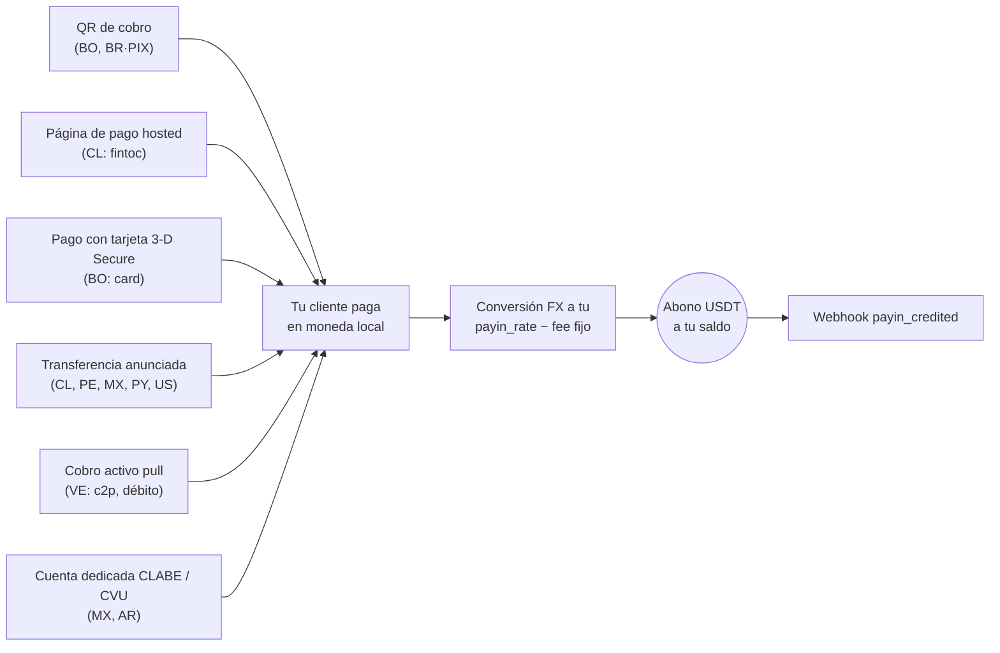

> **Ambientes:** Test `https://cryptobank.qbank.cl/platform` (`pk_test_...`) - Live `https://api.qbank.cl/platform` (`pk_...`).

Un payin es un cobro fiat: tu cliente paga en moneda local y tu cuenta
recibe el abono en USDT automáticamente, convertido a **tu tasa de payin**
(`payin_rate` en `GET /v1/rates`) menos la comisión fija de payin si tu
cuenta la tiene configurada.

Sea cual sea la modalidad, todos los caminos terminan igual — abono
automático + webhook:



## 1. Descubre los corredores disponibles

Los países, monedas y modalidades disponibles los define CBPay.
Consúltalos siempre por catálogo:

```bash
curl https://api.qbank.cl/platform/v1/payins/methods \
  -H "Authorization: Bearer <token>"
```

```json
{
  "items": [
    { "country": "BO", "currency": "BOB", "method": "qr", "delivery": "push" },
    { "country": "VE", "currency": "VES", "method": "c2p", "delivery": "push+polling" },
    { "country": "MX", "currency": "MXN", "method": "bank_transfer", "delivery": "push" }
  ],
  "meta": { "retrieved": 3 }
}
```

`delivery` indica cómo se confirma el pago del lado de CBPay (notificación
del banco, sondeo o ambos) — no cambia nada en tu integración: tú siempre
recibes el webhook `payin_credited`.

Corredores y modalidades de cobro:

| País | Moneda | Modalidades |
|---|---|---|
| Chile | CLP | Página de pago hosted (`fintoc`), transferencia anunciada |
| Perú | PEN | Transferencia anunciada |
| México | MXN | Cuenta CLABE dedicada, transferencia anunciada |
| Venezuela | VES | Cobro activo `c2p` y `debito_inmediato` (pull) |
| Bolivia | BOB / USD | QR de cobro, página de pago con tarjeta (`card`) |
| Paraguay | PYG | Transferencia anunciada |
| Brasil | BRL | QR PIX dinámico |
| Argentina | ARS | Cuenta CVU dedicada |
| Estados Unidos | USD | Página de pago con tarjeta internacional (`card`), transferencia anunciada (dos rieles: wire doméstico + SWIFT internacional) |

La disponibilidad puede variar; el catálogo (`GET /v1/payins/methods`) es
siempre la fuente de verdad. En todos los casos el abono llega igual: se
convierte a USDT a tu `payin_rate` del momento y se acredita neto de la
comisión fija de payin. Si prefieres quedarte con tus cobros en otro saldo
(USDC, BTC o GOLD), configura `default_payin_asset` — ver
[el modelo de dinero](https://docs.cbpayapp.com/es/conceptos/modelo-de-dinero#elige-en-que-saldo-se-acreditan-tus-payins).

## 2. Elige la modalidad y crea el cobro

Cada país tiene su propia modalidad de cobro. El request y la respuesta
real de cada una:

#### Chile

**Página de pago hosted (`fintoc`)** — recomendado: recibes una
`payment_url`; el pagador la abre y transfiere desde **cualquier banco o
billetera chilena** (Banco Estado, Santander, Mach, Tenpo, Mercado
Pago…). El pago se detecta y valida automáticamente — sin referencias
manuales.

```bash
curl -X POST https://api.qbank.cl/platform/v1/payins \
  -H "Authorization: Bearer <token>" \
  -H "Content-Type: application/json" \
  -d '{
    "country": "CL",
    "currency": "CLP",
    "method": "fintoc",
    "amount": "150000",
    "description": "Recarga pedido 8841",
    "idempotency_key": "topup-8841"
  }'
```

Respuesta `201`:

```json
{
  "payin_id": "7a2b…",
  "status": "pending",
  "reference": "7a2b…",
  "payment_url": "https://pay.fintoc.com/plink_K2zwNNSxPyx8w3GZ",
  "expires_at": "2026-07-08T18:48:25Z",
  "note": "share the payment_url with the payer; the deposit is credited automatically once the transfer is detected"
}
```

Comparte la `payment_url` con el pagador (link, redirección o WebView).
Cuando el pago se confirma, tu cuenta se acredita en USDT y recibes el
webhook `payin_credited`. El monto CLP debe ser entero (el peso chileno no
usa decimales) y la sesión de pago vence en 24 horas por defecto. Un retry
con la misma `idempotency_key` devuelve el mismo payin y la misma URL —
nunca abre una segunda sesión de pago.

**Transferencia anunciada** (alternativa manual): anuncias el depósito
entrante y compartes la referencia con quien transfiere.

```bash
curl -X POST https://api.qbank.cl/platform/v1/payins \
  -H "Authorization: Bearer <token>" \
  -H "Content-Type: application/json" \
  -d '{
    "country": "CL",
    "currency": "CLP",
    "method": "bank_transfer",
    "amount": "500000"
  }'
```

Respuesta `201`:

```json
{
  "payin_id": "4f81…",
  "status": "pending",
  "reference": "CBJ6T3W9M2K5",
  "note": "include the reference in the transfer description so the deposit is credited automatically"
}
```

Cuando la transferencia llega, se matchea por la referencia en la glosa y tu
cuenta se acredita automáticamente. Si la referencia no viaja, el documento
del pagador la respalda — ver
[conciliación de una transferencia anunciada](#conciliaci%C3%B3n-de-una-transferencia-anunciada).

#### Perú

**Transferencia anunciada**, igual que Chile pero en soles:

```bash
curl -X POST https://api.qbank.cl/platform/v1/payins \
  -H "Authorization: Bearer <token>" \
  -H "Content-Type: application/json" \
  -d '{
    "country": "PE",
    "currency": "PEN",
    "method": "bank_transfer",
    "amount": "1800.00"
  }'
```

Respuesta `201`:

```json
{
  "payin_id": "6d20…",
  "status": "pending",
  "reference": "CBK7M2Q9X4T3",
  "note": "include the reference in the transfer description so the deposit is credited automatically"
}
```

La `reference` es un **código corto de 12 caracteres alfanuméricos** (cabe
en cualquier concepto bancario) y debe viajar en la descripción de la
transferencia para el match automático. Manda `payer_document` como
respaldo — ver
[cómo se concilia](#conciliaci%C3%B3n-de-una-transferencia-anunciada).

#### México

**Cuenta CLABE dedicada** (recomendado): creas una CLABE fija vinculada a
tu cuenta — todo SPEI que llegue a ella se acredita automáticamente, sin
referencias:

```bash
curl -X POST https://api.qbank.cl/platform/v1/payins/deposit-accounts \
  -H "Authorization: Bearer <token>" \
  -H "Content-Type: application/json" \
  -d '{ "country": "MX", "currency": "MXN" }'
```

Respuesta `201`:

```json
{
  "instrument_id": "a1d4…",
  "account_id": "…",
  "country": "MX",
  "currency": "MXN",
  "method": "bank_transfer",
  "instrument": "734180000151000006",
  "status": "active"
}
```

`instrument` es la CLABE que compartes con tus pagadores. La creación es
gratis; cada depósito paga la comisión de payin normal. Lista tus cuentas
con `GET /v1/payins/deposit-accounts`.

También puedes usar la **transferencia anunciada** puntual
(`POST /v1/payins` con `method: "bank_transfer"`, `country: "MX"`).

#### Venezuela

**Cobro activo (pull)**: cobras directamente al pagador con su
autorización. El resultado es **síncrono** — si el cobro se aprueba, el
abono se acredita en la misma llamada.

Para `debito_inmediato`, primero solicita el OTP (gratis):

```bash
curl -X POST https://api.qbank.cl/platform/v1/payins/collect/otp \
  -H "Authorization: Bearer <token>" \
  -H "Content-Type: application/json" \
  -d '{
    "method": "debito_inmediato",
    "amount": "1200.00",
    "payer_document": "V12345678",
    "payer_phone": "04141234567",
    "payer_bank": "0102",
    "payer_account": "01020123456789012345"
  }'
```

```json
{
  "method": "debito_inmediato",
  "result": { "status": "sent", "otp_reference": "OTP-5521" }
}
```

Luego ejecuta el cobro:

```bash c2p (teléfono + cédula + OTP del pagador)
curl -X POST https://api.qbank.cl/platform/v1/payins/collect \
  -H "Authorization: Bearer <token>" \
  -H "Content-Type: application/json" \
  -d '{
    "method": "c2p",
    "amount": "1200.00",
    "description": "Cobro pedido 5512",
    "payer_document": "V12345678",
    "payer_phone": "04141234567",
    "payer_bank": "0102",
    "otp": "12345678",
    "idempotency_key": "cobro-5512"
  }'
```

```bash debito_inmediato (cuenta + OTP solicitado antes)
curl -X POST https://api.qbank.cl/platform/v1/payins/collect \
  -H "Authorization: Bearer <token>" \
  -H "Content-Type: application/json" \
  -d '{
    "method": "debito_inmediato",
    "amount": "1200.00",
    "description": "Cobro pedido 5512",
    "payer_document": "V12345678",
    "payer_account": "01020123456789012345",
    "payer_bank": "0102",
    "payer_account_type": "CNTA",
    "otp": "87654321",
    "otp_reference": "OTP-5521",
    "idempotency_key": "cobro-5512"
  }'
```

> **Nota**
El cobro activo ejecuta un débito real contra el pagador, así que
`idempotency_key` es **obligatoria** (body o header `Idempotency-Key`): un
reintento con la misma clave devuelve el resultado original con
`idempotency_hit` y nunca vuelve a cobrar.
Respuesta `200` (cobro aprobado y acreditado):

```json
{
  "payin_id": "7b3c…",
  "kind": "collect",
  "method": "c2p",
  "status": "credited",
  "local_amount": "1200.00",
  "fx_rate": "36.50",
  "usdt_gross": "32.876712",
  "fee": "0.300000",
  "usdt_credited": "32.576712",
  "paid": true,
  "provider_reference": "…"
}
```

Si el pagador rechaza o falla la autorización, `paid` es `false`, el payin
queda `failed` y no se cobra nada. La causa exacta del rechazo queda
persistida en el payin y se expone en el objeto `failure` (en la respuesta
síncrona, en `GET /v1/payins/{payin_id}` y en el replay idempotente):

```json
{
  "payin_id": "7b3c…",
  "kind": "collect",
  "method": "c2p",
  "status": "failed",
  "paid": false,
  "failure": {
    "source": "provider",
    "code": "provider_rejected",
    "message": "Documento de identidad del receptor errado"
  }
}
```

- `source` indica dónde se originó el rechazo (`provider` = el banco del
  pagador rechazó; `core` = la validación previa al cobro).
- `code` y `message` traen el motivo concreto (OTP inválida o expirada,
  documento errado, fondos insuficientes del pagador, etc.), útil para
  mostrarle al pagador qué corregir antes de reintentar con una clave
  de idempotencia nueva.

#### Bolivia

**QR de cobro** (estándar interoperable local): generas el QR y tu cliente
lo escanea con su app bancaria.

```bash
curl -X POST https://api.qbank.cl/platform/v1/payins \
  -H "Authorization: Bearer <token>" \
  -H "Content-Type: application/json" \
  -d '{
    "country": "BO",
    "currency": "BOB",
    "method": "qr",
    "amount": "700.00",
    "description": "Recarga app",
    "expires_in": 3600
  }'
```

Respuesta `201`:

```json
{
  "payin_id": "9c2a…",
  "status": "pending",
  "charge": {
    "charge_id": "…",
    "qr_image": "<base64>",
    "qr_image_url": "https://cdn.cbpayapp.com/public/payin-qr/<charge_id>.png",
    "qr_payload": "<contenido del QR>",
    "our_reference": "482915073",
    "status": "pending"
  }
}
```

Muestra el QR a tu cliente — `qr_image_url` es una URL pública de CDN lista
para un `` (prefiérela por sobre el base64 `qr_image`); cuando paga, tu
cuenta se acredita automáticamente. También funciona en USD
(`currency: "USD"`).

**Página de pago con tarjeta (`card`)**: recibes una `payment_url` de un
checkout hosted con 3-D Secure — el pagador ingresa su tarjeta en una página
segura con la marca de tu organización y, si su banco lo exige, completa el
desafío de autenticación ahí mismo. Los datos de la tarjeta nunca pasan por
tu sistema ni por tu integración.

```bash
curl -X POST https://api.qbank.cl/platform/v1/payins \
  -H "Authorization: Bearer <token>" \
  -H "Content-Type: application/json" \
  -d '{
    "country": "BO",
    "currency": "BOB",
    "method": "card",
    "amount": "700.00",
    "description": "Recarga app",
    "customer": { "email": "pagador@ejemplo.com", "first_name": "Ana", "last_name": "Rojas" },
    "success_url": "https://tu-app.com/pago/ok",
    "failure_url": "https://tu-app.com/pago/error",
    "idempotency_key": "recarga-7719"
  }'
```

Respuesta `201`:

```json
{
  "payin_id": "b41c…",
  "status": "pending",
  "reference": "b41c…",
  "payment_url": "https://api.qbank.cl/pay/cards/9f3XkT…",
  "expires_at": "2026-07-16T18:30:00Z",
  "note": "share the payment_url with the payer; the balance is credited automatically once the card payment is approved"
}
```

Comparte la `payment_url` (link, redirección o WebView). Detalles del flujo:

- `customer` es un prefill **opcional** de los datos de facturación
  (`email`, `first_name`, `last_name`, `address`, `city`, `country` —
  texto plano, máx 120 caracteres por campo); el pagador puede
  completarlos/corregirlos en la página.
- `success_url` / `failure_url` (opcionales, https públicas) redirigen al
  pagador al terminar; sin ellas la página muestra el resultado final.
- `expires_at` (opcional, RFC3339, mínimo 15 minutos) acorta la vigencia de
  la sesión; el default es 24 horas. Si vence sin pago, el payin pasa a
  `expired` y recibes el webhook `payin_expired`.
- El pagador tiene un número limitado de intentos; un rechazo del emisor le
  permite reintentar con otra tarjeta dentro de la misma sesión.
- La aprobación es en línea: al aprobarse el cargo tu cuenta se acredita en
  USDT a tu `payin_rate` y recibes `payin_credited` — igual que cualquier
  otra modalidad.
- Un retry con la misma `idempotency_key` devuelve el mismo payin y la misma
  `payment_url`; nunca abre una segunda sesión de pago.
- Si el pagador ya guardó tarjetas contigo, la página se las ofrece sola:
  escribe su correo (primer campo), lo verifica con un código y paga con una
  de ellas sin re-digitarla — con "Recordar este dispositivo" no repite el
  código por 30 días. Detalle en
  [tarjetas guardadas](https://docs.cbpayapp.com/es/guias/stored-cards-subscriptions#el-pagador-descubre-sus-tarjetas-en-la-página-de-pago).
- Funciona también en USD (`currency: "USD"`).
- **Settlement diferido**: cuando la comisión de `payin_card` está
  configurada con `settlement_hours` sobre cero, un cobro aprobado confirma
  el payin como `credited` de inmediato — se emite el webhook
  `payin_credited` y el checkout cierra como pagado — pero el **saldo**
  queda disponible recién al llegar `settle_at` (RFC 3339, presente en las
  respuestas de create/GET/lista junto a `settlement_pending: true`), o
  antes si un org-admin lo libera manualmente; una vez liberado, el payin
  lleva `settled_at`. El webhook `payin_settlement_scheduled` se emite
  exactamente una vez al confirmarse el pago, con `status: "credited"` y
  los montos programados. Detalle en
  [comisiones — settlement de payins con tarjeta](https://docs.cbpayapp.com/es/conceptos/comisiones#settlement-de-payins-con-tarjeta).

#### Paraguay

**Transferencia anunciada** en guaraníes: anuncias el depósito, tu pagador
transfiere (SIPAP interbancaria o transferencia interna del banco receptor)
con la referencia en el concepto, y el abono se detecta automáticamente.

```bash
curl -X POST https://api.qbank.cl/platform/v1/payins \
  -H "Authorization: Bearer <token>" \
  -H "Content-Type: application/json" \
  -d '{
    "country": "PY",
    "currency": "PYG",
    "method": "bank_transfer",
    "amount": "596000"
  }'
```

Respuesta `201`:

```json
{
  "payin_id": "8f41…",
  "status": "pending",
  "reference": "CBW4N8R2T6P9",
  "note": "include the reference in the transfer description so the deposit is credited automatically"
}
```

> **Nota**
Los guaraníes no usan decimales: anuncia el monto **entero exacto** que
transferirá tu pagador (ej. `"596000"`). La `reference` es un código corto
de 12 caracteres alfanuméricos — diseñado para el concepto SIPAP, que
acepta **máximo 20 caracteres sin caracteres especiales** — y ponerla en
el concepto asegura el match automático. Manda `payer_document` como
respaldo — ver
[conciliación de una transferencia anunciada](#conciliaci%C3%B3n-de-una-transferencia-anunciada).
#### Brasil

**QR PIX dinámico**: el mismo endpoint genera un QR PIX con el monto
embebido.

```bash
curl -X POST https://api.qbank.cl/platform/v1/payins \
  -H "Authorization: Bearer <token>" \
  -H "Content-Type: application/json" \
  -d '{
    "country": "BR",
    "currency": "BRL",
    "method": "qr",
    "amount": "120.00",
    "description": "Pedido 7719",
    "expires_in": 1800
  }'
```

En la respuesta, `charge.qr_payload` es el código **"copia e cola"** de
PIX, para que el pagador pueda pegarlo en su app bancaria si no escanea la
imagen (`charge.qr_image` base64 o `charge.qr_image_url`, la URL pública de
CDN). El QR expira según `expires_in` (default 1
hora); el pago se acredita automáticamente al confirmarse en el rail
(conciliación continua — consulta puntual con `GET /v1/payins/{charge_id}`).

> **Nota**
En Brasil el cobro es únicamente por QR PIX dinámico (un QR = un pago, con
monto exacto embebido). La transferencia anunciada llegará más adelante.
#### Argentina

**Cuenta CVU dedicada**: creas una CVU fija vinculada a tu cuenta — toda
transferencia en ARS que llegue a ella (desde cualquier CBU o CVU del
sistema argentino) se acredita automáticamente, sin referencias:

```bash
curl -X POST https://api.qbank.cl/platform/v1/payins/deposit-accounts \
  -H "Authorization: Bearer <token>" \
  -H "Content-Type: application/json" \
  -d '{ "country": "AR", "currency": "ARS" }'
```

Respuesta `201`:

```json
{
  "instrument_id": "f2b8…",
  "account_id": "…",
  "country": "AR",
  "currency": "ARS",
  "method": "bank_transfer",
  "instrument": "0000079900000000132537",
  "status": "active"
}
```

`instrument` es la CVU de 22 dígitos que compartes con tus pagadores. La
creación es gratis; cada depósito paga la comisión de payin normal. Lista
tus cuentas con `GET /v1/payins/deposit-accounts`.

> **Nota**
La CVU opera **solo en ARS** y es de depósito (receive-only): ningún
tercero puede debitarla. Los intentos de débito directo (DEBIN) contra
una CVU de depósito se rechazan automáticamente.
#### Estados Unidos

**Página de pago con tarjeta internacional (`card`)**: cobra en dólares con
tarjetas Visa, Mastercard, American Express, Discover y Diners emitidas en
cualquier país. Recibes una `payment_url` de un checkout hosted con 3-D
Secure y la marca de tu organización; los datos de la tarjeta se ingresan en
campos seguros del procesador embebidos en esa página y **nunca pasan por tu
sistema ni por tu integración**.

```bash
curl -X POST https://api.qbank.cl/platform/v1/payins \
  -H "Authorization: Bearer <token>" \
  -H "Content-Type: application/json" \
  -d '{
    "country": "US",
    "currency": "USD",
    "method": "card",
    "amount": "49.90",
    "description": "Plan Pro",
    "customer": { "email": "pagador@ejemplo.com", "first_name": "Ana", "last_name": "Rojas" },
    "success_url": "https://tu-app.com/pago/ok",
    "failure_url": "https://tu-app.com/pago/error",
    "save_card": true,
    "payer_reference": "cliente-7719",
    "idempotency_key": "plan-pro-7719"
  }'
```

Respuesta `201`:

```json
{
  "payin_id": "3ab7…",
  "status": "pending",
  "reference": "3ab7…",
  "payment_url": "https://api.qbank.cl/pay/cards/Kt9XmQ…",
  "expires_at": "2026-07-26T18:30:00Z",
  "note": "share the payment_url with the payer; the balance is credited automatically once the card payment is approved"
}
```

El contrato es el **mismo** que el de la página de tarjeta de Bolivia
(`customer` opcional, `success_url`/`failure_url`, `expires_at`, intentos
limitados, retry idempotente devuelve la misma `payment_url`). Diferencias
propias del corredor internacional:

- El 3-D Secure lo ejecuta el procesador dentro de la página: si el emisor
  pide desafío, el pagador lo completa ahí mismo sin salir del checkout.
- La mayoría de los cargos se aprueba en línea; si el emisor deja el cargo
  en verificación, el abono se acredita en cuanto el rail lo confirma —
  recibes `payin_credited` igual, solo con unos minutos de diferencia.
- `save_card: true` + `payer_reference` guardan la tarjeta con el
  consentimiento del pagador para cobros posteriores (ver
  [tarjetas guardadas y suscripciones](https://docs.cbpayapp.com/es/guias/stored-cards-subscriptions)).
- Si el pagador ya tiene tarjetas guardadas, la página se las ofrece tras
  verificar su correo con un código (una sola vez por dispositivo si marca
  "Recordar este dispositivo", vigente 30 días) — paga con 3-D Secure sin
  re-digitar la tarjeta.

> **Nota**
El corredor de tarjetas internacionales se habilita por cuenta. Consulta
`GET /v1/payins/methods` — es la fuente de verdad de lo que tu cuenta
puede cobrar hoy.
**Transferencia anunciada (`bank_transfer`) — dos rieles: wire doméstico y SWIFT internacional**: cobra dólares
desde cualquier cuenta bancaria de EE. UU., con el mismo contrato de
transferencia anunciada de los otros países. El corredor US/USD publica
**dos instrucciones de depósito** a propósito — un riel doméstico (routing
number ABA) para pagadores que bancan dentro de EE. UU., y un riel
internacional (SWIFT/BIC a través de un banco corresponsal) para pagadores
que envían desde el extranjero. Anuncias el depósito una sola vez y la
respuesta trae ambos bloques — `deposit_instructions` (doméstico) y
`deposit_instructions_swift` (internacional) — cada uno con su propio QR
para copiar, así tu pagador elige el riel que su banco soporta:

```bash
curl -X POST https://api.qbank.cl/platform/v1/payins \
  -H "Authorization: Bearer <token>" \
  -H "Content-Type: application/json" \
  -d '{
    "country": "US",
    "currency": "USD",
    "method": "bank_transfer",
    "amount": "1250.00",
    "payer_name": "Acme Holdings LLC",
    "idempotency_key": "factura-1042"
  }'
```

Respuesta `201`:

#### Wire doméstico (ABA)

```json
{
  "payin_id": "8f4e…",
  "status": "pending",
  "reference": "CBM4X8Q2T7K9",
  "note": "incluye la referencia en la descripción de la transferencia para que el depósito se acredite automáticamente",
  "payer_source": "declared",
  "payer_name": "Acme Holdings LLC",
  "deposit_instructions": {
    "bank_name": "Partner Bank, N.A.",
    "account_number": "000123456789",
    "account_type": "checking",
    "holder_name": "CBPay Operations LLC",
    "holder_tax_id": "88-1234567",
    "routing_number": "021000021",
    "holder_address": "25 SW 9th Street, Suite 406, Miami, FL 33130, US",
    "reference_required": true,
    "qr_payload": "Bank: Partner Bank, N.A.\nAccount type: checking\nAccount number: 000123456789\nRouting number (ABA): 021000021\nHolder: CBPay Operations LLC\nHolder address: 25 SW 9th Street, Suite 406, Miami, FL 33130, US\nTax ID: 88-1234567\nAmount: 1250.00 USD\nReference: CBM4X8Q2T7K9",
    "qr_png_base64": "iVBORw0KGgoAAAANSUhEUgAA…"
  }
}
```

Para pagadores que bancan **dentro de EE. UU.**: un wire doméstico (o ACH)
con el `routing_number` (ABA). Este riel no tiene código SWIFT — las
transferencias domésticas de EE. UU. no lo necesitan.

#### SWIFT internacional (BIC)

```json
{
  "payin_id": "8f4e…",
  "status": "pending",
  "reference": "CBM4X8Q2T7K9",
  "note": "incluye la referencia en la descripción de la transferencia para que el depósito se acredite automáticamente",
  "payer_source": "declared",
  "payer_name": "Acme Holdings LLC",
  "deposit_instructions_swift": {
    "bank_name": "Partner Bank International",
    "account_number": "9870001234",
    "account_type": "checking",
    "holder_name": "CBPay Operations LLC",
    "holder_tax_id": "88-1234567",
    "swift": "PRTBPRI3",
    "bank_address": "200 Example Blvd, San Juan, PR 00901, PR",
    "intermediary_bank_name": "Intermediary Bank N.A.",
    "intermediary_bank_swift": "INTRUS33",
    "holder_address": "25 SW 9th Street, Suite 406, Miami, FL 33130, US",
    "notes": "Select Puerto Rico as the final beneficiary bank country",
    "reference_required": true,
    "qr_payload": "Bank: Partner Bank International\nAccount type: checking\nAccount number: 9870001234\nSWIFT: PRTBPRI3\nBank address: 200 Example Blvd, San Juan, PR 00901, PR\nIntermediary bank: Intermediary Bank N.A.\nIntermediary SWIFT: INTRUS33\nHolder: CBPay Operations LLC\nHolder address: 25 SW 9th Street, Suite 406, Miami, FL 33130, US\nTax ID: 88-1234567\nAmount: 1250.00 USD\nReference: CBM4X8Q2T7K9\nNote: Select Puerto Rico as the final beneficiary bank country",
    "qr_png_base64": "iVBORw0KGgoAAAANSUhEUgAA…"
  }
}
```

Para pagadores que envían **desde fuera de EE. UU.**: una transferencia
internacional SWIFT con el `swift` (BIC) y el banco corresponsal
(`intermediary_bank_name` / `intermediary_bank_swift`). El campo `notes`
lleva las indicaciones operativas que el banco emisor necesita para llenar
su formulario correctamente (aquí: qué país seleccionar como banco
beneficiario final) — muéstralo al pagador tal cual viene.

El pagador copia la `reference` (`CB…`) en el campo **memo / remittance**
de la transferencia, use el riel que use: es la señal que enlaza el abono
con tu anuncio (ver
[conciliación de una transferencia anunciada](#conciliaci%C3%B3n-de-una-transferencia-anunciada)).
`holder_address` es la dirección postal del titular de la cuenta — los
bancos de EE. UU. la piden en su formulario de wire, y el QR de cada riel la
incluye como línea "Holder address" cuando tiene valor (lo mismo para
`notes` como línea "Note"). `intermediary_bank_name` /
`intermediary_bank_swift` aparecen solo en el riel que recibe wires a través
de un banco corresponsal — muéstralos al pagador tal cual vienen; un wire
que los necesita y viaja sin ellos puede rebotar o llegar con monto menor.

Las instrucciones de depósito de EE. UU. son **obligatorias** en este
corredor: si tu organización todavía no las configuró, el anuncio responde
`422 deposit_instructions_unavailable` y no se crea nada (ver
[errores comunes](#errores-comunes)). Puedes previsualizar ambas cuentas de
destino sin anunciar con
`GET /v1/payins/deposit-instructions?country=US&currency=USD&method=bank_transfer`.

## Link de cobro universal (`checkout`)

El link de cobro universal ahora tiene su propia guía, con el cotizador,
todos los rieles y los endpoints públicos:

- **Checkout** - Un solo link donde el pagador elige cómo pagar — fiat en todos los países activos, crypto, tarjeta o la app CBPay — liquidado en el saldo que elijas.

## Tarjetas guardadas y cobros recurrentes (tarjeta)

Las credenciales guardadas (COF) y las suscripciones agendadas ahora tienen
su propia guía:

- **Tarjetas guardadas y suscripciones** - Guarda tarjetas con consentimiento del pagador, cóbralas con un clic o sin el pagador presente, y agenda suscripciones recurrentes.

## Devoluciones (tarjeta)

Un cobro con tarjeta ya acreditado se devuelve total o parcialmente desde tu
saldo, con su asiento en la cartola, comprobante y webhook:

- **Devoluciones de cobros** - Devuelve total o parcialmente un cobro con tarjeta, anula un cargo del día y entiende cómo se aplica un contracargo.

## Conciliación de una transferencia anunciada

Una transferencia anunciada (`method: "bank_transfer"`) no tiene sesión de
pago: el pagador mueve la plata desde su propio banco, así que el depósito se
reconoce cuando llega. La conciliación corre en este orden y se detiene en el
primer acierto:

1. **`reference`** — el código de 12 caracteres en la glosa de la
   transferencia.
2. **Documento del pagador** — el `payer_document` del anuncio contra el
   pagador que reporta el banco (puntos, guiones y dígito verificador se
   ignoran).
3. **Candidato único** — exactamente un anuncio pendiente por ese monto y
   moneda.

> **Importante**
Si ninguno de los tres resuelve a **un** anuncio — dos anuncios pendientes
por el mismo monto, sin referencia y sin documento del pagador — el depósito
**no** se acredita por adivinanza: queda `unassigned` y tu operador CBPay lo
enruta. Nada se pierde; la plata ya está en la cuenta recaudadora.
### Identificar al pagador (opcional, recomendado)

`method: "bank_transfer"` acepta los datos del pagador. Todos los campos son
opcionales y aditivos — las integraciones existentes siguen funcionando igual:

| Campo | Se compara contra |
|---|---|
| `payer_document` | RUT / documento que reporta el banco (puntos, guiones y dígito verificador se ignoran) |
| `payer_name` | Nombre del pagador, por tokens (`JUAN PEREZ` calza con `PEREZ JUAN SOTO`) |
| `payer_account` | Número de cuenta del pagador, por sus dígitos |

```bash Request
curl -X POST https://api.qbank.cl/platform/v1/payins \
  -H "Authorization: Bearer <token>" \
  -H "Content-Type: application/json" \
  -d '{
    "country": "CL",
    "currency": "CLP",
    "method": "bank_transfer",
    "amount": "500000",
    "payer_document": "17438319-7"
  }'
```

```json Response 201
{
  "payin_id": "4f81…",
  "status": "pending",
  "reference": "CBJ6T3W9M2K5",
  "note": "include the reference in the transfer description so the deposit is credited automatically",
  "payer_source": "declared",
  "payer_document": "17438319-7"
}
```
`payer_source` viene SIEMPRE en la respuesta para que tu checkout sepa qué
pedirle al pagador:

| Valor | Significado |
|---|---|
| `declared` | Mandaste datos del pagador — el documento respalda la referencia |
| `account_identity` | No mandaste pagador: se usa el RUT verificado de tu cuenta (el titular se deposita a sí mismo) |
| `none` | Sin identidad disponible — **insiste en la referencia**, es la única señal fuerte que queda |

> **Nota**
Un documento de menos de 5 caracteres o sin dígitos se descarta como señal
(no se puede distinguir de un monto o un código de banco). El anuncio se crea
igual y `payer_source` reporta la cobertura real.
### Reintentos e idempotencia

El anuncio acepta `idempotency_key` (en el body) o el header
`Idempotency-Key`. Un reintento con la MISMA clave devuelve el anuncio
**original** — misma `reference` — con `idempotency_hit: true` y HTTP `200`,
en vez de crear un segundo anuncio.

```bash Request (reintento)
curl -X POST https://api.qbank.cl/platform/v1/payins \
  -H "Authorization: Bearer <token>" \
  -H "Content-Type: application/json" \
  -H "Idempotency-Key: topup-9912" \
  -d '{
    "country": "CL",
    "currency": "CLP",
    "method": "bank_transfer",
    "amount": "500000",
    "payer_document": "17438319-7"
  }'
```

```json Response 200
{
  "payin_id": "4f81…",
  "status": "pending",
  "reference": "CBJ6T3W9M2K5",
  "note": "include the reference in the transfer description so the deposit is credited automatically",
  "payer_source": "declared",
  "payer_document": "17438319-7",
  "idempotency_hit": true
}
```
> **Importante**
Dos anuncios vivos idénticos (misma cuenta, moneda, monto y pagador) son
justo el caso que la conciliación se niega a resolver: el depósito real
calza con ambos y queda `unassigned`. Por eso un POST **sin** clave reutiliza
un anuncio vivo idéntico en lugar de duplicarlo (también `200` con
`idempotency_hit: true`).

Para cobrar **dos pagos reales** del mismo monto al mismo pagador, manda una
`idempotency_key` distinta en cada uno — cada clave crea su anuncio con su
propia `reference`.
> **Nota**
Las claves son **únicas por cuenta y por operación lógica**: si reutilizas una
`idempotency_key` que ya usaste con OTRO método de payin (QR, checkout,
tarjeta), la API responde `409 idempotency_conflict` en vez de devolverte un
objeto que no corresponde.
### Instrucciones de depósito: a dónde transferir

En los corredores donde tu organización registró una cuenta de destino para
transferencias anunciadas (hoy Chile, Paraguay y Estados Unidos), la
respuesta del anuncio
incluye un bloque `deposit_instructions` — la cuenta bancaria exacta a la
que el pagador debe transferir, con el monto y la `reference` ya incrustados
en un QR para copiar:

```json Respuesta 201 (con instrucciones de depósito)
{
  "payin_id": "4f81…",
  "status": "pending",
  "reference": "CBJ6T3W9M2K5",
  "note": "incluye la referencia en la descripción de la transferencia para que el depósito se acredite automáticamente",
  "payer_source": "declared",
  "payer_document": "17438319-7",
  "deposit_instructions": {
    "bank_name": "Banco Ejemplo",
    "account_number": "001122334455",
    "account_type": "checking",
    "holder_name": "CBPay Operations SpA",
    "holder_tax_id": "77123456-7",
    "reference_required": true,
    "qr_payload": "Bank: Banco Ejemplo\nAccount type: checking\nAccount number: 001122334455\nHolder: CBPay Operations SpA\nTax ID: 77123456-7\nAmount: 500000 CLP\nReference: CBJ6T3W9M2K5",
    "qr_png_base64": "iVBORw0KGgoAAAANSUhEUgAA…"
  }
}
```

También puedes previsualizar la cuenta de destino **antes** de crear un
payin — útil para mostrarle al pagador a dónde tendrá que transferir una vez
que confirme:

```bash
curl "https://api.qbank.cl/platform/v1/payins/deposit-instructions?country=CL&currency=CLP&method=bank_transfer" \
  -H "Authorization: Bearer <token>"
```

```json Respuesta 200
{
  "deposit_instructions": {
    "bank_name": "Banco Ejemplo",
    "account_number": "001122334455",
    "account_type": "checking",
    "holder_name": "CBPay Operations SpA",
    "holder_tax_id": "77123456-7",
    "reference_required": true,
    "qr_payload": "Bank: Banco Ejemplo\nAccount type: checking\nAccount number: 001122334455\nHolder: CBPay Operations SpA\nTax ID: 77123456-7",
    "qr_png_base64": "iVBORw0KGgoAAAANSUhEUgAA…"
  }
}
```

En el corredor **US/USD** el preview devuelve **dos bloques**: el riel
doméstico bajo `deposit_instructions` y, cuando tu organización tiene
configurada la variante internacional, el riel SWIFT bajo
`deposit_instructions_swift` (mismo shape, con su propio QR). Los campos de
riel están ausentes (no vacíos) en los corredores que no los usan:

| Campo | Qué es |
|---|---|
| `routing_number` | Routing number ABA del banco destino — riel doméstico (`deposit_instructions`) |
| `swift` | SWIFT/BIC del banco destino — riel internacional (`deposit_instructions_swift`) |
| `bank_address` | Dirección registrada del banco destino |
| `intermediary_bank_name` | Banco corresponsal, cuando los wires llegan a través de uno |
| `intermediary_bank_swift` | SWIFT/BIC del banco corresponsal |
| `holder_address` | Dirección postal del titular de la cuenta (los formularios de wire de EE. UU. la piden) |
| `notes` | Nota operativa libre para el banco emisor (ej. qué país seleccionar como banco beneficiario final) |

```bash
curl "https://api.qbank.cl/platform/v1/payins/deposit-instructions?country=US&currency=USD&method=bank_transfer" \
  -H "Authorization: Bearer <token>"
```

```json Respuesta 200 (US)
{
  "deposit_instructions": {
    "bank_name": "Partner Bank, N.A.",
    "account_number": "000123456789",
    "account_type": "checking",
    "holder_name": "CBPay Operations LLC",
    "holder_tax_id": "88-1234567",
    "routing_number": "021000021",
    "holder_address": "25 SW 9th Street, Suite 406, Miami, FL 33130, US",
    "reference_required": true,
    "qr_payload": "Bank: Partner Bank, N.A.\nAccount type: checking\nAccount number: 000123456789\nRouting number (ABA): 021000021\nHolder: CBPay Operations LLC\nHolder address: 25 SW 9th Street, Suite 406, Miami, FL 33130, US\nTax ID: 88-1234567",
    "qr_png_base64": "iVBORw0KGgoAAAANSUhEUgAA…"
  },
  "deposit_instructions_swift": {
    "bank_name": "Partner Bank International",
    "account_number": "9870001234",
    "account_type": "checking",
    "holder_name": "CBPay Operations LLC",
    "holder_tax_id": "88-1234567",
    "swift": "PRTBPRI3",
    "bank_address": "200 Example Blvd, San Juan, PR 00901, PR",
    "intermediary_bank_name": "Intermediary Bank N.A.",
    "intermediary_bank_swift": "INTRUS33",
    "holder_address": "25 SW 9th Street, Suite 406, Miami, FL 33130, US",
    "notes": "Select Puerto Rico as the final beneficiary bank country",
    "reference_required": true,
    "qr_payload": "Bank: Partner Bank International\nAccount type: checking\nAccount number: 9870001234\nSWIFT: PRTBPRI3\nBank address: 200 Example Blvd, San Juan, PR 00901, PR\nIntermediary bank: Intermediary Bank N.A.\nIntermediary SWIFT: INTRUS33\nHolder: CBPay Operations LLC\nHolder address: 25 SW 9th Street, Suite 406, Miami, FL 33130, US\nTax ID: 88-1234567\nNote: Select Puerto Rico as the final beneficiary bank country",
    "qr_png_base64": "iVBORw0KGgoAAAANSUhEUgAA…"
  }
}
```

> **Nota**
El `qr_payload` del endpoint de preview no lleva las líneas `Amount`/
`Reference` (todavía no existe el payin); el que va embebido en un anuncio
real siempre las lleva, así el pagador puede pagar sin escribir nada a mano.
Ambos bloques del anuncio son una **fotografía congelada**: si tu operador
CBPay actualiza después una cuenta registrada, los anuncios ya vivos siguen
apuntando a la cuenta con la que se crearon — solo los nuevos toman el
cambio.
Los mismos bloques `deposit_instructions` (y `deposit_instructions_swift`,
cuando existe) se repiten en
`GET /v1/payins/{id}` y en el listado (`GET /v1/payins`), así tu front no
necesita cachearlo de la respuesta de creación. En corredores sin cuenta de
destino registrada, el campo simplemente está ausente — en ese caso muestra
la `reference` y pídele al pagador que use los datos bancarios habituales de
tu organización.

## 3. Recibe el abono

Cuando el pago llega (por cualquiera de las modalidades), tu cuenta se
acredita automáticamente y se emite el webhook `payin_credited`:

```json
{
  "payin_id": "9c2a…",
  "account_id": "…",
  "country": "BO",
  "currency": "BOB",
  "local_amount": "700.00",
  "fx_rate": "6.91",
  "usdt_credited": "100.302460",
  "fee": "1.000000"
}
```

`fx_rate` es tu `payin_rate` del momento del abono — la conversión se hace
exactamente a esa tasa: `usdt_gross = 700.00 / 6.91`.

El objeto payin queda con el detalle completo:

```bash
curl https://api.qbank.cl/platform/v1/payins/9c2a… \
  -H "Authorization: Bearer <token>"
```

```json
{
  "payin_id": "9c2a…",
  "kind": "qr",
  "status": "credited",
  "local_amount": "700.00",
  "fx_rate": "6.91",
  "usdt_gross": "101.302460",
  "fee": "1.000000",
  "usdt_credited": "100.302460"
}
```

## Estados

| Estado | Significado |
|---|---|
| `pending` | Cargo creado, esperando el pago |
| `credited` | Pago recibido y abonado en USDT |
| `unassigned` | Depósito recibido sin match automático (lo asigna el administrador) |
| `expired` | El cargo venció sin pago |
| `failed` | El cobro falló |

> **Nota**
Un depósito que no se puede resolver a un único anuncio queda `unassigned`
hasta que el equipo de CBPay lo asigna a una cuenta (ver
[conciliación de una transferencia anunciada](#conciliaci%C3%B3n-de-una-transferencia-anunciada)).
Al asignarse, se acredita con la tasa y comisiones de la cuenta destino, y el
anuncio al que pertenecía se cierra.
> **Nota**
Cuando un cobro activo (QR o checkout) muere sin pago, el payin pasa de
`pending` a `expired` (o `failed`) automáticamente y recibes el webhook
[`payin_expired`](https://docs.cbpayapp.com/es/webhooks). No se mueve dinero: si quieres reintentar
el cobro, crea un payin nuevo.
## Consulta e historial

```bash
# Un payin
curl https://api.qbank.cl/platform/v1/payins/9c2a… \
  -H "Authorization: Bearer <token>"

# Historial con filtros
curl "https://api.qbank.cl/platform/v1/payins?from=2026-07-01&to=2026-07-08&status=credited&country=BO&page_size=50" \
  -H "Authorization: Bearer <token>"
```

`from`/`to` van en `YYYY-MM-DD` (zona horaria de tu organización); fecha inválida responde
`400 invalid_range`.

## Errores frecuentes

| HTTP | `error` | Qué hacer |
|---|---|---|
| 400 | `invalid_request` | Revisa `method` (qr, bank_transfer, fintoc, card; collect va en su endpoint) |
| 400 | `idempotency_key_required` | El collect exige clave de idempotencia (débito real al pagador) |
| 403 | `service_disabled` | Payins no está habilitado para tu cuenta — ver [servicios](https://docs.cbpayapp.com/es/conceptos/servicios) |
| 422 | `core_rejected` | El procesador rechazó el cargo; revisa el mensaje |
| 422 | `deposit_instructions_unavailable` | `bank_transfer` en un corredor que exige una cuenta de destino registrada (hoy CL, PY, US) y tu organización todavía no configuró una — contacta a tu operador CBPay |
| 502 | `core_unavailable` | No se pudo crear el cargo; reintenta la creación (no se cobró nada) |

> **Nota**
`GET /v1/payins/deposit-instructions` responde `404 not_found` cuando el
corredor no tiene una cuenta de destino activa configurada — trátalo igual
que el `422` de arriba: todavía no puedes mostrarle una cuenta al pagador.
## FAQ

#### ¿Cómo sé que un payin se acreditó?
Suscríbete a `payin_credited`: trae la tasa FX aplicada, la comisión y el
`usdt_credited` exacto. También puedes consultar `GET /v1/payins/{id}`.
#### ¿Qué tasa FX aplica a mi payin?
El `payin_rate` vigente al momento de acreditar (ver `GET /v1/rates`). Tu
spread acordado ya viene dentro de la tasa — nunca se itemiza.
#### ¿Los payins pueden caer en un saldo distinto de USDT?
Sí — configura `default_payin_asset` con `PUT /v1/settlement`. El crédito
sigue entrando en USDT y se convierte inmediatamente después a precio real;
`conversion_status` reporta `done` o `pending_retry` (se reintenta solo).
#### ¿Qué pasa cuando un cobro (QR, checkout) expira sin pago?
Recibes `payin_expired` y el payin se cierra sin mover dinero. Crea un
cobro nuevo — nada se debitó ni acreditó.
#### El pagador transfirió un monto distinto al anunciado, ¿qué pasa?
La referencia sigue calzando con el anuncio, pero se acredita el monto que
llegó. Una transferencia que no resuelve a ningún anuncio queda `unassigned`
para conciliación; tu equipo CBPay puede asignarla manualmente al payin
correcto.
#### Dos clientes anunciaron el mismo monto y ninguno puso la referencia, ¿a quién se le abona?
A nadie por azar. Si el documento del pagador no los distingue, ambos anuncios
quedan `pending` y el depósito queda `unassigned` para que el operador lo
enrute. Mandar `payer_document` en el anuncio es lo que convierte este caso en
un abono automático.
#### ¿Ahora tengo que mandar payer_document?
No — es opcional y nada se rompe sin él. Si lo omites, se usa el RUT
verificado de la cuenta (`payer_source: account_identity`), que cubre los
depósitos del propio titular. Mándalo cuando un tercero pague por tu cliente,
y muéstrale SIEMPRE la `reference` al pagador.
#### Reintenté el POST del anuncio, ¿creé dos anuncios?
No. Con `idempotency_key` (body o header `Idempotency-Key`) el reintento
devuelve el anuncio original con `idempotency_hit: true`. Incluso sin clave,
un POST idéntico a un anuncio vivo (misma cuenta, moneda, monto y pagador)
lo reutiliza — duplicarlo dejaría el depósito real `unassigned` por
ambigüedad. Manda claves distintas solo cuando de verdad quieras cobrar dos
veces.
#### ¿Por qué falló mi cobro collect (pull)?
La respuesta y `GET /v1/payins/{id}` persisten un bloque `failure` con el
código y mensaje del riel (por ejemplo, un documento que no calza con el
registro bancario del pagador). Corrige el dato y reintenta con clave
nueva.
#### ¿Cómo paga mi cliente de EE. UU. — wire doméstico o SWIFT internacional?
El corredor publica dos cuentas de destino a propósito, y tu pagador elige
el riel que su banco soporta: quienes bancan **dentro de EE. UU.** usan el
riel doméstico (`deposit_instructions`) con el `routing_number` (ABA) — un
Fedwire o ACH; quienes envían **desde fuera de EE. UU.** usan el riel
internacional (`deposit_instructions_swift`) con el `swift` (BIC), el banco
corresponsal (`intermediary_bank_name` / `intermediary_bank_swift`) y las
indicaciones de `notes` para el formulario del wire. Cualquiera sea el riel,
la `reference` (`CB…`) en el campo memo / remittance es lo que acredita el
depósito automáticamente. Un wire se reporta normalmente el mismo día hábil;
un ACH puede tardar de uno a tres días hábiles según el banco emisor — el
crédito y el webhook `payin_credited` ocurren en cuanto el banco reporta el
abono.
#### ¿Por qué el QR bancario es solo texto para copiar y no algo que mi app bancaria escanea?
Los bancos no comparten un estándar de QR común para cuentas de destino
arbitrarias (a diferencia de un QR de comercio en un checkout) — cada banco
codifica las transferencias de forma distinta, y la mayoría de las apps
bancarias no puede auto-completar una transferencia desde un QR de un
tercero. `qr_png_base64` renderiza los datos de la cuenta como QR
únicamente como **atajo de copiado en el celular**: el pagador lo escanea,
obtiene el texto multilínea (banco, cuenta, titular, monto, referencia) y lo
pega en el formulario de transferencia de SU banco — la transferencia la
confirma él mismo. No construyas un flujo de escanear-y-pagar alrededor de
esto; muéstralo junto a los campos en texto plano para que el pagador
siempre pueda escribirlos a mano.
