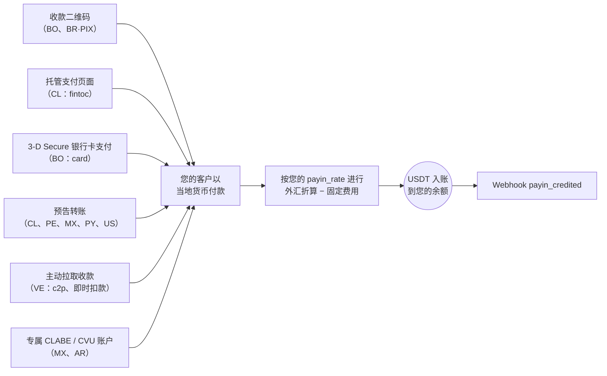

> **环境：** 测试 `https://cryptobank.qbank.cl/platform` (`pk_test_...`) - 正式 `https://api.qbank.cl/platform` (`pk_...`).

入金（payin）是一笔法币收款：您的客户以当地货币付款，您的账户自动获得
USDT 入账，按**您的入金汇率**（`GET /v1/rates` 中的 `payin_rate`）折算，
并在您的账户配置了固定入金费用时予以扣除。

无论采用哪种模式，每条路径的终点都相同 —— 自动入账 + webhook：



## 1. 查询可用通道

可用的国家、货币和收款模式由 CBPay 定义。请始终查询目录：

```bash
curl https://api.qbank.cl/platform/v1/payins/methods \
  -H "Authorization: Bearer <token>"
```

```json
{
  "items": [
    { "country": "BO", "currency": "BOB", "method": "qr", "delivery": "push" },
    { "country": "VE", "currency": "VES", "method": "c2p", "delivery": "push+polling" },
    { "country": "MX", "currency": "MXN", "method": "bank_transfer", "delivery": "push" }
  ],
  "meta": { "retrieved": 3 }
}
```

`delivery` 描述付款在 CBPay 一侧的确认方式（银行通知、轮询或两者兼有）
—— 它不会改变您的任何集成方式：您始终会收到 `payin_credited` webhook。

收款通道和模式：

| 国家 | 货币 | 模式 |
|---|---|---|
| 智利 | CLP | 托管支付页面（`fintoc`）、预告银行转账 |
| 秘鲁 | PEN | 预告银行转账 |
| 墨西哥 | MXN | 专属 CLABE 账户、预告银行转账 |
| 委内瑞拉 | VES | 主动收款 `c2p` 和 `debito_inmediato`（拉取式） |
| 玻利维亚 | BOB / USD | 收款二维码、银行卡支付页面（`card`） |
| 巴拉圭 | PYG | 预告银行转账 |
| 巴西 | BRL | 动态 PIX 二维码 |
| 阿根廷 | ARS | 专属 CVU 账户 |
| 美国 | USD | 国际银行卡支付页面（`card`）、预告银行转账（两条轨道：境内电汇 + 国际 SWIFT） |

可用性可能变化；目录（`GET /v1/payins/methods`）始终是唯一可信来源。
在所有情况下入账方式相同：按您当前的 `payin_rate` 折算为 USDT，并在
扣除固定入金费用后净额入账。如果您希望将收款保留在其他余额（USDC、BTC
或 GOLD），请配置 `default_payin_asset` — 参见
[资金模型](https://docs.cbpayapp.com/zh/concepts/money-model)。

## 2. 选择模式并创建收款

每个国家都有自己的收款模式。各模式的真实请求与响应如下：

#### 智利

**托管支付页面（`fintoc`）** —— 推荐：您会获得一个 `payment_url`；
付款人打开它后可从**任意智利银行或钱包**（Banco Estado、Santander、
Mach、Tenpo、Mercado Pago……）转账。付款会被自动检测并校验 ——
无需手动填写参考号。

```bash
curl -X POST https://api.qbank.cl/platform/v1/payins \
  -H "Authorization: Bearer <token>" \
  -H "Content-Type: application/json" \
  -d '{
    "country": "CL",
    "currency": "CLP",
    "method": "fintoc",
    "amount": "150000",
    "description": "Top-up order 8841",
    "idempotency_key": "topup-8841"
  }'
```

响应 `201`：

```json
{
  "payin_id": "7a2b…",
  "status": "pending",
  "reference": "7a2b…",
  "payment_url": "https://pay.fintoc.com/plink_K2zwNNSxPyx8w3GZ",
  "expires_at": "2026-07-08T18:48:25Z",
  "note": "share the payment_url with the payer; the deposit is credited automatically once the transfer is detected"
}
```

将 `payment_url` 分享给付款人（链接、重定向或 WebView）。付款确认后，
您的账户即以 USDT 入账，并收到 `payin_credited` webhook。CLP 金额必须为
整数（智利比索没有小数位），支付会话默认在 24 小时后过期。使用相同的
`idempotency_key` 重试会返回同一笔入金和同一个 URL —— 绝不会开启第二个
支付会话。

**预告银行转账**（手动的替代方案）：预先申报即将到来的存款，并把
参考号分享给汇款人。

```bash
curl -X POST https://api.qbank.cl/platform/v1/payins \
  -H "Authorization: Bearer <token>" \
  -H "Content-Type: application/json" \
  -d '{
    "country": "CL",
    "currency": "CLP",
    "method": "bank_transfer",
    "amount": "500000"
  }'
```

响应 `201`：

```json
{
  "payin_id": "4f81…",
  "status": "pending",
  "reference": "CBJ6T3W9M2K5",
  "note": "include the reference in the transfer description so the deposit is credited automatically"
}
```

转账到达后，系统会根据转账附言中的参考号进行匹配，您的账户即自动入账。
若参考号未随转账传递，付款人证件号可作为后备依据 — 参见
[预告转账的匹配规则](#预告转账的匹配规则)。

#### 秘鲁

**预告银行转账**，与智利相同，但使用索尔：

```bash
curl -X POST https://api.qbank.cl/platform/v1/payins \
  -H "Authorization: Bearer <token>" \
  -H "Content-Type: application/json" \
  -d '{
    "country": "PE",
    "currency": "PEN",
    "method": "bank_transfer",
    "amount": "1800.00"
  }'
```

响应 `201`：

```json
{
  "payin_id": "6d20…",
  "status": "pending",
  "reference": "CBK7M2Q9X4T3",
  "note": "include the reference in the transfer description so the deposit is credited automatically"
}
```

`reference` 是一个**12 位字母数字短代码**（可放入任何银行的附言字段），
必须随转账附言一起传递以便自动匹配。建议同时传 `payer_document` 作为后备 —
参见[预告转账的匹配规则](#预告转账的匹配规则)。

#### 墨西哥

**专属 CLABE 账户**（推荐）：创建一个与您的账户绑定的固定 CLABE ——
到达该账户的每一笔 SPEI 都会自动入账，无需任何参考号：

```bash
curl -X POST https://api.qbank.cl/platform/v1/payins/deposit-accounts \
  -H "Authorization: Bearer <token>" \
  -H "Content-Type: application/json" \
  -d '{ "country": "MX", "currency": "MXN" }'
```

响应 `201`：

```json
{
  "instrument_id": "a1d4…",
  "account_id": "…",
  "country": "MX",
  "currency": "MXN",
  "method": "bank_transfer",
  "instrument": "734180000151000006",
  "status": "active"
}
```

`instrument` 就是您分享给付款人的 CLABE。创建免费；每笔存款按常规入金
费用计费。使用 `GET /v1/payins/deposit-accounts` 列出您的账户。

您也可以使用一次性的**预告银行转账**
（`POST /v1/payins`，`method: "bank_transfer"`、`country: "MX"`）。

#### 委内瑞拉

**主动收款（拉取式）**：在获得付款人授权后直接向其发起扣款。结果为
**同步**返回 —— 扣款获批后，入账在同一次调用中完成。

对于 `debito_inmediato`，请先请求 OTP（免费）：

```bash
curl -X POST https://api.qbank.cl/platform/v1/payins/collect/otp \
  -H "Authorization: Bearer <token>" \
  -H "Content-Type: application/json" \
  -d '{
    "method": "debito_inmediato",
    "amount": "1200.00",
    "payer_document": "V12345678",
    "payer_phone": "04141234567",
    "payer_bank": "0102",
    "payer_account": "01020123456789012345"
  }'
```

```json
{
  "method": "debito_inmediato",
  "result": { "status": "sent", "otp_reference": "OTP-5521" }
}
```

然后执行收款：

```bash c2p (phone + ID + payer's OTP)
curl -X POST https://api.qbank.cl/platform/v1/payins/collect \
  -H "Authorization: Bearer <token>" \
  -H "Content-Type: application/json" \
  -d '{
    "method": "c2p",
    "amount": "1200.00",
    "description": "Order 5512",
    "payer_document": "V12345678",
    "payer_phone": "04141234567",
    "payer_bank": "0102",
    "otp": "12345678",
    "idempotency_key": "order-5512"
  }'
```

```bash debito_inmediato (account + previously requested OTP)
curl -X POST https://api.qbank.cl/platform/v1/payins/collect \
  -H "Authorization: Bearer <token>" \
  -H "Content-Type: application/json" \
  -d '{
    "method": "debito_inmediato",
    "amount": "1200.00",
    "description": "Order 5512",
    "payer_document": "V12345678",
    "payer_account": "01020123456789012345",
    "payer_bank": "0102",
    "payer_account_type": "CNTA",
    "otp": "87654321",
    "otp_reference": "OTP-5521",
    "idempotency_key": "order-5512"
  }'
```

> **注**
主动收款会对付款人执行真实扣款，因此 `idempotency_key` 为**必填**
（请求体或 `Idempotency-Key` 请求头）：使用相同的键重试会返回带
`idempotency_hit` 的原始结果，绝不会重复扣款。
响应 `200`（扣款获批并已入账）：

```json
{
  "payin_id": "7b3c…",
  "kind": "collect",
  "method": "c2p",
  "status": "credited",
  "local_amount": "1200.00",
  "fx_rate": "36.50",
  "usdt_gross": "32.876712",
  "fee": "0.300000",
  "usdt_credited": "32.576712",
  "paid": true,
  "provider_reference": "…"
}
```

如果付款人拒绝或授权失败，`paid` 为 `false`，该入金被标记为
`failed`，且不会产生任何扣款。确切的拒绝原因会持久化在该 payin 上，
并通过 `failure` 对象暴露（在同步响应、`GET /v1/payins/{payin_id}`
以及幂等重放中均可见）：

```json
{
  "payin_id": "7b3c…",
  "kind": "collect",
  "method": "c2p",
  "status": "failed",
  "paid": false,
  "failure": {
    "source": "provider",
    "code": "provider_rejected",
    "message": "Documento de identidad del receptor errado"
  }
}
```

- `source` 表示拒绝的来源（`provider` = 付款人的银行拒绝；`core` =
  扣款前的校验）。
- `code` 和 `message` 携带具体原因（OTP 无效或已过期、证件号错误、
  付款人余额不足等），便于告知付款人需要修正什么，然后使用新的幂等键
  重试。

#### 玻利维亚

**收款二维码**（本地互操作标准）：您生成二维码，客户用其银行 App
扫码支付。

```bash
curl -X POST https://api.qbank.cl/platform/v1/payins \
  -H "Authorization: Bearer <token>" \
  -H "Content-Type: application/json" \
  -d '{
    "country": "BO",
    "currency": "BOB",
    "method": "qr",
    "amount": "700.00",
    "description": "App top-up",
    "expires_in": 3600
  }'
```

响应 `201`：

```json
{
  "payin_id": "9c2a…",
  "status": "pending",
  "charge": {
    "charge_id": "…",
    "qr_image": "<base64>",
    "qr_image_url": "https://cdn.cbpayapp.com/public/payin-qr/<charge_id>.png",
    "qr_payload": "<QR content>",
    "our_reference": "482915073",
    "status": "pending"
  }
}
```

将二维码展示给您的客户 —— `qr_image_url` 是可直接用于 `` 标签的
公共 CDN URL（优先使用它而非 base64 的 `qr_image`）；客户付款后，
您的账户会自动入账。它同样支持 USD（`currency: "USD"`）。

**银行卡支付页面（`card`）**：您会收到一个托管 3-D Secure 收银台的
`payment_url` —— 付款人在带有您组织品牌的安全页面上输入银行卡信息，
如其发卡行要求，还会在同一页面完成认证挑战。银行卡数据绝不会经过
您的系统或您的集成。

```bash
curl -X POST https://api.qbank.cl/platform/v1/payins \
  -H "Authorization: Bearer <token>" \
  -H "Content-Type: application/json" \
  -d '{
    "country": "BO",
    "currency": "BOB",
    "method": "card",
    "amount": "700.00",
    "description": "App top-up",
    "customer": { "email": "payer@example.com", "first_name": "Ana", "last_name": "Rojas" },
    "success_url": "https://your-app.com/payment/ok",
    "failure_url": "https://your-app.com/payment/error",
    "idempotency_key": "topup-7719"
  }'
```

响应 `201`：

```json
{
  "payin_id": "b41c…",
  "status": "pending",
  "reference": "b41c…",
  "payment_url": "https://api.qbank.cl/pay/cards/9f3XkT…",
  "expires_at": "2026-07-16T18:30:00Z",
  "note": "share the payment_url with the payer; the balance is credited automatically once the card payment is approved"
}
```

分享 `payment_url`（链接、重定向或 WebView）。流程细节：

- `customer` 是账单信息的**可选**预填（`email`、`first_name`、
  `last_name`、`address`、`city`、`administrative_area`、`postal_code`、
  `country` —— 纯文本，每个字段最多 120 个字符）；付款人可在页面上
  补充或更正。`administrative_area` 是账单州/地区：ISO 3166-2 代码
  （`US-CA`）或其后缀（`CA`）。

**账单地址 —— 按国家要求填写州/地区**：托管页面会收集**完整的账单
地址**（姓名、邮箱、街道、国家、城市、州/地区和邮政编码）。当账单
国家在 ISO 3166-2 中有行政区划时（例如美国、加拿大、墨西哥、巴西
或智利），**州/地区**字段为**必填**：付款人从由地址目录提供的下拉
列表中选择，未选择时页面不会提交付款。如果该国家在目录中没有行政
区划，则隐藏该字段。该值以 `administrative_area`（ISO 3166-2）传输。
账单地址会在发送扣款授权**之前**进行校验：如果地址不完整，或在要求
州/地区的国家缺失该字段，付款将被拒绝并返回 `invalid_payload`，且
**不会在卡上创建任何授权**。

> **注**
使用不完整账单地址创建的卡授权，可能随后在捕获时被发卡行拒绝。请
始终收集完整的账单地址 —— 当国家有行政区划时包括州/地区 —— 以便
付款能够被捕获。
- `success_url` / `failure_url`（可选，公共 https）在完成后重定向付款
  人；不提供时页面会显示最终结果。
- `expires_at`（可选，RFC3339，至少提前 15 分钟）可缩短会话有效期；
  默认为 24 小时。到期未付款时，该 payin 转为 `expired`，您会收到
  `payin_expired` webhook。
- 付款人的尝试次数有限；发卡行拒绝后，可在同一会话内换卡重试。
- 授权是在线完成的：收款获批后，您的账户按您的 `payin_rate` 以 USDT
  入账，并收到 `payin_credited` —— 与其他所有模式相同。
- 使用相同 `idempotency_key` 重试会返回同一个 payin 和同一个
  `payment_url`；绝不会开启第二个支付会话。
- 如果付款人已在您这里保存过卡片，页面会主动提供：付款人输入邮箱
  （第一个字段），用验证码完成验证后即可选择已保存的卡片支付，无需
  重新输入卡号 —— 勾选"记住此设备"后 30 天内无需再次验证。详见
  [已保存卡片](https://docs.cbpayapp.com/zh/guides/stored-cards-subscriptions#付款人在支付页面上发现自己的卡片)。
- 同样支持 USD（`currency: "USD"`）。
- **结算延迟**：当 `payin_card` 费用配置了大于零的 `settlement_hours`
  时，扣款获批后收款会立即确认为 `credited` —— `payin_credited`
  webhook 随即发出，收银台链接关闭为已支付 —— 但**余额**要到
  `settle_at`（RFC 3339，create/GET/列表响应中均携带，同时带有
  `settlement_pending: true`）才可用，或由机构管理员在面板中手动提前
  释放；  释放后收款携带 `settled_at`。`payin_settlement_scheduled`
  webhook 在付款确认时仅发出一次，携带 `status: "credited"` 和计划的
  入账金额。以卡支付[收银台链接](https://docs.cbpayapp.com/zh/guides/checkout)或
  [POS 收款](https://docs.cbpayapp.com/zh/guides/qr-pos)时适用相同的延迟。详见
  [费用——银行卡收款结算延迟](https://docs.cbpayapp.com/zh/concepts/fees#银行卡收款结算延迟)。

#### 巴拉圭

以瓜拉尼进行的**预告银行转账**：您预先申报存款，付款人转账（跨行
SIPAP 或在收款银行内部转账）并在转账附言中带上参考号，入账即被自动
检测。

```bash
curl -X POST https://api.qbank.cl/platform/v1/payins \
  -H "Authorization: Bearer <token>" \
  -H "Content-Type: application/json" \
  -d '{
    "country": "PY",
    "currency": "PYG",
    "method": "bank_transfer",
    "amount": "596000"
  }'
```

响应 `201`：

```json
{
  "payin_id": "8f41…",
  "status": "pending",
  "reference": "CBW4N8R2T6P9",
  "note": "include the reference in the transfer description so the deposit is credited automatically"
}
```

> **注**
瓜拉尼没有小数位：请申报付款人将转账的**精确整数金额**（例如
`"596000"`）。`reference` 是一个 12 位字母数字短代码 —— 专为 SIPAP
附言字段设计，该字段**最多接受 20 个字符且不允许特殊字符** ——
将其填入附言可确保自动匹配。建议同时传 `payer_document` 作为后备 —
参见[预告转账的匹配规则](#预告转账的匹配规则)。
#### 巴西

**动态 PIX 二维码**：同一端点生成内嵌金额的 PIX 二维码。

```bash
curl -X POST https://api.qbank.cl/platform/v1/payins \
  -H "Authorization: Bearer <token>" \
  -H "Content-Type: application/json" \
  -d '{
    "country": "BR",
    "currency": "BRL",
    "method": "qr",
    "amount": "120.00",
    "description": "Order 7719",
    "expires_in": 1800
  }'
```

响应中的 `charge.qr_payload` 就是 PIX 的 **"copia e cola"** 代码，
付款人可将其粘贴到银行 App 中，而无需扫描图片（`charge.qr_image`
base64 或 `charge.qr_image_url`，即公共 CDN URL）。二维码按
`expires_in` 过期（默认 1 小时）；付款在通道确认后自动入账
（持续对账 —— 可随时使用 `GET /v1/payins/{charge_id}` 查询）。

> **注**
在巴西，收款仅通过动态 PIX 二维码进行（一个二维码 = 一笔付款，
内嵌精确金额）。预告银行转账将在之后推出。
#### 阿根廷

**专属 CVU 账户**：创建一个与您的账户绑定的固定 CVU —— 到达该账户的
每一笔 ARS 转账（来自阿根廷系统中的任何 CBU 或 CVU）都会自动入账，
无需任何参考号：

```bash
curl -X POST https://api.qbank.cl/platform/v1/payins/deposit-accounts \
  -H "Authorization: Bearer <token>" \
  -H "Content-Type: application/json" \
  -d '{ "country": "AR", "currency": "ARS" }'
```

响应 `201`：

```json
{
  "instrument_id": "f2b8…",
  "account_id": "…",
  "country": "AR",
  "currency": "ARS",
  "method": "bank_transfer",
  "instrument": "0000079900000000132537",
  "status": "active"
}
```

`instrument` 就是您分享给付款人的 22 位 CVU。创建免费；每笔存款按常规
入金费用计费。使用 `GET /v1/payins/deposit-accounts` 列出您的账户。

> **注**
CVU **仅支持 ARS**，且为存款专用（只收不付）：任何第三方都无法从中
扣款。针对存款 CVU 的直接扣款尝试（DEBIN）会被自动拒绝。
#### 美国

**国际银行卡支付页面（`card`）**：以美元收款，支持在任意国家发行的
Visa、Mastercard、American Express、Discover 与 Diners 卡。您会收到一个
带 3-D Secure 且使用您机构品牌的托管 checkout 的 `payment_url`；卡片
数据在嵌入该页面的处理方安全字段中录入，**绝不经过您的系统或您的
集成**。

```bash
curl -X POST https://api.qbank.cl/platform/v1/payins \
  -H "Authorization: Bearer <token>" \
  -H "Content-Type: application/json" \
  -d '{
    "country": "US",
    "currency": "USD",
    "method": "card",
    "amount": "49.90",
    "description": "Pro 套餐",
    "customer": { "email": "payer@example.com", "first_name": "Ana", "last_name": "Rojas" },
    "success_url": "https://your-app.com/payment/ok",
    "failure_url": "https://your-app.com/payment/error",
    "save_card": true,
    "payer_reference": "customer-7719",
    "idempotency_key": "pro-plan-7719"
  }'
```

响应 `201`：

```json
{
  "payin_id": "3ab7…",
  "status": "pending",
  "reference": "3ab7…",
  "payment_url": "https://api.qbank.cl/pay/cards/Kt9XmQ…",
  "expires_at": "2026-07-26T18:30:00Z",
  "note": "share the payment_url with the payer; the balance is credited automatically once the card payment is approved"
}
```

契约与玻利维亚的银行卡页面**完全相同**（`customer` 可选、
`success_url`/`failure_url`、`expires_at`、尝试次数受限，幂等重试返回
同一个 `payment_url`）。国际通道特有之处：

- 3-D Secure 在页面内完成：如果发卡行要求挑战验证，付款人可在
  checkout 内直接完成，无需离开页面。
- 大多数交易在线获批；如果发卡行将交易置于审核状态，一旦通道确认即
  自动入账 —— 您仍会收到 `payin_credited`，只是延迟数分钟。
- `save_card: true` 配合 `payer_reference` 会在获得付款人同意后保存卡片
  以便后续收款（参见
  [已保存卡片与订阅](https://docs.cbpayapp.com/zh/guides/stored-cards-subscriptions)）。
- 如果付款人已有已保存的卡片，页面会在其用验证码验证邮箱后提供这些
  卡片（勾选"记住此设备"后每个设备只需验证一次，30 天有效）—— 付款人
  通过 3-D Secure 完成支付，无需重新输入卡片。

> **注**
国际银行卡通道按账户开通。请查询 `GET /v1/payins/methods` —— 它是您账户
当前可收款方式的唯一可信来源。
**预告银行转账（`bank_transfer`）—— 两条轨道：境内电汇与国际 SWIFT**：可从任意美国银行
账户收款，契约与其他国家的预告转账完全相同。US/USD 走廊有意发布
**两份入金说明**——境内轨道（ABA 路由号码）面向在美国境内开户的
汇款方，国际轨道（经由代理行的 SWIFT/BIC）面向从境外汇款的发送方。
您只需发起一次预告，响应即同时携带两个区块——`deposit_instructions`
（境内）与 `deposit_instructions_swift`（国际）——各自带有可复制
的 QR，付款人可任选其银行支持的轨道：

```bash
curl -X POST https://api.qbank.cl/platform/v1/payins \
  -H "Authorization: Bearer <token>" \
  -H "Content-Type: application/json" \
  -d '{
    "country": "US",
    "currency": "USD",
    "method": "bank_transfer",
    "amount": "1250.00",
    "payer_name": "Acme Holdings LLC",
    "idempotency_key": "invoice-1042"
  }'
```

响应 `201`：

#### 境内电汇（ABA）

```json
{
  "payin_id": "8f4e…",
  "status": "pending",
  "reference": "CBM4X8Q2T7K9",
  "note": "include the reference in the transfer description so the deposit is credited automatically",
  "payer_source": "declared",
  "payer_name": "Acme Holdings LLC",
  "deposit_instructions": {
    "bank_name": "Partner Bank, N.A.",
    "account_number": "000123456789",
    "account_type": "checking",
    "holder_name": "CBPay Operations LLC",
    "holder_tax_id": "88-1234567",
    "routing_number": "021000021",
    "holder_address": "25 SW 9th Street, Suite 406, Miami, FL 33130, US",
    "reference_required": true,
    "qr_payload": "Bank: Partner Bank, N.A.\nAccount type: checking\nAccount number: 000123456789\nRouting number (ABA): 021000021\nHolder: CBPay Operations LLC\nHolder address: 25 SW 9th Street, Suite 406, Miami, FL 33130, US\nTax ID: 88-1234567\nAmount: 1250.00 USD\nReference: CBM4X8Q2T7K9",
    "qr_png_base64": "iVBORw0KGgoAAAANSUhEUgAA…"
  }
}
```

适用于在**美国境内**开户的汇款方：使用 `routing_number`（ABA）发起
境内电汇（或 ACH）。该轨道没有 SWIFT 代码——美国境内转账不需要。

#### 国际 SWIFT（BIC）

```json
{
  "payin_id": "8f4e…",
  "status": "pending",
  "reference": "CBM4X8Q2T7K9",
  "note": "include the reference in the transfer description so the deposit is credited automatically",
  "payer_source": "declared",
  "payer_name": "Acme Holdings LLC",
  "deposit_instructions_swift": {
    "bank_name": "Partner Bank International",
    "account_number": "9870001234",
    "account_type": "checking",
    "holder_name": "CBPay Operations LLC",
    "holder_tax_id": "88-1234567",
    "swift": "PRTBPRI3",
    "bank_address": "200 Example Blvd, San Juan, PR 00901, PR",
    "intermediary_bank_name": "Intermediary Bank N.A.",
    "intermediary_bank_swift": "INTRUS33",
    "holder_address": "25 SW 9th Street, Suite 406, Miami, FL 33130, US",
    "notes": "Select Puerto Rico as the final beneficiary bank country",
    "reference_required": true,
    "qr_payload": "Bank: Partner Bank International\nAccount type: checking\nAccount number: 9870001234\nSWIFT: PRTBPRI3\nBank address: 200 Example Blvd, San Juan, PR 00901, PR\nIntermediary bank: Intermediary Bank N.A.\nIntermediary SWIFT: INTRUS33\nHolder: CBPay Operations LLC\nHolder address: 25 SW 9th Street, Suite 406, Miami, FL 33130, US\nTax ID: 88-1234567\nAmount: 1250.00 USD\nReference: CBM4X8Q2T7K9\nNote: Select Puerto Rico as the final beneficiary bank country",
    "qr_png_base64": "iVBORw0KGgoAAAANSUhEUgAA…"
  }
}
```

适用于**从美国境外**汇款的发送方：使用 `swift`（BIC）与代理行
（`intermediary_bank_name` / `intermediary_bank_swift`）发起国际
SWIFT 电汇。`notes` 字段携带汇款银行正确填写表单所需的操作提示
（此处：最终收款银行应选择哪个国家/地区）——请原样展示给付款人。

付款人将 `reference`（`CB…`）填写到所选调转账的 **memo / remittance
（附言）**栏位：它是把入金匹配到您预告的关键信号（参见
[预告转账的匹配规则](#预告转账的匹配规则)）。`holder_address` 是账户持有人的
邮政地址——美国银行的电汇表单会要求填写，每条轨道的 QR 在其有值时
都会包含一行 "Holder address"（`notes` 同理，为一行 "Note"）。
`intermediary_bank_name` / `intermediary_bank_swift` 仅在经由代理行
接收电汇的轨道上出现——请原样展示给付款人；需要中间行却未填写的
电汇可能被退回或短额到账。

美国走廊的入金说明是**强制要求**的：如果您的组织尚未配置，发起预告会
返回 `422 deposit_instructions_unavailable`，且不会创建任何记录（参见
[常见错误](#常见错误)）。您也可以在未预告的情况下预览两个收款账户：
`GET /v1/payins/deposit-instructions?country=US&currency=USD&method=bank_transfer`。

## 通用收款链接（`checkout`）

通用收款链接现已拥有独立指南，涵盖报价引擎、所有支付轨道与公开端点：

- **Checkout 收款链接** - 一个链接，付款人自行选择支付方式 — 所有已开通国家的法币、加密货币、银行卡或 CBPay 应用 — 结算到你选择的余额。

## 已保存卡片与循环扣款（card）

已保存凭证（COF）与计划性订阅已移至独立指南：

- **已保存卡片与订阅** - 在持卡人同意下保存卡片，一键或在持卡人不在场时扣款，并安排循环订阅。

## 退款（card）

已入账的银行卡收款可以全额或部分退款，资金从你的余额扣除，并生成对应的
分录、凭证与 Webhook：

- **退款** - 全额或部分退回银行卡收款、撤销当日授权，并了解拒付如何自动入账。

## 预告转账的匹配规则

预告转账（`method: "bank_transfer"`）没有支付会话：付款人从自己的银行转出，
因此存款在到账时才被识别。匹配按以下顺序执行，命中即停止：

1. **`reference`** —— 转账附言中的 12 位代码。
2. **付款人证件号** —— 预告中的 `payer_document` 与银行报送的付款人比对
   （点、连字符与校验位均忽略）。
3. **唯一候选** —— 该金额与货币下恰好只有一笔待处理预告。

> **重要**
若三者都无法唯一对应到**一笔**预告 —— 同一金额有两笔待处理预告、没有参考号、
也没有付款人证件号 —— 系统**不会**靠猜入账：该存款以 `unassigned` 落地，由你的
CBPay 运营人员路由。钱不会丢失，它已经在收款账户中。
### 标识付款人（可选，推荐）

`method: "bank_transfer"` 接受付款人数据。所有字段均为可选且向后兼容 ——
现有集成无需改动即可继续工作：

| 字段 | 比对对象 |
|---|---|
| `payer_document` | 银行报送的税号／身份证件号（点、连字符与校验位忽略） |
| `payer_name` | 付款人姓名，按词元比对（`JUAN PEREZ` 可匹配 `PEREZ JUAN SOTO`） |
| `payer_account` | 付款人账号，按其数字比对 |

```bash Request
curl -X POST https://api.qbank.cl/platform/v1/payins \
  -H "Authorization: Bearer <token>" \
  -H "Content-Type: application/json" \
  -d '{
    "country": "CL",
    "currency": "CLP",
    "method": "bank_transfer",
    "amount": "500000",
    "payer_document": "17438319-7"
  }'
```

```json Response 201
{
  "payin_id": "4f81…",
  "status": "pending",
  "reference": "CBJ6T3W9M2K5",
  "note": "include the reference in the transfer description so the deposit is credited automatically",
  "payer_source": "declared",
  "payer_document": "17438319-7"
}
```
响应中始终包含 `payer_source`，便于你的结账页决定该向付款人索取什么：

| 值 | 含义 |
|---|---|
| `declared` | 你传了付款人数据 —— 证件号可为参考号兜底 |
| `account_identity` | 未传付款人：使用该账户已验证的税号（持有人自存） |
| `none` | 无可用身份 —— **务必坚持使用参考号**，这是仅剩的强信号 |

> **注**
少于 5 个字符或不含数字的证件号会被丢弃为弱信号（无法与金额或银行代码区分）。
预告仍会创建，且 `payer_source` 会如实反映覆盖情况。
### 重试与幂等

预告接受 `idempotency_key`（请求体）或 `Idempotency-Key` 请求头。使用相同
键值重试会返回**原始**预告 —— 相同的 `reference` —— 并带上
`idempotency_hit: true` 与 HTTP `200`，而不会创建第二笔预告。

```bash Request（重试）
curl -X POST https://api.qbank.cl/platform/v1/payins \
  -H "Authorization: Bearer <token>" \
  -H "Content-Type: application/json" \
  -H "Idempotency-Key: topup-9912" \
  -d '{
    "country": "CL",
    "currency": "CLP",
    "method": "bank_transfer",
    "amount": "500000",
    "payer_document": "17438319-7"
  }'
```

```json Response 200
{
  "payin_id": "4f81…",
  "status": "pending",
  "reference": "CBJ6T3W9M2K5",
  "note": "include the reference in the transfer description so the deposit is credited automatically",
  "payer_source": "declared",
  "payer_document": "17438319-7",
  "idempotency_hit": true
}
```
> **重要**
两笔完全相同的存活预告（同一账户、货币、金额与付款人）正是匹配拒绝解析的场景：
真实存款与两者都匹配，最终以 `unassigned` 落地。因此**未带**键值的 POST 会复用
已存在的相同存活预告，而不是再创建一笔（同样返回 `200` 与
`idempotency_hit: true`）。

若要向同一付款人收取**两笔真实付款**且金额相同，请为每一笔传入不同的
`idempotency_key` —— 每个键值都会创建各自的预告与 `reference`。
> **注**
幂等键在**账户内按逻辑操作唯一**：若你复用一个已用于**其他**收款方式
（QR、checkout、卡支付）的 `idempotency_key`，API 会返回
`409 idempotency_conflict`，而不是返回与请求不符的对象。
### 入金说明：应该转到哪里

在你的组织已为转账通知类收款登记了收款账户的走廊（目前是智利、巴拉圭与美国），
通报的响应中会包含一个 `deposit_instructions` 区块——付款人需要转账的确切
银行账户，金额和 `reference` 已经内置在一段可直接复制的二维码文本中：

```json 响应 201（含入金说明）
{
  "payin_id": "4f81…",
  "status": "pending",
  "reference": "CBJ6T3W9M2K5",
  "note": "include the reference in the transfer description so the deposit is credited automatically",
  "payer_source": "declared",
  "payer_document": "17438319-7",
  "deposit_instructions": {
    "bank_name": "Banco Ejemplo",
    "account_number": "001122334455",
    "account_type": "checking",
    "holder_name": "CBPay Operations SpA",
    "holder_tax_id": "77123456-7",
    "reference_required": true,
    "qr_payload": "Bank: Banco Ejemplo\nAccount type: checking\nAccount number: 001122334455\nHolder: CBPay Operations SpA\nTax ID: 77123456-7\nAmount: 500000 CLP\nReference: CBJ6T3W9M2K5",
    "qr_png_base64": "iVBORw0KGgoAAAANSUhEUgAA…"
  }
}
```

你也可以在创建 payin **之前**预览收款账户——便于在付款人确认之前，先告诉
他们应该把钱转到哪里：

```bash
curl "https://api.qbank.cl/platform/v1/payins/deposit-instructions?country=CL&currency=CLP&method=bank_transfer" \
  -H "Authorization: Bearer <token>"
```

```json 响应 200
{
  "deposit_instructions": {
    "bank_name": "Banco Ejemplo",
    "account_number": "001122334455",
    "account_type": "checking",
    "holder_name": "CBPay Operations SpA",
    "holder_tax_id": "77123456-7",
    "reference_required": true,
    "qr_payload": "Bank: Banco Ejemplo\nAccount type: checking\nAccount number: 001122334455\nHolder: CBPay Operations SpA\nTax ID: 77123456-7",
    "qr_png_base64": "iVBORw0KGgoAAAANSUhEUgAA…"
  }
}
```

在 **US/USD** 走廊中，预览会返回**两个区块**：`deposit_instructions`
下的境内轨道，以及（当您的组织配置了国际变体时）
`deposit_instructions_swift` 下的 SWIFT 轨道（结构相同，带有自己的
QR）。轨道字段在不使用它们的走廊上直接缺省（而非空值）：

| 字段 | 含义 |
|---|---|
| `routing_number` | 收款银行的 ABA 路由号码——境内轨道（`deposit_instructions`） |
| `swift` | 收款银行的 SWIFT/BIC——国际轨道（`deposit_instructions_swift`） |
| `bank_address` | 收款银行的注册地址 |
| `intermediary_bank_name` | 中间（代理）银行，当电汇经由其到账时 |
| `intermediary_bank_swift` | 中间银行的 SWIFT/BIC |
| `holder_address` | 账户持有人的邮政地址（美国电汇表单会要求填写） |
| `notes` | 给汇款银行的自由操作提示（例如最终收款银行应选择哪个国家/地区） |

```bash
curl "https://api.qbank.cl/platform/v1/payins/deposit-instructions?country=US&currency=USD&method=bank_transfer" \
  -H "Authorization: Bearer <token>"
```

```json 响应 200（美国）
{
  "deposit_instructions": {
    "bank_name": "Partner Bank, N.A.",
    "account_number": "000123456789",
    "account_type": "checking",
    "holder_name": "CBPay Operations LLC",
    "holder_tax_id": "88-1234567",
    "routing_number": "021000021",
    "holder_address": "25 SW 9th Street, Suite 406, Miami, FL 33130, US",
    "reference_required": true,
    "qr_payload": "Bank: Partner Bank, N.A.\nAccount type: checking\nAccount number: 000123456789\nRouting number (ABA): 021000021\nHolder: CBPay Operations LLC\nHolder address: 25 SW 9th Street, Suite 406, Miami, FL 33130, US\nTax ID: 88-1234567",
    "qr_png_base64": "iVBORw0KGgoAAAANSUhEUgAA…"
  },
  "deposit_instructions_swift": {
    "bank_name": "Partner Bank International",
    "account_number": "9870001234",
    "account_type": "checking",
    "holder_name": "CBPay Operations LLC",
    "holder_tax_id": "88-1234567",
    "swift": "PRTBPRI3",
    "bank_address": "200 Example Blvd, San Juan, PR 00901, PR",
    "intermediary_bank_name": "Intermediary Bank N.A.",
    "intermediary_bank_swift": "INTRUS33",
    "holder_address": "25 SW 9th Street, Suite 406, Miami, FL 33130, US",
    "notes": "Select Puerto Rico as the final beneficiary bank country",
    "reference_required": true,
    "qr_payload": "Bank: Partner Bank International\nAccount type: checking\nAccount number: 9870001234\nSWIFT: PRTBPRI3\nBank address: 200 Example Blvd, San Juan, PR 00901, PR\nIntermediary bank: Intermediary Bank N.A.\nIntermediary SWIFT: INTRUS33\nHolder: CBPay Operations LLC\nHolder address: 25 SW 9th Street, Suite 406, Miami, FL 33130, US\nTax ID: 88-1234567\nNote: Select Puerto Rico as the final beneficiary bank country",
    "qr_png_base64": "iVBORw0KGgoAAAANSUhEUgAA…"
  }
}
```

> **注**
预览端点的 `qr_payload` 没有 `Amount`/`Reference` 这两行（此时还没有实际
的 payin）；而实际通报中内置的那段文本始终包含这两行，这样付款人无需手动
输入任何内容即可完成支付。通报中的这两个区块是一份**冻结的快照**：如果你的
CBPay 运营方之后更新了登记的账户，已经存在的通报仍会指向创建时使用的账户
——只有新的通报才会采用变更后的账户。
> **注**
如果该走廊尚未登记任何收款账户，此端点会返回 `404 not_found`——处理方式
与下方的 `422 deposit_instructions_unavailable` 相同：此时还不能向付款人
展示任何账户。
`GET /v1/payins/{id}` 与列表接口（`GET /v1/payins`）会原样返回同样的
`deposit_instructions`（以及存在时的 `deposit_instructions_swift`）区块，
因此你的前端无需从创建响应中缓存它。在未登记
收款账户的走廊上，该字段直接缺省——此时展示 `reference`，并请付款人使用
你组织常规的银行信息即可。

## 3. 接收入账

当付款到达（无论通过哪种模式），您的账户会自动入账，并触发
`payin_credited` webhook：

```json
{
  "payin_id": "9c2a…",
  "account_id": "…",
  "country": "BO",
  "currency": "BOB",
  "local_amount": "700.00",
  "fx_rate": "6.91",
  "usdt_credited": "100.302460",
  "fee": "1.000000"
}
```

`fx_rate` 是入账时刻您的 `payin_rate` —— 折算严格按该汇率进行：
`usdt_gross = 700.00 / 6.91`。

入金对象保留完整的明细：

```bash
curl https://api.qbank.cl/platform/v1/payins/9c2a… \
  -H "Authorization: Bearer <token>"
```

```json
{
  "payin_id": "9c2a…",
  "kind": "qr",
  "status": "credited",
  "local_amount": "700.00",
  "fx_rate": "6.91",
  "usdt_gross": "101.302460",
  "fee": "1.000000",
  "usdt_credited": "100.302460"
}
```

## 状态

| 状态 | 含义 |
|---|---|
| `pending` | 收款已创建，等待付款 |
| `credited` | 已收到付款并以 USDT 入账 |
| `unassigned` | 收到的存款未能自动匹配（由管理员路由分配） |
| `expired` | 收款过期且未支付 |
| `failed` | 收款失败 |

> **注**
无法唯一对应到某一笔预告的存款会保持 `unassigned` 状态，直到 CBPay 团队将其
路由到某个账户（参见[预告转账的匹配规则](#预告转账的匹配规则)）。分配后，
按目标账户的汇率和费用入账，并同时关闭其所属的那笔预告。
> **注**
当一笔待支付的代收（二维码或 checkout）在未收到付款的情况下终止时，payin
会自动从 `pending` 变为 `expired`（或 `failed`），并且您会收到
[`payin_expired`](https://docs.cbpayapp.com/zh/webhooks) webhook。不产生任何资金变动：如需重新
收款，请创建新的 payin。
## 查询与历史记录

```bash
# One payin
curl https://api.qbank.cl/platform/v1/payins/9c2a… \
  -H "Authorization: Bearer <token>"

# History with filters
curl "https://api.qbank.cl/platform/v1/payins?from=2026-07-01&to=2026-07-08&status=credited&country=BO&page_size=50" \
  -H "Authorization: Bearer <token>"
```

`from`/`to` 使用 `YYYY-MM-DD`（组织时区）；日期无效时返回
`400 invalid_range`。

## 常见错误

| HTTP | `error` | 应对方式 |
|---|---|---|
| 400 | `invalid_request` | 检查 `method`（qr、bank_transfer、fintoc、card；collect 有自己的端点） |
| 400 | `idempotency_key_required` | Collect 需要幂等键（对付款人的真实扣款） |
| 403 | `service_disabled` | 您的账户未启用入金服务 —— 参见[服务](https://docs.cbpayapp.com/zh/concepts/services) |
| 422 | `core_rejected` | 处理方拒绝了该收款；请检查消息 |
| 422 | `deposit_instructions_unavailable` | `bank_transfer` 走廊要求登记收款账户（目前为 CL、PY、US），而您的组织尚未配置——请联系您的 CBPay 运营方 |
| 502 | `core_unavailable` | 收款无法创建；请重试创建（未产生任何扣款） |
## 常见问题

#### 如何知道一笔 payin 已入账？
订阅 `payin_credited`：它携带所应用的汇率、手续费和精确的
`usdt_credited`。你也可以轮询 `GET /v1/payins/{id}`。
#### 我的 payin 适用哪个汇率？
入账时刻生效的 `payin_rate`（见 `GET /v1/rates`）。你约定的点差已包含在
汇率中 —— 绝不会单独列示。
#### payin 可以落在 USDT 以外的余额吗？
可以 —— 用 `PUT /v1/settlement` 设置 `default_payin_asset`。入账仍先进入
USDT，随后立即按真实价格转换；`conversion_status` 报告 `done` 或
`pending_retry`（自动重试）。
#### 收款（QR、checkout）过期未支付会怎样？
你会收到 `payin_expired`，该 payin 关闭且不发生任何资金变动。创建一个新
的收款即可 —— 没有任何扣款或入账。
#### 付款人转账金额与通报的不一致怎么办？
参考号仍会匹配到该笔预告，但入账金额以实际到账金额为准。若一笔转账无法对应
到任何预告，则保持 `unassigned` 状态等待对账；你的 CBPay 团队可以手动将其
分配到正确的 payin。
#### 两个客户预告了相同金额且都没填参考号，钱归谁？
不会靠猜。如果付款人证件号也无法区分二者，两笔预告都保持 `pending`，存款以
`unassigned` 落地交由运营人员路由。在预告中传 `payer_document`，正是把这种
情形变成自动入账的关键。
#### 现在必须传 payer_document 吗？
不必 —— 它是可选的，不传也不会有任何中断。省略时会使用该账户已验证的税号
（`payer_source: account_identity`），覆盖持有人自存的场景。当由第三方为你的
客户付款时再传它，并始终向付款人展示 `reference`。
#### 我重试了预告的 POST，是否创建了两笔预告？
不会。带上 `idempotency_key`（请求体或 `Idempotency-Key` 请求头）时，重试会
返回原始预告并带 `idempotency_hit: true`。即使未带键值，与某笔存活预告完全相同
的 POST（同一账户、货币、金额与付款人）也会复用它 —— 复制会因歧义而让真实存款
落到 `unassigned`。只有确实要收两笔款时，才为每笔传入不同的键值。
#### 为什么我的 collect（pull）收款失败了？
响应和 `GET /v1/payins/{id}` 会持久化 `failure` 块，包含通道的代码和消息
（例如证件与付款人银行登记不符）。修正输入后用新的 key 重试。
#### 我的美国客户如何付款 —— 境内电汇还是国际 SWIFT？
走廊会同时发布**两条轨道**，付款人可任选其一：境内轨道
（`deposit_instructions`）使用 `routing_number`（ABA），适用于在美国境内
开户的汇款方（wire 或 ACH）；国际轨道（`deposit_instructions_swift`）使用
`swift`（BIC）以及经由代理行的 `intermediary_bank_name` /
`intermediary_bank_swift`，适用于从美国境外汇款的发送方。两条轨道都汇入
您组织的同一收款安排，并共享同一个 `reference`（`CB…`）——付款人将其填入
所选转账的 memo / 附言栏位，这就是自动入账的匹配依据。电汇通常在同一
个工作日内到账并被上报；ACH 视汇款银行可能需要一到三个工作日 —— 只要银行
上报入金，入账与 `payin_credited` webhook 立即发生。
#### 为什么银行 QR 只是一段供复制的文本，而不是我的银行 App 能扫描识别的内容？
银行之间并没有针对任意收款账户的统一二维码标准（不同于结账时商户的收款
二维码）——每家银行对转账信息的编码方式都不同，而且大多数银行 App 根本
无法从第三方二维码自动填充转账信息。`qr_png_base64` 把账户信息渲染成
二维码，仅仅是**移动端的复制捷径**：付款人扫码后得到一段多行文本
（银行、账户、持有人、金额、备注），再把它粘贴到自己银行的转账表单中——
转账本身仍由付款人自己确认。不要围绕它构建"扫码即付"的流程；应把它和
纯文本字段放在一起展示，让付款人始终可以手动输入。
