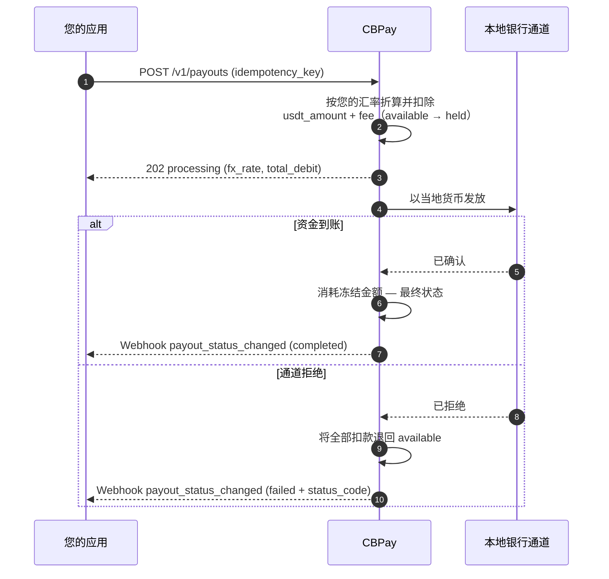

> **环境：** 测试 `https://cryptobank.qbank.cl/platform` (`pk_test_...`) - 正式 `https://api.qbank.cl/platform` (`pk_...`).

出金（payout）会以当地货币向目的国的银行账户汇出资金。金额按**您账户的
汇率**（即 `GET /v1/rates` 返回的汇率）从当地货币折算为 USDT，并从您的
余额中扣除 `usdt_amount + fee`（如已配置固定费用）。

以下是完整的生命周期，包括每一步中您的余额发生的变化：



## 1. 查询可用通道

国家、货币和方式由 CBPay 定义。请始终查询目录：

```bash
curl https://api.qbank.cl/platform/v1/payouts/methods \
  -H "Authorization: Bearer <token>"
```

```json
{
  "items": [
    { "country": "CL", "currency": "CLP", "method": "bank_transfer" },
    { "country": "PE", "currency": "PEN", "method": "bank_transfer" },
    { "country": "PE", "currency": "PEN", "method": "yape" },
    { "country": "BO", "currency": "BOB", "method": "qr" }
  ],
  "meta": { "retrieved": 4 }
}
```

可用的通道和方式：

| 国家 | 货币 | 方式 |
|---|---|---|
| 智利 | CLP | `bank_transfer` |
| 秘鲁 | PEN | `bank_transfer`、`yape` |
| 墨西哥 | MXN | `bank_transfer`（SPEI：CLABE 或借记卡） |
| 委内瑞拉 | VES | `bank_transfer`、`pago_movil` |
| 玻利维亚 | BOB / USD | `bank_transfer`、`qr`（参见 [QR 出金](#qr-出金)） |
| 巴西 | BRL | `pix`（按密钥或到账户）、`qr`（PIX 二维码 —— 参见 [QR 出金](#qr-出金)） |
| 厄瓜多尔 | USD | `bank_transfer`、`deuna`、`cash_pickup`、`cnb` |
| 巴拉圭 | PYG | `bank_transfer` |
| 阿根廷 | ARS / USD | `bank_transfer`（CBU 或 CVU） |
| 美国 | USD | `ach`、`wire`、`swift` |

可用性可能变化；目录（`GET /v1/payouts/methods`）始终是唯一可信来源。
如果某个国家只有一种方式，`method` 为可选。每种方式的计费方式相同：
您的汇率 + 固定费用。

对于银行转账，您还需要银行目录（收款人的 `bank_code` 即来自这里）：

```bash
curl "https://api.qbank.cl/platform/v1/payouts/banks?country=CL" \
  -H "Authorization: Bearer <token>"
```

```json
{
  "items": [
    { "code": "001", "name": "Banco de Chile" },
    { "code": "012", "name": "Banco del Estado de Chile" },
    { "code": "016", "name": "Banco de Crédito e Inversiones" }
  ],
  "meta": { "retrieved": 3 }
}
```

## 2. 创建出金

```bash
curl -X POST https://api.qbank.cl/platform/v1/payouts \
  -H "Authorization: Bearer <token>" \
  -H "Content-Type: application/json" \
  -d '{
    "country": "MX",
    "currency": "MXN",
    "method": "bank_transfer",
    "amount": "1500.00",
    "beneficiary": {
      "name": "Maria Lopez",
      "account_type": "clabe",
      "account_number": "012180001234567895"
    },
    "description": "Invoice 8841",
    "idempotency_key": "invoice-8841"
  }'
```

> **重要**
`beneficiary` 是一个键/值对象，其必填字段取决于具体通道（智利需要 RUT
和银行，墨西哥需要 CLABE，秘鲁需要 CCI，巴西需要 PIX 密钥等）。方式目录
对每个通道都有说明。
> **注**
每笔出金都会自动将收款人保存为[联系人](https://docs.cbpayapp.com/zh/guides/contacts)
（发送 `"save_contact": false` 可跳过）。若要再次向其付款而无需重新输入
资料，请发送 `"beneficiary_contact_id"` 代替 `beneficiary` —— 系统将使用
其在该国家和方式下最近保存的收款人信息（若不存在则返回
`422 no_saved_destination`）。
响应 `202 Accepted`：

```json
{
  "payout_id": "0d4f…",
  "account_id": "…",
  "idempotency_key": "invoice-8841",
  "country": "MX",
  "currency": "MXN",
  "method": "bank_transfer",
  "local_amount": "1500.00",
  "fx_rate": "17.50",
  "usdt_amount": "85.714286",
  "fee": "0.300000",
  "total_debit": "86.014286",
  "settlement_asset": "USDT",
  "settlement_amount": "86.014286",
  "settlement_rate": "1",
  "status": "processing",
  "bank_reference": "",
  "created_at": "2026-07-06T20:00:00Z"
}
```

此时您的余额已反映该笔扣款：`total_debit` 已从 `available` 转入
`held`（在 `settlement_asset` 对应的余额上）。

> **注**
**`bank_reference` —— 银行为该笔转账分配的交易编号。** US ACH/wire/SWIFT 在创建时**立即**返回 CBF（payout 保持 `processing` 直至银行确认）；其他通道在完成前为空（`""`）；
当出金状态变为 `completed` 时，它会带上目的地银行/通道分配的交易编号。收款人可使用该编号
与自己的银行核对付款。该字段同时出现在 `payout_status_changed` Webhook、PDF 回执、
出金 CSV 导出以及对账单中。
### 从其他余额支付（`settlement_asset`）

默认情况下，扣款来自您的默认结算资产（除非您通过 `PUT /v1/settlement`
更改，否则为 USDT）。若要让单笔操作从其他余额支付，请在请求中加入
`settlement_asset`。示例：一笔 100,000 CLP 的出金从 BTC 余额支付，会经过
四次转换，全部记录在响应中：

1. **CLP → USDT**，按您的汇率：`100000 / 950.25 = 105.235465 USDT`。
2. **+ 固定费用**：`105.235465 + 0.30 = 105.535465 USDT`（`total_debit`）。
3. **USDT → BTC**，按实际结算价格（`settlement_rate`
   `109029.34070000`）：`105.535465 / 109029.3407 = 0.00096795 BTC`
   （向上取整到聪）。
4. **以 BTC 扣款并冻结**：`settlement_amount` `0.00096795` 从您的 BTC
   余额中扣除；收款人照常收到其 100,000 CLP，分毫不差。

```json
{
  "country": "CL",
  "currency": "CLP",
  "local_amount": "100000",
  "fx_rate": "950.25",
  "usdt_amount": "105.235465",
  "fee": "0.300000",
  "total_debit": "105.535465",
  "settlement_asset": "BTC",
  "settlement_amount": "0.00096795",
  "settlement_rate": "109029.34070000",
  "status": "processing",
  "bank_reference": ""
}
```

如果出金失败，将向您的 BTC 余额退回精确的 `settlement_amount` ——
绝不重新报价。如果当时 BTC/GOLD 的执行价格不可用，您会收到
`503 pricing_unavailable`；波动性资产还有单笔操作限额
（`422 settlement_limit_exceeded`；可在 `GET /v1/settlement` 中查询）。

## 3. 接收最终状态

订阅 `payout_status_changed` 事件（[webhooks](https://docs.cbpayapp.com/zh/webhooks)）：

```json
{
  "payout_id": "0d4f…",
  "account_id": "…",
  "country": "MX",
  "currency": "MXN",
  "local_amount": "1500.00",
  "usdt_amount": "85.714286",
  "total_debit": "86.014286",
  "status": "completed",
  "status_code": "",
  "bank_reference": "00761123456"
}
```

- **`completed`**：资金已到账；冻结金额被消耗。
- **`failed`**：全部扣款自动退回（在您的账本中记为
  `payout_refund`）。

您也可以随时查询：

```bash
curl https://api.qbank.cl/platform/v1/payouts/0d4f… \
  -H "Authorization: Bearer <token>"
```

### 出金状态

| 状态 | 含义 | 您的余额 |
|---|---|---|
| `processing` | 已受理，正在本地通道执行 | 扣款冻结在 `held` 中 |
| `completed` | 资金已到达收款人 | 冻结金额被消耗 —— 最终状态 |
| `failed` | 通道拒绝或执行失败 | **自动全额退款**（金额 + 费用） |

## 查询与历史记录

每笔出金都可以单独读取，列表接口支持筛选：

```bash
# One payout
curl https://api.qbank.cl/platform/v1/payouts/0d4f… \
  -H "Authorization: Bearer <token>"

# History with filters: dates, status and pagination
curl "https://api.qbank.cl/platform/v1/payouts?from=2026-07-01&to=2026-07-08&status=failed&country=MX&page=1&page_size=50" \
  -H "Authorization: Bearer <token>"
```

```json
{
  "page": 1,
  "page_size": 50,
  "payouts": [
    {
      "payout_id": "0d4f…",
      "country": "MX",
      "currency": "MXN",
      "method": "bank_transfer",
      "local_amount": "1500.00",
      "fx_rate": "17.50",
      "usdt_amount": "85.714286",
      "fee": "0.300000",
      "total_debit": "86.014286",
      "status": "failed",
      "status_code": "core_rejected",
      "status_message": "beneficiary account does not exist",
      "bank_reference": "",
      "created_at": "2026-07-06T20:00:00Z"
    }
  ]
}
```

`from`/`to` 使用 `YYYY-MM-DD`（组织时区，两端均含）；日期无效时返回
`400 invalid_range`。

## 各国示例

每条通道均附有其精确的 `beneficiary`、完整的请求和真实的响应。汇率
（`fx_rate`）仅供参考 —— 实际始终采用 `GET /v1/rates` 返回的您账户的
汇率；扣款为 `usdt_amount + fee`（固定费用，如已配置；此处为 `0.30`）。

### 各通道的收款人字段

| 国家 | 方式 | `beneficiary` 字段 |
|---|---|---|
| CL | `bank_transfer` | `name`、`tax_id`（RUT）、`bank_code`、`account_type`、`account_number` |
| PE | `bank_transfer` | `name`、`account_number`（20 位 CCI） |
| PE | `yape` | `name`、`phone`（`51XXXXXXXXX`） |
| MX | `bank_transfer` | `name`、`account_type`（`clabe`/`debit_card`）、`account_number`（银行卡还需 `bank_code`） |
| VE | `pago_movil` | `name`（名 + 第一姓氏，与证件一致）、`phone`、`bank_code`（SUDEBAN）、`document_value` |
| VE | `bank_transfer` | `name`、`account_number`（20 位）、`document_value` |
| BO | `bank_transfer` | `name`、`tax_id`、`bank_code`、`account_number` |
| BR | `pix` | `name`、`tax_id` +（`pix_key` 和 `pix_key_type`）或（`bank_code` ISPB、`branch_code`、`account_number`） |
| EC | `bank_transfer` | `name`、`document_value`（身份证 cédula）、`sender_name`、`account_number`（转到其他银行还需 `bank_code` 和 `account_type`） |
| EC | `deuna` | `name`、`document_value`、`sender_name`、`phone`（钱包手机号） |
| EC | `cash_pickup` / `cnb` | `name`、`document_value`、`sender_name` — 收款人凭证件领取现金 |
| PY | `bank_transfer` | `name`（最多 35 个字符）、`tax_id`、`bank_code`、`account_number` |
| AR | `bank_transfer` | `name`、`tax_id`（11 位 CUIT/CUIL）、`account_number`（22 位 CBU 或 CVU；USD 仅支持 CBU） |
| US | `ach` / `wire` / `swift` | `name`、`account_number`、`email`、`country_code`、`address`、`city`、`postal_code`、`bank_name`、`bank_code`（`ach`/`wire` 用 ABA routing，`swift` 用 SWIFT BIC；`ach` 还需 `account_type` `CHECKING`/`SAVING`） |

#### 智利

以 CLP 进行银行转账。需要 RUT、银行和账户：

```bash
curl -X POST https://api.qbank.cl/platform/v1/payouts \
  -H "Authorization: Bearer <token>" \
  -H "Content-Type: application/json" \
  -d '{
    "country": "CL",
    "currency": "CLP",
    "method": "bank_transfer",
    "amount": "100000",
    "beneficiary": {
      "name": "Pedro Soto Fuentes",
      "tax_id": "12.345.678-5",
      "bank_code": "012",
      "account_type": "checking",
      "account_number": "123456789"
    },
    "description": "Supplier payment",
    "idempotency_key": "cl-prov-0091"
  }'
```

```json
{
  "payout_id": "b3e1…",
  "country": "CL",
  "currency": "CLP",
  "method": "bank_transfer",
  "local_amount": "100000",
  "fx_rate": "925.69",
  "usdt_amount": "108.027528",
  "fee": "0.300000",
  "total_debit": "108.327528",
  "status": "processing",
  "bank_reference": ""
}
```

银行目录（`GET /v1/payouts/banks?country=CL`）列出当前有效的
`bank_code` 值。

#### 秘鲁

两种方式：银行转账（跨行 CCI）和 **Yape**（转到手机号码）。

```bash bank_transfer (CCI)
curl -X POST https://api.qbank.cl/platform/v1/payouts \
  -H "Authorization: Bearer <token>" \
  -H "Content-Type: application/json" \
  -d '{
    "country": "PE",
    "currency": "PEN",
    "method": "bank_transfer",
    "amount": "1000.00",
    "beneficiary": {
      "name": "Rosa Alvarez Diaz",
      "account_number": "00219300123456789012"
    },
    "idempotency_key": "pe-cci-3310"
  }'
```

```bash yape (phone)
curl -X POST https://api.qbank.cl/platform/v1/payouts \
  -H "Authorization: Bearer <token>" \
  -H "Content-Type: application/json" \
  -d '{
    "country": "PE",
    "currency": "PEN",
    "method": "yape",
    "amount": "150.00",
    "beneficiary": {
      "name": "Luis Ramos Vega",
      "phone": "51987654321"
    },
    "idempotency_key": "pe-yape-8874"
  }'
```

```json
{
  "payout_id": "c7a2…",
  "country": "PE",
  "currency": "PEN",
  "method": "yape",
  "local_amount": "150.00",
  "fx_rate": "3.40",
  "usdt_amount": "44.117648",
  "fee": "0.300000",
  "total_debit": "44.417648",
  "status": "completed",
  "bank_reference": "00761123456"
}
```

对于 `yape`，手机号码使用 `51XXXXXXXXX` 格式（含国家代码共 11 位）。
结果通常是同步返回的。

#### 墨西哥

以 MXN 进行 SPEI 转账，转到 CLABE（18 位）或借记卡：

```bash CLABE
curl -X POST https://api.qbank.cl/platform/v1/payouts \
  -H "Authorization: Bearer <token>" \
  -H "Content-Type: application/json" \
  -d '{
    "country": "MX",
    "currency": "MXN",
    "method": "bank_transfer",
    "amount": "1500.00",
    "beneficiary": {
      "name": "Maria Lopez",
      "account_type": "clabe",
      "account_number": "012180001234567895"
    },
    "idempotency_key": "mx-clabe-8841"
  }'
```

```bash Debit card
curl -X POST https://api.qbank.cl/platform/v1/payouts \
  -H "Authorization: Bearer <token>" \
  -H "Content-Type: application/json" \
  -d '{
    "country": "MX",
    "currency": "MXN",
    "method": "bank_transfer",
    "amount": "800.00",
    "beneficiary": {
      "name": "Jorge Herrera",
      "account_type": "debit_card",
      "account_number": "4152313412341234",
      "bank_code": "40012"
    },
    "idempotency_key": "mx-card-1102"
  }'
```

```json
{
  "payout_id": "0d4f…",
  "country": "MX",
  "currency": "MXN",
  "method": "bank_transfer",
  "local_amount": "1500.00",
  "fx_rate": "17.50",
  "usdt_amount": "85.714286",
  "fee": "0.300000",
  "total_debit": "86.014286",
  "status": "processing",
  "bank_reference": ""
}
```

使用 CLABE 时，目标银行由其前几位数字推导；使用银行卡时，必须提供
`bank_code`。

#### 委内瑞拉

两种方式：**Pago Móvil**（姓名 + 手机号 + 银行 + 证件）和银行转账
（20 位账户）：

```bash pago_movil
curl -X POST https://api.qbank.cl/platform/v1/payouts \
  -H "Authorization: Bearer <token>" \
  -H "Content-Type: application/json" \
  -d '{
    "country": "VE",
    "currency": "VES",
    "method": "pago_movil",
    "amount": "2000.00",
    "beneficiary": {
      "name": "Carmen Delgado",
      "phone": "04141234567",
      "bank_code": "0102",
      "document_value": "V12345678"
    },
    "idempotency_key": "ve-pm-5567"
  }'
```

```bash bank_transfer
curl -X POST https://api.qbank.cl/platform/v1/payouts \
  -H "Authorization: Bearer <token>" \
  -H "Content-Type: application/json" \
  -d '{
    "country": "VE",
    "currency": "VES",
    "method": "bank_transfer",
    "amount": "5000.00",
    "beneficiary": {
      "name": "Carmen Delgado",
      "account_number": "01020123456789012345",
      "document_value": "V87654321"
    },
    "idempotency_key": "ve-bank-7810"
  }'
```

```json
{
  "payout_id": "e9b4…",
  "country": "VE",
  "currency": "VES",
  "method": "pago_movil",
  "local_amount": "2000.00",
  "fx_rate": "666.00",
  "usdt_amount": "3.003004",
  "fee": "0.300000",
  "total_debit": "3.303004",
  "status": "completed",
  "bank_reference": "00761123456"
}
```

`bank_code` 使用 SUDEBAN 代码；对于 `bank_transfer`，可由账号的前 4 位
数字推导。

#### 玻利维亚

以 BOB 或 USD 进行 ACH 转账（此外还有 [QR](#qr-出金)）：

```bash
curl -X POST https://api.qbank.cl/platform/v1/payouts \
  -H "Authorization: Bearer <token>" \
  -H "Content-Type: application/json" \
  -d '{
    "country": "BO",
    "currency": "BOB",
    "method": "bank_transfer",
    "amount": "1382.00",
    "beneficiary": {
      "name": "Juan Quispe Mamani",
      "tax_id": "4567890",
      "bank_code": "1016",
      "account_number": "1234567890"
    },
    "idempotency_key": "bo-ach-2204"
  }'
```

```json
{
  "payout_id": "f2c8…",
  "country": "BO",
  "currency": "BOB",
  "method": "bank_transfer",
  "local_amount": "1382.00",
  "fx_rate": "6.91",
  "usdt_amount": "200.000000",
  "fee": "0.300000",
  "total_debit": "200.300000",
  "status": "processing",
  "bank_reference": ""
}
```

如需 USD，请发送 `currency: "USD"`，结构相同。

#### 巴西

按密钥进行 PIX 转账（此外还有 [PIX QR](#qr-出金)）：

```bash
curl -X POST https://api.qbank.cl/platform/v1/payouts \
  -H "Authorization: Bearer <token>" \
  -H "Content-Type: application/json" \
  -d '{
    "country": "BR",
    "currency": "BRL",
    "method": "pix",
    "amount": "350.00",
    "beneficiary": {
      "name": "João da Silva",
      "tax_id": "123.456.789-09",
      "pix_key_type": "cpf",
      "pix_key": "12345678909"
    },
    "idempotency_key": "br-pix-3321"
  }'
```

```json
{
  "payout_id": "a6d1…",
  "country": "BR",
  "currency": "BRL",
  "method": "pix",
  "local_amount": "350.00",
  "fx_rate": "5.13",
  "usdt_amount": "68.226121",
  "fee": "0.300000",
  "total_debit": "68.526121",
  "status": "processing",
  "bank_reference": ""
}
```

`pix_key_type`：`cpf`、`cnpj`、`phone`、`email` 或 `evp`（随机密钥）。

**PIX 转账到账户（无密钥）** —— 当收款人没有（或不愿提供）PIX 密钥时，
可发送其银行账户信息；到账同样迅速（同一 PIX 通道，24/7 全天候）：

```bash
curl -X POST https://api.qbank.cl/platform/v1/payouts \
  -H "Authorization: Bearer <token>" \
  -H "Content-Type: application/json" \
  -d '{
    "country": "BR",
    "currency": "BRL",
    "method": "pix",
    "amount": "350.00",
    "beneficiary": {
      "name": "Empresa Exemplo Ltda",
      "tax_id": "19.385.062/0001-20",
      "bank_code": "45678923",
      "branch_code": "1",
      "account_number": "765432",
      "account_type": "CACC"
    },
    "idempotency_key": "br-pix-acct-3322"
  }'
```

- `bank_code` 是目标银行的 **ISPB**（8 位），`branch_code` 是分行号，
  `account_type` 是账户类型（`CACC` 活期 —— 默认 ——、`SVGS` 储蓄、
  `TRAN` 支付账户、`SLRY` 工资账户）。
- 最终状态通过 `payout_status_changed` webhook 送达（与通道持续对账）；
  也可随时使用 `GET /v1/payouts/{id}` 查询。

#### 厄瓜多尔

以 **USD** 汇出汇款（每笔 1 至 10,000，最多 2 位小数），支持四种方式：
银行转账、**DE UNA** 钱包（按手机号）、**柜台取现**（`cash_pickup`）和
**非银行代理点取现**（`cnb`）。这是一个汇款通道：除收款人外，通道还
要求提供**汇款人**（付款发起方）的信息，以 `sender_*` 前缀平铺在同一个
`beneficiary` 对象中。

```bash bank_transfer（到账户）
curl -X POST https://api.qbank.cl/platform/v1/payouts \
  -H "Authorization: Bearer <token>" \
  -H "Content-Type: application/json" \
  -d '{
    "country": "EC",
    "currency": "USD",
    "method": "bank_transfer",
    "amount": "250.00",
    "beneficiary": {
      "name": "Carlos Andrade Vera",
      "document_value": "1712345678",
      "account_number": "2203456789",
      "sender_name": "Ana Torres Silva",
      "sender_document_value": "V23456789",
      "sender_country": "US"
    },
    "idempotency_key": "ec-bank-4471"
  }'
```

```bash deuna（钱包）
curl -X POST https://api.qbank.cl/platform/v1/payouts \
  -H "Authorization: Bearer <token>" \
  -H "Content-Type: application/json" \
  -d '{
    "country": "EC",
    "currency": "USD",
    "method": "deuna",
    "amount": "80.00",
    "beneficiary": {
      "name": "Lucia Paredes Mora",
      "document_value": "0923456781",
      "phone": "0998765432",
      "sender_name": "Ana Torres Silva"
    },
    "idempotency_key": "ec-deuna-5520"
  }'
```

```bash cash_pickup（柜台）
curl -X POST https://api.qbank.cl/platform/v1/payouts \
  -H "Authorization: Bearer <token>" \
  -H "Content-Type: application/json" \
  -d '{
    "country": "EC",
    "currency": "USD",
    "method": "cash_pickup",
    "amount": "120.00",
    "beneficiary": {
      "name": "Miguel Zambrano Loor",
      "document_value": "1309876543",
      "sender_name": "Ana Torres Silva"
    },
    "idempotency_key": "ec-cash-6612"
  }'
```

```bash cnb（代理点）
curl -X POST https://api.qbank.cl/platform/v1/payouts \
  -H "Authorization: Bearer <token>" \
  -H "Content-Type: application/json" \
  -d '{
    "country": "EC",
    "currency": "USD",
    "method": "cnb",
    "amount": "60.00",
    "beneficiary": {
      "name": "Rosa Cedeño Vera",
      "document_value": "0801234567",
      "sender_name": "Ana Torres Silva"
    },
    "idempotency_key": "ec-cnb-7703"
  }'
```

```json
{
  "payout_id": "9f3a…",
  "country": "EC",
  "currency": "USD",
  "method": "bank_transfer",
  "local_amount": "250.00",
  "fx_rate": "1",
  "usdt_amount": "250.000000",
  "fee": "0.300000",
  "total_debit": "250.300000",
  "status": "processing",
  "bank_reference": ""
}
```

- 厄瓜多尔为美元化经济体：当地货币就是美元（`fx_rate: "1"`）。
- `document_value` 为收款人的身份证号（cédula）；`document_type` 接受
  `IDCD`（身份证，默认）、`CCPT`（护照）或 `TXID`（RUC）。
- 在 `bank_transfer` 中，省略 `bank_code` 表示账户属于通道的发卡银行；
  转到**其他银行**时需发送目录中的 `bank_code`
  （`GET /v1/payouts/banks?country=EC`）以及 `account_type`
  （`checking` 或 `savings`）。
- 可选的结构化姓名字段（`given_name`、`middle_name`、`first_surname`、
  `second_surname` 及其 `sender_*` 对应字段）：如有请发送 —— 它们优先
  于对 `name` 的自动拆分。
- 最终状态通过 `payout_status_changed` webhook 送达（并有周期性对账
  作为兜底）。

#### 巴拉圭

以 PYG 进行银行转账：

```bash
curl -X POST https://api.qbank.cl/platform/v1/payouts \
  -H "Authorization: Bearer <token>" \
  -H "Content-Type: application/json" \
  -d '{
    "country": "PY",
    "currency": "PYG",
    "method": "bank_transfer",
    "amount": "500000",
    "beneficiary": {
      "name": "Sofia Benitez",
      "tax_id": "4123456",
      "bank_code": "0011",
      "account_number": "600123456"
    },
    "idempotency_key": "py-bank-9917"
  }'
```

```json
{
  "payout_id": "d4e7…",
  "country": "PY",
  "currency": "PYG",
  "method": "bank_transfer",
  "local_amount": "500000",
  "fx_rate": "6055.76",
  "usdt_amount": "82.566020",
  "fee": "0.300000",
  "total_debit": "82.866020",
  "status": "processing",
  "bank_reference": ""
}
```

在此通道中，`name` 最多接受 35 个字符。

#### 阿根廷

以 **ARS** 或 **USD** 银行转账到任何 22 位的 **CBU 或 CVU**（银行账户和
虚拟钱包）。无需 `bank_code`：CBU/CVU 本身即可识别银行。

```bash ARS（CBU 或 CVU）
curl -X POST https://api.qbank.cl/platform/v1/payouts \
  -H "Authorization: Bearer <token>" \
  -H "Content-Type: application/json" \
  -d '{
    "country": "AR",
    "currency": "ARS",
    "method": "bank_transfer",
    "amount": "50000.00",
    "beneficiary": {
      "name": "Julieta Fernandez",
      "tax_id": "27-23456789-1",
      "account_number": "2850590940090418135201"
    },
    "idempotency_key": "ar-ars-3311"
  }'
```

```bash USD（仅 CBU）
curl -X POST https://api.qbank.cl/platform/v1/payouts \
  -H "Authorization: Bearer <token>" \
  -H "Content-Type: application/json" \
  -d '{
    "country": "AR",
    "currency": "USD",
    "method": "bank_transfer",
    "amount": "100.00",
    "beneficiary": {
      "name": "Julieta Fernandez",
      "tax_id": "27-23456789-1",
      "account_number": "2850590940090418135201"
    },
    "idempotency_key": "ar-usd-3312"
  }'
```

```json
{
  "payout_id": "b7c1…",
  "country": "AR",
  "currency": "ARS",
  "method": "bank_transfer",
  "local_amount": "50000.00",
  "fx_rate": "1250.00",
  "usdt_amount": "40.000000",
  "fee": "0.300000",
  "total_debit": "40.300000",
  "status": "completed",
  "bank_reference": "00761123456"
}
```

- `tax_id` 是目标账户持有人的 **CUIT/CUIL**（11 位数字；接受带连字符的
  格式并自动规范化）。
- **USD 仅支持银行账户到银行账户（CBU）**：CVU（虚拟钱包）不支持美元 ——
  该出金会在发送前被拒绝。
- 大多数出金在同一次调用中确认（`status: "completed"`）；如果通道返回
  `processing`，最终状态会通过 `payout_status_changed` webhook 送达。
- 极少数情况下，通道可能**冲正**一笔已入账的转账（例如接收银行的指令）。
  此时该出金变为 `failed`，扣款全额退还，并且你会收到
  `payout_status_changed` webhook。

#### 美国

以 **USD** 向美国银行账户出金，提供三种方式：

- **`ach`** —— 向支票或储蓄账户发起 ACH 转账，**次日**结算。
- **`wire`** —— 美国境内电汇，最低 **USD 25.00**。
- **`swift`** —— 通过 SWIFT 的国际美元电汇，最低 **USD 25.00**。

美国银行通道要求**每笔转账都附带收款人完整的身份与邮政地址** ——
收款人信息不完整会在创建时被拒绝（`422`，见下文）。收款人的
`country_code` 是其**居住国，可以是任何国家**（例如：向居住在德国的
收款人的美国银行账户发起 ACH 转账）；保持不变的是**银行**：在
`ach`/`wire` 中收款银行必须位于美国（`bank_country: "US"`），而
`swift` 本身就是国际化的。合规底线（古巴、伊朗、朝鲜和叙利亚）对
收款人所在国和银行所在国均保持封锁。必填与选填字段：

| 字段 | `ach` | `wire` | `swift` | 说明 |
|---|---|---|---|---|
| `name` | 必填 | 必填 | 必填 | 账户持有人的完整法定姓名 |
| `account_number` | 必填 | 必填 | 必填 | 美国银行账户号码 |
| `email` | 必填 | 必填 | 必填 | 通道会为每个收款人登记该邮箱 |
| `country_code` | 必填 | 必填 | 必填 | **收款人居住国**的 ISO-3166 alpha-2 —— 任何国家（不仅限于 `US`） |
| `address`、`city`、`postal_code` | 必填 | 必填 | 必填 | 收款人的完整邮政地址 |
| `state` | 条件必填 | 条件必填 | 条件必填 | **仅当 `country_code` 为 `US` 时**必填（两位字母的州代码）；其他国家选填 |
| `phone` | 选填 | 选填 | 选填 | 收款人联系电话 |
| `bank_name` | 必填 | 必填 | 必填 | 收款银行名称 |
| `bank_code` | 必填 | 必填 | 必填 | `ach`/`wire` 用 **ABA routing number**（9 位数字）；`swift` 用 **SWIFT BIC** |
| `account_type` | 必填 | — | — | `CHECKING` 或 `SAVING` |
| `bank_country` | 必填（`US`） | 必填（`US`） | 必填 | 收款银行所在国 —— **`ach`/`wire` 固定为 `US`**；`swift` 可为任何国家 |
| `bank_address`、`bank_city`、`bank_postal_code` | 必填 | 必填 | 选填 | 收款银行的地址块 |
| `bank_state` | 必填（美国银行） | 必填（美国银行） | 选填 | 收款银行的两位字母州代码 |
| `bank_phone` | 选填 | 选填 | 选填 | 收款银行电话 |

美国没有银行目录：`bank_code` 是收款人银行自身的 ABA routing number
（ACH/wire）或 SWIFT BIC（swift），由收款人提供。要在付款人输入时自动识别银行，可调用
`GET /v1/payouts/bank-directory/lookup` 并传入 routing number 或 SWIFT/BIC——它会从嵌入式公开银行目录解析出银行名称、城市、州和地址块，
便于预填 `bank_name` 和选填的 `bank_*` 地址字段。返回 `404 bank_not_found`
仅表示该代码不在目录中：表单保持手动填写即可。

```bash
curl "https://api.qbank.cl/platform/v1/payouts/bank-directory/lookup?routing_number=021000021" \
  -H "Authorization: Bearer <token>"
```

```json
{
  "routing_number": "021000021",
  "bank_name": "JPMORGAN CHASE",
  "bank_city": "TAMPA",
  "bank_state": "FL",
  "bank_postal_code": "33610",
  "bank_country": "US",
  "bank_phone": "813-432-3700",
  "source": "directory",
  "directory_vintage": "fed_ach_2019"
}
```

```bash ach
curl -X POST https://api.qbank.cl/platform/v1/payouts \
  -H "Authorization: Bearer <token>" \
  -H "Content-Type: application/json" \
  -d '{
    "country": "US",
    "currency": "USD",
    "method": "ach",
    "amount": "250.00",
    "beneficiary": {
      "name": "John Carter",
      "email": "john.carter@example.com",
      "account_number": "123456789012",
      "account_type": "CHECKING",
      "country_code": "US",
      "address": "1200 Brickell Ave",
      "city": "Miami",
      "state": "FL",
      "postal_code": "33131",
      "bank_name": "Example Bank",
      "bank_code": "021000089",
      "bank_address": "270 Park Ave",
      "bank_city": "New York",
      "bank_state": "NY",
      "bank_postal_code": "10017",
      "bank_country": "US"
    },
    "description": "Invoice 2210",
    "idempotency_key": "us-ach-2210"
  }'
```

```bash ach（美国境外的收款人）
curl -X POST https://api.qbank.cl/platform/v1/payouts \
  -H "Authorization: Bearer <token>" \
  -H "Content-Type: application/json" \
  -d '{
    "country": "US",
    "currency": "USD",
    "method": "ach",
    "amount": "250.00",
    "beneficiary": {
      "name": "Anna Becker",
      "email": "anna.becker@example.com",
      "account_number": "123456789012",
      "account_type": "CHECKING",
      "country_code": "DE",
      "address": "Friedrichstrasse 100",
      "city": "Berlin",
      "postal_code": "10117",
      "bank_name": "Example Bank",
      "bank_code": "021000089",
      "bank_address": "270 Park Ave",
      "bank_city": "New York",
      "bank_state": "NY",
      "bank_postal_code": "10017",
      "bank_country": "US"
    },
    "description": "Invoice 2210",
    "idempotency_key": "us-ach-2210-de"
  }'
```

```bash wire
curl -X POST https://api.qbank.cl/platform/v1/payouts \
  -H "Authorization: Bearer <token>" \
  -H "Content-Type: application/json" \
  -d '{
    "country": "US",
    "currency": "USD",
    "method": "wire",
    "amount": "1000.00",
    "beneficiary": {
      "name": "John Carter",
      "email": "john.carter@example.com",
      "account_number": "123456789012",
      "country_code": "US",
      "address": "1200 Brickell Ave",
      "city": "Miami",
      "state": "FL",
      "postal_code": "33131",
      "bank_name": "Example Bank",
      "bank_code": "021000089",
      "bank_address": "270 Park Ave",
      "bank_city": "New York",
      "bank_state": "NY",
      "bank_postal_code": "10017",
      "bank_country": "US"
    },
    "description": "Invoice 2211",
    "idempotency_key": "us-wire-2211"
  }'
```

```bash swift
curl -X POST https://api.qbank.cl/platform/v1/payouts \
  -H "Authorization: Bearer <token>" \
  -H "Content-Type: application/json" \
  -d '{
    "country": "US",
    "currency": "USD",
    "method": "swift",
    "amount": "1000.00",
    "beneficiary": {
      "name": "John Carter",
      "email": "john.carter@example.com",
      "account_number": "123456789012",
      "country_code": "US",
      "address": "1200 Brickell Ave",
      "city": "Miami",
      "state": "FL",
      "postal_code": "33131",
      "bank_name": "Example Bank",
      "bank_code": "CHASUS33XXX",
      "bank_country": "US"
    },
    "description": "Invoice 2212",
    "idempotency_key": "us-swift-2212"
  }'
```

```json
{
  "payout_id": "c5f2…",
  "country": "US",
  "currency": "USD",
  "method": "ach",
  "local_amount": "250.00",
  "fx_rate": "0.9980",
  "usdt_amount": "250.501002",
  "fee": "0.300000",
  "total_debit": "250.801002",
  "status": "processing",
  "bank_reference": "CBF1234567890123"
}
```

- **美国 payout 会保持 `processing`，直到银行确认人工付款。**
  创建响应已在 `bank_reference` 返回 CBF。监听 `payout_status_changed`
  以获得 `completed` 或 `failed`（已退款）。
- 该通道没有额外的收款人 AML hold：运营方手工付款，poller 对账。
- **最低金额**：`wire` 和 `swift` 至少 **USD 25.00**；低于该金额会在创建时
  被拒绝（`422`，`status_message` 为
  `"…payouts require an amount of at least USD 25"`）。ACH 无已验证的最低金额。
- 通道要求每笔转账附带**付款用途声明**。除非在 `options` 中按笔覆盖，
  否则使用默认值（值最长 140 字符）：

  | `options` 键 | 声明内容 | 默认值 |
  |---|---|---|
  | `purpose` | 付款用途 | `Invoice_Payment` |
  | `crypto_activity` | 该付款是否涉及加密货币买卖活动（`Yes`/`No`） | `No` |
  | `payment_gateway` | 入金网关声明 | 通道默认值 |

### 美元转账的强制支持文件

银行要求**每笔通过银行通道（`ach`/`wire`/`swift`）的美元转账都附带
支持文件**（发票或收据），无论通道国家如何 —— 包括国际 SWIFT
（例如 `PY/USD/swift`）。没有该文件，创建将以
`400 supporting_document_required` 被拒绝，且不会扣款：

### 上传文件

使用 `POST /v1/payouts/documents` 发送文件：请求体为**原始文件二进制**，
通过 `Content-Type` 请求头声明类型（PDF、PNG、JPEG、WEBP、TXT、CSV、
DOC(X) 或 XLS(X)，最大 50 MB），文件名通过 `name` 查询参数传递。

```bash
curl -X POST "https://api.qbank.cl/platform/v1/payouts/documents?name=invoice-2210.pdf" \
  -H "Authorization: Bearer <token>" \
  -H "Content-Type: application/pdf" \
  --data-binary "@invoice-2210.pdf"
```

```json
{
  "document_key": "payout-docs/9f1c…/org/…/3c2e…",
  "file_name": "invoice-2210.pdf",
  "content_type": "application/pdf",
  "size_bytes": 48213
}
```

该文件将存储在私有存储中，仅对您的组织可见。
### 创建出金时传递该 key

在 `options.supporting_document_key` 中发送该 key，并可选择在
`options.document_reference_number` 中附上发票编号（`ach`/`wire`）。
如果文件已上传，使用**相同的** `idempotency_key` 重试被拒绝的创建
不会重复上传。
## QR 出金

支付收款二维码（玻利维亚、巴西 PIX）现已拥有独立指南：

- **QR 出金** - 免费扫描二维码，向用户展示收款人信息，再通过第二次调用确认支付 — 按普通出金计费。

## 常见错误

| HTTP | `error` | 应对方式 |
|---|---|---|
| 400 | `idempotency_key_required` | 在请求体或请求头中发送该键 |
| 400 | `beneficiary_required` | 包含 `beneficiary` 对象 |
| 400 | `supporting_document_required` | 美元银行通道转账缺少随附的支持文件 —— 使用 `POST /v1/payouts/documents` 上传并在 `options.supporting_document_key` 中传递（参见[支持文件](https://docs.cbpayapp.com/zh/guides/payouts#美元转账的强制支持文件)） |
| 400 | `invalid_document_key` | 该 `supporting_document_key` 不属于您的账户 —— 请使用您自己的凭据上传文件并使用返回的 key |
| 402 | `insufficient_funds` | 为账户充值；该出金未被创建 |
| 403 | `account_blocked` | 账户未处于激活状态；请联系 CBPay 团队 |
| 403 | `service_disabled` | 您的账户未启用出金服务 —— 参见[服务](https://docs.cbpayapp.com/zh/concepts/services) |
| 403 | `compliance_hold` | 该出金被平台的合规控制拦截，未被创建（未扣款）。按政策不披露具体原因 —— 请携带时间戳联系支持；参见[错误](https://docs.cbpayapp.com/zh/errors) |
| 422 | `currency_not_supported` | 该货币没有可用的外汇汇率 |
| 422 | （出金处于 `status: failed`） | 通道拒绝了该数据；扣款已退回 —— 修正 `beneficiary` 后使用新的键重试 |
| 503 | `channel_unavailable` | 出金通道暂时不可用；请稍后使用**相同的** `idempotency_key` 重试 |
| 503 | `compliance_check_unavailable` | 合规校验暂时无法完成；该出金未被创建 —— 请使用**相同的** `idempotency_key` 重试 |

## 立即拒绝与后续失败

如果处理方在创建时就拒绝了出金，您会收到 `422`，对象处于
`status: failed`，且退款已经完成。如果之后才失败（例如目标账户不存在），
webhook 会以 `status: failed` 送达，自动退款也在那一刻发生。

### 解读失败出金的 `status_code`

| `status_code` | 含义 | 处理方式 |
|---|---|---|
| `core_rejected` | 处理方在创建时拒绝了该操作（收款人数据无效、通道不可用） | 阅读 `status_message`，修正数据后使用新的键创建新出金 |
| `counterparty_rejected` | 银行通道拒绝了收款人本身（US/USD 通道） | 与账户持有人核对收款人的身份与地址信息，然后使用新的键创建新出金 |
| `channel_unavailable` | 出金通道暂时不可用 | 稍后重试；退款（如已扣款）已经完成 |
| *其他代码* | 银行通道在后续阶段拒绝（例如目标账户已注销） | 同上：修正数据后创建新的操作 |
| *（空）* | 通道的一般性失败 | 检查 `status_message`；如仍不清楚，请携带 `payout_id` 联系支持 |

无论哪种情况，退款均已完成 —— 可通过
[账户流水](https://docs.cbpayapp.com/zh/concepts/movements-reconciliation)中的 `payout_refund`
条目进行核实。

> **注**
处于 `processing` 状态的出金无法通过 API 取消：通道已经在处理它。请通过
webhook 或 `GET` 等待最终状态 —— 它一定会到达，失败时会自动退款。
## 常见问题

#### 我的余额什么时候被扣款？
创建时：payout 立即扣款并冻结资金。如果 payout 失败，精确的扣款金额
（含手续费）会自动退回。
#### 可以取消 processing 中的 payout 吗？
不可以 —— 一旦派发到通道，它会自行解析为 `completed` 或 `failed`。订阅
`payout_status_changed` 获取最终状态。
#### 我的 payout 使用哪个汇率？
创建时报价的汇率（以 `fx_rate` 返回），对该笔操作冻结。你约定的点差
已包含在汇率中。
#### 可以用 USDT 以外的余额付款吗？
可以 —— 设置账户级默认值（`PUT /v1/settlement`）或按笔用
`settlement_asset` 覆盖（USDC、BTC、GOLD）。退款返回精确的结算金额，
绝不重新报价。
#### compliance_hold（403）是什么意思？
受益人未通过合规筛查：payout **未被**创建，你的 `idempotency_key` 也未
被消耗。请核对受益人信息或联系你的 CBPay 团队。
#### 超时或 5xx 之后如何安全重试？
用**相同**的 `idempotency_key` 重试：会返回原始 payout
（`idempotency_hit: true`）—— 绝不会重复。新的 key 是一笔全新的独立
payout。
#### 为什么我的美国 ACH/wire/SWIFT payout 一直处于 processing？
创建时就已经返回 `bank_reference`（CBF）。payout 保持 `processing`，直到银行确认人工付款。
监听 `payout_status_changed` 以获得 `completed` 或 `failed`（已退款）。该通道没有额外的收款人 AML hold。
