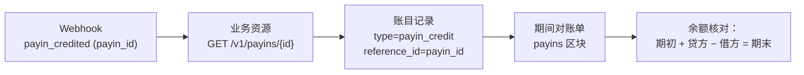

每当您的余额发生变化时，CBPay 都会在账本中写入一条**不可变的账目
记录**，并附带变动后的余额。`GET /v1/movements` 是您对账的事实
来源：任何资金变动都必然留下一条记录。

## 查询账目变动

```bash
curl "https://api.qbank.cl/platform/v1/movements?from=2026-07-01&to=2026-07-08&page_size=100" \
  -H "Authorization: Bearer <token>"
```

```json
{
  "account_id": "9b1deb4d-3b7d-4bad-9bdd-2b0d7b3dcb6d",
  "page": 1,
  "page_size": 100,
  "movements": [
    {
      "id": "a3f1…",
      "asset": "USDT",
      "amount": "-101.602460",
      "type": "payout_debit",
      "reference_type": "payout",
      "reference_id": "8e2a…",
      "description": "Payout 700.00 BOB",
      "balance_after": "3898.397540",
      "created_at": "2026-07-07T15:22:10Z"
    }
  ]
}
```

筛选参数：`from`/`to`（`YYYY-MM-DD`，组织时区）、`type`、`asset`、`page`、
`page_size`（最大 200）。每条记录都携带 `reference_type` +
`reference_id`：即产生该记录的业务资源。

### 导出 CSV / Excel

添加 `format=csv` 或 `format=xlsx`，可将相同的行下载为可直接用于会计
的文件（每次下载最多 10,000 行）。`payouts`、`payins` 与 `transfers`
列表同样支持：

```bash
curl -o movements.xlsx "https://api.qbank.cl/platform/v1/movements?from=2026-07-01&to=2026-07-13&format=xlsx" \
  -H "Authorization: Bearer <token>"
```

出款导出（`GET /v1/payouts?format=csv`）包含 `bank_reference` 列（位于 `status_code` 之后），即收款银行分配的交易号，在出款完成后填充。

## 完整类型目录

| `type` | 符号 | 来源（`reference_type`） |
|---|---|---|
| `payin_credit` | + | 法币收款入账（`payin`） |
| `payout_debit` / `payout_refund` | − / + | 出款创建 / 失败时退款（`payout`） |
| `transfer_in` / `transfer_out` | + / − | 收到 / 发出的内部转账（`transfer`） |
| `funding` | + | 链上 USDT 充值入账（`deposit`） |
| `withdrawal_debit` / `withdrawal_refund` | − / + | 链上提现 / 失败时退款（`withdrawal`） |
| `card_debit` / `card_refund` | − / + | 卡片消费 / 撤销（`card_transaction`） |
| `card_fee` / `card_fee_refund` | − / + | 卡片费用（发卡、月费、注销） |
| `compliance_fee` / `compliance_refund` | − / + | KYC 筛查收费 / 失败时退款 |
| `wallet_creation_fee` / `wallet_creation_refund` | − / + | 钱包创建费 |
| `banking_fee` / `banking_fee_refund` | − / + | 银行操作费 |
| `adjustment` | ± | 管理员进行的人工调整（已审计） |

<Note>
银行余额存放在您的银行账户中（不在 USDT 账本内）：此处只出现其
**费用**。出款/收款/提现的交易费用没有独立的账目记录 — 它们包含在
各自操作的金额中（`total_debit`、`usdt_credited`）。
</Note>

## 三层对账

您的集成对同一笔资金有三个视图。它们的对应关系如下：

| 层 | 说明 | 关联键 |
|---|---|---|
| **Webhooks** | 每个事件的推送通知 | `payout_id` / `payin_id` / `transfer_id` / `withdrawal_id` |
| **账目变动** | 带 `balance_after` 的不可变会计记录 | `reference_id` = 同一资源的 id |
| **对账单** | 带余额保证的期间快照（JSON/PDF/Excel） | 按产品划分的区块，使用相同的 id |



### 每日对账流程

<Steps>
  <Step title="下载当天的账目变动">
    `GET /v1/movements?from=YESTERDAY&to=YESTERDAY`，分页读取到末尾。
  </Step>
  <Step title="与您的内部记录交叉核对">
    由您的内部 id 派生的 `idempotency_key`，可将您的每笔操作与其
    CBPay `reference_id` 关联起来。
  </Step>
  <Step title="验证余额连续性">
    按日期排序：每条记录的 `balance_after` 必须等于上一条记录 ±
    `amount`。任何缺口都意味着您漏掉了一条记录（不是账本错误 —
    账本是不可变的）。
  </Step>
  <Step title="用对账单结账">
    [对账单](/zh/guides/statement)保证会计恒等式
    `期初 + 贷方 − 借方 = 期末`，可作为您的正式凭证
    （PDF/Excel）。
  </Step>
</Steps>

## 账目变动 vs 对账单：何时用哪个？

- **`GET /v1/movements`** — 程序化、分页、实时：用于您的自动对账
  和历史记录界面。
- **对账单** — 带汇总、按产品/国家/币种细分且余额有保证的期间快照：
  用于会计结账、审计以及与您的财务团队共享。

两者读取的是同一个账本：它们永远不会不一致。
