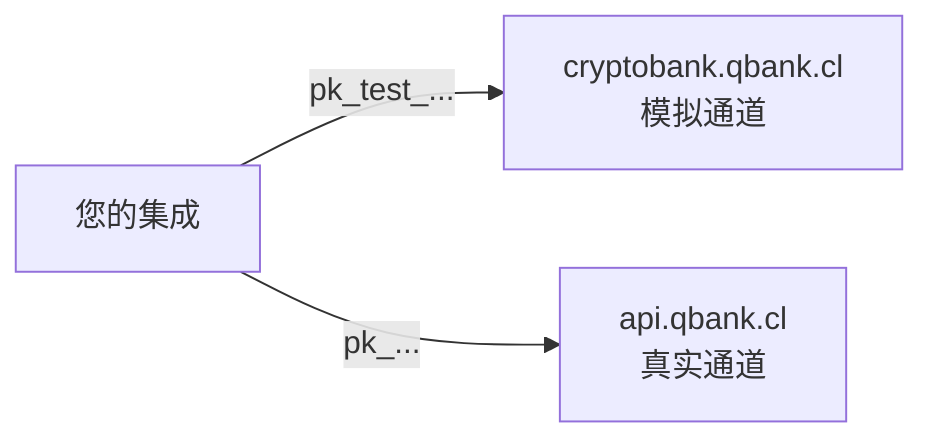

CBPay 运行在**两个环境**上：**test**（沙盒，模拟资金）和 **live**
（生产，真实资金）。两者完全隔离 —— URL 独立、API 密钥独立、数据独立
—— 并暴露完全相同的 API：基于 test 构建的集成只需更换 base URL 和
密钥即可在 live 运行。

| | Test（沙盒） | Live（生产） |
|---|---|---|
| Base URL | `https://cryptobank.qbank.cl/platform` | `https://api.qbank.cl/platform` |
| API 密钥 | `pk_test_...` | `pk_...` |
| 资金 | 模拟（不会发生任何真实转移） | **真实且不可逆** |
| 通道 | 内部模拟器 —— 始终可用、结果确定 | 真实银行通道 |
| 响应头 | `CBPay-Environment: test` | `CBPay-Environment: live` |

<Note>
密钥绝不跨环境：`pk_test_` 密钥会被 live 拒绝，live 的 `pk_` 密钥也会
被 test 拒绝。没有任何开关需要切换 —— 环境由您请求的地址决定。
</Note>



## 测试环境的行为

测试环境**完全自包含**：所有通道（付款、收款、转账、加密货币、银行
账户、卡片、身份验证）均由内部模拟器提供服务，因此永远不依赖任何第三
方的可用性。操作以**确定性**方式解析：

- 您创建的任何操作都会被接受，并在几秒后（默认约 10 秒）达到
  `completed`，触发与 live 相同的 webhook。
- 特定的**魔法值**可以强制触发其他所有结果，让您无需猜测即可测试
  失败处理逻辑。

### 魔法值

| 产品 | 值 | 结果 |
|---|---|---|
| 付款（payouts） | 金额以 `.99` 结尾（如 `100.99`） | 延迟后失败（`failed`，余额退回） |
| 付款（payouts） | 金额以 `.77` 结尾 | 永远停留在 `processing`（测试您的超时处理） |
| 付款（payouts） | 收款人姓名包含 `REJECT` | 立即被拒绝 |
| 收款（QR / 支付页面） | 金额以 `.99` 结尾 | 收款单过期且未支付 |
| 收款（QR / 支付页面） | 金额以 `.77` 结尾 | 永远停留在 `pending` |
| 收款（QR / 支付页面） | 其他任意金额 | 延迟后自动支付并入账您的余额 |
| Collect（主动扣款） | OTP `000000` | 批准扣款；其他任何 OTP 都会失败 |
| 登录 / 2FA 验证码 | `000000` | 在所有渠道（SMS、WhatsApp、邮件）均有效 —— 不会真正发送任何消息 |
| 身份验证（KYC/KYB） | 姓名或 external id 包含 `REJECT` | 验证以 `rejected` 结束 |
| 身份验证（KYC/KYB） | 其他任意值 | 延迟后自动通过（文件始终通过 OCR） |
| AML 筛查 | 姓名包含 `SANCTION` | 命中筛查，风险 `prohibited` |
| AML 筛查 | 姓名包含 `PEP` | 命中筛查，风险 `high` |
| 加密货币提现地址 | 以 `SANC` 结尾 | 被制裁闸门拦截 |
| 加密货币提现地址 | 以 `HIGH` / `MED` 结尾 | 评估为高 / 中风险 |
| 加密货币提现 | 任意地址（非魔法值） | 延迟后以 `SIMTX...` 交易 id 确认 |

<Tip>
测试环境中的加密货币**充值**通过控制台（或您的平台管理员）入账 ——
没有真实链可供转入。提现、余额、冻结与 webhook 的行为与 live 完全
一致。
</Tip>

### 与 live 的差异

- 任何真实的资金、卡片、邮件或短信都不会离开测试环境。
- 银行目录是虚构的（`Simulated National Bank` 等）。
- 汇率是真实的（与 live 同源），因此金额看起来真实。
- 测试数据会定期从脱敏快照刷新；请将测试数据视为可丢弃的。

## 从控制台使用测试模式

控制台的 **test/live 开关**一键切换您的会话所在环境 —— 无需单独注册，
也无需再次登录。如果您的账户尚不存在于 test，首次切换时会自动创建。
API 密钥按环境管理：在测试模式下创建您的 `pk_test_` 密钥。

## 在本地开发中测试 webhook

回调 URL 必须是**公网 HTTPS**：创建订阅时会拒绝 `localhost`、私有 IP
和 `.local` 域名。在本机开发时请使用 HTTPS 隧道：

<CodeGroup>

```bash Cloudflare Tunnel（免费）
# 安装 cloudflared 并暴露本地端口
cloudflared tunnel --url http://localhost:3000
# → https://<random>.trycloudflare.com  ← 用作 callback_url
```

```bash ngrok
ngrok http 3000
# → https://<random>.ngrok-free.app  ← 用作 callback_url
```

</CodeGroup>

然后使用该公网 URL 创建订阅（注意测试环境的 base URL）：

```bash
curl -X POST https://cryptobank.qbank.cl/platform/v1/webhooks/subscriptions \
  -H "X-API-Key: pk_test_..." \
  -H "Content-Type: application/json" \
  -d '{
    "event_type": "payin_credited",
    "callback_url": "https://your-tunnel.trycloudflare.com/webhooks/cbpay",
    "secret": "a-long-random-secret"
  }'
```

<Tip>
失败的投递最多重试 **5 次（递增退避）**，即使隧道中断几分钟也不会丢失
事件。请始终验证 HMAC 签名 —— 完整方法见
[webhooks](/zh/webhooks#signature-verification)。
</Tip>

## 在测试环境演练每个流程

| 产品 | 测试方式 |
|---|---|
| 付款 | 使用任意收款人创建；几秒内完成。用魔法金额强制触发失败 |
| 收款 | 创建 QR 收款或支付页面；延迟后自动支付并入账余额 |
| 转账 | 创建第二个测试账户并在两者之间转账（免费） |
| 加密货币 | 从控制台入账测试充值，然后提现到任意地址 |
| 身份验证（KYC/KYB） | 创建验证链接；几秒内自动通过 |
| AML | 筛查 `John SANCTION` 和 `Maria PEP` 来演练命中处理 |
| 卡片 | 发行一张卡并从控制台模拟消费 |
| 2FA | 启用后在所有地方使用验证码 `000000` |

## 上线前检查清单

在将集成指向 live 环境之前：

- [ ] 将 base URL 换成 `https://api.qbank.cl/platform`，密钥换成您在 live 模式签发的 `pk_...`。
- [ ] API 密钥保存在密钥管理器中（绝不放在前端或代码仓库）。
- [ ] 每个资金操作都发送由您内部 id 派生的 `idempotency_key`（不是每次尝试随机生成的 UUID）。
- [ ] 遇到超时或 `5xx` 时**不要换新密钥重试**：使用相同密钥重试，或用 `GET` 查询状态。
- [ ] 验证每个 webhook 的 HMAC 签名并快速返回 `2xx`（异步处理）。
- [ ] 正确处理非终态（`pending`、`processing`），不要假设成功 —— live 的清算时间比模拟的 10 秒更长。
- [ ] 在 live 重新创建了 webhook 订阅（test 的订阅不会迁移）。
- [ ] 查询 `GET /v1/services` 只展示已启用的产品 —— 见[服务](/zh/concepts/services)。
- [ ] 每天通过 `GET /v1/movements` 或[对账单](/zh/guides/statement)对账。
- [ ] 与 CBPay 团队保持沟通渠道，处理 `unassigned` 充值或事故。

<Warning>
在 **live** 中，每个操作一旦完成即真实且不可逆。`completed` 的付款
已经到达收款人账户；唯一的冲正途径在 API 之外（联系 CBPay 团队）。
</Warning>

<AccordionGroup>
  <Accordion title="测试模式收费吗？">
    不收费。手续费从模拟余额中扣除，您可以在不花真钱的情况下演练完整
    的计费逻辑。
  </Accordion>
  <Accordion title="可以在 test 使用 live 密钥（或反之）吗？">
    不可以。每个环境只接受自己的密钥（test 用 `pk_test_`，live 用
    `pk_`）。另一个环境的密钥会返回 `401`。
  </Accordion>
  <Accordion title="如何知道是哪个环境响应的？">
    每个响应都带有 `CBPay-Environment` 头（`test` 或 `live`），
    `GET /healthz` 也返回 `livemode`。
  </Accordion>
  <Accordion title="为什么我的测试数据消失了？">
    测试数据集会定期从生产的脱敏快照刷新。请通过 API 重建您的测试
    数据（成本极低：一切都在几秒内解析），并将测试数据视为可丢弃的。
  </Accordion>
  <Accordion title="webhook 在 test 会触发吗？">
    会 —— 完全相同的事件，使用您 test 订阅的密钥签名。请将其指向您的
    开发隧道。
  </Accordion>
</AccordionGroup>
