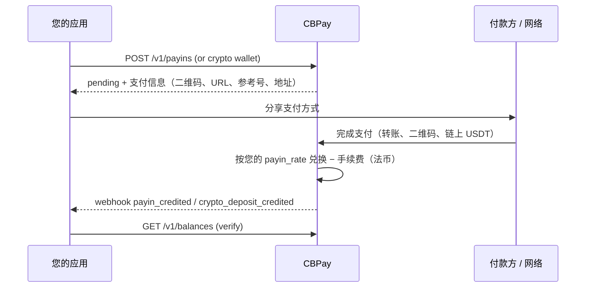
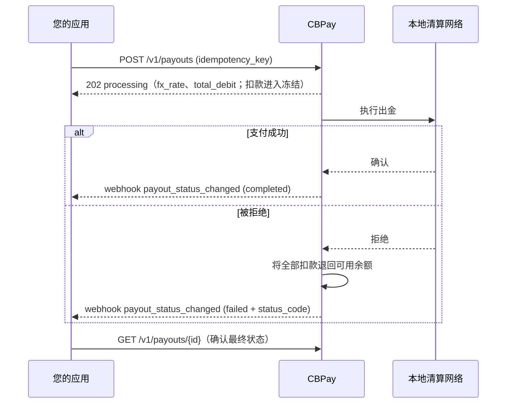
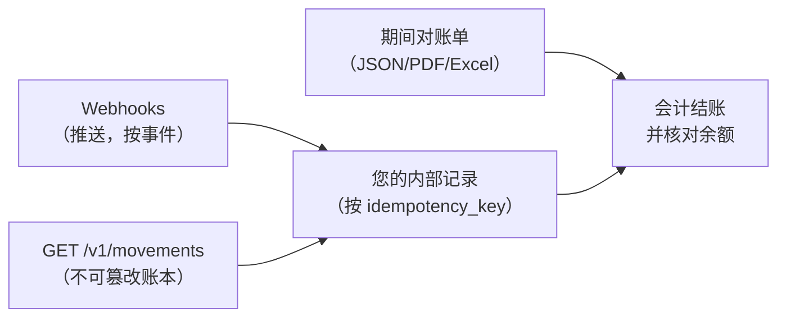
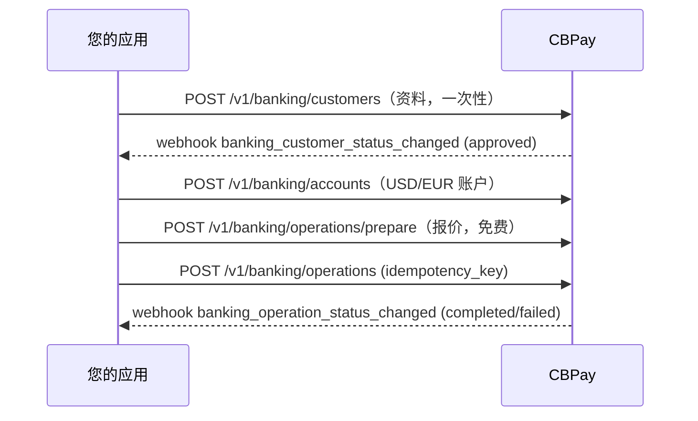

本页将各产品串联成**完整的业务流程**：调用什么、期待什么，以及哪个
webhook 为每个闭环收尾。每个流程都链接到对应产品的详细指南。

## 1. 为账户注资

资金流入有三条路径；全部以 USDT 入账和一个 webhook 结束：

| 路径 | 端点 | 收尾 webhook |
|---|---|---|
| 法币收款（二维码、转账、支付页面、扣款） | `POST /v1/payins` / `/collect` | `payin_credited` |
| 链上 USDT 充值 | `POST /v1/crypto/wallets`（固定地址） | `crypto_deposit_credited` |
| 来自其他账户的内部转账 | ——（由发送方发起） | `transfer_received` |

详情：[收款](/zh/guides/payins) · [加密资产](/zh/guides/crypto) ·
[转账](/zh/guides/transfers)。

## 2. 付款（Payout）

**二维码**变体（玻利维亚）：`POST /v1/payouts/qr/scan`（免费，解码）
→ 展示数据 → `POST /v1/payouts/qr/confirm`（按普通付款计费）。
详情：[付款](/zh/guides/payouts)。

## 3. 向客户收款

根据国家和期望的体验选择模式：

| 模式 | 国家 | 付款方体验 | 确认方式 |
|---|---|---|---|
| 托管支付页面 | CL | 打开一个 URL，从其银行完成支付 | 自动 |
| 二维码 | BO、BR（PIX） | 使用其银行 App 扫码 | 自动 |
| 附参考号转账 | CL、PE、MX、BR | 转账时附带参考号 | 按参考号自动确认（或按金额） |
| 专属 CLABE | MX | 转账到您的固定 CLABE | 自动，无需参考号 |
| 主动扣款（c2p / debit） | VE | 通过 OTP 授权后由您执行扣款 | 同一调用内**同步**确认 |

所有模式都以 `payin_credited` 收尾，净额入账到您的余额。
详情：[收款](/zh/guides/payins)。

## 4. 对账

完整做法见
[流水与对账](/zh/concepts/movements-reconciliation)和
[对账单](/zh/guides/statement)。

## 5. 端到端国际银行服务

银行余额存放在您的银行账户中（与 USDT 分离）；CBPay 只收取已配置
的固定费用。详情：[银行服务](/zh/guides/banking)。

<Tip>
首次集成？请按照[快速开始](/zh/quickstart)（注资 → 付款 → webhook）
操作，添加更多产品时再回到本页。
</Tip>
