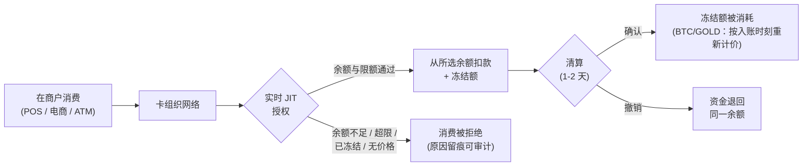

import { EnvUrls } from "/snippets/env-urls.jsx";

<EnvUrls lang="zh" />

CBPay 卡片以 **Just-In-Time 方式直接从账户的中央余额消费**：无需预充值，也无需在余额之间搬动资金。每张卡选择其消费来源余额（`spending_asset`：**USDT、USDC、BTC 或 GOLD**）。USDT/USDC 与美元 1:1；BTC 和 GOLD 则**按每个事件发生时刻的价格**换算。每笔消费都会实时针对该资产的可用余额及该卡自身的限额进行授权，扣款会立即出现在流水记录中。



## 您可以持有多少张卡

| 账户类型 | 虚拟卡 | 实体卡 | 可为第三方发卡？ |
|---|---|---|---|
| 个人 | **1** | **1** | 否 |
| 企业 | **不限** | **不限** | 可以：指定人员（如员工） |

每张卡都从**账户在其所配置资产中的中央余额**消费（`spending_asset`，默认 USDT）。精细化控制通过按卡设置的消费限额实现（单笔、每日、每月），限额始终以**美元**计量，并可随时修改。

## 选择消费余额（USDT、USDC、BTC 或 GOLD）

在创建卡片时设置 `spending_asset`，或之后通过 `PATCH` 修改。它只影响未来的消费：进行中的授权保持其原扣款资产（其撤销也会退回同一资产）。

```bash
curl -X PATCH https://api.qbank.cl/platform/v1/cards/{card_id} \
  -H "Authorization: Bearer <token>" \
  -H "Content-Type: application/json" \
  -d '{ "spending_asset": "BTC" }'
```

**USDT 和 USDC** 均等值 1 美元，因此换算为精确的 1:1，无兑换费：一笔 25.00 USD 的消费会扣除所选资产的 25.000000。

**BTC 和 GOLD** 按每个事件发生时刻的有效价格换算（即您在 `GET /v1/rates` 的 `settlement` 区块中看到的同一结算价格）：

- **授权**：预留消费金额在您资产中的等值**加上一小笔缓冲额**（这不是收费：它用于覆盖到清算为止的价格波动，并在入账时退回）。如果该时刻无法获得执行价格，消费会被**拒绝**（`pricing_unavailable`）——绝不会用不可信的价格换算您的余额。
- **清算（入账）**：最终金额按入账时刻的价格重新换算；缓冲额的多余部分退回您的余额（若价格波动超出缓冲范围，则补扣差额）。
- **授权撤销**：退回**精确的**预留金额，不做任何换算。
- **入账后的退款与调整**：按事件发生时刻的价格重新换算。价格可能在消费与退款之间发生变动——您收到的是该时刻价格下您资产中的等值，而非原始数量。
- BTC/GOLD 消费与您账户的**波动性资产限额**共享（单笔操作及 24 小时交易量，可在 `GET /v1/settlement` 中查看）。

| 错误 / 拒绝 | 出现位置 | 原因 | 解决方案 |
|---|---|---|---|
| `spending_asset_unavailable` | PATCH 返回 400 / 消费被拒 | 该资产不存在或未启用消费 | 使用 `USDT`、`USDC`、`BTC` 或 `GOLD` |
| `settlement_asset_disabled` | PATCH 返回 400 | 您的运营方已禁用该资产 | 检查 `GET /v1/settlement`（`enabled_assets`） |
| `pricing_unavailable` | 消费被拒（BTC/GOLD） | 授权时无法获得执行价格 | 重试该消费；若持续出现，切换到 USDT/USDC |
| `settlement_limit_exceeded` | 消费被拒（BTC/GOLD） | 该消费超过波动性资产的单笔操作限额 | 减小消费金额，或改用 USDT/USDC 消费 |
| `settlement_daily_limit_exceeded` | 消费被拒（BTC/GOLD） | 账户已达到 24 小时波动性资产交易量上限 | 等待，或改用 USDT/USDC 消费 |

<Note>
若所选资产的余额不足，消费会以 `insufficient_funds` 被拒绝——不会自动回退到其他余额。
</Note>

<Warning>
使用 BTC/GOLD 时，您的余额在一笔消费的各事件之间（授权、入账、退款）会暴露于价格波动。每次换算都使用其时刻的有效价格——CBPay 绝不会向后重新计价，也不会"以防万一"多扣：授权缓冲额始终在清算时退回。
</Warning>

## 费用（由您的运营方配置，可以为 0）

| 服务 | 计费时机 |
|---|---|
| `card_creation_virtual` | 发行虚拟卡时 |
| `card_creation_physical` | 发行实体卡时 |
| `card_monthly` | 每张有效卡的月费（余额不足时卡片会被冻结——不产生欠款） |
| `card_cancellation` | 注销卡片时 |

具体金额见 `GET /v1/rates`（`fees` 字段）。若发卡失败，所有发卡费用都会**自动退款**。

## 创建卡片

流程取决于您的账户是**个人**还是**企业**——请选择对应的标签页。共同规则：**持卡人每个账户只验证一次**，即首次发卡时验证；后续发卡直接复用，无需数据。`idempotency_key` 始终必填（使用相同 key 的重试会返回原始卡片，绝不会重复扣费）。

<Tabs>
<Tab title="个人账户">

个人账户**为自己**发卡（最多 1 张虚拟卡 + 1 张实体卡）。

**您的第一张卡**会在发卡方创建并验证您的持卡人。由于您的账户已通过[身份验证](/zh/guides/kyc)，您的数据和证件会**从验证中自动填充**——您只需补充发卡方专属字段（`occupation`、`salary_usd`）；任何显式提供的字段都优先于自动填充：

```bash
curl -X POST https://api.qbank.cl/platform/v1/cards \
  -H "Authorization: Bearer <token>" \
  -H "Content-Type: application/json" \
  -d '{
    "physical": false,
    "idempotency_key": "card-v-1",
    "cardholder": {
      "occupation": "52201",
      "salary_usd": 1800
    }
  }'
```

`occupation` 是**目录代码**（[见下文](#occupation-and-business-activity-catalog-codes)），`salary_usd` 为美元整数。如果您的验证是通过向导完成的，而缺少发卡方要求的某些数据或证件，请在 `cardholder` 中显式补充（`first_name`、`email`、`address`、`id_front_url`…，格式与往常相同）。

**您的第二张卡**（例如实体卡）无需任何数据——您的持卡人已完成验证：

```bash
curl -X POST https://api.qbank.cl/platform/v1/cards \
  -H "Authorization: Bearer <token>" \
  -H "Content-Type: application/json" \
  -d '{ "physical": true, "idempotency_key": "card-f-1" }'
```

同类型的第三张卡会返回 `409 card_limit_reached`（请先注销现有的那张）。

</Tab>
<Tab title="企业账户">

企业账户可发行**不限数量的卡片**，有两种模式：

**A. 为企业自身发卡**（公司卡）。首次发卡会用公司数据创建企业持卡人；之后的发卡无需任何数据：

<CodeGroup>

```bash First card (creates the company holder)
curl -X POST https://api.qbank.cl/platform/v1/cards \
  -H "Authorization: Bearer <token>" \
  -H "Content-Type: application/json" \
  -d '{
    "physical": false,
    "idempotency_key": "card-corp-1",
    "cardholder": {
      "kind_of_business": "J63",
      "legal_representation": "Carlos Soto, General Manager",
      "email": "finance@andina.cl",
      "certificate_of_good_standing_url": "https://files.example.com/kyb/standing.pdf",
      "business_license_url": "https://files.example.com/kyb/license.pdf",
      "register_shareholder_url": "https://files.example.com/kyb/shareholders.pdf",
      "id_shareholders_url": "https://files.example.com/kyb/shareholder-ids.pdf",
      "address_verification_shareholders_url": "https://files.example.com/kyb/addresses.pdf",
      "address": {
        "line1": "Av. Apoquindo 4500",
        "city": "Santiago",
        "region": "RM",
        "postal_code": "7550000",
        "country": "CL"
      }
    }
  }'
```

```bash Subsequent cards (no data, with limits)
curl -X POST https://api.qbank.cl/platform/v1/cards \
  -H "Authorization: Bearer <token>" \
  -H "Content-Type: application/json" \
  -d '{
    "physical": true,
    "idempotency_key": "card-f-ops-1",
    "limits": { "per_transaction": "500.00", "monthly": "5000.00" }
  }'
```

</CodeGroup>

**B. 为指定人员发卡**（例如员工）：添加 `cardholder.kind: "person"`，并附上该人员[**已批准** KYC](/zh/guides/kyc) 的 `verification_id`——其身份和证件来自该验证；您只需补充发卡方字段：

```bash
curl -X POST https://api.qbank.cl/platform/v1/cards \
  -H "Authorization: Bearer <token>" \
  -H "Content-Type: application/json" \
  -d '{
    "physical": false,
    "idempotency_key": "card-emp-77",
    "limits": { "monthly": "1500.00" },
    "cardholder": {
      "kind": "person",
      "verification_id": "c3d4e5f6-a7b8-4c9d-0e1f-2a3b4c5d6e7f",
      "occupation": "52201",
      "salary_usd": 1800
    }
  }'
```

- 未提供 `verification_id`（或验证未获批准）：`422 verification_required` / `422 verification_not_approved`。验证必须是 KYC（个人）；KYB 会返回 `422 verification_kind_mismatch`。
- 显式提供的 `cardholder` 字段优先于自动填充（当发卡方要求验证中没有的某份证件时很有用）。
- 卡面印刷姓名使用 `first_name` + `last_name`（合计最多 22 个字符），响应中包含 `cardholder_kind: "person"` 以及所使用的 `verification_id`。

</Tab>
</Tabs>

响应（所有情况下结构相同）：

```json
{
  "card_id": "3c2b1a09-8d7e-6f5a-4b3c-2d1e0f9a8b7c",
  "account_id": "9b1deb4d-3b7d-4bad-9bdd-2b0d7b3dcb6d",
  "physical": false,
  "cardholder_kind": "account",
  "status": "active",
  "spending_asset": "USDT",
  "limits": { "monthly": "5000.000000" },
  "created_at": "2026-07-08T12:00:00Z",
  "updated_at": "2026-07-08T12:00:00Z",
  "creation_fee": "3.000000"
}
```

您可以在创建请求体中添加 `"spending_asset": "USDC"` 从一开始就固定消费余额（省略时为 USDT）。

<Warning>
证件会由发卡方**实际校验**：URL 必须指向合法且可访问的文件。若证件缺失或不充分，发卡会失败（`422 core_rejected` 或 `409 cardholder_kyc_pending`），**费用会自动退款**，您可以用修正后的数据重试。
</Warning>

<Note>
个人还是企业？两种账户类型在所有产品中的差异汇总见[个人与企业](/zh/concepts/persons-companies)。
</Note>

### 职业与经营活动（目录代码）

指定**个人**时，`occupation` 必须是官方目录中的**代码**（不是自由文本）；指定**企业**时，`kind_of_business` 同样如此。可以查询（支持用 `?q=` 搜索）：

```bash
# Occupations (persons)
curl "https://api.qbank.cl/platform/v1/cards/catalog/occupations?q=director" \
  -H "Authorization: Bearer <token>"

# Business activities (companies)
curl "https://api.qbank.cl/platform/v1/cards/catalog/business-activities?q=software" \
  -H "Authorization: Bearer <token>"
```

每一项为 `{ "code": "...", "label": "..." }`。在 `occupation` / `kind_of_business` 中使用其 `code`。目录之外的值在到达发卡方之前就会返回 `400 invalid_occupation` 或 `400 invalid_kind_of_business`。`salary_usd` 以**美元**计（整数）。


## 实体卡：激活

实体卡初始状态为 `pending_activation`，出于安全考虑在运输途中处于**未激活**状态。持卡人拿到卡后：

```bash
curl -X POST https://api.qbank.cl/platform/v1/cards/{card_id}/activate \
  -H "Authorization: Bearer <token>"
```

## 显示 PAN 与 CVV（敏感数据）

只有**持有该卡的账户**可以显示它们（组织管理员永远不行）。响应为一次性：展示给持卡人后即丢弃。

```bash
curl -X POST https://api.qbank.cl/platform/v1/cards/{card_id}/reveal \
  -H "Authorization: Bearer <token>"
```

```json
{
  "card_id": "3c2b1a09-8d7e-6f5a-4b3c-2d1e0f9a8b7c",
  "pan": "5339880000001234",
  "cvv": "123",
  "exp_date": "202907",
  "note": "sensitive data: display once, never store"
}
```

<Warning>
**切勿存储或记录 PAN/CVV。** CBPay 同样不做持久化：响应直接来自发卡方（PCI 标准）。
</Warning>

## 限额与冻结/解冻

```bash Update limits
curl -X PATCH https://api.qbank.cl/platform/v1/cards/{card_id} \
  -H "Authorization: Bearer <token>" \
  -H "Content-Type: application/json" \
  -d '{ "limits": { "per_transaction": "200.00", "daily": "0" } }'
```

`"0"` 表示移除某项限额。要冻结（立即拒绝所有消费）：

```bash Freeze
curl -X PATCH https://api.qbank.cl/platform/v1/cards/{card_id} \
  -H "Authorization: Bearer <token>" \
  -H "Content-Type: application/json" \
  -d '{ "frozen": true }'
```

## 交易及其生命周期

```bash
curl "https://api.qbank.cl/platform/v1/cards/{card_id}/transactions?from=2026-07-01&to=2026-07-08&page=1&page_size=50" \
  -H "Authorization: Bearer <token>"
```

```json
{
  "page": 1,
  "page_size": 50,
  "transactions": [
    {
      "transaction_id": "7a1b2c3d-4e5f-6071-8293-a4b5c6d7e8f9",
      "card_id": "3c2b1a09-8d7e-6f5a-4b3c-2d1e0f9a8b7c",
      "kind": "purchase",
      "merchant": "MERPAGO*SUPERMERCADO",
      "mcc": "5411",
      "amount_usd": "25.00",
      "amount_usdt": "25.000000",
      "spend_asset": "USDC",
      "spend_amount": "25.000000",
      "status": "settled",
      "decline_reason": "",
      "auth_number": "123456",
      "created_at": "2026-07-09T15:04:05Z",
      "updated_at": "2026-07-10T09:00:00Z"
    }
  ]
}
```

`spend_asset` / `spend_amount` 显示这笔消费实际从哪个余额扣款，以及在该资产中扣了多少（`amount_usd` / `amount_usdt` 仍为美元参考值）。对于 BTC/GOLD，已授权交易的 `spend_amount` 包含预留缓冲额；清算后显示最终金额。

| 状态 | 含义 |
|---|---|
| `authorized` | 已实时批准：金额已从所选余额的可用额中扣除并置于冻结额中 |
| `settled` | 在卡组织清算时确认（冻结额被消耗；BTC/GOLD 按入账时刻重新计价） |
| `reversed` | 已撤销：资金退回同一余额（未清算则退回精确金额；已清算则按当时价格重新换算） |
| `declined` | 已拒绝，附带原因：`insufficient_funds`、`card_limit_exceeded`、`card_frozen`、`account_blocked`、`spending_asset_unavailable`、`spending_asset_disabled`、`pricing_unavailable`、`settlement_limit_exceeded`、`settlement_daily_limit_exceeded` |

如果清算金额与授权金额不同（小费、商户换汇），调整会自动应用：为正则补扣差额，为负则退回差额。

## 注销卡片

不可逆。若已配置，会计收 `card_cancellation` 费用。

```bash
curl -X POST https://api.qbank.cl/platform/v1/cards/{card_id}/cancel \
  -H "Authorization: Bearer <token>"
```

## Webhooks

| 事件 | 触发时机 |
|---|---|
| `card_transaction` | 某笔消费被授权、撤销或调整 |
| `card_status_changed` | 卡片状态发生变化（包括因月费未付而自动冻结） |

订阅方式与其他事件相同（参见 [Webhooks](/zh/webhooks)）。

## 常见问题

<AccordionGroup>
<Accordion title="我需要给卡片预充值吗？">
不需要。卡片自身不持有余额：每笔消费都实时针对账户余额（该卡的消费资产）进行授权。只要余额足够且消费符合限额，就会被批准。
</Accordion>
<Accordion title="如果我公司的多张卡同时消费会怎样？">
它们都从账户的中央余额消费。每次授权都以原子方式扣款：无论多少张卡并行操作，消费总额都不可能超过该资产的可用余额。
</Accordion>
<Accordion title="消费以什么货币扣款？">
消费以美元处理，并从卡片配置的余额（`spending_asset`）扣款。USDT/USDC 与美元 1:1，无兑换费；BTC 和 GOLD 按每个事件发生时刻的有效价格换算（与 `GET /v1/rates` 的 `settlement` 区块中的价格相同）。
</Accordion>
<Accordion title="不同的卡可以从不同的余额消费吗？">
可以：`spending_asset` 是按卡设置的。例如，一家企业可以让公司卡消费 USDT、员工卡消费 USDC、个人卡消费 BTC。通过 `PATCH` 修改只对未来的消费生效。
</Accordion>
<Accordion title="BTC/GOLD 消费中我看到的预留缓冲额是什么？">
卡组织清算在授权后 1-2 天到达，期间 BTC/黄金价格可能波动。因此授权时会预留消费等值金额外加一个小的百分比。这不是收费：清算时，消费按当时的价格重新换算，多预留的部分会自动退回您的余额。
</Accordion>
<Accordion title="如果消费时 BTC/黄金价格不可用会怎样？">
该消费会被拒绝（`pricing_unavailable`）——CBPay 绝不会用不可信的价格换算您的余额。这是暂时性状况（价格源降级）：几分钟后重试，或将卡片切换到 USDT/USDC。无法被拒绝的事件（已批准消费的清算、退款）永远不会被阻塞：它们会按最后已知价格加上审慎溢价处理，并在流水中留痕可审计。
</Accordion>
<Accordion title="我的一笔 BTC 消费被退款了——为什么收到的数量不一样？">
退款按退款时刻的价格换算，而非消费时刻的价格：您收到的是退款美元金额在您资产中的等值。如果 BTC 自消费以来上涨，您收到的 BTC 会更少（美元价值相同）；如果下跌，则更多。您的 BTC/GOLD 余额始终暴露于价格波动——这是用波动性资产消费的本质。
</Accordion>
<Accordion title="如果月费扣款时没有余额会怎样？">
卡片会被自动冻结（`card_status_changed` 事件，`reason: monthly_fee_unpaid`）。不会产生欠款；余额补足后，用 `PATCH { "frozen": false }` 解冻即可。
</Accordion>
<Accordion title="我可以为公司以外的人发卡吗？">
企业账户可以为任何指定人员发卡。该人员必须拥有[已批准的 KYC 验证](/zh/guides/kyc)——您在 `cardholder` 中传入其 `verification_id`，其数据和证件会自动填充。卡片始终从发卡企业账户的余额消费。
</Accordion>
</AccordionGroup>
