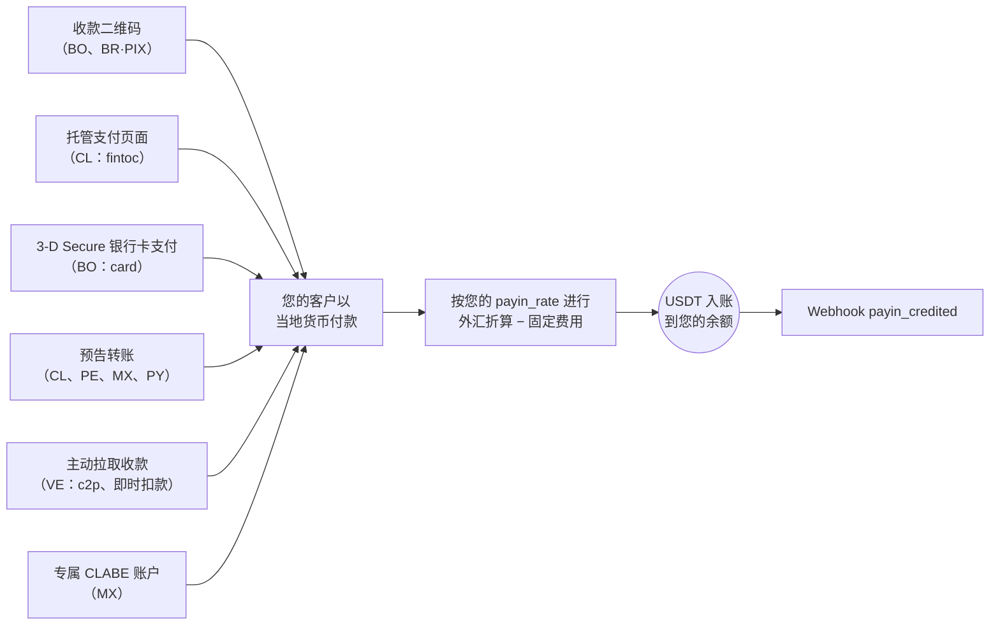
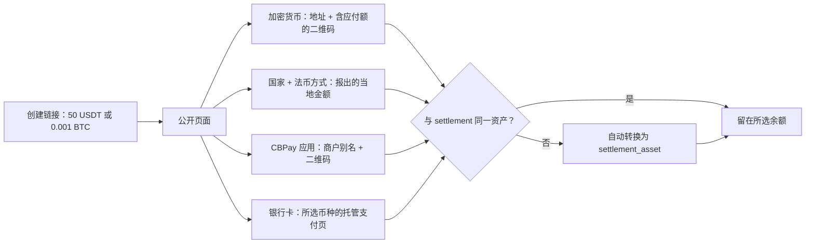

入金（payin）是一笔法币收款：您的客户以当地货币付款，您的账户自动获得
USDT 入账，按**您的入金汇率**（`GET /v1/rates` 中的 `payin_rate`）折算，
并在您的账户配置了固定入金费用时予以扣除。

无论采用哪种模式，每条路径的终点都相同 —— 自动入账 + webhook：



## 1. 查询可用通道

可用的国家、货币和收款模式由 CBPay 定义。请始终查询目录：

```bash
curl https://api.qbank.cl/platform/v1/payins/methods \
  -H "Authorization: Bearer <token>"
```

```json
{
  "items": [
    { "country": "BO", "currency": "BOB", "method": "qr", "delivery": "push" },
    { "country": "VE", "currency": "VES", "method": "c2p", "delivery": "push+polling" },
    { "country": "MX", "currency": "MXN", "method": "bank_transfer", "delivery": "push" }
  ],
  "meta": { "retrieved": 3 }
}
```

`delivery` 描述付款在 CBPay 一侧的确认方式（银行通知、轮询或两者兼有）
—— 它不会改变您的任何集成方式：您始终会收到 `payin_credited` webhook。

收款通道和模式：

| 国家 | 货币 | 模式 |
|---|---|---|
| 智利 | CLP | 托管支付页面（`fintoc`）、预告银行转账 |
| 秘鲁 | PEN | 预告银行转账 |
| 墨西哥 | MXN | 专属 CLABE 账户、预告银行转账 |
| 委内瑞拉 | VES | 主动收款 `c2p` 和 `debito_inmediato`（拉取式） |
| 玻利维亚 | BOB / USD | 收款二维码、银行卡支付页面（`card`） |
| 巴拉圭 | PYG | 预告银行转账 |
| 巴西 | BRL | 动态 PIX 二维码 |

可用性可能变化；目录（`GET /v1/payins/methods`）始终是唯一可信来源。
在所有情况下入账方式相同：按您当前的 `payin_rate` 折算为 USDT，并在
扣除固定入金费用后净额入账。

## 2. 选择模式并创建收款

每个国家都有自己的收款模式。各模式的真实请求与响应如下：

<Tabs>
<Tab title="智利">

**托管支付页面（`fintoc`）** —— 推荐：您会获得一个 `payment_url`；
付款人打开它后可从**任意智利银行或钱包**（Banco Estado、Santander、
Mach、Tenpo、Mercado Pago……）转账。付款会被自动检测并校验 ——
无需手动填写参考号。

```bash
curl -X POST https://api.qbank.cl/platform/v1/payins \
  -H "Authorization: Bearer <token>" \
  -H "Content-Type: application/json" \
  -d '{
    "country": "CL",
    "currency": "CLP",
    "method": "fintoc",
    "amount": "150000",
    "description": "Top-up order 8841",
    "idempotency_key": "topup-8841"
  }'
```

响应 `201`：

```json
{
  "payin_id": "7a2b…",
  "status": "pending",
  "reference": "7a2b…",
  "payment_url": "https://pay.fintoc.com/plink_K2zwNNSxPyx8w3GZ",
  "expires_at": "2026-07-08T18:48:25Z",
  "note": "share the payment_url with the payer; the deposit is credited automatically once the transfer is detected"
}
```

将 `payment_url` 分享给付款人（链接、重定向或 WebView）。付款确认后，
您的账户即以 USDT 入账，并收到 `payin_credited` webhook。CLP 金额必须为
整数（智利比索没有小数位），支付会话默认在 24 小时后过期。使用相同的
`idempotency_key` 重试会返回同一笔入金和同一个 URL —— 绝不会开启第二个
支付会话。

**预告银行转账**（手动的替代方案）：预先申报即将到来的存款，并把
参考号分享给汇款人。

```bash
curl -X POST https://api.qbank.cl/platform/v1/payins \
  -H "Authorization: Bearer <token>" \
  -H "Content-Type: application/json" \
  -d '{
    "country": "CL",
    "currency": "CLP",
    "method": "bank_transfer",
    "amount": "500000"
  }'
```

响应 `201`：

```json
{
  "payin_id": "4f81…",
  "status": "pending",
  "reference": "CBJ6T3W9M2K5",
  "note": "include the reference in the transfer description so the deposit is credited automatically"
}
```

转账到达后，系统会根据转账附言中的参考号进行匹配（或以金额+货币作为
后备匹配方式），您的账户即自动入账。

</Tab>
<Tab title="秘鲁">

**预告银行转账**，与智利相同，但使用索尔：

```bash
curl -X POST https://api.qbank.cl/platform/v1/payins \
  -H "Authorization: Bearer <token>" \
  -H "Content-Type: application/json" \
  -d '{
    "country": "PE",
    "currency": "PEN",
    "method": "bank_transfer",
    "amount": "1800.00"
  }'
```

响应 `201`：

```json
{
  "payin_id": "6d20…",
  "status": "pending",
  "reference": "CBK7M2Q9X4T3",
  "note": "include the reference in the transfer description so the deposit is credited automatically"
}
```

`reference` 是一个**12 位字母数字短代码**（可放入任何银行的附言字段），
必须随转账附言一起传递以便自动匹配；金额+货币作为后备匹配方式。

</Tab>
<Tab title="墨西哥">

**专属 CLABE 账户**（推荐）：创建一个与您的账户绑定的固定 CLABE ——
到达该账户的每一笔 SPEI 都会自动入账，无需任何参考号：

```bash
curl -X POST https://api.qbank.cl/platform/v1/payins/deposit-accounts \
  -H "Authorization: Bearer <token>" \
  -H "Content-Type: application/json" \
  -d '{ "country": "MX", "currency": "MXN" }'
```

响应 `201`：

```json
{
  "instrument_id": "a1d4…",
  "account_id": "…",
  "country": "MX",
  "currency": "MXN",
  "method": "bank_transfer",
  "instrument": "734180000151000006",
  "status": "active"
}
```

`instrument` 就是您分享给付款人的 CLABE。创建免费；每笔存款按常规入金
费用计费。使用 `GET /v1/payins/deposit-accounts` 列出您的账户。

您也可以使用一次性的**预告银行转账**
（`POST /v1/payins`，`method: "bank_transfer"`、`country: "MX"`）。

</Tab>
<Tab title="委内瑞拉">

**主动收款（拉取式）**：在获得付款人授权后直接向其发起扣款。结果为
**同步**返回 —— 扣款获批后，入账在同一次调用中完成。

对于 `debito_inmediato`，请先请求 OTP（免费）：

```bash
curl -X POST https://api.qbank.cl/platform/v1/payins/collect/otp \
  -H "Authorization: Bearer <token>" \
  -H "Content-Type: application/json" \
  -d '{
    "method": "debito_inmediato",
    "amount": "1200.00",
    "payer_document": "V12345678",
    "payer_phone": "04141234567",
    "payer_bank": "0102",
    "payer_account": "01020123456789012345"
  }'
```

```json
{
  "method": "debito_inmediato",
  "result": { "status": "sent", "otp_reference": "OTP-5521" }
}
```

然后执行收款：

<CodeGroup>

```bash c2p (phone + ID + payer's OTP)
curl -X POST https://api.qbank.cl/platform/v1/payins/collect \
  -H "Authorization: Bearer <token>" \
  -H "Content-Type: application/json" \
  -d '{
    "method": "c2p",
    "amount": "1200.00",
    "description": "Order 5512",
    "payer_document": "V12345678",
    "payer_phone": "04141234567",
    "payer_bank": "0102",
    "otp": "12345678",
    "idempotency_key": "order-5512"
  }'
```

```bash debito_inmediato (account + previously requested OTP)
curl -X POST https://api.qbank.cl/platform/v1/payins/collect \
  -H "Authorization: Bearer <token>" \
  -H "Content-Type: application/json" \
  -d '{
    "method": "debito_inmediato",
    "amount": "1200.00",
    "description": "Order 5512",
    "payer_document": "V12345678",
    "payer_account": "01020123456789012345",
    "payer_bank": "0102",
    "payer_account_type": "CNTA",
    "otp": "87654321",
    "otp_reference": "OTP-5521",
    "idempotency_key": "order-5512"
  }'
```

<Note>
主动收款会对付款人执行真实扣款，因此 `idempotency_key` 为**必填**
（请求体或 `Idempotency-Key` 请求头）：使用相同的键重试会返回带
`idempotency_hit` 的原始结果，绝不会重复扣款。
</Note>

</CodeGroup>

响应 `200`（扣款获批并已入账）：

```json
{
  "payin_id": "7b3c…",
  "kind": "collect",
  "method": "c2p",
  "status": "credited",
  "local_amount": "1200.00",
  "fx_rate": "36.50",
  "usdt_gross": "32.876712",
  "fee": "0.300000",
  "usdt_credited": "32.576712",
  "paid": true,
  "provider_reference": "…"
}
```

如果付款人拒绝或授权失败，`paid` 为 `false`，该入金被标记为
`failed`，且不会产生任何扣款。确切的拒绝原因会持久化在该 payin 上，
并通过 `failure` 对象暴露（在同步响应、`GET /v1/payins/{payin_id}`
以及幂等重放中均可见）：

```json
{
  "payin_id": "7b3c…",
  "kind": "collect",
  "method": "c2p",
  "status": "failed",
  "paid": false,
  "failure": {
    "source": "provider",
    "code": "provider_rejected",
    "message": "Documento de identidad del receptor errado"
  }
}
```

- `source` 表示拒绝的来源（`provider` = 付款人的银行拒绝；`core` =
  扣款前的校验）。
- `code` 和 `message` 携带具体原因（OTP 无效或已过期、证件号错误、
  付款人余额不足等），便于告知付款人需要修正什么，然后使用新的幂等键
  重试。

</Tab>
<Tab title="玻利维亚">

**收款二维码**（本地互操作标准）：您生成二维码，客户用其银行 App
扫码支付。

```bash
curl -X POST https://api.qbank.cl/platform/v1/payins \
  -H "Authorization: Bearer <token>" \
  -H "Content-Type: application/json" \
  -d '{
    "country": "BO",
    "currency": "BOB",
    "method": "qr",
    "amount": "700.00",
    "description": "App top-up",
    "expires_in": 3600
  }'
```

响应 `201`：

```json
{
  "payin_id": "9c2a…",
  "status": "pending",
  "charge": {
    "charge_id": "…",
    "qr_image": "<base64>",
    "qr_image_url": "https://cdn.cbpayapp.com/public/payin-qr/<charge_id>.png",
    "qr_payload": "<QR content>",
    "our_reference": "482915073",
    "status": "pending"
  }
}
```

将二维码展示给您的客户 —— `qr_image_url` 是可直接用于 `` 标签的
公共 CDN URL（优先使用它而非 base64 的 `qr_image`）；客户付款后，
您的账户会自动入账。它同样支持 USD（`currency: "USD"`）。

**银行卡支付页面（`card`）**：您会收到一个托管 3-D Secure 收银台的
`payment_url` —— 付款人在带有您组织品牌的安全页面上输入银行卡信息，
如其发卡行要求，还会在同一页面完成认证挑战。银行卡数据绝不会经过
您的系统或您的集成。

```bash
curl -X POST https://api.qbank.cl/platform/v1/payins \
  -H "Authorization: Bearer <token>" \
  -H "Content-Type: application/json" \
  -d '{
    "country": "BO",
    "currency": "BOB",
    "method": "card",
    "amount": "700.00",
    "description": "App top-up",
    "customer": { "email": "payer@example.com", "first_name": "Ana", "last_name": "Rojas" },
    "success_url": "https://your-app.com/payment/ok",
    "failure_url": "https://your-app.com/payment/error",
    "idempotency_key": "topup-7719"
  }'
```

响应 `201`：

```json
{
  "payin_id": "b41c…",
  "status": "pending",
  "reference": "b41c…",
  "payment_url": "https://api.qbank.cl/pay/cards/9f3XkT…",
  "expires_at": "2026-07-16T18:30:00Z",
  "note": "share the payment_url with the payer; the balance is credited automatically once the card payment is approved"
}
```

分享 `payment_url`（链接、重定向或 WebView）。流程细节：

- `customer` 是账单信息的**可选**预填（`email`、`first_name`、
  `last_name`、`address`、`city`、`country` —— 纯文本，每个字段最多
  120 个字符）；付款人可在页面上补充或更正。
- `success_url` / `failure_url`（可选，公共 https）在完成后重定向付款
  人；不提供时页面会显示最终结果。
- `expires_at`（可选，RFC3339，至少提前 15 分钟）可缩短会话有效期；
  默认为 24 小时。到期未付款时，该 payin 转为 `expired`，您会收到
  `payin_expired` webhook。
- 付款人的尝试次数有限；发卡行拒绝后，可在同一会话内换卡重试。
- 授权是在线完成的：收款获批后，您的账户按您的 `payin_rate` 以 USDT
  入账，并收到 `payin_credited` —— 与其他所有模式相同。
- 使用相同 `idempotency_key` 重试会返回同一个 payin 和同一个
  `payment_url`；绝不会开启第二个支付会话。
- 同样支持 USD（`currency: "USD"`）。

</Tab>
<Tab title="巴拉圭">

以瓜拉尼进行的**预告银行转账**：您预先申报存款，付款人转账（跨行
SIPAP 或在收款银行内部转账）并在转账附言中带上参考号，入账即被自动
检测。

```bash
curl -X POST https://api.qbank.cl/platform/v1/payins \
  -H "Authorization: Bearer <token>" \
  -H "Content-Type: application/json" \
  -d '{
    "country": "PY",
    "currency": "PYG",
    "method": "bank_transfer",
    "amount": "596000"
  }'
```

响应 `201`：

```json
{
  "payin_id": "8f41…",
  "status": "pending",
  "reference": "CBW4N8R2T6P9",
  "note": "include the reference in the transfer description so the deposit is credited automatically"
}
```

<Note>
瓜拉尼没有小数位：请申报付款人将转账的**精确整数金额**（例如
`"596000"`）。`reference` 是一个 12 位字母数字短代码 —— 专为 SIPAP
附言字段设计，该字段**最多接受 20 个字符且不允许特殊字符** ——
将其填入附言可确保自动匹配；金额+货币匹配作为后备方式。
</Note>

</Tab>
<Tab title="巴西">

**动态 PIX 二维码**：同一端点生成内嵌金额的 PIX 二维码。

```bash
curl -X POST https://api.qbank.cl/platform/v1/payins \
  -H "Authorization: Bearer <token>" \
  -H "Content-Type: application/json" \
  -d '{
    "country": "BR",
    "currency": "BRL",
    "method": "qr",
    "amount": "120.00",
    "description": "Order 7719",
    "expires_in": 1800
  }'
```

响应中的 `charge.qr_payload` 就是 PIX 的 **"copia e cola"** 代码，
付款人可将其粘贴到银行 App 中，而无需扫描图片（`charge.qr_image`
base64 或 `charge.qr_image_url`，即公共 CDN URL）。二维码按
`expires_in` 过期（默认 1 小时）；付款在通道确认后自动入账
（持续对账 —— 可随时使用 `GET /v1/payins/{charge_id}` 查询）。

<Note>
在巴西，收款仅通过动态 PIX 二维码进行（一个二维码 = 一笔付款，
内嵌精确金额）。预告银行转账将在之后推出。
</Note>

</Tab>
</Tabs>

## 通用收款链接（`checkout`）

创建一个**通用收款链接**：一次 `POST /v1/payins`（`method: "checkout"`）
即可返回一个带品牌的公开 URL，付款人在页面上自行选择支付方式。收款以
**你选择的虚拟余额**计价（`settlement_asset`：`USDT`、`USDC`、`BTC` 或
`GOLD`，默认 `USDT`），每笔付款在入账时**自动转换**为该余额——除非付款
人用同一资产支付，此时不发生转换。

页面将支付方式组织为**四个标签页**：

- **CBPay** —— 使用应用直接支付：显示商户别名和二维码；用应用扫码
  即可通过内部转账即时付款，支持 4 种余额中的任意一种。
- **Crypto** —— 可用币种按网络分组（目前为 TRON 与以太坊上的 USDT、
  以太坊上的 USDC 以及 BTC；新网络启用后会自动出现），每笔收款专属
  充值地址，并附带**可扫描二维码**，兼容外部钱包（Trust Wallet、
  MetaMask、Binance 等）。
- **Fiat** —— 付款人在**所有有可用代收走廊的国家**中选择自己的国家，
  即可看到可用方式（二维码、银行转账、托管支付页）及即时报出的当地
  金额。
- **银行卡** —— 在安全的托管页面用信用卡或借记卡支付，按**扣款币种**
  列出（目前为 BOB 和 USD；未来收单机构的币种会自动出现）。每种币种
  都是独立的支付选项，各自有报出的金额。



```bash
curl -X POST https://api.qbank.cl/platform/v1/payins \
  -H "Authorization: Bearer <token>" \
  -H "Content-Type: application/json" \
  -d '{
    "method": "checkout",
    "amount": "50",
    "settlement_asset": "USDT",
    "description": "订单 8841",
    "country": "CL",
    "success_url": "https://your-app.com/payment/ok",
    "failure_url": "https://your-app.com/payment/error",
    "expires_in": 86400,
    "idempotency_key": "order-8841"
  }'
```

- `amount` 以 **`settlement_asset`** 计价：配 `USDT` 的 `"50"` 表示 50
  USDT；配 `BTC` 的 `"0.001"` 表示 0.001 BTC；配 `GOLD` 的 `"2"` 表示
  2 克黄金。不要发送 `currency`——那是旧契约，会返回 `400`（收款不再
  绑定当地货币）。
- `country` 为**可选**，仅用于页面上的国家预选；付款人可以更改。
- `GOLD` 没有自己的支付轨道：收款始终通过自动转换达成，无论客户用什么
  方式付款。

响应 `201`：

```json
{
  "payin_id": "d0135ed5-8e9c-4f8b-a522-8ec100470426",
  "kind": "checkout",
  "status": "pending",
  "settlement_asset": "USDT",
  "asset_amount": "50",
  "country": "CL",
  "description": "订单 8841",
  "reference": "CB68JZCT46QE",
  "checkout_url": "https://api.qbank.cl/platform/pay/fc4981b8e7c7…",
  "expires_at": "2026-07-17T17:57:44Z",
  "receipt_url": "https://api.qbank.cl/platform/v1/payins/d0135ed5-…/receipt"
}
```

把 `checkout_url` 分享给付款人（链接、邮件、WhatsApp、打印二维码均可）。
页面无需登录，带有你组织的品牌，并会自动刷新：任一方式确认付款后，页面
显示"已支付"，如设置了 `success_url` 则自动跳转。

### 各支付轨道的工作方式

- **多国家法币**：付款人选择国家和方式；当地金额即时报价（目标金额 →
  美元 → 当地货币，按你走廊的 `payin_rate`，向上取整），在选定方式时
  **冻结**。入账按正常 payin 汇率与手续费结算，随后转换为
  `settlement_asset`。付款金额**小于**冻结报价时照常入账（钱是真实的），
  但**不会**将链接标记为已支付。当一个国家以**多种币种**提供同一方式
  （例如玻利维亚同时提供 BOB 和 USD 的二维码）时，页面把每种币种列为
  独立选项。墨西哥的银行转账会为该链接生成一个**专属 CLABE（仅限本次
  收款）**：付款人只需转账准确金额，**无需填写任何参考号** —— 账户本身
  即可识别链接，存款自动检测并结算。若当时无法签发专属账户，页面会降级
  为经典方式（商户通用账户 + 转账附言中必须填写参考号）。
- **拉取式收款（委内瑞拉）**：`c2p` 和 `debito_inmediato` 直接从付款人
  账户扣款。页面要求填写银行、证件号、电话（C2P）或账户（即时扣款）
  以及 OTP —— C2P 由付款人在其银行 App 中生成；即时扣款则按需发送
  （"请求密码"按钮）。金额始终是报价时冻结的金额；若通道同步确认，
  链接即刻支付完成。被拒绝不会终结链接：付款人可修正数据或改用其他
  方式。
- **银行卡（多币种）**：标签页按扣款币种列出每个可用选项及其报价金额；
  选择后打开该币种的托管支付页面。每种币种是独立的物化（同一链接可
  同时以 BOB 和 USD 报价；最先完成支付的生效）。
- **加密货币（每笔收款一个钱包）**：选择币种后生成专属地址及其
  `qr_payload` 和 `qr_png_base64`——二维码始终为裸地址（BTC bech32、
  TRON base58、ETH hex），以兼容钱包与交易所（Binance 等会拒绝
  BIP-21/EIP-681 URI）；精确金额显示在旁边可复制。若支付资产与
  `settlement_asset` 不同，报出的应付额**已包含转换成本**（由付款人
  承担；你收到精确的目标金额）。部分支付会累加，页面显示剩余金额。
  涉及 BTC/GOLD 的报价每 15 分钟刷新。
- **CBPay 应用**：商户二维码内嵌链接
  （`cbpay:pay?to=…&checkout=…`）。应用通过内部转账以 4 种余额中的
  任意一种付款：同一资产 ⇒ 精确目标金额；不同 ⇒ 含转换的应付额。金额
  在服务端按新报价校验——不足以覆盖收款时返回
  `422 checkout_amount_mismatch` 及当前应付额。集成方：
  `POST /v1/transfers` 接受可选字段 `checkout_token`（或在
  `to_qr_token` 中使用扩展二维码）；目标账户强制为链接所属账户。

### 自动转换到所选余额

任何与 `settlement_asset` 不同资产的入账都会经你账户的转换引擎转换
（与 `POST /v1/swaps` 相同的点差与限额）。汇总状态通过
`conversion_status` 传递：

| `conversion_status` | 含义 |
|---|---|
| _（缺省）_ | 未发生转换（用同一资产支付） |
| `done` | 链接的所有转换均已执行 |
| `pending_retry` | 某次转换暂时失败（价格不可用或限额）；资金留在收到的资产中并自动重试 |

### 链接的公开端点（免认证，有限流）

- `GET {checkout_url}/state`——链接状态：`status`、`paid_method`、
  `settlement_asset`、`asset_amount`、冻结的法币物化
  （`fiat_methods`）、加密进度（`crypto`，含 `due`/`received`）及
  `conversion_status`。
- `GET {checkout_url}/quote`——选择前的报价：`countries`（按国家的
  目录；每个国家在 `options[]` 中列出其通道——每个方式+币种一行，
  拉取式方式带 `collect: true`）、`cards`（按国家与币种的银行卡选项，
  含 `local_amount`）、`crypto`（各币对的参考应付额）和 `cbpay`
  （别名 + 各资产应付额）。带 `?country=XX` 时额外返回该国每个选项
  当地金额的 `country_quote`。
- `POST {checkout_url}/methods/{method}`——物化所选支付选项。法币方式
  要求 `?country=XX`；当国家以多种币种提供该方式时（银行卡、玻利维亚
  的 QR BOB/USD）还须传 `&currency=YYY`；加密货币使用
  `crypto:<chain>:<asset>`（如 `crypto:tron:usdt`），不带国家。拉取式
  方式返回付款人表单定义（`banks[]`、`requires_otp_request`）和冻结的
  报价。对同一组合重复 POST 返回**同一个**物化结果。
- `POST {checkout_url}/collect/otp`——当通道按需发送密码时
  （`requires_otp_request: true`，如委内瑞拉即时扣款），请求拉取式
  收款的 OTP。返回随最终扣款一起提交的 `otp_reference`。严格限流
  （每次调用都是真实的短信/推送）。
- `POST {checkout_url}/collect`——用付款人数据（银行、证件号、电话或
  账户、OTP）执行拉取式扣款。金额始终是冻结的金额；若通道同步确认，
  返回 `paid: true`，链接在同一次调用中完成结算。

如果你想在同一链接上渲染自己的支付页面，这些端点会很有用。

### 链接规则

- **一个链接 = 一笔收款**：最先完成支付的方式生效；之后经其他轨道的
  付款不会入账（在无人付款前，选择某个方式不会锁定其他方式）。
- `expires_in` 取值 600 到 604800 秒（10 分钟到 7 天；默认 24 小时）。
  到期未支付时 payin 变为 `expired`，你会收到 `payin_expired` Webhook。
- 使用相同 `idempotency_key` 重试会返回**同一个链接**（URL 不变），
  绝不会开启第二笔收款。
- `settlement_asset` 必须已为你的组织启用；若被停用，创建请求返回
  `422 settlement_asset_disabled`。

收款完成后你会收到 `payin_credited`，附带 `settled_via`（如
`crypto:tron:usdt`、`qr`、`cbpay`）、`settlement_asset` 和
`asset_amount`；加密支付额外附带 `crypto_amount`，CBPay 应用支付额外
附带 `transfer_id`、`asset` 和 `amount`。

链接专属错误（由打开页面的人看到）：

| HTTP | `error` | 含义 |
|---|---|---|
| 404 | `not_found` | 令牌无效或链接不存在 |
| 400 | `country_required` | 法币方式缺少 `?country=XX` |
| 400 | `currency_required` | 该国家以多种币种提供此方式；缺少 `?currency=YYY` |
| 409 | `already_paid` | 链接已通过其他方式支付 |
| 410 | `checkout_expired` | 链接到期未支付 |
| 422 | `method_unavailable` | 该方式对此链接或国家不可用 |
| 422 | `country_unavailable` | 该国家没有可用的支付方式 |
| 422 | `checkout_amount_mismatch` | CBPay 转账不足以覆盖收款的当前应付额 |
| 422 | `collect_otp_failed` | 通道拒绝发送 OTP（请检查数据） |
| 422 | `collect_rejected` | 通道拒绝了拉取式扣款（OTP 无效或数据错误）；链接保持待支付 |
| 429 | `too_many_attempts` | 公开页面的按 IP 限流 |
| 503 | `pricing_unavailable` | 报价暂时不可用；请稍后重试 |

## 已保存卡片与循环扣款（card）

`card` 方式支持**存储凭证**（卡组织 COF 规范）：付款人在首次支付时明确同意保存卡片，之后你可以让他们免输卡号一键支付，
或在付款人不在场的情况下自行发起订阅和非定期扣款。卡号**从不存在**于你的集成或本平台：仅存储处理商的不透明引用和
展示数据（卡组织、末四位、有效期）。

<Steps>
<Step title="种子支付：首次支付时提供保存卡片选项">

创建 `card` payin 时带上 `save_card: true` 和你的付款人引用：

```bash
curl -X POST https://api.qbank.cl/platform/v1/payins \
  -H "Authorization: Bearer <token>" \
  -H "Content-Type: application/json" \
  -d '{
    "country": "BO",
    "currency": "BOB",
    "method": "card",
    "amount": "700.00",
    "save_card": true,
    "payer_reference": "customer-1042",
    "idempotency_key": "topup-7720"
  }'
```

托管页面会显示"保存此卡以便将来支付"复选框。仅当付款人勾选且 3-D Secure 支付获批后才存储凭证。入账时你会收到
`card_stored` webhook，该卡出现在你的列表中。

</Step>
<Step title="列出付款人的卡片">

```bash
curl "https://api.qbank.cl/platform/v1/stored-cards?from=2026-07-01&to=2026-07-20&payer_reference=customer-1042" \
  -H "Authorization: Bearer <token>"
```

```json
{
  "page": 1,
  "page_size": 50,
  "stored_cards": [{
    "stored_card_id": "5f0f2c9e-…",
    "payer_reference": "customer-1042",
    "country": "BO",
    "currency": "BOB",
    "brand": "visa",
    "last4": "2701",
    "expiry_month": "12",
    "expiry_year": "2028",
    "status": "active",
    "created_at": "2026-07-20T18:00:00Z"
  }]
}
```

</Step>
<Step title="使用已保存的卡支付（付款人在场）">

创建带 `stored_card_id` 的 `card` payin：页面跳过卡片录入，显示已保存的卡（`VISA •••• 2701`），3-D Secure 照常
运行 — 付款人只需与其银行确认。

```bash
curl -X POST https://api.qbank.cl/platform/v1/payins \
  -H "Authorization: Bearer <token>" \
  -H "Content-Type: application/json" \
  -d '{
    "country": "BO",
    "currency": "BOB",
    "method": "card",
    "amount": "350.00",
    "stored_card_id": "5f0f2c9e-…",
    "idempotency_key": "topup-7721"
  }'
```

</Step>
<Step title="循环 / 非定期扣款（付款人不在场）">

直接对卡片扣款 — 订阅（`recurring: true`）或客户已同意的非定期金额：

```bash
curl -X POST https://api.qbank.cl/platform/v1/stored-cards/5f0f2c9e-…/charges \
  -H "Authorization: Bearer <token>" \
  -H "Content-Type: application/json" \
  -d '{
    "amount": "45.00",
    "description": "Monthly subscription",
    "recurring": true,
    "idempotency_key": "sub-2026-07-cust1042"
  }'
```

响应 `201` — 批准的扣款自动入账（`payin_credited` webhook，与任何卡 payin 相同的路径）：

```json
{
  "payin_id": "3c5b002c-…",
  "status": "pending",
  "reference": "3c5b002c-…",
  "transaction_id": "7846012604…",
  "note": "charge approved; the balance is credited automatically (payin_credited webhook)"
}
```

发卡行拒绝时返回 `422`，payin 标记为 `failed` 并带 `failure_reason`。使用相同 `idempotency_key` 的重试返回原
payin，**绝不重复扣款**。

</Step>
</Steps>

撤销已保存的卡（应付款人要求或出于怀疑）：`DELETE /v1/stored-cards/{stored_card_id}` — 扣款立即失效，你会收到
`stored_card_revoked`（之后再尝试扣款返回 `422 stored_card_revoked`）。

<Warning>
付款人不在场的扣款按规范定义**不经过 3-D Secure**：拒付风险由你承担。只扣客户明确同意的金额 — 平台会保存种子支付的
同意证据（复选框、IP 和时间戳）用于争议处理。
</Warning>

### 订阅（计划性循环扣款）

与其每月手动扣款，不如让**平台执行排期**：在已存卡上创建订阅 — 首个周期在创建时扣款（除非 `start_at` 为将来时间），
其余按 `interval` 自动触发。

```bash
curl -X POST https://api.qbank.cl/platform/v1/subscriptions \
  -H "Authorization: Bearer <token>" \
  -H "Content-Type: application/json" \
  -d '{
    "stored_card_id": "5f0f2c9e-…",
    "amount": "45.00",
    "interval": "monthly",
    "description": "Monthly plan",
    "idempotency_key": "plan-cust1042-monthly"
  }'
```

响应 `201`（在创建时扣款首个周期时包含 `first_charge`）：

```json
{
  "subscription_id": "7a1c9e2d-…",
  "stored_card_id": "5f0f2c9e-…",
  "amount": "45.00",
  "currency": "BOB",
  "interval": "monthly",
  "status": "active",
  "period": 1,
  "next_charge_at": "2026-08-20T18:00:00Z",
  "first_charge": { "outcome": "approved", "payin_id": "3c5b002c-…" }
}
```

- `interval`：`daily`、`weekly`、`monthly` 或 `yearly`。保留每月的日期并在短月份夹到最后一天（31 号的计划在 2 月
  28/29 日扣款，3 月回到 31 号）。
- `start_at`（可选，将来的 RFC3339）：推迟首次扣款（试用 / 开始日期）；不填则在创建时扣款。
- **催收（dunning）**：发卡行拒绝时，平台每 24 小时重试最多 3 次；用尽后订阅变为 `past_due`，你会收到
  `subscription_status_changed` webhook。`resume` 以一次新的尝试重新激活。
- 每次成功扣款都像普通卡 payin 一样入账（`payin_credited` webhook，携带 `subscription_id` 以关联到计划）。

生命周期管理：

```bash
# 暂停（停止扣款；恢复不会补扣错过的周期）
curl -X POST https://api.qbank.cl/platform/v1/subscriptions/7a1c9e2d-…/pause -H "Authorization: Bearer <token>"
# 恢复
curl -X POST https://api.qbank.cl/platform/v1/subscriptions/7a1c9e2d-…/resume -H "Authorization: Bearer <token>"
# 取消（终态）
curl -X POST https://api.qbank.cl/platform/v1/subscriptions/7a1c9e2d-…/cancel -H "Authorization: Bearer <token>"
# 列出 / 查询
curl "https://api.qbank.cl/platform/v1/subscriptions?from=2026-07-01&to=2026-07-31&status=active" -H "Authorization: Bearer <token>"
```

撤销已存卡（`DELETE /v1/stored-cards/{id}`）会自动取消其订阅（`cancel_reason: card_revoked`）。

## 3. 接收入账

当付款到达（无论通过哪种模式），您的账户会自动入账，并触发
`payin_credited` webhook：

```json
{
  "payin_id": "9c2a…",
  "account_id": "…",
  "country": "BO",
  "currency": "BOB",
  "local_amount": "700.00",
  "fx_rate": "6.91",
  "usdt_credited": "100.302460",
  "fee": "1.000000"
}
```

`fx_rate` 是入账时刻您的 `payin_rate` —— 折算严格按该汇率进行：
`usdt_gross = 700.00 / 6.91`。

入金对象保留完整的明细：

```bash
curl https://api.qbank.cl/platform/v1/payins/9c2a… \
  -H "Authorization: Bearer <token>"
```

```json
{
  "payin_id": "9c2a…",
  "kind": "qr",
  "status": "credited",
  "local_amount": "700.00",
  "fx_rate": "6.91",
  "usdt_gross": "101.302460",
  "fee": "1.000000",
  "usdt_credited": "100.302460"
}
```

## 状态

| 状态 | 含义 |
|---|---|
| `pending` | 收款已创建，等待付款 |
| `credited` | 已收到付款并以 USDT 入账 |
| `unassigned` | 收到的存款未能自动匹配（由管理员路由分配） |
| `expired` | 收款过期且未支付 |
| `failed` | 收款失败 |

<Info>
通过直接转账到达但缺少清晰参考号的存款会保持 `unassigned` 状态，直到
CBPay 团队将其路由到某个账户。分配后，按目标账户的汇率和费用入账。
</Info>

<Note>
当一笔待支付的代收（二维码或 checkout）在未收到付款的情况下终止时，payin
会自动从 `pending` 变为 `expired`（或 `failed`），并且您会收到
[`payin_expired`](/zh/webhooks) webhook。不产生任何资金变动：如需重新
收款，请创建新的 payin。
</Note>

## 查询与历史记录

```bash
# One payin
curl https://api.qbank.cl/platform/v1/payins/9c2a… \
  -H "Authorization: Bearer <token>"

# History with filters
curl "https://api.qbank.cl/platform/v1/payins?from=2026-07-01&to=2026-07-08&status=credited&country=BO&page_size=50" \
  -H "Authorization: Bearer <token>"
```

`from`/`to` 使用 `YYYY-MM-DD`（UTC）；日期无效时返回
`400 invalid_range`。

## 常见错误

| HTTP | `error` | 应对方式 |
|---|---|---|
| 400 | `invalid_request` | 检查 `method`（qr、bank_transfer、fintoc、card；collect 有自己的端点） |
| 400 | `idempotency_key_required` | Collect 需要幂等键（对付款人的真实扣款） |
| 403 | `service_disabled` | 您的账户未启用入金服务 —— 参见[服务](/zh/concepts/services) |
| 422 | `core_rejected` | 处理方拒绝了该收款；请检查消息 |
| 502 | `core_unavailable` | 收款无法创建；请重试创建（未产生任何扣款） |
