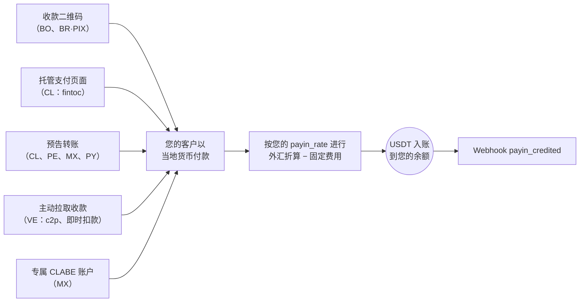

入金（payin）是一笔法币收款：您的客户以当地货币付款，您的账户自动获得
USDT 入账，按**您的入金汇率**（`GET /v1/rates` 中的 `payin_rate`）折算，
并在您的账户配置了固定入金费用时予以扣除。

无论采用哪种模式，每条路径的终点都相同 —— 自动入账 + webhook：



## 1. 查询可用通道

可用的国家、货币和收款模式由 CBPay 定义。请始终查询目录：

```bash
curl https://api.qbank.cl/platform/v1/payins/methods \
  -H "Authorization: Bearer <token>"
```

```json
{
  "items": [
    { "country": "BO", "currency": "BOB", "method": "qr", "delivery": "push" },
    { "country": "VE", "currency": "VES", "method": "c2p", "delivery": "push+polling" },
    { "country": "MX", "currency": "MXN", "method": "bank_transfer", "delivery": "push" }
  ],
  "meta": { "retrieved": 3 }
}
```

`delivery` 描述付款在 CBPay 一侧的确认方式（银行通知、轮询或两者兼有）
—— 它不会改变您的任何集成方式：您始终会收到 `payin_credited` webhook。

收款通道和模式：

| 国家 | 货币 | 模式 |
|---|---|---|
| 智利 | CLP | 托管支付页面（`fintoc`）、预告银行转账 |
| 秘鲁 | PEN | 预告银行转账 |
| 墨西哥 | MXN | 专属 CLABE 账户、预告银行转账 |
| 委内瑞拉 | VES | 主动收款 `c2p` 和 `debito_inmediato`（拉取式） |
| 玻利维亚 | BOB / USD | 收款二维码 |
| 巴拉圭 | PYG | 预告银行转账 |
| 巴西 | BRL | 动态 PIX 二维码 |

可用性可能变化；目录（`GET /v1/payins/methods`）始终是唯一可信来源。
在所有情况下入账方式相同：按您当前的 `payin_rate` 折算为 USDT，并在
扣除固定入金费用后净额入账。

## 2. 选择模式并创建收款

每个国家都有自己的收款模式。各模式的真实请求与响应如下：

<Tabs>
<Tab title="智利">

**托管支付页面（`fintoc`）** —— 推荐：您会获得一个 `payment_url`；
付款人打开它后可从**任意智利银行或钱包**（Banco Estado、Santander、
Mach、Tenpo、Mercado Pago……）转账。付款会被自动检测并校验 ——
无需手动填写参考号。

```bash
curl -X POST https://api.qbank.cl/platform/v1/payins \
  -H "Authorization: Bearer <token>" \
  -H "Content-Type: application/json" \
  -d '{
    "country": "CL",
    "currency": "CLP",
    "method": "fintoc",
    "amount": "150000",
    "description": "Top-up order 8841",
    "idempotency_key": "topup-8841"
  }'
```

响应 `201`：

```json
{
  "payin_id": "7a2b…",
  "status": "pending",
  "reference": "7a2b…",
  "payment_url": "https://pay.fintoc.com/plink_K2zwNNSxPyx8w3GZ",
  "expires_at": "2026-07-08T18:48:25Z",
  "note": "share the payment_url with the payer; the deposit is credited automatically once the transfer is detected"
}
```

将 `payment_url` 分享给付款人（链接、重定向或 WebView）。付款确认后，
您的账户即以 USDT 入账，并收到 `payin_credited` webhook。CLP 金额必须为
整数（智利比索没有小数位），支付会话默认在 24 小时后过期。使用相同的
`idempotency_key` 重试会返回同一笔入金和同一个 URL —— 绝不会开启第二个
支付会话。

**预告银行转账**（手动的替代方案）：预先申报即将到来的存款，并把
参考号分享给汇款人。

```bash
curl -X POST https://api.qbank.cl/platform/v1/payins \
  -H "Authorization: Bearer <token>" \
  -H "Content-Type: application/json" \
  -d '{
    "country": "CL",
    "currency": "CLP",
    "method": "bank_transfer",
    "amount": "500000"
  }'
```

响应 `201`：

```json
{
  "payin_id": "4f81…",
  "status": "pending",
  "reference": "CBJ6T3W9M2K5",
  "note": "include the reference in the transfer description so the deposit is credited automatically"
}
```

转账到达后，系统会根据转账附言中的参考号进行匹配（或以金额+货币作为
后备匹配方式），您的账户即自动入账。

</Tab>
<Tab title="秘鲁">

**预告银行转账**，与智利相同，但使用索尔：

```bash
curl -X POST https://api.qbank.cl/platform/v1/payins \
  -H "Authorization: Bearer <token>" \
  -H "Content-Type: application/json" \
  -d '{
    "country": "PE",
    "currency": "PEN",
    "method": "bank_transfer",
    "amount": "1800.00"
  }'
```

响应 `201`：

```json
{
  "payin_id": "6d20…",
  "status": "pending",
  "reference": "CBK7M2Q9X4T3",
  "note": "include the reference in the transfer description so the deposit is credited automatically"
}
```

`reference` 是一个**12 位字母数字短代码**（可放入任何银行的附言字段），
必须随转账附言一起传递以便自动匹配；金额+货币作为后备匹配方式。

</Tab>
<Tab title="墨西哥">

**专属 CLABE 账户**（推荐）：创建一个与您的账户绑定的固定 CLABE ——
到达该账户的每一笔 SPEI 都会自动入账，无需任何参考号：

```bash
curl -X POST https://api.qbank.cl/platform/v1/payins/deposit-accounts \
  -H "Authorization: Bearer <token>" \
  -H "Content-Type: application/json" \
  -d '{ "country": "MX", "currency": "MXN" }'
```

响应 `201`：

```json
{
  "instrument_id": "a1d4…",
  "account_id": "…",
  "country": "MX",
  "currency": "MXN",
  "method": "bank_transfer",
  "instrument": "734180000151000006",
  "status": "active"
}
```

`instrument` 就是您分享给付款人的 CLABE。创建免费；每笔存款按常规入金
费用计费。使用 `GET /v1/payins/deposit-accounts` 列出您的账户。

您也可以使用一次性的**预告银行转账**
（`POST /v1/payins`，`method: "bank_transfer"`、`country: "MX"`）。

</Tab>
<Tab title="委内瑞拉">

**主动收款（拉取式）**：在获得付款人授权后直接向其发起扣款。结果为
**同步**返回 —— 扣款获批后，入账在同一次调用中完成。

对于 `debito_inmediato`，请先请求 OTP（免费）：

```bash
curl -X POST https://api.qbank.cl/platform/v1/payins/collect/otp \
  -H "Authorization: Bearer <token>" \
  -H "Content-Type: application/json" \
  -d '{
    "method": "debito_inmediato",
    "amount": "1200.00",
    "payer_document": "V12345678",
    "payer_phone": "04141234567",
    "payer_bank": "0102",
    "payer_account": "01020123456789012345"
  }'
```

```json
{
  "method": "debito_inmediato",
  "result": { "status": "sent", "otp_reference": "OTP-5521" }
}
```

然后执行收款：

<CodeGroup>

```bash c2p (phone + ID + payer's OTP)
curl -X POST https://api.qbank.cl/platform/v1/payins/collect \
  -H "Authorization: Bearer <token>" \
  -H "Content-Type: application/json" \
  -d '{
    "method": "c2p",
    "amount": "1200.00",
    "description": "Order 5512",
    "payer_document": "V12345678",
    "payer_phone": "04141234567",
    "payer_bank": "0102",
    "otp": "12345678",
    "idempotency_key": "order-5512"
  }'
```

```bash debito_inmediato (account + previously requested OTP)
curl -X POST https://api.qbank.cl/platform/v1/payins/collect \
  -H "Authorization: Bearer <token>" \
  -H "Content-Type: application/json" \
  -d '{
    "method": "debito_inmediato",
    "amount": "1200.00",
    "description": "Order 5512",
    "payer_document": "V12345678",
    "payer_account": "01020123456789012345",
    "payer_bank": "0102",
    "payer_account_type": "CNTA",
    "otp": "87654321",
    "otp_reference": "OTP-5521",
    "idempotency_key": "order-5512"
  }'
```

<Note>
主动收款会对付款人执行真实扣款，因此 `idempotency_key` 为**必填**
（请求体或 `Idempotency-Key` 请求头）：使用相同的键重试会返回带
`idempotency_hit` 的原始结果，绝不会重复扣款。
</Note>

</CodeGroup>

响应 `200`（扣款获批并已入账）：

```json
{
  "payin_id": "7b3c…",
  "kind": "collect",
  "method": "c2p",
  "status": "credited",
  "local_amount": "1200.00",
  "fx_rate": "36.50",
  "usdt_gross": "32.876712",
  "fee": "0.300000",
  "usdt_credited": "32.576712",
  "paid": true,
  "provider_reference": "…"
}
```

如果付款人拒绝或授权失败，`paid` 为 `false`，该入金被标记为
`failed`，且不会产生任何扣款。

</Tab>
<Tab title="玻利维亚">

**收款二维码**（本地互操作标准）：您生成二维码，客户用其银行 App
扫码支付。

```bash
curl -X POST https://api.qbank.cl/platform/v1/payins \
  -H "Authorization: Bearer <token>" \
  -H "Content-Type: application/json" \
  -d '{
    "country": "BO",
    "currency": "BOB",
    "method": "qr",
    "amount": "700.00",
    "description": "App top-up",
    "expires_in": 3600
  }'
```

响应 `201`：

```json
{
  "payin_id": "9c2a…",
  "status": "pending",
  "charge": {
    "charge_id": "…",
    "qr_image": "<base64>",
    "qr_image_url": "https://cdn.cbpayapp.com/public/payin-qr/<charge_id>.png",
    "qr_payload": "<QR content>",
    "our_reference": "482915073",
    "status": "pending"
  }
}
```

将二维码展示给您的客户 —— `qr_image_url` 是可直接用于 `` 标签的
公共 CDN URL（优先使用它而非 base64 的 `qr_image`）；客户付款后，
您的账户会自动入账。它同样支持 USD（`currency: "USD"`）。

</Tab>
<Tab title="巴拉圭">

以瓜拉尼进行的**预告银行转账**：您预先申报存款，付款人转账（跨行
SIPAP 或在收款银行内部转账）并在转账附言中带上参考号，入账即被自动
检测。

```bash
curl -X POST https://api.qbank.cl/platform/v1/payins \
  -H "Authorization: Bearer <token>" \
  -H "Content-Type: application/json" \
  -d '{
    "country": "PY",
    "currency": "PYG",
    "method": "bank_transfer",
    "amount": "596000"
  }'
```

响应 `201`：

```json
{
  "payin_id": "8f41…",
  "status": "pending",
  "reference": "CBW4N8R2T6P9",
  "note": "include the reference in the transfer description so the deposit is credited automatically"
}
```

<Note>
瓜拉尼没有小数位：请申报付款人将转账的**精确整数金额**（例如
`"596000"`）。`reference` 是一个 12 位字母数字短代码 —— 专为 SIPAP
附言字段设计，该字段**最多接受 20 个字符且不允许特殊字符** ——
将其填入附言可确保自动匹配；金额+货币匹配作为后备方式。
</Note>

</Tab>
<Tab title="巴西">

**动态 PIX 二维码**：同一端点生成内嵌金额的 PIX 二维码。

```bash
curl -X POST https://api.qbank.cl/platform/v1/payins \
  -H "Authorization: Bearer <token>" \
  -H "Content-Type: application/json" \
  -d '{
    "country": "BR",
    "currency": "BRL",
    "method": "qr",
    "amount": "120.00",
    "description": "Order 7719",
    "expires_in": 1800
  }'
```

响应中的 `charge.qr_payload` 就是 PIX 的 **"copia e cola"** 代码，
付款人可将其粘贴到银行 App 中，而无需扫描图片（`charge.qr_image`
base64 或 `charge.qr_image_url`，即公共 CDN URL）。二维码按
`expires_in` 过期（默认 1 小时）；付款在通道确认后自动入账
（持续对账 —— 可随时使用 `GET /v1/payins/{charge_id}` 查询）。

<Note>
在巴西，收款仅通过动态 PIX 二维码进行（一个二维码 = 一笔付款，
内嵌精确金额）。预告银行转账将在之后推出。
</Note>

</Tab>
</Tabs>

## 3. 接收入账

当付款到达（无论通过哪种模式），您的账户会自动入账，并触发
`payin_credited` webhook：

```json
{
  "payin_id": "9c2a…",
  "account_id": "…",
  "country": "BO",
  "currency": "BOB",
  "local_amount": "700.00",
  "fx_rate": "6.91",
  "usdt_credited": "100.302460",
  "fee": "1.000000"
}
```

`fx_rate` 是入账时刻您的 `payin_rate` —— 折算严格按该汇率进行：
`usdt_gross = 700.00 / 6.91`。

入金对象保留完整的明细：

```bash
curl https://api.qbank.cl/platform/v1/payins/9c2a… \
  -H "Authorization: Bearer <token>"
```

```json
{
  "payin_id": "9c2a…",
  "kind": "qr",
  "status": "credited",
  "local_amount": "700.00",
  "fx_rate": "6.91",
  "usdt_gross": "101.302460",
  "fee": "1.000000",
  "usdt_credited": "100.302460"
}
```

## 状态

| 状态 | 含义 |
|---|---|
| `pending` | 收款已创建，等待付款 |
| `credited` | 已收到付款并以 USDT 入账 |
| `unassigned` | 收到的存款未能自动匹配（由管理员路由分配） |
| `expired` | 收款过期且未支付 |
| `failed` | 收款失败 |

<Info>
通过直接转账到达但缺少清晰参考号的存款会保持 `unassigned` 状态，直到
CBPay 团队将其路由到某个账户。分配后，按目标账户的汇率和费用入账。
</Info>

<Note>
当一笔待支付的代收（二维码或 checkout）在未收到付款的情况下终止时，payin
会自动从 `pending` 变为 `expired`（或 `failed`），并且您会收到
[`payin_expired`](/zh/webhooks) webhook。不产生任何资金变动：如需重新
收款，请创建新的 payin。
</Note>

## 查询与历史记录

```bash
# One payin
curl https://api.qbank.cl/platform/v1/payins/9c2a… \
  -H "Authorization: Bearer <token>"

# History with filters
curl "https://api.qbank.cl/platform/v1/payins?from=2026-07-01&to=2026-07-08&status=credited&country=BO&page_size=50" \
  -H "Authorization: Bearer <token>"
```

`from`/`to` 使用 `YYYY-MM-DD`（UTC）；日期无效时返回
`400 invalid_range`。

## 常见错误

| HTTP | `error` | 应对方式 |
|---|---|---|
| 400 | `invalid_request` | 检查 `method`（qr、bank_transfer、fintoc；collect 有自己的端点） |
| 400 | `idempotency_key_required` | Collect 需要幂等键（对付款人的真实扣款） |
| 403 | `service_disabled` | 您的账户未启用入金服务 —— 参见[服务](/zh/concepts/services) |
| 422 | `core_rejected` | 处理方拒绝了该收款；请检查消息 |
| 502 | `core_unavailable` | 收款无法创建；请重试创建（未产生任何扣款） |
