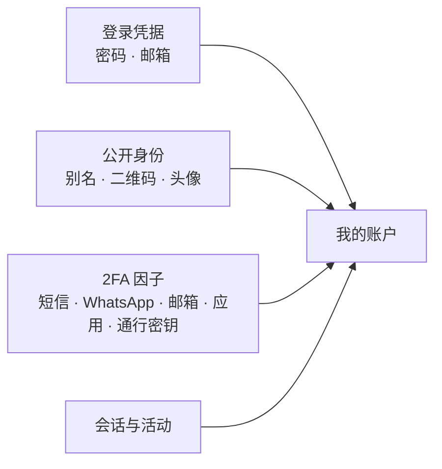

import { EnvUrls } from "/snippets/env-urls.jsx";

<EnvUrls lang="zh" />

终端用户可管理的与**自己账户**相关的一切：登录凭据（密码和邮箱）、用于收款的公开身份（别名、二维码和头像）、双重验证（2FA）因子，以及对会话和安全活动的控制。这些功能全部位于 `/v1/me/*` 和 `/v1/auth/*` 下，并要求**用户会话**（JWT）；API key 不适用。



## 档案数据与已验证身份

`PATCH /v1/me` 用于更新档案数据（`display_name`、`tax_id`、`phone`、
`country`）。但身份验证（KYC/KYB）**获批**后，姓名、税号和国家会
**自动由已验证的身份填充**——以验证确认的信息为准，而非自行申报的内容——
并且通过此端点变为**不可修改**：

```json
{
  "error": "identity_locked",
  "message": "display_name, tax_id and country come from your approved identity verification and cannot be changed here; contact support to update your verified identity"
}
```

如需更正已验证的数据（例如公司名称变更），请联系平台支持：需要重新验证
或由管理员执行运营层面的覆盖。`phone` 随时可通过其专属验证流程修改
（政策要求时会向旧号码发送 OTP）。

## 密码

<Steps>
<Step title="修改密码（有会话时）">
使用 `current_password` 和 `new_password` 调用 `POST /v1/me/password`。如果你的账户是通过社交登录创建、尚未设置过密码，将 `current_password` 留空即可设置第一个密码。修改密码会**撤销所有其他会话**，响应中会携带一个新的会话。

```bash
curl -X POST https://api.qbank.cl/platform/v1/me/password \
  -H "Authorization: Bearer $TOKEN" \
  -d '{"current_password":"old-pass","new_password":"my-new-strong-pass"}'
```
</Step>
<Step title="找回密码（无会话时）">
使用 `org` 和 `email` 调用 `POST /v1/auth/password/forgot`。无论账户是否存在，它**始终**返回 200 且响应体相同（绝不透露该邮箱是否已注册）。验证码发送到邮箱；若指定 `channel:"sms"`，则发送到已验证的手机号。

```bash
curl -X POST https://api.qbank.cl/platform/v1/auth/password/forgot \
  -d '{"org":"cbpay","email":"taylor@example.com"}'
```

然后使用 `code` 和 `new_password` 调用 `POST /v1/auth/password/reset`。该操作会撤销所有会话。
</Step>
</Steps>

## 登录邮箱

邮箱可以更换，但**新邮箱始终需要验证**：验证码发送到新地址，只有确认后更换才会生效。这可以防止任何人将登录指向一个他并不控制的邮箱。

<Steps>
<Step title="发起更换">
使用 `new_email` 调用 `POST /v1/me/email/change`。如果 2FA 策略要求，还需为 `email_change` 操作附带 `X-OTP-Token` 请求头。
</Step>
<Step title="用验证码确认">
使用在新邮箱收到的 `code` 调用 `POST /v1/me/email/confirm`。旧邮箱会收到更换通知。
</Step>
</Steps>

<Note>
更换邮箱**不会**影响你已绑定的社交登录（Google、Apple 等）：它们以提供方标识，而非邮箱。
</Note>

## 用于收款的别名和二维码

每个账户都有两个**永久性**的公开标识，方便他人在 CBPay 账户之间向你转账：

- **别名（Alias）** — 通过 `PUT /v1/me/alias` 一次性设定（4-20 个字符，允许 `a-z 0-9 . _ -`，不可使用保留词）。设定后不可更改。
- **个人资料二维码** — `GET /v1/me/qr` 返回 `qr_token`、载荷 `cbpay:pay?to=<token>` 以及可直接渲染的 PNG。它只允许他人**向你转入**资金，因此永不变化。

即将付款的人可以先通过 `GET /v1/resolve?alias=taylor.code`（或 `?qr=<token>`）确认你的身份，该接口返回你的姓名、类型和头像。转账也可以直接使用该目标：

```bash
curl -X POST https://api.qbank.cl/platform/v1/transfers \
  -H "Authorization: Bearer $TOKEN" \
  -d '{"to_alias":"taylor.code","amount":"10.00","idempotency_key":"t-001"}'
```

`to_qr_token` 的用法相同（接受 token 或 `cbpay:pay?to=…` 载荷）。

## 头像

使用图片字节流调用 `PUT /v1/me/avatar`（JPEG、PNG 或 WebP，最大 512 KB；类型从内容自动识别）。`DELETE /v1/me/avatar` 可删除头像，`GET /v1/avatars/{accountID}` 用于预览展示。

响应包含 `avatar_url`：当图片已发布到公共 CDN 时，它是一个**无需认证即可加载的绝对 URL**（非常适合前端 — 直接放入 `` 使用）；此时 `GET /v1/avatars/{accountID}` 会以 `302` 重定向到同一 URL。

```json
{
  "status": "avatar_updated",
  "content_type": "image/png",
  "size_bytes": 20481,
  "avatar_url": "https://cdn.cbpayapp.com/public/avatars/1fa63bd1-…/9b1deb4d-…"
}
```

## 双重验证（2FA）

CBPay 通过一次性验证码保护敏感操作。你可以按操作选择是否要求验证，以及通过**哪个渠道**：

| 渠道 | 验证码送达方式 | 说明 |
|---|---|---|
| `sms` / `whatsapp` | 发送到手机的消息 | 取决于渠道可用性 |
| `email` | 发送到已验证邮箱的邮件 | 要求邮箱已验证 |
| `totp` | 身份验证器应用（Google Authenticator、Authy） | 免疫 SIM 卡劫持；不发送任何消息 |

`GET /v1/otp/preferences` 显示你的生效策略（以及你所在组织的要求，后者是**下限**：你可以更严格，但不能低于它）。`PUT /v1/otp/preferences` 用于调整策略。**削弱** 2FA（关闭某个操作或降低渠道等级）需要先验证你当前的因子。

<Warning>
通过 `sms` 或 `whatsapp` 启用**登录** 2FA 前，你的手机号必须已**验证**（先完成任意
SMS/WhatsApp OTP 挑战：`POST /v1/otp/challenges` + verify）。号码未验证时 API 返回
`409 phone_verification_required` — 这样输错的号码不会把你锁在账户外。
</Warning>

### 身份验证器应用（TOTP）

<Steps>
<Step title="注册">
`POST /v1/me/totp/enroll` 返回 `otpauth://` 链接和二维码。在你的应用中扫描它。
</Step>
<Step title="确认">
使用第一个验证码调用 `POST /v1/me/totp/confirm`。它会发给你 **10 个一次性备用码** — 请妥善保存，它们只显示这一次。
</Step>
</Steps>

通过 `POST /v1/me/totp/recovery-codes` 可重新生成备用码，通过 `DELETE /v1/me/totp` 可移除该应用（两者均需要有效验证码）。

### 通行密钥（Passkeys）

**通行密钥**让你无需密码即可登录，使用设备的生物识别（Face ID、Touch ID、Windows Hello 或安全密钥）。

<Steps>
<Step title="注册">
`POST /v1/me/passkeys/register/begin` → 将 `options.publicKey` 传给 `navigator.credentials.create()` → 使用结果和一个名称（"Taylor's MacBook"）调用 `POST /v1/me/passkeys/register/finish`。
</Step>
<Step title="登录">
使用 `org` 调用 `POST /v1/auth/passkey/login/begin` → `navigator.credentials.get()` → `POST /v1/auth/passkey/login/finish`。由于通行密钥本身已包含两个因子（设备 + 生物识别），此登录不再要求第二个验证码。
</Step>
</Steps>

使用 `GET`/`DELETE /v1/me/passkeys` 可列出和移除你的通行密钥。你无法移除自己**唯一**的登录方式。

<Note>
通行密钥及其注册依赖于你所在组织已配置其域名；否则会返回 `passkeys_unavailable`。
</Note>

## 会话与活动

- `GET /v1/me/sessions` 列出你的活跃会话（设备、IP、登录方式、当前会话标识）。`DELETE /v1/me/sessions/{id}` 关闭某一个会话；`POST /v1/me/sessions/revoke-all` 关闭除当前之外的所有会话。
- `GET /v1/me/security/events?from=&to=` 是你账户的安全历史记录：登录、密码或邮箱更换、因子的添加或移除。

此外，当你的密码或邮箱发生更改，或某个因子被添加/移除时，CBPay 会**向你发送邮件通知** — 这是你防范未授权访问的安全网。

## 常见错误

| 代码 | HTTP | 处理方式 |
|---|---|---|
| `invalid_password` | 403 | 当前密码不匹配 |
| `alias_already_set` | 409 | 别名已设定；它是永久性的 |
| `alias_taken` | 409 | 该别名已被占用；请换一个 |
| `email_in_use` | 409 | 另一个登录已使用该邮箱 |
| `no_pending_email` | 409 | 没有待确认的邮箱更换；请重新发起 |
| `policy_locked_by_org` | 403 | 你所在组织强制要求该操作/渠道；无法削弱 |
| `totp_enrollment_required` | 409 | 在要求 `totp` 渠道之前需先注册应用 |
| `phone_verification_required` | 409 | 通过 SMS/WhatsApp 启用登录 2FA 前需先验证手机号（OTP 挑战） |
| `last_login_method` | 409 | 无法移除你唯一的登录方式 |
| `passkeys_unavailable` | 503 | 你所在组织未配置通行密钥 |
| `image_too_large` / `unsupported_image` | 413 / 415 | 头像最大 512 KB，JPEG/PNG/WebP |

<AccordionGroup>
<Accordion title="以后可以更改我的别名或二维码吗？">
不可以。两者在设计上都是永久性的：它们是你用于收款的稳定身份。二维码只允许收款，因此分享它没有风险。
</Accordion>
<Accordion title="我丢失了装有身份验证器应用的手机">
在任何验证或登录中使用你的一个**备用码**（确认 TOTP 时获得的那些）。如果没有备用码，请使用另一个因子（通行密钥或密码 + 其他渠道）恢复访问，然后重新生成所有内容。
</Accordion>
<Accordion title="更换邮箱会断开我与 Google/Apple 的连接吗？">
不会。社交登录以提供方标识，而非邮箱，因此它们会继续正常工作。
</Accordion>
</AccordionGroup>
