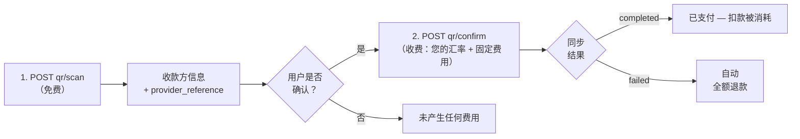

import { EnvUrls } from "/snippets/env-urls.jsx";

<EnvUrls lang="zh" />

在玻利维亚（本地互操作 QR 标准）和巴西（**PIX 二维码**，包括
"copia e cola" 代码），您还可以分两步**支付收款二维码**：扫码与确认。
扫码**免费**；只在确认时收费，与普通出金完全相同（您的汇率 + 固定
费用）。如未提供 `country`/`currency`，默认按玻利维亚（BOB）处理；
巴西请发送 `country: "BR"` 和 `currency: "BRL"`。



## 1. 扫描二维码（免费）

<Tabs>
<Tab title="玻利维亚">

```bash
curl -X POST https://api.qbank.cl/platform/v1/payouts/qr/scan \
  -H "Authorization: Bearer <token>" \
  -H "Content-Type: application/json" \
  -d '{
    "qr_payload": "<QR content>",
    "currency": "BOB"
  }'
```

返回收款方的信息，以便用户确认付款对象：

```json
{
  "scan_id": "…",
  "provider_reference": "…",
  "beneficiary_name": "Juan Quispe",
  "destination_account": "…",
  "amount": "700.00",
  "currency": "BOB",
  "glosa": "",
  "status": "…"
}
```

</Tab>
<Tab title="巴西（PIX 二维码）">

`qr_payload` 接受 PIX 二维码的原始内容（EMV BR Code）**或
"copia e cola" 代码** —— 二者是同一个字符串：

```bash
curl -X POST https://api.qbank.cl/platform/v1/payouts/qr/scan \
  -H "Authorization: Bearer <token>" \
  -H "Content-Type: application/json" \
  -d '{
    "country": "BR",
    "currency": "BRL",
    "qr_payload": "00020126360014br.gov.bcb.pix0114+5511998765432520400005303986540575.005802BR5913LOJA DA MARIA6009SAO PAULO62110507PED423163040BF9"
  }'
```

扫描会在本地解码 BR Code（校验其校验和），返回目标 PIX 密钥、商户
名称，以及二维码携带固定金额时的金额：

```json
{
  "scan_id": "PIXSCAN-…",
  "provider_reference": "<同一个 EMV payload>",
  "beneficiary_name": "LOJA DA MARIA",
  "destination_account": "+5511998765432",
  "amount": "75.00",
  "currency": "BRL",
  "glosa": "",
  "status": "scanned"
}
```

- `amount` 为空表示**开放金额**二维码：由您在确认步骤决定支付多少。
  固定金额时，确认必须发送完全一致的金额。
- 支持**静态** PIX 二维码（印刷/可重复使用、密钥内嵌的那种）。
  **动态**二维码（payload 携带 PSP 的 URL 而非密钥）会返回 `400`
  和 `dynamic pix qr codes are not supported yet` —— 请向收款方索取其
  PIX 密钥并使用 [`pix`](/zh/guides/payouts#各国示例) 方法。
- 被篡改或截断的 payload 会返回 `400`（CRC 校验和无效）。

</Tab>
</Tabs>

## 2. 确认支付（此步收费）

<Tabs>
<Tab title="玻利维亚">

```bash
curl -X POST https://api.qbank.cl/platform/v1/payouts/qr/confirm \
  -H "Authorization: Bearer <token>" \
  -H "Content-Type: application/json" \
  -d '{
    "provider_reference": "<from the scan>",
    "amount": "700.00",
    "currency": "BOB",
    "description": "QR lunch payment",
    "idempotency_key": "qr-2026-07-07-a"
  }'
```

</Tab>
<Tab title="巴西（PIX 二维码）">

```bash
curl -X POST https://api.qbank.cl/platform/v1/payouts/qr/confirm \
  -H "Authorization: Bearer <token>" \
  -H "Content-Type: application/json" \
  -d '{
    "country": "BR",
    "currency": "BRL",
    "provider_reference": "<from the scan>",
    "amount": "75.00",
    "description": "Order 4231",
    "idempotency_key": "qr-br-2026-07-16-a"
  }'
```

- `amount` 始终必填：固定金额二维码必须完全一致 —— 否则返回 `422`，
  出金处于 `status: failed`（`status_message: "amount mismatch: the qr
  requires exactly 75.00 BRL"`），且**退款已自动完成**；修正金额后用
  新的键重试。开放金额二维码则按您发送的金额支付。
- **静态 PIX 二维码天生可复用**（商户打印的二维码会被支付多次）：
  可以用不同的 `idempotency_key` 再次支付。失败的尝试**不会作废该
  二维码**。
- 付款走与 `pix` 方法相同的 PIX 通道（24/7）；二维码中的 `txid`
  会随付款传递，便于商户自动对账。

</Tab>
</Tabs>

- 按**您的汇率**扣除 `usdt_amount + 固定费用`，与 `bank_transfer`
  完全一致。
- 结果为**同步**返回：响应中已包含最终状态（`completed`，或 `failed`
  并自动退款）—— 无需等待。
- 使用相同 `idempotency_key` 重试会返回原始出金。玻利维亚的扫码引用
  为一次性（已扫描的二维码只能支付一次）；巴西的静态 PIX 二维码可
  复用，每笔支付携带自己的键。
