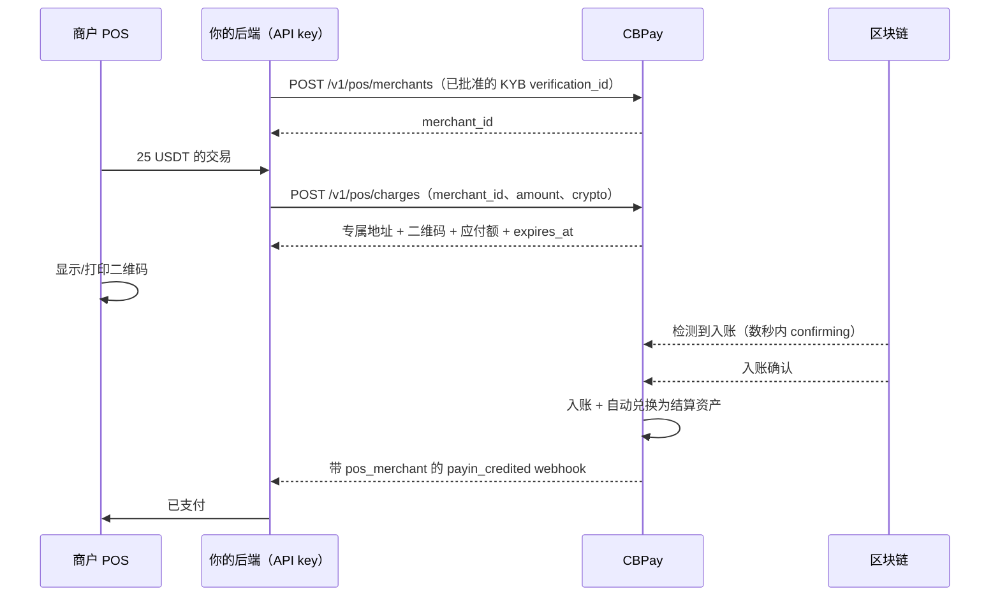

import { EnvUrls } from "/snippets/env-urls.jsx";

<EnvUrls lang="zh" />

QR Crypto POS 是面向**拥有企业账户的处理商/收单机构**的产品，适用于运营实体
POS 终端的场景：将你的商户（餐厅、酒店、门店）注册为已验证的
*merchant*，并生成**带精确金额的加密货币二维码收款**（USDT、USDC、
BTC）。POS 显示或打印二维码，顾客用钱包或交易所应用扫码支付，API 检测
链上支付：余额记入**你的账户**（自动兑换为你的结算资产），且每笔收款都
带有**商户归属** — 你能准确知道每个商户收了多少，之后再通过任意通道
（内部转账、法币出金、加密货币）与他们结算。

<Note>
QR Crypto POS 面向已启用 `pos` 服务的**已验证企业账户**。每笔收款使用
**专属地址**（来自[通用收款链接](/zh/guides/checkout)
引擎的临时钱包）：不同收款之间的支付绝不会串单。
</Note>

## 端到端流程



## 1. 注册商户（每个客户一次）

每个商户都必须绑定一份**已批准**的[第三方 KYC/KYB 验证](/zh/guides/kyc)
— 商户身份来自验证，绝不手工申报。可以为商户配置**信息性佣金**
（`fee_percent` + `fee_fixed`）：不移动资金，但 API 会在每笔已支付收款上
计算，汇总接口告诉你应分配的净额。

```bash
curl -X POST "https://api.qbank.cl/platform/v1/pos/merchants" \
  -H "Authorization: Bearer $API_KEY" -H "Content-Type: application/json" \
  -d '{
    "verification_id": "9e2f41d0-6b3e-4b57-9d5c-2f2f0a97c001",
    "name": "La Terraza 餐厅",
    "external_ref": "resto-001",
    "fee_percent": "1",
    "fee_fixed": "0"
  }'
```

```json
{
  "merchant_id": "d2875683-fc80-4c7b-876a-fb585d7c6982",
  "account_id": "5138e8dd-64bd-43ef-aafe-8d9ef23bec9e",
  "name": "La Terraza 餐厅",
  "verification_id": "9e2f41d0-6b3e-4b57-9d5c-2f2f0a97c001",
  "external_ref": "resto-001",
  "fee_percent": "1",
  "fee_fixed": "0",
  "status": "active",
  "created_at": "2026-07-17T19:40:00Z",
  "updated_at": "2026-07-17T19:40:00Z"
}
```

用 `GET /v1/pos/merchants`（分页）和 `GET /v1/pos/merchants/{id}` 查询。
`PATCH /v1/pos/merchants/{id}` 可修改 `status`（`active`/`disabled` —
停用的商户无法生成新收款）、佣金和 `external_ref`。身份不可编辑：以验证
为准。

## 2. 生成收款（每笔交易一个）

契约与通用收款链接一致：金额以你的 `settlement_asset` 计价（缺省时用
账户默认值），顾客支付的**应付额在创建收款时按二维码的加密货币报价** —
若顾客支付的资产与你的不同，兑换成本已包含在应付额中（你收到精确的
目标金额）。

```bash
curl -X POST "https://api.qbank.cl/platform/v1/pos/charges" \
  -H "Authorization: Bearer $API_KEY" -H "Content-Type: application/json" \
  -d '{
    "merchant_id": "d2875683-fc80-4c7b-876a-fb585d7c6982",
    "amount": "25",
    "crypto": "tron:usdt",
    "reference": "TICKET-0451",
    "expires_in": 900,
    "idempotency_key": "pos-0451-1"
  }'
```

```json
{
  "charge_id": "66773a3a-9911-4482-ae3c-09a481aba018",
  "payin_id": "bd3d88ca-af9c-4c05-a6f8-0982a2d187d5",
  "status": "pending",
  "amount": "25",
  "settlement_asset": "USDT",
  "crypto": "tron:usdt",
  "chain": "tron",
  "asset": "USDT",
  "address": "TC5SToDEigQtie7Crf9et7ui7zDsvdDHeG",
  "due": "25.000000",
  "received": "0.000000",
  "qr_payload": "TC5SToDEigQtie7Crf9et7ui7zDsvdDHeG",
  "qr_png_base64": "iVBORw0KGgo…",
  "merchant": { "id": "d2875683-…", "name": "La Terraza 餐厅", "external_ref": "resto-001" },
  "reference": "TICKET-0451",
  "expires_at": "2026-07-17T19:55:00Z",
  "receipt_url": "https://api.qbank.cl/platform/v1/payins/bd3d88ca-…/receipt",
  "created_at": "2026-07-17T19:40:00Z"
}
```

- `crypto`：`tron:usdt`、`eth:usdt`、`eth:usdc` 或 `btc:btc`。
- `expires_in`：300–86400 秒（默认 900）。涉及 BTC 的报价冻结 15 分钟
  （`quote_expires_at`）。
- `idempotency_key` **必填**：用同一键重试返回同一笔收款和同一地址
  （`idempotency_hit: true`）— POS 重试绝不会开出第二笔收款。
- **二维码是裸地址**（兼容 Binance 及所有钱包）；把 `due` 打印在旁边。

<Tip>
POS 大批量场景推荐 **TRON/USDT** 作为主通道：约 1 分钟确认，网络成本
最低。BTC 约 30 分钟确认 — 适合大额账单，不适合买咖啡。
</Tip>

## 3. 检测支付（轮询或 webhook）

**POS 轮询**：每隔几秒 `GET /v1/pos/charges/{charge_id}`。入账刚出现在
链上（通常 2-3 秒，早于确认），响应即带**早期检测**：

```json
{
  "charge_id": "66773a3a-…",
  "status": "pending",
  "confirming": true,
  "detected_amount": "25.000000",
  "due": "25.000000",
  "received": "0.000000"
}
```

`confirming` 是 UX 信号（"已检测到支付，确认中…"）— 真正的入账只在链上
确认后发生：`status` 变为 `paid`，`received` 反映累计金额，`paid_at`
被记录。

**Webhook**（推荐用于结单）：`payin_credited` 附带归属块：

```json
{
  "event_type": "payin_credited",
  "data": {
    "payin_id": "bd3d88ca-…",
    "kind": "pos",
    "settled_via": "crypto:tron:usdt",
    "crypto_amount": "25.000000",
    "settlement_asset": "USDT",
    "asset_amount": "25",
    "pos_merchant": { "id": "d2875683-…", "name": "La Terraza 餐厅", "external_ref": "resto-001" },
    "receipt_url": "…"
  }
}
```

### 收款状态

| 状态 | 含义 | 处理方式 |
|---|---|---|
| `pending` | 等待支付 | POS 继续显示二维码 |
| `pending` + `confirming: true` | 已检测到入账，链上确认中 | 显示"已检测到支付"（TRON 约 1 分钟，ETH 数分钟，BTC 约 30 分钟） |
| `paid` | 达到目标并已入账你的余额 | 结单；自动兑换为结算资产自行完成 |
| `expired` | 到期未完成支付 | 顾客仍想支付时生成新收款 |

**部分支付**会累加（`received`）直到达标；只有完成时才 `paid`。
**迟到支付**：到期后到账的资金仍会记入你的账户（地址持续有效）并发出
webhook — 过期收款的 `received` 会反映出来供你对账，真实支付绝不丢失。
**超额支付**（小费）同样入账。

## 4. 按商户对账与分账

`GET /v1/pos/charges?from=…&to=…&merchant_id=…` 列出每个商户的收款
（`merchant_id`、`status` 筛选；标准分页）。

`GET /v1/pos/summary?from=…&to=…` 返回**按商户**的汇总 — 与每个客户
结算的视图：

```bash
curl "https://api.qbank.cl/platform/v1/pos/summary?from=2026-07-01&to=2026-07-17" \
  -H "Authorization: Bearer $API_KEY"
```

```json
{
  "from": "2026-07-01", "to": "2026-07-17",
  "merchants": [
    {
      "merchant_id": "d2875683-…",
      "name": "La Terraza 餐厅",
      "external_ref": "resto-001",
      "charges_count": 214,
      "paid_count": 201,
      "fee_percent": "1",
      "fee_fixed": "0",
      "totals": [
        { "settlement_asset": "USDT", "gross": "5025.000000", "processor_fee": "50.250000", "net_for_merchant": "4972.750000" }
      ],
      "refunded": [ { "asset": "USDT", "amount": "2.000000" } ]
    }
  ]
}
```

`gross` 是收款总额（已支付收款的目标金额），`processor_fee` 是你在商户
上配置的佣金，`net_for_merchant` 是应分配给商户的净额（同资产的退款已
扣除）。分账走现有通道：[内部转账](/zh/guides/transfers)、
[法币出金](/zh/guides/payouts)或[加密货币提现](/zh/guides/crypto)。

## 5. 退款

`POST /v1/pos/charges/{charge_id}/refund` 把（部分）已收资金退还给付款
人，作为一笔从你余额发出的**普通加密货币提现** — 带持有、提现手续费和
该通道的全部合规控制。

```bash
curl -X POST "https://api.qbank.cl/platform/v1/pos/charges/66773a3a-…/refund" \
  -H "Authorization: Bearer $API_KEY" -H "Content-Type: application/json" \
  -d '{
    "amount": "25",
    "to_address": "TXHkw6bYtL2j…",
    "idempotency_key": "pos-ref-0451-1"
  }'
```

```json
{
  "refund_id": "b92b1ac0-…",
  "charge_id": "66773a3a-…",
  "withdrawal_id": "4630fe8c-…",
  "amount": "25.000000",
  "asset": "USDT",
  "to_address": "TXHkw6bYtL2j…",
  "status": "processing",
  "tx_id": "SIMTX…",
  "created_at": "2026-07-17T20:01:00Z"
}
```

关键规则：

- **`to_address` 必须显式提供。**我们绝不自动退回入账来源地址：那可能
  是交易所的热钱包，你的顾客并不掌控该地址（资金会丢失）。请向顾客索取
  并确认退款地址；已收到的 `from_address` 保留在收款详情中作参考。
- **硬上限**：一笔收款的退款总额绝不能超过其已收金额
  （`422 refund_exceeds_received`），并发请求下同样成立。
- 适用于任何**已收到资金**的收款 — 包括收到迟到支付的过期收款（最常见
  的退款场景）。
- 退款以**收款的加密货币**发出：由于支付已兑换为你的结算资产，你需要
  该加密货币的余额（不足时先[兑换](/zh/guides/swaps)回来；错误码为
  `insufficient_funds`）。
- 状态跟随提现生命周期（`pending` → `processing` →
  `completed`/`failed`；失败的提现会退回你的扣款并释放上限）。用
  `GET /v1/pos/charges/{id}/refunds` 查询。

## 产品错误

| HTTP | 错误码 | 解决方案 |
|---|---|---|
| 422 | `verification_required` | 用商户已批准的第三方 KYC/KYB 的 `verification_id` 注册商户 |
| 422 | `verification_not_approved` | 等待验证批准（或检查其状态）后再注册商户 |
| 422 | `merchant_disabled` | 先重新启用商户（`PATCH status: "active"`）再生成收款 |
| 400 | `idempotency_key_required` | 收款和退款都要携带 `idempotency_key`（body 或 `Idempotency-Key` 头） |
| 400 | `invalid_request` | `crypto` 须为 `tron:usdt`、`eth:usdt`、`eth:usdc` 或 `btc:btc`；`expires_in` 在 300 与 86400 之间 |
| 503 | `pricing_unavailable` | 加密货币价格不满足结算级（BTC）；稍后重试 |
| 422 | `nothing_received` | 该收款未收到任何链上支付：无可退款 |
| 422 | `refund_exceeds_received` | 降低金额：已收 − 已退是上限 |
| 400 | `to_address_required` | 显式提供退款地址（绝不自动退回来源） |
| 402 | `insufficient_funds` | 该收款加密货币的余额不足以退款：先兑换回来 |
| 403 | `company_required` | QR Crypto POS 仅面向企业账户 |

## 常见问题

<AccordionGroup>
<Accordion title="POS 上确认支付要多久？">
早期检测（`confirming: true`）2-3 秒内出现。最终确认取决于网络：TRON
约 1 分钟，Ethereum 数分钟，Bitcoin 约 30 分钟。由你决定是在
`confirming` 时放行交易（风险自担）还是等 `paid`。POS 场景推荐
TRON/USDT。
</Accordion>
<Accordion title="可以把二维码打印在纸上吗？">
可以 — `qr_png_base64` 可直接打印，`qr_payload` 是裸地址，供你的 POS
本地生成二维码。请把 `due` 和网络打印在旁边：顾客必须通过正确的网络
发送精确金额。
</Accordion>
<Accordion title="顾客付少了、付多了或付晚了怎么办？">
付少：收款保持 `pending`，累计（`received`）直到达标。付多（小费）：
超额同样入账。付晚（过期后）：仍会入账并发出 webhook — 过期收款的
详情显示 `received` 供对账。真实支付绝不丢失。
</Accordion>
<Accordion title="资金记在餐厅名下吗？">
不 — 全部记入你（处理商）的账户，并兑换为你的结算资产。按商户的归属
（收款、webhook 和汇总）准确告诉你每个商户对应多少，之后你可以用任意
通道分账。
</Accordion>
<Accordion title="有哪些费用？">
每笔入账支付你账户的 `funding` 费（百分比 + 固定），且当支付资产与你
的结算资产不同时收取自动兑换的点差。按商户的佣金
（`fee_percent`/`fee_fixed`）是你与你客户之间的：仅供参考，我们不收取。
</Accordion>
<Accordion title="POS 终端可以直接向 CBPay 查询状态吗？">
当前版本中 POS 与你的后端通信，你的后端用你的 API key 查询（实体终端
绝不应保存你的 key）。如果你需要无后端的 POS 终端，请告诉我们：按收款
签发的只读公共轮询令牌已在路线图中。
</Accordion>
</AccordionGroup>
