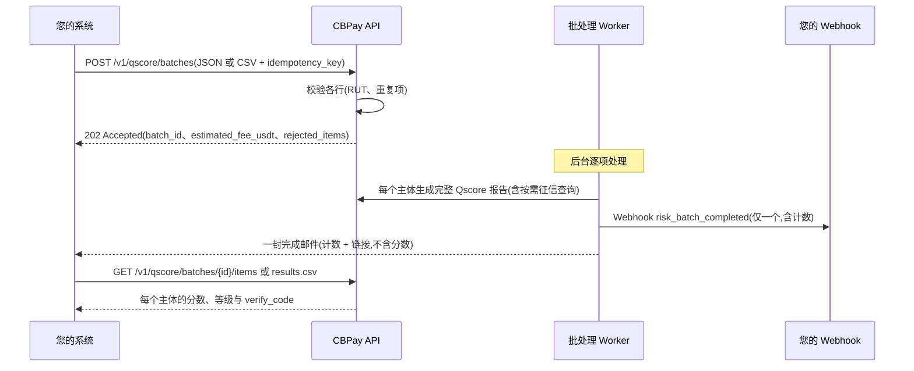

import { EnvUrls } from "/snippets/env-urls.jsx";

<EnvUrls lang="zh" />

批量评分是 [Qscore](/zh/guides/qscore) 的大批量模式:您无需逐份请求信用报告,而是提交一个**批次**的主体(目前为智利 RUT),CBPay 将**异步**为每个主体生成完整的 Qscore 报告。批次结束时,您将收到**一个** webhook 和**一封**包含计数的邮件 — 绝不会按主体逐个通知。

典型用途:对现有组合进行重新评分(每月刷新债务人名单)、对供应商列表进行一次性尽职调查,或在新组合上线后补齐分数。对单个主体的临时查询,请继续使用[单独报告](/zh/guides/qscore)。

## 工作原理



<Note>
  批次会被立即接受(`202`),并由后台 worker 处理。每个条目都经过**与单独报告完全相同的流水线** — 包括按需征信查询 — 因此批量分数与逐个查询得到的分数完全一致,使用相同的确定性模型(1–999,等级 A–E,主体无数据时为 `SC`)。
</Note>

## 操作步骤

<Steps>
  <Step title="创建批次">
    通过 `POST /v1/qscore/batches` 提交主体,可以是 JSON 数组**或** CSV 文本(`subjects_csv`)。每个请求都必须携带 `idempotency_key`:使用相同键重放会返回原批次并带 `idempotency_hit: true`,绝不会重复创建批次或重复扣费。

    无效行会在**创建时被拒绝**并报告在 `rejected_items` 中 — 批次只处理有效行。`doc_id` 未通过该国校验位时产生 `invalid_doc_id`;同一批次内重复的 `doc_id` 产生 `duplicate_in_batch`(以其归一化形式报告)。无法识别的 `subject_type` **不会**报错:该行会被接受,并按下方规则推断类型。

    <Tabs>
      <Tab title="JSON">
        ```bash
        curl -X POST https://api.qbank.cl/platform/v1/qscore/batches \
          -H "Authorization: Bearer pk_live_..." \
          -H "Content-Type: application/json" \
          -d '{
            "country": "CL",
            "purpose": "credit_evaluation",
            "lang": "es",
            "subjects": [
              {"doc_id": "12.345.678-5"},
              {"doc_id": "15.678.234-3"},
              {"doc_id": "11.222.333-9"},
              {"doc_id": "76.543.210-3", "subject_type": "company"},
              {"doc_id": "12.345.678-9"},
              {"doc_id": "12.345.678-5"}
            ],
            "idempotency_key": "portfolio-2026-08-refresh-01"
          }'
        ```

        ```json
        {
          "batch_id": "b7f2c1a4-3e5d-4f8a-9c2b-1d0e6a8f4c5d",
          "status": "pending",
          "purpose": "credit_evaluation",
          "country": "CL",
          "lang": "es",
          "total_items": 4,
          "processed_items": 0,
          "succeeded_items": 0,
          "failed_items": 0,
          "estimated_fee_usdt": "14.50",
          "created_at": "2026-08-09T14:32:10Z",
          "rejected_count": 2,
          "rejected_items": [
            {
              "line": 5,
              "doc_id": "12.345.678-9",
              "error_code": "invalid_doc_id",
              "error": "doc_id is not valid for CL"
            },
            {
              "line": 6,
              "doc_id": "12345678-5",
              "error_code": "duplicate_in_batch",
              "error": "doc_id appears more than once in the batch"
            }
          ]
        }
        ```

        上述估算假设您账户配置了个人报告 `4.00` USDT、公司报告 `2.50` USDT 的费用:3 × 4.00 + 1 × 2.50 = **14.50**。您的估算将反映账户实际配置的费用。
      </Tab>
      <Tab title="CSV">
        ```bash
        curl -X POST https://api.qbank.cl/platform/v1/qscore/batches \
          -H "Authorization: Bearer pk_live_..." \
          -H "Content-Type: application/json" \
          -d '{
            "country": "CL",
            "purpose": "supplier_onboarding",
            "lang": "es",
            "subjects_csv": "doc_id,subject_type\n12.345.678-5,person\n76.543.210-3,company\n96.123.450-6,company",
            "idempotency_key": "suppliers-2026-08-01"
          }'
        ```

        CSV 负载是 **JSON body 中的一个字符串字段**(不是文件上传):一行表头 `doc_id[,subject_type]`,随后每行一个主体,最大 5 MB。

        ```json
        {
          "batch_id": "c8a3d2b5-4f6e-5a9b-8d3c-2e1f7b9a5d6e",
          "status": "pending",
          "purpose": "supplier_onboarding",
          "country": "CL",
          "lang": "es",
          "total_items": 3,
          "processed_items": 0,
          "succeeded_items": 0,
          "failed_items": 0,
          "estimated_fee_usdt": "9.00",
          "created_at": "2026-08-09T15:04:44Z",
          "rejected_count": 0,
          "rejected_items": []
        }
        ```
      </Tab>
    </Tabs>

    | 字段 | 类型 | 规则 |
    |---|---|---|
    | `country` | string | 必填。目前为 `CL`。 |
    | `purpose` | string | 必填。封闭列表(智利 Ley 20.575):`credit_evaluation`、`tenant_screening`、`hiring`、`supplier_onboarding`、`other`。批次中**不允许** `self_access` — 主体本人的报告通过 [my-report](/zh/guides/qscore) 免费获取。 |
    | `lang` | string | `es`(默认)、`en` 或 `zh` — 生成的 PDF 报告语言。 |
    | `subjects` | array | 1–5,000 条:`{doc_id, subject_type?}`。与 `subjects_csv` 互斥。 |
    | `subjects_csv` | string | CSV 文本,表头 `doc_id[,subject_type]`,最大 5 MB。与 `subjects` 互斥。 |
    | `subject_type` | string | 每行可选:`person` 或 `company`。`CL` 中省略**或无法识别**时按 RUT 号段推断(首位 5–9 → `company`,其余 → `person`)。 |
    | `idempotency_key` | string | **必填。** 每个批次唯一;重放绝不重复。 |

    幂等重放会返回 `200`(而非 `202`),携带原批次和 `idempotency_hit: true`;`rejected_items` / `rejected_count` 明细仅在首次创建响应中包含。
  </Step>

  <Step title="等待完成信号">
    Worker 逐项处理。您**无需**轮询:批次到达终态时,您会收到恰好**一个** `risk_batch_completed` webhook 和**一封**完成邮件,其中包含计数和指向您账户的链接。

    批次内的报告绝不会触发单独的 `risk_report_ready` webhook 或单份报告邮件 — **批次本身就是信号**。如果您仍想轮询,`GET /v1/qscore/batches/{id}` 会返回实时计数(`processed_items`、`succeeded_items`、`failed_items`)。

    ```bash
    curl "https://api.qbank.cl/platform/v1/qscore/batches/b7f2c1a4-3e5d-4f8a-9c2b-1d0e6a8f4c5d" \
      -H "Authorization: Bearer pk_live_..."
    ```

    ```json
    {
      "batch_id": "b7f2c1a4-3e5d-4f8a-9c2b-1d0e6a8f4c5d",
      "status": "completed_with_errors",
      "purpose": "credit_evaluation",
      "country": "CL",
      "lang": "es",
      "total_items": 4,
      "processed_items": 4,
      "succeeded_items": 3,
      "failed_items": 1,
      "estimated_fee_usdt": "14.50",
      "created_at": "2026-08-09T14:32:10Z",
      "started_at": "2026-08-09T14:34:02Z",
      "completed_at": "2026-08-09T14:41:37Z"
    }
    ```
  </Step>

  <Step title="读取结果">
    逐条结果可通过 JSON(分页)或 CSV 导出(可直接用 Excel 打开)获取。

    ```bash
    curl "https://api.qbank.cl/platform/v1/qscore/batches/b7f2c1a4-3e5d-4f8a-9c2b-1d0e6a8f4c5d/items?status=ready&page=1&page_size=50" \
      -H "Authorization: Bearer pk_live_..."
    ```

    ```json
    {
      "items": [
        {
          "item_id": "e1f0a9b8-7c6d-4e5f-8a9b-0c1d2e3f4a5b",
          "report_id": "3f5c9f2d-7d21-4b8c-9a2d-2d5f6a1b8c01",
          "doc_id": "12.345.678-5",
          "subject_type": "person",
          "status": "ready",
          "score": 715,
          "band": "B",
          "created_at": "2026-08-09T14:32:10Z",
          "completed_at": "2026-08-09T14:34:52Z"
        },
        {
          "item_id": "f2a1b0c9-8d7e-4f6a-9b0c-1d2e3f4a5b6c",
          "report_id": "7c9a1f3d-2e44-4b8a-9d51-0a1b2c3d4e5f",
          "doc_id": "15.678.234-3",
          "subject_type": "person",
          "status": "ready",
          "score": 430,
          "band": "D",
          "created_at": "2026-08-09T14:32:10Z",
          "completed_at": "2026-08-09T14:35:41Z"
        },
        {
          "item_id": "a3b2c1d0-9e8f-4a7b-8c1d-2e3f4a5b6c7d",
          "report_id": "9d0e1f2a-3b4c-4d5e-8f6a-7b8c9d0e1f2a",
          "doc_id": "76.543.210-3",
          "subject_type": "company",
          "status": "ready",
          "score": 604,
          "band": "C",
          "created_at": "2026-08-09T14:32:10Z",
          "completed_at": "2026-08-09T14:36:22Z"
        }
      ],
      "meta": {"page": 1, "page_size": 50, "total": 3}
    }
    ```

    对于失败的条目,`score` 为 `null`,行内携带 `error_code` / `error_message`:

    ```json
    {
      "item_id": "b4c3d2e1-0f9a-4b8c-9d2e-3f4a5b6c7d8e",
      "doc_id": "11.222.333-9",
      "subject_type": "person",
      "status": "failed",
      "score": null,
      "error_code": "generation_failed",
      "error_message": "the report could not be generated; the fee was refunded",
      "created_at": "2026-08-09T14:32:10Z",
      "completed_at": "2026-08-09T14:37:05Z"
    }
    ```

    CSV 导出(`GET /v1/qscore/batches/{id}/results.csv`)输出全部行并带 UTF-8 BOM(Excel 可正确打开),且包含每份报告的公开 `verify_code`。每个单元格都经过公式注入防护。可**随时**下载,即使批次仍处于 `processing` 状态 — 仍为 `pending` 的条目行其 score/band/verify_code 字段为空。

    ```bash
    curl -OJ "https://api.qbank.cl/platform/v1/qscore/batches/b7f2c1a4-3e5d-4f8a-9c2b-1d0e6a8f4c5d/results.csv" \
      -H "Authorization: Bearer pk_live_..."
    ```

    ```csv
    doc_id,subject_type,status,score,band,verify_code,report_id,error_code
    12.345.678-5,person,ready,715,B,Q3f5c9f2d7d214b8c9a2d2d5f6a1b8c01a1b2c3d4e5f60718293a,3f5c9f2d-7d21-4b8c-9a2d-2d5f6a1b8c01,
    15.678.234-3,person,ready,430,D,Q7c9a1f3d2e444b8a9d510a1b2c3d4e5fb2c3d4e5f60718293a4b5,7c9a1f3d-2e44-4b8a-9d51-0a1b2c3d4e5f,
    76.543.210-3,company,ready,604,C,Q9d0e1f2a3b4c4d5e8f6a7b8c9d0e1f2ac3d4e5f60718293a4b5c6,9d0e1f2a-3b4c-4d5e-8f6a-7b8c9d0e1f2a,
    11.222.333-9,person,failed,,,,,generation_failed
    ```

    每个 `report_id` 都是一份完整的单独报告:您可以使用标准的[报告下载](/zh/guides/qscore)端点下载其 PDF,任何人都可以在 `https://business.cbpayapp.com/verify/qscore/{verify_code}` 验证其真实性。
  </Step>
</Steps>

## 列出并检索您的批次

`GET /v1/qscore/batches` 返回您账户的批次,按最新排序,支持分页(`page`、`page_size`,默认 50,上限 200)并按 `from` / `to`(`YYYY-MM-DD`,UTC,首尾均含)过滤:

```bash
curl "https://api.qbank.cl/platform/v1/qscore/batches?from=2026-08-01&to=2026-08-09&page=1&page_size=50" \
  -H "Authorization: Bearer pk_live_..."
```

```json
{
  "batches": [
    {
      "batch_id": "b7f2c1a4-3e5d-4f8a-9c2b-1d0e6a8f4c5d",
      "account_id": "9d3f1c2a-5b6e-4a7d-8c9b-0e1f2a3b4c5d",
      "status": "completed_with_errors",
      "purpose": "credit_evaluation",
      "country": "CL",
      "total_items": 4,
      "succeeded_items": 3,
      "failed_items": 1,
      "estimated_fee_usdt": "14.50",
      "created_at": "2026-08-09T14:32:10Z"
    },
    {
      "batch_id": "c8a3d2b5-4f6e-5a9b-8d3c-2e1f7b9a5d6e",
      "account_id": "9d3f1c2a-5b6e-4a7d-8c9b-0e1f2a3b4c5d",
      "status": "completed",
      "purpose": "supplier_onboarding",
      "country": "CL",
      "total_items": 3,
      "succeeded_items": 3,
      "failed_items": 0,
      "estimated_fee_usdt": "9.00",
      "created_at": "2026-08-09T15:04:44Z"
    }
  ],
  "meta": {"page": 1, "page_size": 50, "total": 2}
}
```

## 批次与条目状态

**批次**(`GET /v1/qscore/batches/{id}`):

| 状态 | 含义 | 是否终态 |
|---|---|---|
| `pending` | 已接受,等待 worker | 否 |
| `processing` | Worker 正在逐项生成报告 | 否 |
| `completed` | 所有条目均成功完成 | 是 |
| `completed_with_errors` | 已完成,但至少一个条目失败(失败条目已退款) | 是 |
| `failed` | 批次本身失败(基础设施)— 查看 `error_code` / `error_message` | 是 |

**条目**(`GET /v1/qscore/batches/{id}/items`):

| 状态 | 含义 |
|---|---|
| `pending` | 排队中,尚未处理 |
| `ready` | 报告已生成 — `score`、`band` 和 `report_id` 已设置 |
| `failed` | 该主体发生终态失败 — 条目费用已**自动退款** |

## 计费

每个条目在 worker 处理时按您账户配置的独立费用(`risk_report_person` 或 `risk_report_company`)扣费。创建响应中的 `estimated_fee_usdt` 是有效条目的预先估算。

- **幂等扣费**:每个条目使用由批次和条目派生的确定性计费引用扣费,因此 worker 重启绝不会对条目重复扣费。
- **自动退款**:最终状态为 `failed` 的条目会在同一轮次中自动退款。您只需为实际生成的报告付费。
- 扣费和退款会像其他 Qscore 费用一样出现在您的[对账单](/zh/guides/statement)中。

## 错误

| HTTP | 代码 | 处理方式 |
|---|---|---|
| 400 | `invalid_payload` | body 不是合法 JSON、缺少 `country`、同时发送了 `subjects` 和 `subjects_csv`(只能发送其一)、CSV 超过 5 MB 或没有任何数据行 |
| 400 | `purpose_required` / `invalid_purpose` | 请发送封闭列表中的 `purpose`;批次中不允许 `self_access` |
| 400 | `idempotency_key_required` | 创建批次必须携带 `idempotency_key` |
| 400 | `invalid_range` | 列表接口中 `from`/`to` 必须为合法的 `YYYY-MM-DD` 日期 |
| 400 | `no_valid_items` | 所有行均被拒绝(`invalid_doc_id` / `duplicate_in_batch`),**批次未创建** — 请在本地校验文件(每个 `doc_id` 必须通过该国校验位且保持唯一),然后使用**新的**幂等键重新提交 |
| 400 | `too_many_items` | 单个批次最多接受 5,000 个主体 — 请将组合拆分为多个批次,每个批次使用各自的幂等键 |
| 401 | `unauthorized` | API key 缺失或无效 |
| 403 | `verification_required` | 您的账户尚未完成操作所需的身份验证 |
| 403 | `service_disabled` | 您的账户未启用 `risk` 产品 — 请联系您的组织管理员 |
| 404 | `not_found` | 批次不存在或属于其他账户 |

## Webhook:`risk_batch_completed`

每个批次恰好**一个** webhook,在批次到达终态时投递给所属账户的订阅。使用事件类型 `risk_batch_completed` 订阅(参见 [webhooks](/zh/webhooks))。body 为下方的扁平对象,事件类型在请求头 `X-Webhook-Event` 中携带:

```http
POST https://your-server.example/webhooks/cbpay
X-Webhook-Event: risk_batch_completed
Content-Type: application/json
```

```json
{
  "batch_id": "b7f2c1a4-3e5d-4f8a-9c2b-1d0e6a8f4c5d",
  "status": "completed_with_errors",
  "total_items": 4,
  "succeeded_items": 3,
  "failed_items": 1,
  "country": "CL",
  "purpose": "credit_evaluation"
}
```

<Warning>
  Webhook 仅携带**计数** — 绝不包含分数或文档。请通过 `GET /v1/qscore/batches/{id}/items` 或 CSV 导出获取结果。完成邮件遵循同样的数据最小化原则:只有计数和一个链接。
</Warning>

## 常见问题

<AccordionGroup>
  <Accordion title="一个批次需要多长时间?">
    取决于批次大小以及每个主体的征信数据新鲜程度。每个条目都是一份完整报告(包括按需征信查询),请按每条几秒估算;1,000 个主体的批次通常在一小时内完成。您无需在线等待 — webhook 会在完成时通知您。
  </Accordion>
  <Accordion title="批量分数与单独报告的分数有区别吗?">
    没有。Worker 运行的流水线与单独报告完全相同,模型版本也是同一个确定性版本。在同一时间点,对同一主体单独评分或在批次中评分,结果一致。
  </Accordion>
  <Accordion title="如果我的组合超过 5,000 个主体怎么办?">
    将其拆分为多个不超过 5,000 的批次,每个批次使用不同的 `idempotency_key`。各批次独立处理,并各自发送完成 webhook。
  </Accordion>
  <Accordion title="可以在同一批次中混合个人和公司吗?">
    可以。逐行声明 `subject_type`,或让 API 按智利 RUT 号段推断。每个条目按其类型对应的费用计费。
  </Accordion>
  <Accordion title="如果 worker 在批次中途崩溃怎么办?">
    处理过程具备崩溃安全性:worker 会从中断处恢复批次,确定性计费引用保证任何条目都不会被重复扣费。
  </Accordion>
  <Accordion title="可以取消正在运行的批次吗?">
    当前版本不支持。已进入 `processing` 的批次会运行到结束;失败的条目会自动退款。
  </Accordion>
  <Accordion title="谁能看到我的批次?">
    只有您的账户 — 其他账户会得到 `404 not_found`。批次绝不会跨组织可见。批次生成的单份报告是标准的 Qscore 报告,因此它们会出现在任何其他报告所在的位置(包括您组织的 org-admin 报告视图)。
  </Accordion>
</AccordionGroup>
