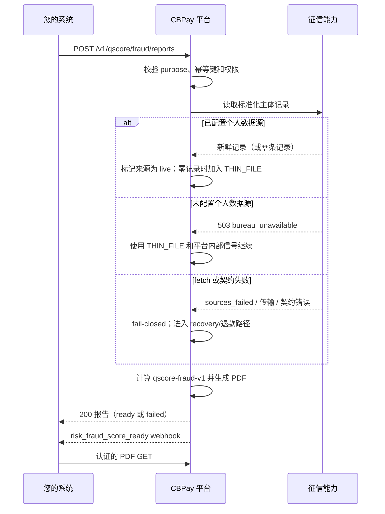

import { EnvUrls } from "/snippets/env-urls.jsx";

<EnvUrls lang="zh" />

欺诈与身份评估是独立于信用报告的产品。它返回**欺诈风险评分**：
数值越高表示观察到的欺诈风险越高。评估结合查询速度、已验证平台信号、
联系方式一致性、共享设备/IP 证据以及可用的征信覆盖；它不是信用评分。

<Note>
产品受账户 `risk` 服务标志控制，使用固定费用服务 `risk_fraud_score`。
生成失败会自动退款。PDF 和详细信号不会通过电子邮件发送。
</Note>

## 流程



## 征信覆盖与 `THIN_FILE`

当本次评估没有可用的征信证据时，报告仍可能为 `ready` 并带有
`THIN_FILE`。这可能发生在 fetch 成功但主体没有记录时，包括 HTTP `200`
且 `sources_queried: 0` 的情况。这表示没有可查询的个人来源（响应中只有
bulk 或不支持的来源），因此按 `unavailable` 处理，并可能产生
`THIN_FILE`。当核心明确返回 `503 bureau_unavailable`，表示没有配置个人
征信数据源时，也采用同样的处理方式。后一种情况下，PDF 会将个人征信
来源标记为 `unavailable`、记录数为零；平台内部信号仍可以参与欺诈评分。

当 `sources_queried > 0` 时，个人来源已响应查询，但没有返回该主体的证据；
这仍是有效 fetch，也可能产生 `THIN_FILE`。

`THIN_FILE` 表示证据覆盖不足，不表示主体干净、已批准或低风险。PDF 的
`sources` 表会声明每个功能性来源、记录数量以及 `freshness`
（`live` 或 `unavailable`）。当 on-demand fetch 不可用时，已持久化的征信
记录不会被当作新鲜身份证据展示。

Legacy 例外：由 consent links 派生的 `Source: open_finance` 记录可能没有
`ingest_run_id`。它们不算新鲜的个人征信证据，不应标记 `FetchedThisRun`，
也不代表个人欺诈来源。

所有失败都采用 fail-closed：非空的 `sources_failed`、传输或认证失败、
存储失败、响应契约无效，都不会生成薄文件成功。现有的 recovery/退款流程
会处理已扣费的报告。

## 创建报告

`POST /v1/qscore/fraud/reports` 需要认证账户和已通过验证的账户状态。
幂等键可以放在 JSON body 或 `Idempotency-Key` header 中。

| 字段 | 必填 | 说明 |
|---|---:|---|
| `country` | 是 | 证件的 ISO 3166-1 alpha-2 国家。 |
| `doc_id` | 是 | 主体证件；智利 RUT 会被规范化和校验。 |
| `subject_type` | 否 | `person` 或 `company`；可自动推断。 |
| `purpose` | 是 | `fraud_prevention`、`identity_verification`、`onboarding` 或 `other`。 |
| `lang` | 否 | `en`、`es` 或 `zh`；默认 `en`。 |
| `idempotency_key` | 是 | 本次购买的唯一键。 |

```bash 创建欺诈报告
curl -X POST "https://api.qbank.cl/platform/v1/qscore/fraud/reports" \
  -H "Authorization: Bearer pk_live_..." \
  -H "Content-Type: application/json" \
  -H "Idempotency-Key: fraud-check-2026-09-06-001" \
  -d '{"country":"CL","doc_id":"76.123.456-0","subject_type":"company","purpose":"identity_verification","lang":"zh"}'
```

```json 200 OK
{
  "report_id": "9f1c2d3e-4a5b-4c6d-8e7f-0a1b2c3d4e5f",
  "kind": "qscore_fraud",
  "subject_id": "3fa85f64-5717-4562-b3fc-2c963f66afa6",
  "country": "CL",
  "doc_id": "76123456-0",
  "subject_type": "company",
  "purpose": "identity_verification",
  "status": "ready",
  "model_version": "qscore-fraud-v1",
  "lang": "zh",
  "score": 280,
  "band": "B",
  "reason_codes": [{"code":"NEW_SUBJECT","direction":"negative","weight":"high"}],
  "verify_code": "F9f1c2d3e4a5b6c7d8e9f00112233445566778899aabbccddeeff0011223344",
  "verify_url": "https://business.cbpayapp.com/verify/qscore-fraud/F9f1c2d3e4a5b6c7d8e9f00112233445566778899aabbccddeeff0011223344",
  "pdf_url": "/v1/qscore/fraud/reports/9f1c2d3e-4a5b-4c6d-8e7f-0a1b2c3d4e5f/pdf",
  "created_at": "2026-09-06T15:04:12Z"
}
```

使用同一账户和同一键重试会返回原报告及
`"idempotency_hit": true`，不会重复扣费或生成。

## 查询、状态与 PDF

`GET /v1/qscore/fraud/reports` 要求 `from` 和 `to`（`YYYY-MM-DD`，组织
时区，包含首尾），可选 `status`，支持 `page`/`page_size`（默认 50，最大 200）。
`GET .../{report_id}` 返回报告元数据、原因和可用的验证/PDF链接。无效或越权
的 ID 返回 `404 not_found`。

`GET /v1/qscore/fraud/reports/{report_id}/pdf` 需要认证，仅 `ready` 报告可下载，
文件名为 `qxrisk_fraud_<report_id>.pdf`。

| 状态 | 含义 | 操作 |
|---|---|---|
| `pending` | 生成中的报告记录 | 读取 detail |
| `ready` | 评分、原因、代码和 PDF 可用 | 读取或下载 |
| `failed` | 生成失败且费用已退回 | 读取 `error_code`，使用新幂等键重试 |

## Webhook、邮件与公开验证

账户会收到签名的 `risk_fraud_score_ready`：

```json risk_fraud_score_ready
{"report_id":"9f1c2d3e-4a5b-4c6d-8e7f-0a1b2c3d4e5f","kind":"qscore_fraud","subject_id":"3fa85f64-5717-4562-b3fc-2c963f66afa6","country":"CL","doc_id":"76••••••-0","score":280,"band":"B","status":"ready"}
```

邮件为 best-effort 且使用组织品牌，仅包含报告短引用、证件和账户入口；
不会包含 PDF、评分、等级或信号。

无需认证的 `GET /verify/qscore-fraud/{code}` 只确认真实性、状态、日期和
签发方。无效代码返回 `404` 和 `valid:false`，不泄露证件、评分或信号；
请求按 IP 限流。

## 评分模型

模型为 `qscore-fraud-v1`，范围 1–999，分数越高风险越高。

| 等级 | 分数 | 含义 |
|---|---:|---|
| `A` | 1–199 | 较低观察风险 |
| `B` | 200–399 | 低至中等风险 |
| `C` | 400–599 | 中等风险 |
| `D` | 600–799 | 高风险 |
| `E` | 800–999 | 很高风险 |

已实现的 reason code：`NEW_SUBJECT`、`VELOCITY`、
`CONTACT_MISMATCH`、`SHARED_DEVICE_IP`、`THIN_FILE`。

## 错误

| HTTP | 代码 | 处理 |
|---:|---|---|
| 400 | `invalid_doc_id` | 使用该国家的有效证件 |
| 400 | `invalid_purpose` | 使用四个允许的 purpose |
| 400 | `invalid_subject_type` | 发送 `person` 或 `company` |
| 400 | `idempotency_key_required` | 发送 body 字段或 header |
| 403 | `verification_required` | 先完成 KYC/KYB |
| 403 | `service_disabled` | 为账户启用 `risk` |
| 404 | `not_found` | 检查 ID 或等待 PDF 就绪 |
| 429 | `too_many_attempts` | 降低公开验证频率 |
| 502 | `generation_failed` | 费用已退回，使用新键重试 |

## 常见问题

<AccordionGroup>
  <Accordion title="这是信用评分吗？">
    不是。这是独立的欺诈与身份风险评分，数值越高表示观察到的风险越高。
  </Accordion>
  <Accordion title="是否提供只返回评分的端点？">
    不提供。产品始终生成完整报告、PDF 和验证代码。
  </Accordion>
  <Accordion title="重试会重复扣费吗？">
    使用同一幂等键重试不会重复扣费。
  </Accordion>
</AccordionGroup>
