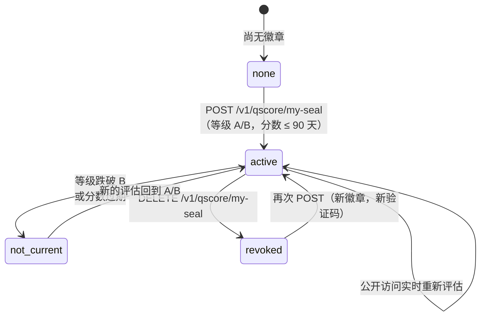

import { EnvUrls } from "/snippets/env-urls.jsx";

<EnvUrls lang="zh" />

**Qscore 徽章**是一种公开可验证的标志，信用状况良好的公司可以将其展示在网站、报价单和电子邮件中：一个公开验证页面，外加一个可嵌入的 SVG 徽章，用于显示公司**当前**的 Qscore 等级（A 或 B）。

它免费、自助，并且在设计上绝对诚实：徽章在每次查看时都会**实时**评估。如果分数跌破 B 级或过期（过去 90 天内没有评估），公开页面会自动停止显示等级——您永远不需要记得去撤下它，也永远无法展示您不再拥有的等级。

## 何时使用

- 您是已通过 KYB 审核的**企业账户**，Qscore 等级为 **A 或 B**（分数 ≥ 650），且评估时间在最近 90 天内——无论来自自有报告还是第三方购买的报告。
- 您希望向客户、供应商或合作伙伴证明信用资质，提供一个他们可以自行验证的链接，而不是发送 PDF 文件。
- 您希望该证明在不再属实时**自动失效**。

<Note>
徽章仅面向**企业**提供。个人账户在其生成的每份 Qscore 报告上已带有公开验证码（请参阅 [Qscore 指南](/zh/guides/qscore)）。
</Note>

## 工作原理



- **激活**会创建一个带有加密签名公开验证码的徽章。重复激活是安全的：第二次调用返回已有的徽章（`idempotency_hit: true`）。
- **每次公开访问都会实时重新评估资格**：仅当徽章处于激活状态**且**主体当下仍然符合条件时，页面和徽章才会显示等级。
- **撤销权在您手中**：`DELETE` 会永久停用该徽章（该验证码将永远显示"已撤销"）。之后您可以激活一个新徽章——使用新的验证码。

## 第 1 步 — 激活徽章

需要账户会话（已通过 KYB 的企业账户）。无需请求体，也无需幂等键：激活按主体天然幂等。

```bash
curl -X POST https://api.qbank.cl/platform/v1/qscore/my-seal \
  -H "Authorization: Bearer $SESSION_TOKEN"
```

`201 Created` — 徽章已激活：

```json
{
  "seal": {
    "seal_id": "c8f3e2a1-9b4d-4c7e-8a1f-2e5d6b7c8a91",
    "subject_id": "3e9b7c41-2f68-4a1d-8c5e-9a0d4b6f8e21",
    "status": "active",
    "created_at": "2026-08-09T14:22:10Z",
    "verify_code": "Sc8f3e2a19b4d4c7e8a1f2e5d6b7c8a91a1b2c3d4e5f60718",
    "verify_url": "https://api.qbank.cl/platform/verify/qscore/seal/Sc8f3e2a19b4d4c7e8a1f2e5d6b7c8a91a1b2c3d4e5f60718",
    "badge_url": "https://api.qbank.cl/platform/verify/qscore/seal/Sc8f3e2a19b4d4c7e8a1f2e5d6b7c8a91a1b2c3d4e5f60718/badge.svg"
  },
  "subject_id": "3e9b7c41-2f68-4a1d-8c5e-9a0d4b6f8e21",
  "eligibility": {
    "eligible": true,
    "band": "A",
    "score": 831,
    "evaluated_at": "2026-08-07T16:45:31Z"
  }
}
```

在徽章激活状态下再次调用 `POST` 会返回 `200 OK` 和**同一个**徽章，并带 `"idempotency_hit": true`——重试永远不会产生重复。账户在激活徽章时会收到品牌邮件（撤销时也会收到）。

## 第 2 步 — 查询状态和资格

```bash
curl https://api.qbank.cl/platform/v1/qscore/my-seal \
  -H "Authorization: Bearer $SESSION_TOKEN"
```

`200 OK`：

```json
{
  "subject_id": "3e9b7c41-2f68-4a1d-8c5e-9a0d4b6f8e21",
  "seal": {
    "seal_id": "c8f3e2a1-9b4d-4c7e-8a1f-2e5d6b7c8a91",
    "subject_id": "3e9b7c41-2f68-4a1d-8c5e-9a0d4b6f8e21",
    "status": "active",
    "created_at": "2026-08-09T14:22:10Z",
    "verify_code": "Sc8f3e2a19b4d4c7e8a1f2e5d6b7c8a91a1b2c3d4e5f60718",
    "verify_url": "https://api.qbank.cl/platform/verify/qscore/seal/Sc8f3e2a19b4d4c7e8a1f2e5d6b7c8a91a1b2c3d4e5f60718",
    "badge_url": "https://api.qbank.cl/platform/verify/qscore/seal/Sc8f3e2a19b4d4c7e8a1f2e5d6b7c8a91a1b2c3d4e5f60718/badge.svg"
  },
  "eligibility": {
    "eligible": true,
    "band": "A",
    "score": 831,
    "evaluated_at": "2026-08-07T16:45:31Z"
  }
}
```

`eligibility` 块始终是**实时**的——在做任何操作之前，用它来判断您是否可以激活（或继续展示）徽章：

| `reason`（当 `eligible: false` 时） | 含义 |
|---|---|
| `no_score` | 尚无 Qscore 评估——请先生成自有报告（`POST /v1/qscore/my-report`） |
| `band_too_low` | 当前等级为 C、D 或 E——只有 A 和 B 符合条件 |
| `score_stale` | 最近一次评估已超过 90 天——请生成一份新报告 |
| `companies_only` | 个人账户没有徽章（返回 200 且 `seal: null`） |

已撤销的徽章会继续出现在响应中，带有 `status: "revoked"` 和 `revoked_at`，并**不含** `verify_code`/`verify_url`/`badge_url`。

## 第 3 步 — 发布

直接分享 `verify_url`，或将徽章嵌入您的网站。徽章是无需凭据即可访问的普通 SVG：

```html
<a href="https://api.qbank.cl/platform/verify/qscore/seal/Sc8f3e2a19b4d4c7e8a1f2e5d6b7c8a91a1b2c3d4e5f60718" target="_blank" rel="noopener">
  
</a>
```

- 徽章尺寸为 **180×64**，深色背景，在徽章有效期间显示等级字母（A 或 B）。
- 如果徽章不再有效，同一 URL 会渲染为**灰色的"NO VIGENTE"徽章**——它永远不会显示过期等级，也不会在您的页面上出现视觉错误。
- `Cache-Control: public, max-age=300`：浏览器最多可缓存该图像 5 分钟。徽章上的标签为西班牙语（"VERIFICADO" / "NO VIGENTE"）。
- 徽章 URL 仅对无效或被篡改的验证码返回 `404`（空响应）。

## 第 4 步 — 撤销（可选）

您可以随时停用徽章。撤销对该验证码是**永久性的**：公开页面将永远显示"徽章已撤销"，徽章也会变灰。之后您可以使用新验证码激活一个新徽章。

```bash
curl -X DELETE https://api.qbank.cl/platform/v1/qscore/my-seal \
  -H "Authorization: Bearer $SESSION_TOKEN"
```

`200 OK`：

```json
{
  "seal": {
    "seal_id": "c8f3e2a1-9b4d-4c7e-8a1f-2e5d6b7c8a91",
    "subject_id": "3e9b7c41-2f68-4a1d-8c5e-9a0d4b6f8e21",
    "status": "revoked",
    "created_at": "2026-08-09T14:22:10Z",
    "revoked_at": "2026-08-09T18:03:44Z"
  }
}
```

## 验证者看到的内容（公开，无需凭据）

任何持有链接的人都可以验证徽章——机器使用 JSON，浏览器使用品牌 HTML 页面（`Accept: text/html`）：

```bash
curl https://api.qbank.cl/platform/verify/qscore/seal/Sc8f3e2a19b4d4c7e8a1f2e5d6b7c8a91a1b2c3d4e5f60718
```

有效徽章 — `200 OK`：

```json
{
  "valid": true,
  "type": "qscore_seal",
  "seal_status": "active",
  "band": "A",
  "evaluated_at": "2026-08-07",
  "company_name": "Comercial Andes SpA",
  "doc_id": "76.543.210-3",
  "country": "CL"
}
```

已撤销徽章 — `200 OK`：

```json
{
  "valid": false,
  "seal_status": "revoked",
  "revoked_at": "2026-08-09"
}
```

不再符合条件的徽章（等级下降或分数过期） — `200 OK`：

```json
{
  "valid": false,
  "seal_status": "not_current"
}
```

无效或被篡改的验证码 — `404`：

```json
{
  "valid": false,
  "seal_status": "not_current"
}
```

<Warning>
**设计上防探测。** 当徽章不再有效时，公开页面只显示 `not_current`——绝不透露公司降至哪个等级、分数或原因（过期还是降级）。数字分数从不出现在任何公开页面上：只显示等级，且仅在应得时显示。
</Warning>

公开端点按 IP 限流（`429 too_many_attempts`）。

## 徽章状态

| 状态 | 显示位置 | 公开页面 |
|---|---|---|
| `active` | 已认证 API，只要资格保持 | 等级 A/B + 公司名称、证件和所在国家 |
| `not_current` | 仅公开页面（徽章处于激活状态但已不再符合条件） | 灰色徽章，`valid: false`，无等级、无原因 |
| `revoked` | 所有页面 | 带撤销日期的"已撤销"页面；灰色徽章 |

## 错误

| HTTP | `error` | 解决方案 |
|---|---|---|
| 400 | `invalid_tax_id` | 账户已验证的税号在其国家/地区无效——请联系客服修正您的已验证资料 |
| 401 | `unauthorized` | 请使用企业账户会话登录 |
| 403 | `kyc_required` | 请先完成身份验证（KYB） |
| 404 | `no_active_seal` | 在没有激活徽章的情况下调用了 `DELETE`——没有可撤销的内容 |
| 409 | `no_tax_id` | 已验证账户没有登记税号——请先完善您的已验证资料 |
| 409 | `identity_mismatch` | 账户税号与已验证的身份证件不一致——请联系客服 |
| 409 | `seal_companies_only` | 该账户为个人账户；徽章仅面向企业 |
| 409 | `seal_not_eligible` | 等级不是 A/B 或评估已超过 90 天——通过 `GET` 查看实时的 `eligibility.reason`，生成新报告后重试 |
| 429 | `too_many_attempts` | 公开验证按 IP 限流——稍等片刻后重试 |

完整目录请参阅[错误页面](/zh/errors)。

## Webhook 和费用

徽章**不发送 webhook**，也**不收取任何费用**——它是基于您自己已验证数据的自助功能，与自有信用报告一样。状态变更通过品牌邮件通知账户（激活和撤销）。

## 常见问题

<AccordionGroup>
  <Accordion title="徽章收费吗？">
    不收费。激活、展示和撤销徽章都是免费的。背后的 Qscore 评估遵循正常规则（您的自有报告每 30 天免费一次）。
  </Accordion>
  <Accordion title="哪种报告能让我符合条件？">
    任何一种：您自己的自有报告，或第三方购买的关于您公司的报告。徽章始终读取存档的**最新**分数，无论其来源如何。
  </Accordion>
  <Accordion title="如果我发布徽章后分数下降怎么办？">
    徽章和页面会在下一次访问时自动变为灰色 / `not_current`——实时评估，最多 5 分钟缓存。当新的评估让您回到 A/B 级时，徽章会再次显示等级，无需您做任何操作（只要您没有撤销它）。
  </Accordion>
  <Accordion title="我可以撤销后重新激活吗？">
    可以。撤销对已撤销的验证码是永久性的（它将永远显示"已撤销"），但您可以随时激活新徽章，获得新的验证码和新的 URL。
  </Accordion>
  <Accordion title="个人账户可以获得徽章吗？">
    不可以——徽章仅面向企业。个人报告在每份报告上印有自己的公开验证码（请参阅 [Qscore 指南](/zh/guides/qscore)）。
  </Accordion>
  <Accordion title="验证者能看到我的数字分数吗？">
    永远看不到。公开页面和 JSON 只显示等级（A 或 B）、公司名称、证件和所在国家，以及评估日期——且仅在徽章有效期间。
  </Accordion>
</AccordionGroup>
