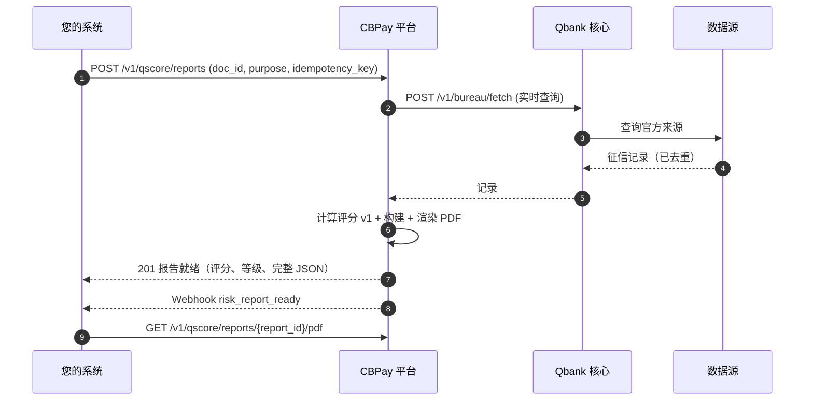

import { EnvUrls } from "/snippets/env-urls.jsx";

<EnvUrls lang="zh" />

Qscore 是平台的 API 优先征信局。一次调用即可返回个人或企业的**完整信用报告**——身份、信贷账户、逾期记录、破产记录、商业活动、替代数据——外加**信用评分（1–999）及其等级和可解释的原因码**，渲染为品牌化 PDF 并以 JSON 暴露。

- **智利先行，国家无关设计**：目前主体为智利（`country: "CL"`，RUT 作为 `doc_id`）；新国家无需更改契约即可接入。
- **实时新鲜度**：每份报告在购买时查询数据源，并按来源声明数据是 `live`、`cached` 还是 `unavailable`。绝不静默使用陈旧数据。
- **内置合规**：声明的 `purpose` 为必填（智利数据保护法），每个评分都带有原因码，每份报告都包含公开验证码。

<Note>
Qscore 是付费产品，由您账户的 `risk` 服务标志门控，按报告计费（独立费用 `risk_report_person` / `risk_report_company`）。如果收费后生成失败，费用将**自动退还**，报告以 `failed` 结束并带有 `error_code`。
</Note>

## 工作原理



生成是**同步的**：`POST` 获取征信记录、计算评分、渲染 PDF，并在单个响应中返回就绪的报告。某个来源宕机**不会**导致付费报告失败——报告将使用持久化数据生成，该来源在 `sources` 部分声明为 `cached`（如果完全没有贡献则声明为 `unavailable`）。

## 1. 购买报告

`POST /v1/qscore/reports` 创建并生成完整报告。`idempotency_key` 为**必填**（报告会收取费用：使用相同密钥重试将返回原始报告并带 `idempotency_hit: true`，绝不会重复收费）。

| 字段 | 类型 | 必填 | 描述 |
|---|---|---|---|
| `doc_id` | string | 是 | 主体的证件号。在智利为 RUT（`11.111.111-1`）；将规范化为标准形式。 |
| `country` | string | 是 | 证件的 ISO 3166-1 alpha-2 国家代码。目前为 `CL`。 |
| `subject_type` | string | 否 | `person` 或 `company`。如果省略，将从证件推断。 |
| `purpose` | string | 是 | 声明的用途（数据保护法）：`credit_evaluation`、`tenant_screening`、`hiring`、`supplier_onboarding`、`other`。 |
| `lang` | string | 否 | 报告语言：`es`（默认）、`en`、`zh`。 |
| `idempotency_key` | string | 是 | 您此次购买的唯一密钥。 |

<Tabs>
  <Tab title="个人">

```bash 创建个人报告
curl -X POST "https://api.qbank.cl/platform/v1/qscore/reports" \
  -H "Authorization: Bearer pk_live_..." \
  -H "Content-Type: application/json" \
  -d '{
    "doc_id": "11.111.111-1",
    "country": "CL",
    "purpose": "credit_evaluation",
    "lang": "zh",
    "idempotency_key": "qscore-2026-08-08-0001"
  }'
```

  </Tab>
  <Tab title="企业">

```bash 创建企业报告
curl -X POST "https://api.qbank.cl/platform/v1/qscore/reports" \
  -H "Authorization: Bearer pk_live_..." \
  -H "Content-Type: application/json" \
  -d '{
    "doc_id": "76.123.456-0",
    "country": "CL",
    "subject_type": "company",
    "purpose": "supplier_onboarding",
    "lang": "zh",
    "idempotency_key": "qscore-2026-08-08-0002"
  }'
```

  </Tab>
</Tabs>

```json 201 Created（报告就绪）
{
  "report_id": "f47ac10b-58cc-4372-a567-0e02b2c3d479",
  "subject_id": "3fa85f64-5717-4562-b3fc-2c963f66afa6",
  "status": "ready",
  "purpose": "credit_evaluation",
  "lang": "zh",
  "band": "B",
  "model_version": "qscore-v1",
  "verify_code": "Qf47ac10b58cc4372a5670e02b2c3d4791a2b3c4d5e6f",
  "created_at": "2026-08-08T15:04:22Z",
  "score": 742,
  "completed_at": "2026-08-08T15:04:25Z",
  "report": {
    "meta": {
      "report_id": "QSR-f47ac10b58cc",
      "lang": "zh",
      "purpose": "credit_evaluation",
      "generated_at": "2026-08-08T15:04:25Z",
      "verification_code": "Qf47ac10b58cc4372a5670e02b2c3d4791a2b3c4d5e6f",
      "verification_url": "https://business.cbpayapp.com/verify/qscore/Qf47ac10b58cc4372a5670e02b2c3d4791a2b3c4d5e6f"
    },
    "identity": {
      "subject_type": "person",
      "doc_id": "11111111-1",
      "name": "Juan Pérez González",
      "country": "CL"
    },
    "score": {
      "score": 742,
      "band": "B",
      "model_version": "qscore-v1",
      "reason_codes": [
        {"code": "ACTIVE_TRADELINES", "direction": "positive", "weight": "medium"},
        {"code": "CREDIT_HISTORY_DEPTH", "direction": "positive", "weight": "low"}
      ],
      "computed_at": "2026-08-08T15:04:25Z"
    },
    "summary": ["无未结逾期记录", "税务状态正常"],
    "internal_score": {"available": false},
    "sources": [
      {"source": "res_chile", "label": "Registro de Empresas y Sociedades (RES)", "records": 2, "fetched_at": "2026-08-08T15:04:23Z", "freshness": "live"}
    ]
  }
}
```

如果收费后出现故障，费用将被退还，响应为错误，并在报告中持久化 `error_code: "generation_failed"`。使用**相同**的 `idempotency_key` 重新运行将返回原始报告（或其失败状态）——绝不会重复收费。

## 2. 评分（模型 v1）

评分运行 `qscore-v1`：基础分 **600**，范围 **1–999**，根据不利事实（未结逾期、拒付票据、破产、近期查询）和正面信号（活跃信贷账户、信用历史深度、公司活跃度、替代数据）进行调整。

| 等级 | 范围 | 解读 |
|---|---|---|
| `A` | 800–999 | 优秀 |
| `B` | 650–799 | 良好 |
| `C` | 500–649 | 一般 |
| `D` | 350–499 | 较弱 |
| `E` | 1–349 | 高风险 |
| `SC` | — | 未找到主体数据（评分为 `null`） |

每份报告都带有 `reason_codes`——评分的可解释层：

| 代码 | 方向 | 含义 |
|---|---|---|
| `NO_DATA` | negative | 未找到主体记录（等级 `SC`） |
| `BANKRUPTCY_OPEN` | negative | 有未结破产/资不抵债程序 |
| `OPEN_DELINQUENCY` | negative | 有未结催收逾期 |
| `PROTESTO_OPEN` | negative | 有未支付的拒付票据（支票/本票） |
| `RECENT_DELINQUENCY` | negative | 近期报告的逾期 |
| `MANY_RECENT_QUERIES` | negative | 过去 90 天内针对该主体购买了许多报告 |
| `ACTIVE_TRADELINES` | positive | 活跃且正常的信贷账户 |
| `CREDIT_HISTORY_DEPTH` | positive | 信用历史较长 |
| `COMPANY_ACTIVE` | positive | 公司活跃且有税务活动 |
| `COMPANY_NEW` | negative | 新成立的公司 |
| `ALTERNATIVE_POSITIVE` | positive | 正面替代数据（水电费、开放金融） |
| `INTERNAL_ACTIVITY` | positive | 平台内部正面信号 |

## 3. 查询与历史

### 列出报告

`GET /v1/qscore/reports` 列出您账户购买的报告。`from` 和 `to`（日期 `YYYY-MM-DD`，UTC，两端均包含）为**必填**；`subject_id` 和 `status`（`pending`、`ready`、`failed`）为可选筛选；使用 `page` / `page_size` 分页（默认 50，最大 200）。

```bash 列出报告
curl "https://api.qbank.cl/platform/v1/qscore/reports?from=2026-08-01&to=2026-08-31&status=ready&page=1&page_size=50" \
  -H "Authorization: Bearer pk_live_..."
```

```json 200 OK
{
  "items": [
    {
      "report_id": "f47ac10b-58cc-4372-a567-0e02b2c3d479",
      "account_id": "ae8c91f2-…",
      "subject_id": "3fa85f64-5717-4562-b3fc-2c963f66afa6",
      "purpose": "credit_evaluation",
      "status": "ready",
      "lang": "zh",
      "score": 742,
      "band": "B",
      "score_model_version": "qscore-v1",
      "reason_codes": [{"code": "ACTIVE_TRADELINES", "direction": "positive", "weight": "medium"}],
      "verify_code": "Qf47ac10b58cc4372a5670e02b2c3d4791a2b3c4d5e6f",
      "created_at": "2026-08-08T15:04:22Z",
      "completed_at": "2026-08-08T15:04:25Z"
    }
  ],
  "meta": {"page": 1, "page_size": 50, "total": 1}
}
```

### 报告详情

`GET /v1/qscore/reports/{report_id}` 返回报告；当状态为 `ready` 时，包含完整的 `report` 对象（与创建响应相同的结构）。

### 下载 PDF

`GET /v1/qscore/reports/{report_id}/pdf` 下载品牌化 PDF（`application/pdf`，文件名 `qscore_<report_id>.pdf`）。在报告 `ready` 之前，响应为 `404 pdf_not_ready`。PDF 是私密文档：下载需要**身份验证**——绝不会附加到电子邮件或暴露在公开 URL 上。

### 主体档案与当前评分（无需购买新报告）

`GET /v1/qscore/subjects/{doc_id}?country=CL` 返回您已购买过报告的证件的主体档案（身份 + 最新评分）：

```json 200 OK（主体档案）
{
  "subject_id": "3fa85f64-5717-4562-b3fc-2c963f66afa6",
  "country": "CL",
  "doc_id": "11111111-1",
  "subject_type": "person",
  "display_name": "Juan Pérez González",
  "last_score": 742,
  "last_band": "B",
  "last_score_at": "2026-08-08T15:04:25Z"
}
```

`GET /v1/qscore/subjects/{doc_id}/score?country=CL` 仅返回当前评分（如果主体尚未有评分，则为 `404 no_score`）：

```json 200 OK（当前评分）
{
  "subject_id": "3fa85f64-5717-4562-b3fc-2c963f66afa6",
  "doc_id": "11111111-1",
  "country": "CL",
  "band": "B",
  "model_version": "qscore-v1",
  "computed_at": "2026-08-08T15:04:25Z",
  "score": 742
}
```

## 4. 报告状态

| 状态 | 含义 | 操作 |
|---|---|---|
| `pending` | 报告已创建，正在生成（同步调用中的瞬态） | 无需操作——`POST` 响应携带最终状态 |
| `ready` | 报告已生成：评分、完整 JSON 和 PDF 可用（最终） | 读取 JSON、下载 PDF、分享验证链接 |
| `failed` | 生成失败；费用已**退还**（最终） | 读取 `error_code` / `error_message`，修复原因，使用**新的** `idempotency_key` 购买新报告 |

## 5. 错误

| HTTP | 代码 | 何时 | 解决方案 |
|---|---|---|---|
| 400 | `invalid_payload` | 缺少 `doc_id`/`country` 或 JSON 格式错误 | 使用有效的 JSON body 发送两个字段 |
| 400 | `purpose_required` | 缺少 `purpose` | 声明用途（数据保护法） |
| 400 | `invalid_purpose` | `purpose` 不在封闭列表中 | 使用 `credit_evaluation`、`tenant_screening`、`hiring`、`supplier_onboarding` 或 `other` |
| 400 | `invalid_doc_id` | 证件在该国家/地区无效（例如 RUT 校验位错误） | 修正该国家/地区的 `doc_id` 格式 |
| 400 | `invalid_subject_type` | `subject_type` 不是 `person`/`company` 且无法推断 | 显式发送 `subject_type` |
| 400 | `idempotency_key_required` | 缺少 `idempotency_key` | 每次购买发送唯一密钥 |
| 404 | `not_found` | 报告/主体不存在（或属于另一账户） | 检查 ID |
| 404 | `no_score` | 主体尚未有计算出的评分 | 先购买报告 |
| 404 | `pdf_not_ready` | 报告尚未 `ready` | 轮询详情直到 `status=ready` |
| 502 | `generation_failed` | 收费后无法生成报告 | 费用已退还；稍后重试或联系支持 |

完整目录请参阅[错误](/zh/errors)。

## 6. Webhooks

在您的 [webhook 设置](/zh/webhooks)中订阅 Qscore 事件。两者都是账户受众事件，与所有其他 webhook 一样签名。

<AccordionGroup>
  <Accordion title="risk_report_ready — 报告已生成完毕">

```json risk_report_ready
{
  "report_id": "f47ac10b-58cc-4372-a567-0e02b2c3d479",
  "subject_id": "3fa85f64-5717-4562-b3fc-2c963f66afa6",
  "doc_id": "11111111-1",
  "country": "CL",
  "subject_type": "person",
  "score": 742,
  "band": "B",
  "verify_code": "Qf47ac10b58cc4372a5670e02b2c3d4791a2b3c4d5e6f"
}
```

  </Accordion>
  <Accordion title="risk_score_changed — 主体的评分发生变化">

当新报告计算出的评分与主体之前的评分不同时触发。

```json risk_score_changed
{
  "subject_id": "3fa85f64-5717-4562-b3fc-2c963f66afa6",
  "report_id": "f47ac10b-58cc-4372-a567-0e02b2c3d479",
  "old_score": 715,
  "new_score": 742,
  "old_band": "B",
  "new_band": "B"
}
```

  </Accordion>
</AccordionGroup>

## 7. 公开验证

每份报告 PDF 都会打印**验证码**和 URL。持有验证码的任何人都可以在 `GET /verify/qscore/{code}` 检查报告的真实性——不包含 PII（无需身份验证）：

```json 200 OK（有效报告）
{
  "valid": true,
  "type": "verification_report",
  "kind": "qscore",
  "status": "ready",
  "decision": "B",
  "date": "2026-08-08",
  "issued_by": "CBPay"
}
```

无效或被篡改的代码返回 `404` 和 `{"valid": false, ...}`。该端点按 IP 限流，除了有效性、等级和日期外不透露任何信息。

## 8. ARCO 异议

数据主体可以行使其 ARCO 权利（访问、更正、删除、反对）。您的账户可以针对主体的特定记录提出异议：

```bash 提出异议
curl -X POST "https://api.qbank.cl/platform/v1/qscore/subjects/11111111-1/disputes?country=CL" \
  -H "Authorization: Bearer pk_live_..." \
  -H "Content-Type: application/json" \
  -d '{
    "record_source": "res_chile",
    "record_ref": "RES-2026-04512",
    "reason": "报告的逾期已于 2026-07-30 支付",
    "report_id": "f47ac10b-58cc-4372-a567-0e02b2c3d479"
  }'
```

```json 201 Created
{
  "dispute_id": "7c9e6679-7425-40de-944b-e07fc1f90ae7",
  "subject_id": "3fa85f64-5717-4562-b3fc-2c963f66afa6",
  "report_id": "f47ac10b-58cc-4372-a567-0e02b2c3d479",
  "record_source": "res_chile",
  "record_ref": "RES-2026-04512",
  "reason": "报告的逾期已于 2026-07-30 支付",
  "status": "open",
  "created_by": "ae8c91f2-…",
  "created_at": "2026-08-08T16:11:00Z"
}
```

异议生命周期：`open` → `under_review` → `resolved_corrected` | `resolved_rejected`（最终）。使用 `GET /v1/qscore/subjects/{doc_id}/disputes?country=CL&status=open` 列出（分页），使用 `GET /v1/qscore/disputes/{dispute_id}` 读取单个。异议由您的组织管理员在管理面板中处理。

## 常见问题

<AccordionGroup>
  <Accordion title="每份报告都会重新计算评分吗？">
    是的。每次购买都会实时查询来源，并使用当前的 `qscore-v1` 模型重新计算评分。如果某个来源宕机，报告将使用持久化数据生成，该来源在 `sources` 部分声明为 `cached`/`unavailable`——绝不静默。
  </Accordion>
  <Accordion title="如果收费后报告失败会怎样？">
    费用将在同一流程中自动退还，报告以 `failed` 结束并带有 `error_code`。您的 `idempotency_key` 将重放到该失败的报告；要重试，请使用新密钥。
  </Accordion>
  <Accordion title="为什么用途是必填的？">
    智利数据保护法要求声明合法用途才能查询个人或企业的信用数据。该用途与报告一起存储并打印在报告中（供数据主体审计）。
  </Accordion>
  <Accordion title="我可以在不支付报告费用的情况下查看某人的评分吗？">
    可以——如果您已经购买过该主体的报告，`GET /v1/qscore/subjects/{doc_id}/score` 将免费返回最新计算的评分。主体的第一份报告始终是付费的完整报告。
  </Accordion>
  <Accordion title="PDF 会通过电子邮件发送吗？">
    不会。"报告就绪"电子邮件特意不携带附件（第三方数据最小化）。PDF 只能通过 API 身份验证后下载。
  </Accordion>
  <Accordion title="支持哪些国家/地区？">
    目前为智利（`country: "CL"`，RUT 作为 `doc_id`）。契约是国家无关的：新国家/地区接入其来源后将使用相同的端点。
  </Accordion>
</AccordionGroup>
