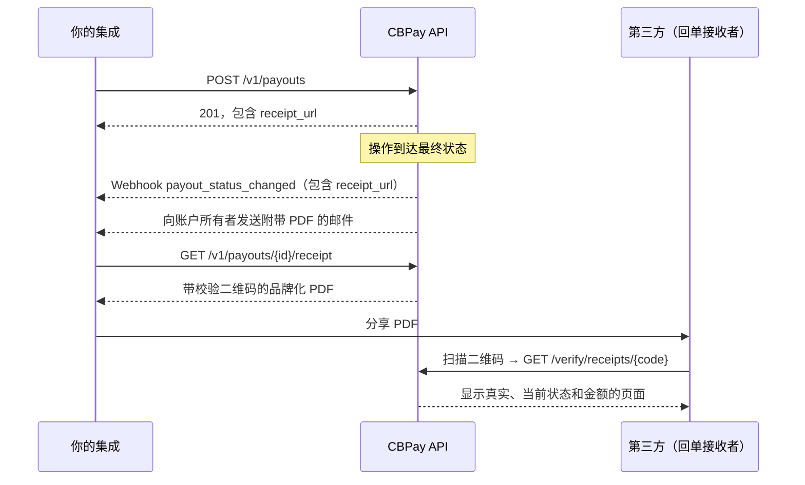

import { EnvUrls } from "/snippets/env-urls.jsx";

<EnvUrls lang="zh" />

你账户上的每笔操作 — 出款、入款、转账、加密货币充值与提现、兑换和银行卡消费 — 都有一份可下载的**品牌化 PDF 回单**：包含 logo、配色、操作状态，以及一个**带二维码的签名校验码**，任何人都可以公开查验以确认文档的真实性。

无需自行构建：每笔操作的响应和 webhook 都包含可直接下载的 `receipt_url`，当操作到达最终状态时，回单还会**自动通过邮件**发送给账户所有者（可选择退订）。



## 下载回单

每个提供 `GET /{id}` 的交易类资源都有其 `GET .../receipt`。PDF 默认英语；传入 `?lang=es` 或 `?lang=zh` 可获取西班牙语或中文。付款人页面也可能持久化 `cbpay_pay_locale`。

| 操作 | 端点 |
|---|---|
| 出款（Payout） | `GET /v1/payouts/{payoutID}/receipt` |
| 入款（Payin） | `GET /v1/payins/{payinID}/receipt` |
| 内部转账 | `GET /v1/transfers/{transferID}/receipt` |
| 加密货币提现 | `GET /v1/crypto/withdrawals/{withdrawalID}/receipt` |
| 加密货币充值 | `GET /v1/crypto/deposits/{depositID}/receipt` |
| 兑换（Swap） | `GET /v1/swaps/{swapID}/receipt` |
| 银行卡消费 | `GET /v1/cards/{cardID}/transactions/{transactionID}/receipt` |
| 银行业务操作 | `GET /v1/banking/operations/{operationID}/receipt` |
| 独立钱包转出 | `GET /v1/segregated-wallets/{walletID}/sends/{sendID}/receipt` |
| 独立钱包充值 | `GET /v1/segregated-wallets/{walletID}/deposits/{depositID}/receipt` |

```bash
curl "https://api.qbank.cl/platform/v1/payouts/9b1deb4d-3b7d-4bad-9bdd-2b0d7b3dcb6d/receipt?lang=en" \
  -H "Authorization: Bearer $CBPAY_TOKEN" \
  -o receipt.pdf
```

加密货币充值的 `depositID` 来自 `GET /v1/crypto/transactions`（每笔充值的 `deposit_id` 字段，紧邻其 `receipt_url`）。

<Note>
只有操作的所有者（或组织管理员）可以下载回单：使用他人的 ID 会返回 `404 not_found`。PDF 显示的收款人数据与你提交时完全一致。
</Note>

<Note>
出款回单包含**银行参考号**一栏 — 即收款银行分配的交易号 — 在银行确认付款后即会显示。出款在途期间该行不会出现：待状态变为 `completed` 后重新下载即可看到。
</Note>

## 响应和 webhook 中的 `receipt_url`

切勿手动拼接 URL：每个出款、入款、转账、提现、充值、兑换和银行卡交易的响应都包含 `receipt_url`，最终状态的 webhook（`payout_status_changed`、`payin_credited`、`transfer_received`、`crypto_deposit_credited`、`crypto_withdrawal_status_changed`、`card_transaction`）的载荷中也会携带它。

```json
{
  "payout_id": "9b1deb4d-3b7d-4bad-9bdd-2b0d7b3dcb6d",
  "status": "completed",
  "local_amount": "800.00",
  "currency": "VES",
  "receipt_url": "https://api.qbank.cl/platform/v1/payouts/9b1deb4d-3b7d-4bad-9bdd-2b0d7b3dcb6d/receipt"
}
```

## 状态与水印

回单反映的是**下载时刻**的操作状态：

| 操作状态 | 标签 | 水印 |
|---|---|---|
| `completed` / `credited` / `confirmed` | 绿色 "Completed" | 无 |
| `pending` / `processing` | 琥珀色 "Processing" | 有 — 对角线 "PROCESSING" |
| `failed` / `declined` / `reversed` | 红色 "Failed" | 有 — 对角线 "FAILED" |

<Warning>
带水印的回单**不是付款凭证**：该操作尚未完成（或已失败）。在收到最终状态的 webhook 后重新下载，即可得到无水印版本。
</Warning>

## 真伪校验（二维码）

每份 PDF 都印有一个**签名校验码**及其二维码。二维码指向一个公开 URL — 无需凭据 — 返回该操作**真实、当前**的数据：

```bash
curl "https://api.qbank.cl/platform/verify/receipts/P9b1deb4d3b7d4bad9bdd2b0d7b3dcb6d16827185..."
```

```json
{
  "valid": true,
  "type": "payout",
  "status": "ok",
  "raw_status": "completed",
  "amount": "800.00 VES",
  "detail": "Venezuela — Pago Móvil",
  "date": "2026-07-11 15:29 UTC",
  "issued_by": "CBPay"
}
```

如果在**浏览器**中打开同一 URL（例如用手机扫描二维码），会重定向到**公共交易跟踪页面** —— 一个 Wise 风格的托管页面，展示实时状态、分步时间线和 PDF 下载。参见[交易跟踪链接](/zh/guides/tracking)。

- 响应**绝不**包含收款人的个人数据、账户或地址：只有类型、状态、金额和日期。
- 校验码经过加密签名：被篡改或伪造的校验码会返回 `404` 并带 `"valid": false`。
- 校验显示的是**当前**数据：如果有人编辑 PDF 虚增金额，二维码会立即揭穿。
- 回单响应和回单邮件中包含的 `verify_url` 直接指向跟踪页面，收件人将看到带时间线的视图。

## 自动回单邮件

当操作到达最终状态（完成或失败）时，账户所有者会收到一封附带 PDF 和校验链接的邮件。适用于出款、入款、发出的转账、加密货币充值与提现以及兑换（银行卡消费不发邮件，以避免塞满你的收件箱）。

按账户禁用（或重新启用）：

```bash
curl -X PATCH "https://api.qbank.cl/platform/v1/me" \
  -H "Authorization: Bearer $CBPAY_TOKEN" \
  -H "Content-Type: application/json" \
  -d '{"receipt_emails": false}'
```

## 错误

| HTTP | 代码 | 原因与解决方案 |
|---|---|---|
| 404 | `not_found` | 该 ID 不存在或不属于你的账户。请在产品列表中核对 ID。 |
| 429 | `too_many_attempts` | 来自你的 IP 的公开校验次数过多。稍等片刻后重试。 |
| 500 | `receipt_render_failed` | 渲染 PDF 时出现临时错误。重试下载即可。 |

## 常见问题

<AccordionGroup>
  <Accordion title="回单是一次性生成的，还是可以随时下载？">
    想下载多少次都可以：它是根据操作的当前数据实时渲染的。因此在 `pending` 状态下下载的回单会带水印，而在收到最终 webhook 之后，同一端点会返回无水印版本。
  </Accordion>
  <Accordion title="我可以把回单分享给收款人或审计师吗？">
    可以 — 这正是它的用途。收到回单的人可以扫描二维码，向平台确认文档真实、状态和金额属实，无需任何凭据。
  </Accordion>
  <Accordion title="如果有人编辑了 PDF 怎么办？">
    PDF 只是一种呈现形式：真实数据保存在平台中。二维码和校验码携带与真实操作绑定的加密签名；查验它们会显示真实的金额和状态，任何篡改都会被揭穿。
  </Accordion>
  <Accordion title="回单提供哪些语言？">
    英语（`?lang=en`）、西班牙语（`?lang=es`）和简体中文（`?lang=zh`）。公共跟踪页面会自动检测访问者的浏览器语言。
  </Accordion>
  <Accordion title="回单上显示哪个品牌？">
    你所使用平台的品牌（运营方的 logo、配色和联系信息）。PDF/Excel 对账单使用相同的品牌形象。
  </Accordion>
  <Accordion title="二维码会过期吗？">
    不会。只要操作存在，校验码就一直有效，并且始终返回其当前状态。
  </Accordion>
</AccordionGroup>

<CardGroup cols={1}>
  <Card title="交易跟踪链接" icon="location-arrow" href="/zh/guides/tracking">
    每张回单还提供一个可分享的公共跟踪页面，带实时状态时间线 —— 无需登录。
  </Card>
</CardGroup>
