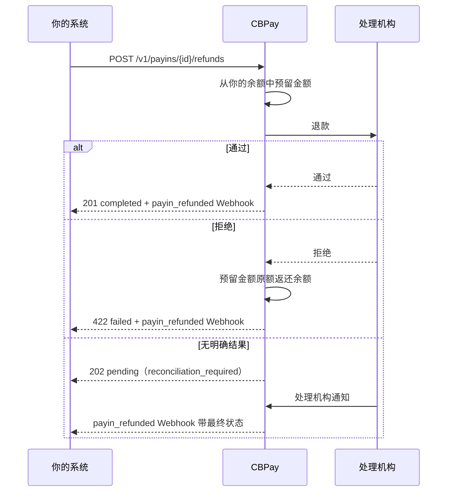

import { EnvUrls } from "/snippets/env-urls.jsx";

<EnvUrls lang="zh" />

当你需要把钱退还给持卡人时——订单取消、重复扣款、争议判给客户——
退款是**你账户上的一笔操作**：处理机构把钱退回卡片，我们**从你的余额
中扣除等值金额**，并生成对应的分录、可验证凭证和 Webhook。

它与收款相反：收款入账，退款出账。

## 哪些收款可以退

| 条件 | 说明 |
|---|---|
| 方式 | 仅限**银行卡**收款（`method: "card"`，含以卡支付的 Checkout 与已保存卡的 MIT 扣款） |
| 状态 | 收款必须为 `credited`（资金已到你的余额） |
| 余额 | 发起时需有足够的 **USDT 余额** |
| 金额 | 全额或部分；同一笔收款的多次部分退款会累计至上限 |

二维码、报备转账、专属入金账户与 collect 类收款**无法**通过此接口退款
（`refund_not_supported`）：这些通道在处理机构侧没有退款能力。POS 收款
通过加密通道退款：`POST /v1/pos/charges/{id}/refunds`。

<Warning>
**手续费与汇率点差不予退还。** 我们扣除的是该笔收款带来的价值（毛额），
而不是入账的净额：若你收款 100.00 USD、扣除 2.90 手续费后入账 97.10
USDT，全额退款将扣除 **100.000000 USDT**。差额由你承担，这与任何银行卡
处理机构的做法一致。
</Warning>

## 生命周期



| 状态 | 含义 | 应对 |
|---|---|---|
| `pending` | 已向处理机构发起，尚无最终答复。你的余额已被预留。 | 等待 Webhook。**不要**用新的幂等键重试：会导致重复退款。 |
| `completed` | 处理机构已批准。扣款在对账单上最终生效。 | 无需操作。终态。 |
| `failed` | 处理机构已拒绝。预留金额已原额返还余额。 | 查看 `failure_reason`，再决定是否用新键重试。 |

<Warning>
`202 pending` **不是错误**：退款可能已经完成。如果你用不同的
`idempotency_key` 重试，付款人会收到两次退款。请始终用**相同**的键重试
（我们返回原对象），或等待 Webhook。
</Warning>

## 发起退款

<Steps>
<Step title="全额退款">

省略 `amount` 即退还剩余全部可退金额：

```bash
curl -X POST https://api.qbank.cl/platform/v1/payins/9f1c2b30-…/refunds \
  -H "Authorization: Bearer <token>" \
  -H "Content-Type: application/json" \
  -d '{
    "reason": "customer cancelled the order",
    "idempotency_key": "refund-order-8841"
  }'
```

```json
{
  "refund_id": "3a7d51c8-…",
  "payin_id": "9f1c2b30-…",
  "account_id": "c57f05b6-…",
  "kind": "refund",
  "status": "completed",
  "currency": "USD",
  "local_amount": "100.00",
  "usdt_debited": "100.000000",
  "requested_by": "account",
  "reason": "customer cancelled the order",
  "idempotency_key": "refund-order-8841",
  "receipt_url": "https://api.qbank.cl/platform/v1/payin-refunds/3a7d51c8-…/receipt",
  "created_at": "2026-07-25T14:02:11Z",
  "updated_at": "2026-07-25T14:02:14Z"
}
```

处理机构当场批准返回 `201`，仍在处理中返回 `202`，拒绝返回 `422`。

</Step>
<Step title="或退还一部分">

以**收款币种**（而非 USDT）传入 `amount`。扣款按该笔收款带来的价值等比
计算：

```bash
curl -X POST https://api.qbank.cl/platform/v1/payins/9f1c2b30-…/refunds \
  -H "Authorization: Bearer <token>" \
  -H "Content-Type: application/json" \
  -d '{
    "amount": "40.00",
    "reason": "partial refund for a missing item",
    "idempotency_key": "refund-order-8841-partial-1"
  }'
```

```json
{
  "refund_id": "b02e77af-…",
  "payin_id": "9f1c2b30-…",
  "kind": "refund",
  "status": "completed",
  "currency": "USD",
  "local_amount": "40.00",
  "usdt_debited": "40.000000",
  "requested_by": "account",
  "receipt_url": "https://api.qbank.cl/platform/v1/payin-refunds/b02e77af-…/receipt",
  "created_at": "2026-07-25T14:20:03Z",
  "updated_at": "2026-07-25T14:20:06Z"
}
```

同一笔收款可发起多次部分退款。当累计超过剩余可退金额时，我们返回
`422 refund_exceeds_payin`，不会动用你的余额。

</Step>
<Step title="撤销而非退款（当日）">

若该笔收款在处理机构尚未清算，`kind: "void"` 会撤销它而不是生成退款。
对你的余额效果相同；对持卡人而言，撤销通常在账单上显示得更快。

```bash
curl -X POST https://api.qbank.cl/platform/v1/payins/9f1c2b30-…/refunds \
  -H "Authorization: Bearer <token>" \
  -H "Content-Type: application/json" \
  -d '{ "kind": "void", "idempotency_key": "void-order-8841" }'
```

若该笔收款已不可撤销，处理机构会拒绝，此时可发起常规退款。

</Step>
<Step title="查询状态">

```bash
curl https://api.qbank.cl/platform/v1/payin-refunds/3a7d51c8-… \
  -H "Authorization: Bearer <token>"
```

查询某笔收款的退款历史：

```bash
curl "https://api.qbank.cl/platform/v1/payins/9f1c2b30-…/refunds?from=2026-07-01&to=2026-07-25" \
  -H "Authorization: Bearer <token>"
```

</Step>
</Steps>

## 二次验证

`POST /v1/payins/{payinID}/refunds` **会把资金移出你的账户**，因此当由
自然人以其会话发起时需要二次验证（操作 `payin_refund`）。若你的组织已
启用，首次调用返回 `403 otp_required` 及 `challenge_id`：验证验证码后带
上挑战令牌重发请求。

**API 密钥按设计豁免**，与平台其他部分一致：你的后端无摩擦接入。

## 历史与筛选

```bash
curl "https://api.qbank.cl/platform/v1/payin-refunds?from=2026-07-01&to=2026-07-25&status=completed&kind=refund&page=1&page_size=50" \
  -H "Authorization: Bearer <token>"
```

```json
{
  "page": 1,
  "page_size": 50,
  "refunds": [{
    "refund_id": "3a7d51c8-…",
    "payin_id": "9f1c2b30-…",
    "kind": "refund",
    "status": "completed",
    "currency": "USD",
    "local_amount": "100.00",
    "usdt_debited": "100.000000",
    "requested_by": "account",
    "receipt_url": "https://api.qbank.cl/platform/v1/payin-refunds/3a7d51c8-…/receipt",
    "created_at": "2026-07-25T14:02:11Z",
    "updated_at": "2026-07-25T14:02:14Z"
  }]
}
```

筛选项：`status`（`pending`、`completed`、`failed`）、`kind`（`refund`、
`void`、`chargeback`）、`payin_id`、`from`/`to` 与分页。

### 每笔收款已退多少

每笔收款都会展示其退款进度，你也可以据此筛选收款列表：

```bash
curl "https://api.qbank.cl/platform/v1/payins?from=2026-07-01&to=2026-07-25&refund_status=partial" \
  -H "Authorization: Bearer <token>"
```

```json
{
  "page": 1,
  "page_size": 50,
  "payins": [{
    "payin_id": "9f1c2b30-…",
    "status": "credited",
    "currency": "USD",
    "local_amount": "100.00",
    "refund_status": "partial",
    "refunded_amount": "40.000000",
    "refunded_local": "40.00"
  }]
}
```

| `refund_status` | 含义 |
|---|---|
| `none` | 无退款 |
| `partial` | 部分退款 |
| `full` | 全额退款（或已被拒付覆盖） |

收款**状态不变**：仍为 `credited`。财务历史从不改写；退款是一笔新的
资金流水。

## 拒付

当发卡行发起**拒付**（chargeback）时，资金已经离开：这既不是你的决定，
也不是我们的决定。此时：

- 我们**自动**从你的余额扣款，`kind: "chargeback"`。
- 即使**余额不足也会扣款**：账户可为负，该欠款会从后续入账中抵扣。
- 你会收到 `payin_refunded` Webhook，`kind` 为 `chargeback`；若余额转负，
  还会带 `balance_after` 字段。

拒付**无法通过 API 发起**：它来自发卡行。你能做的是在对账单、历史与凭证
中查看它。

<Note>
同一笔收款的退款与拒付合计扣款，永远不会超过该笔收款带来的金额。若拒付
在你已退款之后到达，扣款会被限制在剩余额度内——或为零并记录原因——确保
同一笔钱不会被扣两次。
</Note>

## `payin_refunded` Webhook

在每个终态（`completed` 或 `failed`）以及拒付时发出。`pending` 不发出：
请等待终态。

```json
{
  "event_type": "payin_refunded",
  "data": {
    "refund_id": "3a7d51c8-…",
    "payin_id": "9f1c2b30-…",
    "account_id": "c57f05b6-…",
    "kind": "refund",
    "status": "completed",
    "currency": "USD",
    "local_amount": "100.00",
    "usdt_debited": "100.000000",
    "receipt_url": "https://api.qbank.cl/platform/v1/payin-refunds/3a7d51c8-…/receipt"
  }
}
```

被拒时还会带 `failure_reason`；使账户转负的拒付会带 `balance_after`。

## 凭证

每笔退款都有带你组织品牌的 PDF 凭证与公开验证码：

```bash
curl -L https://api.qbank.cl/platform/v1/payin-refunds/3a7d51c8-…/receipt \
  -H "Authorization: Bearer <token>" -o refund.pdf
```

任何人都可在公开验证页校验该验证码，无需凭据且不会看到个人数据。详见
[凭证](/zh/guides/receipts)。

## 错误

| HTTP | 代码 | 处理方式 |
|---|---|---|
| 400 | `idempotency_key_required` | 在请求体或 `Idempotency-Key` 头中传入 `idempotency_key`。 |
| 400 | `invalid_payload` | `kind` 仅接受 `refund` 或 `void`。 |
| 400 | `invalid_amount` | `amount` 必须是收款币种的正十进制数。 |
| 402 | `insufficient_funds` | 为账户充值后用**相同的** `idempotency_key` 重试。 |
| 404 | `not_found` | 该收款（或退款）在你的账户下不存在。 |
| 409 | `idempotency_conflict` | 已有使用该键的退款在处理中；请查询其状态。 |
| 422 | `payin_not_refundable` | 收款未入账，或没有处理机构侧的凭据。 |
| 422 | `refund_not_supported` | 该通道不支持退款（二维码、转账、专属账户、collect）。POS 收款通过加密通道退款。 |
| 422 | `refund_exceeds_payin` | 请求金额合计超过剩余可退金额。 |

完整目录见[错误](/zh/errors)。

## 常见问题

<AccordionGroup>
<Accordion title="退款后手续费会退回吗？">
不会。原收款的手续费与汇率点差不予退还：我们扣除收款带来的毛额，平台
保留已收取的部分。这是银行卡行业的标准做法。
</Accordion>

<Accordion title="发起退款后收到 202，要重试吗？">
不要用另一个键重试。`202` 表示退款可能已经执行，我们尚未拿到确认。用新
键重试会造成第二次真实退款。请用**相同**的 `idempotency_key` 重发请求
（我们会返回同一对象），或等待 `payin_refunded` Webhook。
</Accordion>

<Accordion title="扣的是哪种币？">
始终是 **USDT**，即该笔收款入账的币种，即使你的账户为收款配置了其他默认
结算资产。我们不会代你兑换：USDT 不足时返回 `insufficient_funds`。
</Accordion>

<Accordion title="几个月前的收款还能退吗？">
只要收款为 `credited` 且仍有可退额度，从我们这一侧可以。真正的限制来自
处理机构与卡组织规则（通常 180 天）；超期后退款会以 `failed` 被拒，预留
金额原额返还余额。
</Accordion>

<Accordion title="拒付导致余额为负怎么办？">
账户仅因此原因允许为负。欠款会自动从后续入账中抵扣；在此期间，转出资金
的操作仍需可用余额。
</Accordion>

<Accordion title="我组织的管理员也能退款吗？">
可以。管理后台可对组织下任意账户发起退款；该操作会记录执行的管理员，并
在你的历史中以 `requested_by: "admin"` 显示。
</Accordion>
</AccordionGroup>
