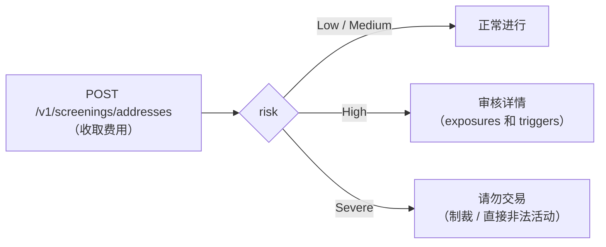

**钱包筛查**将区块链地址与全球链上
情报进行比对，并返回其风险等级：该地址是否属于受制裁
实体、是否收到过非法来源的资金（勒索软件、暗网
市场、盗窃）以及它暴露于哪些风险类别。在向第三方地址
汇款之前、当客户向你提供新钱包时，或作为你自身
合规计划的一部分时使用它。

它是 [AML 筛查](/zh/guides/aml)（评估个人/企业身份）在链上的
对应产品：这里的评估对象是**地址**。



<Note>
`address_screening` 服务费（固定，按次扫描）在
执行时扣除，如果筛查失败会**自动退还**。费用
为 0 时，该服务对你免费。它需要你自己的
[身份验证已通过](/zh/guides/kyc#your-own-verification-onboarding)，
并且你的账户已启用 `screenings` 服务。
</Note>

## 执行一次筛查

评估是**与网络无关的**：同一个地址会同时在
所有支持的区块链上进行评估。`chain` 字段是可选的，
仅用于标注你的记录。由于扫描会收取费用，
`idempotency_key` 是**必填的**——用相同的 key 重试绝不会
重复收费。

<Steps>
<Step title="提交地址">

```bash
curl -X POST https://api.qbank.cl/platform/v1/screenings/addresses \
  -H "Authorization: Bearer <token>" \
  -H "Content-Type: application/json" \
  -d '{
    "address": "TN2BBWc9EF8MMB6i1c4HZHXAssTEXstMDo",
    "chain": "tron",
    "idempotency_key": "scan-customer-742-1"
  }'
```

</Step>
<Step title="读取风险等级">

`201` 响应——一个干净的地址：

```json
{
  "screening_id": "5f0b1c9a-2f3e-4a7b-9c1d-8e6f5a4b3c2d",
  "address": "TN2BBWc9EF8MMB6i1c4HZHXAssTEXstMDo",
  "chain": "tron",
  "risk": "Low",
  "screening_fee": "0.500000",
  "fee_asset": "USDT",
  "idempotency_key": "scan-customer-742-1",
  "created_at": "2026-07-12T14:30:00Z",
  "assessment": {
    "address": "TN2BBWc9EF8MMB6i1c4HZHXAssTEXstMDo",
    "risk": "Low",
    "address_identifications": [],
    "exposures": [
      { "category": "exchange", "value_usd": "1250.75" }
    ],
    "triggers": []
  }
}
```

以及一个受制裁的地址：

```json
{
  "screening_id": "7a2c4e6f-8b1d-4c3a-9e5f-1a2b3c4d5e6f",
  "address": "0x098B716B8Aaf21512996dC57EB0615e2383E2f96",
  "chain": "eth",
  "risk": "Severe",
  "risk_reason": "Identified as Sanctioned Entity",
  "screening_fee": "0.500000",
  "fee_asset": "USDT",
  "idempotency_key": "scan-suspicious-9",
  "created_at": "2026-07-12T14:31:00Z",
  "assessment": {
    "address": "0x098B716B8Aaf21512996dC57EB0615e2383E2f96",
    "risk": "Severe",
    "risk_reason": "Identified as Sanctioned Entity",
    "cluster_name": "OFAC SDN Ronin Bridge Exploiter",
    "cluster_category": "sanctioned entity",
    "address_identifications": [
      {
        "name": "SANCTIONS: OFAC SDN Ronin Bridge Exploiter",
        "category": "sanctioned entity",
        "description": "This specific address 0x098b716b8aaf21512996dc57eb0615e2383e2f96 within this cluster has been identified as belonging to a sanctioned entity."
      }
    ],
    "exposures": [],
    "triggers": []
  }
}
```

</Step>
<Step title="根据风险做出决策">

依据 `risk`（等级表见下文）应用你的策略。`assessment` 对象
包含完整的证据供你存档：点状身份识别信息、按类别的美元
风险敞口以及被触发的风险规则。

</Step>
</Steps>

用相同的 `idempotency_key` 重试会返回原始筛查结果，
并带有 `idempotency_hit: true`，**不会再次收费**：

```json
{
  "screening_id": "5f0b1c9a-2f3e-4a7b-9c1d-8e6f5a4b3c2d",
  "address": "TN2BBWc9EF8MMB6i1c4HZHXAssTEXstMDo",
  "risk": "Low",
  "screening_fee": "0.500000",
  "fee_asset": "USDT",
  "idempotency_key": "scan-customer-742-1",
  "created_at": "2026-07-12T14:30:00Z",
  "idempotency_hit": true
}
```

## 查询历史记录

每次筛查都会被存储。列表接口要求提供 `from`/`to`，并支持
分页和风险等级过滤：

```bash
curl "https://api.qbank.cl/platform/v1/screenings/addresses?from=2026-07-01&to=2026-07-12&risk=severe&page=1&page_size=50" \
  -H "Authorization: Bearer <token>"
```

```json
{
  "page": 1,
  "page_size": 50,
  "screenings": [
    {
      "screening_id": "7a2c4e6f-8b1d-4c3a-9e5f-1a2b3c4d5e6f",
      "address": "0x098B716B8Aaf21512996dC57EB0615e2383E2f96",
      "chain": "eth",
      "risk": "Severe",
      "risk_reason": "Identified as Sanctioned Entity",
      "screening_fee": "0.500000",
      "fee_asset": "USDT",
      "idempotency_key": "scan-suspicious-9",
      "created_at": "2026-07-12T14:31:00Z"
    }
  ]
}
```

以及按 id 查询详情（包含完整的 `assessment`）：

```bash
curl https://api.qbank.cl/platform/v1/screenings/addresses/7a2c4e6f-8b1d-4c3a-9e5f-1a2b3c4d5e6f \
  -H "Authorization: Bearer <token>"
```

## 风险等级

| `risk` | 含义 | 应对措施 |
|---|---|---|
| `Low` | 无相关风险信号 | 正常进行 |
| `Medium` | 对风险类别有轻微敞口 | 可以进行；建议保留内部记录 |
| `High` | 对非法资金有显著敞口 | 交易前审核 `exposures`/`triggers` |
| `Severe` | 受制裁实体或直接非法活动 | **请勿与该地址交易** |

等级是**最终的**（每次筛查是查询时刻的快照）：如果之后需要
重新评估同一地址，请使用新的
`idempotency_key` 执行一次全新扫描。

## 自动保护（免费）

除了按需筛查外，平台还会**自动且免费地保护你的加密货币
操作**：

- **链上提现**：在签名之前会评估目标地址。如果
  它属于严重风险，提现将被拒绝，冻结的
  金额会**全额退还**到你的余额（你会看到该提现
  状态为 `failed`、原因为 `core_rejected`，并收到其
  `crypto_withdrawal_status_changed` webhook）。
- **入账充值**：每笔充值的发送方在入账之前都会被评估。
  严重风险的发送方会使该充值**被冻结等待合规
  审核**（`crypto_deposit_held` webhook）；高风险的发送方则正常
  入账，并附带一条信息性告警（`crypto_deposit_alert` webhook）。

<Warning>
被冻结的充值不会丢失：你运营方的合规团队会审核它，
并决定放行（按正常的充值费用入账）或
拒绝。如果你收到 `crypto_deposit_held`，请携带 `tx_id`
联系你的运营方。
</Warning>

## Webhooks

| 事件 | 触发时机 |
|---|---|
| `crypto_deposit_held` | 因发送方风险，一笔入账充值被冻结 |
| `crypto_deposit_alert` | 一笔充值已入账，但发送方显示高风险（信息性） |

```json crypto_deposit_held
{
  "account_id": "ae8c…",
  "hold_id": "c1d2e3f4-…",
  "chain": "tron",
  "asset": "usdt",
  "tx_id": "8a5b3c…",
  "risk": "Severe",
  "status": "held"
}
```

订阅方式与其他事件相同（见 [Webhooks](/zh/webhooks)）。

## 错误

| HTTP | `error` | 原因 | 解决方法 |
|---|---|---|---|
| 400 | `idempotency_key_required` | 缺少幂等键 | 在请求体中发送 `idempotency_key` 或使用 `Idempotency-Key` 请求头 |
| 400 | `invalid_payload` | 缺少 `address` 或其长度过长 | 检查 `address` 字段 |
| 400 | `invalid_range` | 列表接口缺少或提供了无效的 `from`/`to` | 两者均使用 `YYYY-MM-DD` 格式 |
| 402 | `insufficient_funds` | 余额不足以支付费用 | 为账户充值后用相同的 key 重试 |
| 403 | `verification_required` | 你的账户尚未通过验证 | 完成你的[入驻验证](/zh/guides/kyc#your-own-verification-onboarding) |
| 403 | `service_disabled` | 你的账户未启用 `screenings` 服务 | 联系你的运营方 |
| 404 | `not_found` | `screening_id` 不存在或不属于你 | 检查该 id |
| 422 | `invalid_address` | 该地址无法被筛查（格式问题） | 检查地址格式 |
| 502 | `screening_unavailable` | 服务暂时不可用（费用已退还） | 稍后用相同的 key 重试 |

## 常见问题

<AccordionGroup>
<Accordion title="我需要指定地址所属的网络（chain）吗？">
不需要。评估会同时覆盖所有支持的网络：一个 ETH 地址
会连同其全部已知链上活动一并评估。`chain` 只是
一个可选标签，供你自己记录使用。
</Accordion>
<Accordion title="我可以扫描既不属于我也不属于我客户的地址吗？">
可以。该产品接受任何区块链地址——在与第三方交易之前
评估对方正是它的典型使用场景。每次扫描
收取相应费用。
</Accordion>
<Accordion title="结果会过期吗？">
每次筛查是查询时刻的快照，会连同日期作为证据
存储。地址的风险可能发生变化（新的制裁、新的活动）：对于
敏感决策，请通过全新扫描重新评估。
</Accordion>
<Accordion title="自动保护的扫描会向我收费吗？">
不会。对提现和充值的自动筛查是
平台合规计划的一部分，不产生任何费用。只有按需扫描
（`POST /v1/screenings/addresses`）才收取 `address_screening` 费用。
</Accordion>
<Accordion title="如果我提现时筛查服务不可用会怎样？">
出于安全考虑，未评估目标地址的提现不会被签名：
该提现会被拒绝并全额退款，你可以稍后重试。
入账充值不会因服务中断而被冻结——它们会正常
入账。
</Accordion>
</AccordionGroup>
