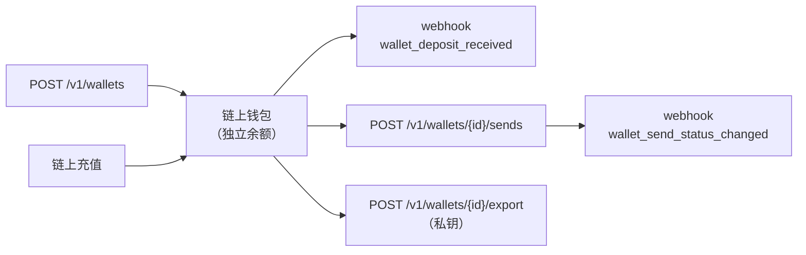

**隔离钱包**是**归属于您的账户**的链上钱包：其余额**就是**该
地址的链上余额，而非 CBPay 账本中的虚拟余额。您可以
接收并**直接从每个钱包发送加密货币**，通过私钥**导入**
外部钱包，并可随时**导出**私钥（共享托管）。它们非常适合按客户、
按项目或按业务单元隔离资金，并完全掌控私钥。

<Note>
个人与企业账户均可使用，但限额不同：**企业**账户可创建**无限**个
隔离钱包；**个人**账户每个网络+资产组合最多持有 **1 个**（创建第二个
会返回 `422 wallet_limit_reached`）。
</Note>

<Warning>
请勿将其与[加密货币](/zh/guides/crypto)产品混淆：在那个产品中，
充值**计入您在账本中的 USDT/USDC 余额**，提现从热钱包发出。而在
隔离钱包中，余额**存在于钱包的链上**，发送**从该钱包本身**发出。
**Gas**（TRON 上的 TRX、Ethereum 上的 ETH）由您自行承担：每个
钱包必须持有 gas 才能发送。
</Warning>



## 支持的组合

| 链 | 资产 | 网络 gas |
|---|---|---|
| `tron` | `usdt` | TRX |
| `eth` | `usdt` | ETH |
| `eth` | `usdc` | ETH |

原生 `eth` 可以从任意 `eth` 链上的钱包发送（它是该网络的 gas）。

## 1. 创建钱包

<CodeGroup>

```bash TRON USDT
curl -X POST https://api.qbank.cl/platform/v1/wallets \
  -H "Authorization: Bearer <token>" \
  -H "Content-Type: application/json" \
  -H "Idempotency-Key: wallet-client-001" \
  -d '{ "chain": "tron", "asset": "usdt", "label": "Acme Client" }'
```

```bash ETH USDC
curl -X POST https://api.qbank.cl/platform/v1/wallets \
  -H "Authorization: Bearer <token>" \
  -H "Content-Type: application/json" \
  -H "Idempotency-Key: wallet-project-x" \
  -d '{ "chain": "eth", "asset": "usdc", "label": "Project X" }'
```

</CodeGroup>

响应 `201`：

```json
{
  "wallet_id": "b7e3a1c2-9f4d-4a8b-8c1e-2d3f4a5b6c7d",
  "chain": "tron",
  "asset": "USDT",
  "address": "TRmSZRaMAqLEevAdGwo3R43bRBXamWR5bd",
  "label": "Acme Client",
  "origin": "created",
  "custody": "cbpay",
  "exported": false,
  "created_at": "2026-07-11T12:00:00Z"
}
```

`custody` 字段反映私钥的托管模式：

| `custody` | 含义 |
|---|---|
| `cbpay` | 由平台创建且私钥从未导出：只有您的 API 操作能够动用余额 |
| `client` | 导入的钱包，或私钥已导出的钱包：您也可以在平台之外签名 |

在 `client` 托管模式下，平台会同步该钱包完整的链上活动——包括在
平台外签名的变动——并将其标记为外部（external），使您的记录与
对账单保持完整。

在 `cbpay` 托管模式下，钱包的会计核算是**有保证的**：对账单展示
其全生命周期的勾稽（`lifetime_in` − `lifetime_out` =
`computed_balance`），且每笔发送的详情
（`GET /v1/wallets/{walletID}/sends/{sendID}`）包含
`funding_sources`：按 FIFO 归因哪些充值为该笔发送提供了资金，
附带 `tx_id`、来源地址与每一份额的金额。

`Idempotency-Key`（或请求体中的 `idempotency_key`）让重试变得安全：
重复请求返回**同一个**钱包并带有 `idempotency_hit: true`，**绝不**
创建第二个钱包。创建钱包可能收取 `wallet_creation` 费用（固定；
0 = 免费，即默认值）。

## 2. 导入外部钱包

通过提供私钥，将您已控制的钱包接入平台。私钥**在传输过程中加密
送达托管方，绝不会在平台中存储或记录日志**。

```bash
curl -X POST https://api.qbank.cl/platform/v1/wallets/import \
  -H "Authorization: Bearer <token>" \
  -H "Content-Type: application/json" \
  -H "X-OTP-Token: <otp-token>" \
  -d '{
    "chain": "tron",
    "asset": "usdt",
    "private_key_hex": "<64 hex>",
    "label": "Migrated wallet",
    "idempotency_key": "import-001"
  }'
```

响应 `201`，结构与创建相同（`origin: "imported"`）。收取
`wallet_import` 费用。

<Warning>
导入与导出涉及私钥材料：它们**要求已登录的用户会话并启用 2FA**
（不允许使用 API key）以及 OTP。若该链/地址组合已存在，核心系统
会返回 `core_rejected`。
</Warning>

## 3. 查询余额、充值与交易

余额**实时来自区块链**，并包含网络 gas（以便您查看钱包是否缺少
用于发送的 TRX/ETH）。

```bash
# 实时链上余额（包含 gas）
curl https://api.qbank.cl/platform/v1/wallets/{walletID}/balance \
  -H "Authorization: Bearer <token>"

# 已接收的充值（支持分页与日期）
curl "https://api.qbank.cl/platform/v1/wallets/{walletID}/deposits?from=2026-07-01&to=2026-07-11&page=1&page_size=50" \
  -H "Authorization: Bearer <token>"

# 完整链上活动（充值 + 发送）
curl "https://api.qbank.cl/platform/v1/wallets/{walletID}/transactions?from=2026-07-01&to=2026-07-11" \
  -H "Authorization: Bearer <token>"
```

当已确认的充值到账时，CBPay 会发出
[`wallet_deposit_received`](/zh/webhooks) webhook——**不触碰您的
账本**，因为余额已经在钱包中。

## 4. 从钱包发送加密货币

发送**从钱包本身**发出（真实的来源地址），由托管方签名。
`idempotency_key` 为必填。

<CodeGroup>

```bash 按金额
curl -X POST https://api.qbank.cl/platform/v1/wallets/{walletID}/sends \
  -H "Authorization: Bearer <token>" \
  -H "Content-Type: application/json" \
  -H "X-OTP-Token: <otp-token>" \
  -d '{
    "asset": "usdt",
    "to_address": "TXYZ...destination",
    "amount": "25.50",
    "idempotency_key": "send-2026-07-11-a"
  }'
```

```bash 按最小单位
curl -X POST https://api.qbank.cl/platform/v1/wallets/{walletID}/sends \
  -H "Authorization: Bearer <token>" \
  -H "Content-Type: application/json" \
  -H "X-OTP-Token: <otp-token>" \
  -d '{
    "asset": "usdt",
    "to_address": "TXYZ...destination",
    "amount_raw": "25500000",
    "idempotency_key": "send-2026-07-11-b"
  }'
```

</CodeGroup>

响应 `202`（发送是异步的；最终状态通过 webhook 送达）：

```json
{
  "send_id": "9c8b7a6d-5e4f-3a2b-1c0d-9e8f7a6b5c4d",
  "wallet_id": "b7e3a1c2-9f4d-4a8b-8c1e-2d3f4a5b6c7d",
  "chain": "tron",
  "asset": "USDT",
  "to_address": "TXYZ...destination",
  "amount_raw": "25500000",
  "fee": "0.000000",
  "fee_asset": "USDT",
  "status": "processing",
  "tx_id": "b1946ac92492d2347c6235b4d2611184...",
  "idempotency_key": "send-2026-07-11-a",
  "created_at": "2026-07-11T12:05:00Z"
}
```

发送之前，CBPay 会校验钱包是否持有足够的 **gas**；若不足，则返回
`422 insufficient_gas` 并附带所需的最低数额——不收取任何费用。
发送可能收取 `wallet_send` 费用（从您账户在账本中的结算余额扣除；
**绝不动用钱包的链上资金**），若托管方拒绝发送则费用退回。

使用相同 `idempotency_key` 的重放会返回 `200`，携带原始发送和
`idempotency_hit: true`——**绝不重复发送**。遇到模糊失败
（超时/网络）时，发送保持 `pending`：请使用**相同的**密钥重试；
去重机制保证不会重复。

查询历史记录：

```bash
curl "https://api.qbank.cl/platform/v1/wallets/{walletID}/sends?from=2026-07-01&to=2026-07-11" \
  -H "Authorization: Bearer <token>"

curl https://api.qbank.cl/platform/v1/wallets/{walletID}/sends/{sendID} \
  -H "Authorization: Bearer <token>"
```

## 5. 导出私钥

获取钱包的私钥。这是**共享托管**：导出后，钱包在 CBPay 中
**仍然完全可用**（可以接收和发送），但您也可以通过私钥掌控资金。

```bash
curl -X POST https://api.qbank.cl/platform/v1/wallets/{walletID}/export \
  -H "Authorization: Bearer <token>" \
  -H "X-OTP-Token: <otp-token>" \
  -H "Content-Type: application/json" \
  -d '{ "reason": "Custody migration to the client cold wallet" }'
```

响应 `200`：

```json
{
  "wallet": {
    "wallet_id": "b7e3a1c2-9f4d-4a8b-8c1e-2d3f4a5b6c7d",
    "chain": "tron",
    "asset": "USDT",
    "address": "TRmSZRaMAqLEevAdGwo3R43bRBXamWR5bd",
    "exported": true,
    "exported_at": "2026-07-11T12:10:00Z"
  },
  "private_key_hex": "<64 hex>",
  "export": {
    "custody": "shared",
    "warning": "anyone holding this private key controls the wallet funds; the wallet remains operational in the platform"
  }
}
```

<Warning>
这是本产品中最敏感的操作。它要求**已登录的用户会话并启用 2FA**
（不允许使用 API key）、**已完成验证的账户**，以及一个至少 20 个
字符、留存于审计记录中的 `reason`。每次导出都会向您的组织触发
`wallet_key_exported` webhook。收取 `wallet_export` 费用。持有
私钥者即可掌控资金：请妥善保管。
</Warning>

## 6. 自动转发

将到达钱包的所有资金自动转发到您指定的地址（适合归集到冷存储）。
由于它会重定向未来的资金，因此要求账户已验证并提供 OTP。

```bash
# 读取当前规则
curl https://api.qbank.cl/platform/v1/wallets/{walletID}/auto-forward \
  -H "Authorization: Bearer <token>"

# 启用 / 更新
curl -X POST https://api.qbank.cl/platform/v1/wallets/{walletID}/auto-forward \
  -H "Authorization: Bearer <token>" \
  -H "X-OTP-Token: <otp-token>" \
  -H "Content-Type: application/json" \
  -d '{ "linked_address": "TColdWallet...destination", "enabled": true }'

# 禁用
curl -X POST https://api.qbank.cl/platform/v1/wallets/{walletID}/auto-forward \
  -H "Authorization: Bearer <token>" \
  -H "X-OTP-Token: <otp-token>" \
  -H "Content-Type: application/json" \
  -d '{ "enabled": false }'
```

## 发送状态

| `status` | 类型 | 含义 / 应对方式 |
|---|---|---|
| `processing` | 过渡态 | 已在链上广播；等待 webhook 确认 |
| `pending` | 过渡态 | 派发时发生模糊失败；使用**相同的** `idempotency_key` 重试 |
| `completed` | 终态 | 已在链上确认 |
| `failed` | 终态 | 已被拒绝；没有资金变动 |

## 产品错误

| HTTP | `error` | 解决方式 |
|---|---|---|
| 422 | `wallet_limit_reached` | 个人账户在该网络+资产组合下已持有隔离钱包（企业账户无限制） |
| 403 | `human_session_required` | 导入和导出要求已登录的用户会话并启用 2FA（不允许使用 API key） |
| 403 | `verification_required` | 完成您的账户开户流程（[验证](/zh/guides/kyc)） |
| 403 | `service_disabled` | `wallets` 服务未启用；请联系您的运营方 |
| 400 | `idempotency_key_required` | 请发送 `idempotency_key`（请求体或 `Idempotency-Key` 请求头） |
| 400 | `invalid_asset` / `invalid_chain` | 请检查支持的链/资产组合 |
| 422 | `insufficient_gas` | 钱包没有支付网络费用的 gas（TRX/ETH）；充入后重试 |
| 409 | `idempotency_conflict` | 使用相同密钥的另一请求仍在处理中；请使用相同密钥重试 |
| 503 | `export_unavailable` | 该环境未启用私钥导出 |

## 相关 webhook

| 事件 | 触发时机 |
|---|---|
| `wallet_deposit_received` | 一笔链上充值到达隔离钱包（不触碰账本） |
| `wallet_send_status_changed` | 钱包发出的一笔发送变更了状态 |
| `wallet_key_exported` | 某钱包的私钥被导出（安全警报） |
| `wallet_external_movement` | 同步检测到一笔未经过平台的链上变动（在 `client` 托管模式下属正常现象） |
| `wallet_key_compromise_suspected` | **严重警报**：资金未经过平台就离开了 `cbpay` 托管的钱包——请视私钥已泄露并立即联系支持团队 |

示例载荷见 [webhook 页面](/zh/webhooks)。

## 常见问题

<AccordionGroup>
<Accordion title="它们与加密货币产品的钱包有何不同？">
在[加密货币](/zh/guides/crypto)产品中，充值计入您在账本中的
USDT/USDC 虚拟余额，提现从热钱包发出——由 CBPay 托管并归集资金。
而隔离钱包的余额存在于每个钱包的链上，发送从同一地址发出，且您
可以导出私钥。其余额完全不经过账本，也不会被归集到资金池。
</Accordion>
<Accordion title="为什么我的发送因 insufficient_gas 失败？">
链上发送要求钱包内持有 gas（TRON 上的 TRX、Ethereum 上的 ETH）。
与加密货币产品不同，这里的 gas 由您自行承担。向钱包地址充入少量
原生币后重试。`GET .../balance` 会显示可用 gas 与所需的最低数额。
</Accordion>
<Accordion title="导出私钥后钱包会停止工作吗？">
不会。这是共享托管：钱包在 CBPay 中保持可用（正常接收和发送），
并被标记为 `exported`。此时您也持有私钥，请妥善保管。
</Accordion>
<Accordion title="资金归集会动用我隔离钱包的余额吗？">
绝不会。这些钱包在创建时即被排除在资金归集之外：其链上余额完全
归您所有。只有当您发起发送或配置自动转发时才会变动。
</Accordion>
<Accordion title="我可以创建多少个钱包？">
**企业**账户没有限制：按客户、项目或业务单元进行隔离是典型用法，
可用 `label` 加以区分。**个人**账户每个网络+资产组合最多持有 1 个
隔离钱包（创建第二个会返回 `422 wallet_limit_reached`）。
</Accordion>
</AccordionGroup>
