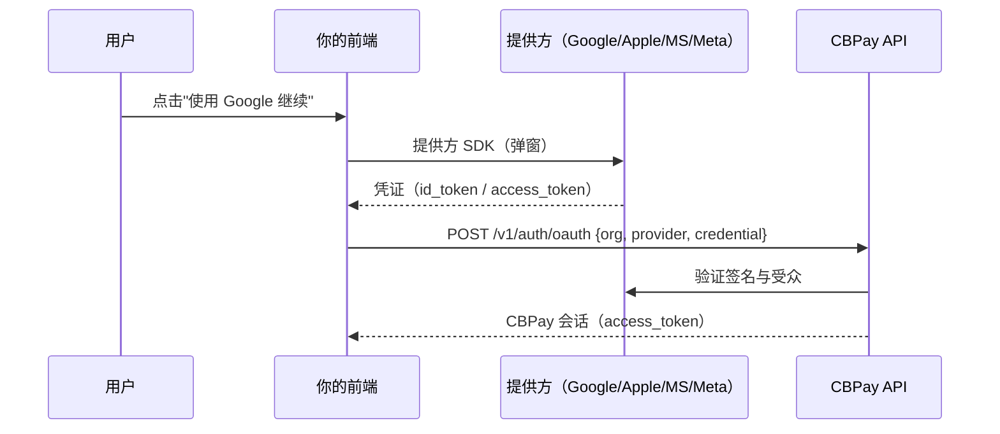
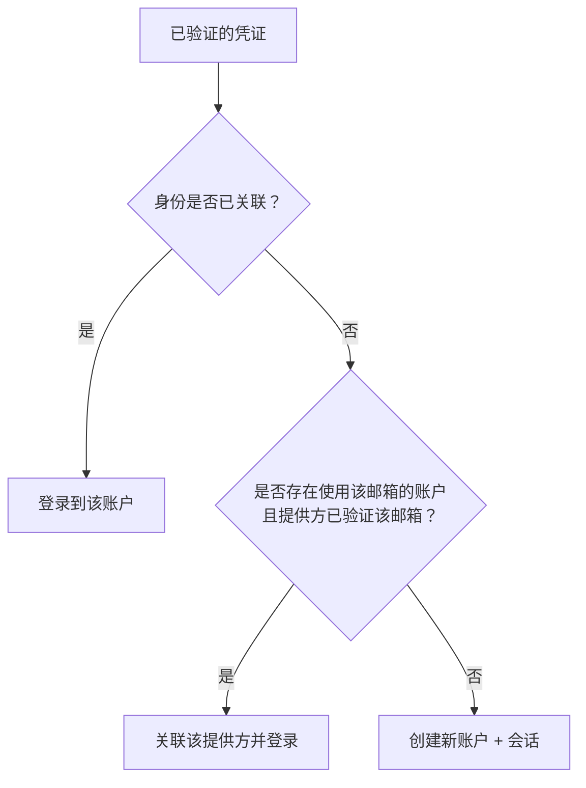

你的用户可以使用 **Google、Apple、Microsoft 或
Facebook** 注册和登录——无需创建或记住密码。CBPay 采用**令牌
交换（token exchange）**模型："使用……继续"按钮位于你的前端，
用户在提供方完成授权，你的前端收到凭证并将其
传给 API；CBPay 会**以加密方式验证它**并返回
会话。



<Note>
社交登录由你的运营方（组织）启用，并且**每个
组织使用自己的** Google/Apple/Microsoft/Meta 应用，因此用户
在授权页面上看到的是你的品牌。使用
`GET /v1/auth/oauth/providers` 查询哪些提供方处于启用状态。
</Note>

## 1. 查询已启用的提供方

为了渲染正确的按钮，你的前端先查询哪些提供方处于启用状态
以及各自的 `client_id`：

```bash
curl "https://api.qbank.cl/platform/v1/auth/oauth/providers?org=cbpay"
```

```json
{
  "providers": [
    { "provider": "google", "client_id": "1234567890-abc.apps.googleusercontent.com" },
    { "provider": "apple", "client_id": "com.yourcompany.cbpay.web" }
  ]
}
```

这是一个公开端点（无需令牌）：`client_id` 不是机密信息。

## 2. 在前端获取凭证

每个提供方通过其自己的 SDK 向你交付凭证。最简示例：

<Tabs>
<Tab title="Google">

使用 [Google Identity Services](https://developers.google.com/identity/gsi/web)：

```html
<script src="https://accounts.google.com/gsi/client" async></script>
<div id="g_id_onload"
     data-client_id="YOUR_CLIENT_ID"
     data-callback="onGoogle"></div>
<div class="g_id_signin"></div>
<script>
function onGoogle(response) {
  // response.credential is the id_token (JWT) you send to CBPay
  fetch("https://api.qbank.cl/platform/v1/auth/oauth", {
    method: "POST",
    headers: { "Content-Type": "application/json" },
    body: JSON.stringify({
      org: "cbpay", provider: "google", credential: response.credential
    })
  });
}
</script>
```

</Tab>
<Tab title="Apple">

使用 [Sign in with Apple JS](https://developer.apple.com/documentation/sign_in_with_apple/sign_in_with_apple_js)：
响应对象中包含 `authorization.id_token`，这就是你作为
`credential` 发送的内容。

```js
const data = await AppleID.auth.signIn();
await fetch("https://api.qbank.cl/platform/v1/auth/oauth", {
  method: "POST",
  headers: { "Content-Type": "application/json" },
  body: JSON.stringify({
    org: "cbpay", provider: "apple", credential: data.authorization.id_token
  })
});
```

Apple **只在首次登录时**返回用户姓名；如有需要，请在你的
前端保存它。邮箱可能是私密中继别名
（`...@privaterelay.appleid.com`）——它是有效且稳定的。

</Tab>
<Tab title="Microsoft">

使用 [MSAL.js](https://learn.microsoft.com/entra/identity-platform/msal-overview)：
在 `loginPopup` 之后，结果中的 `idToken` 即为凭证。

```js
const result = await msalInstance.loginPopup({ scopes: ["openid", "email", "profile"] });
await fetch("https://api.qbank.cl/platform/v1/auth/oauth", {
  method: "POST",
  headers: { "Content-Type": "application/json" },
  body: JSON.stringify({
    org: "cbpay", provider: "microsoft", credential: result.idToken
  })
});
```

</Tab>
<Tab title="Meta (Facebook)">

使用 [Facebook Login SDK](https://developers.facebook.com/docs/facebook-login/web)：
Facebook 不是 OIDC，因此你发送的是会话的 **access_token**。

```js
FB.login(function(response) {
  if (response.authResponse) {
    fetch("https://api.qbank.cl/platform/v1/auth/oauth", {
      method: "POST",
      headers: { "Content-Type": "application/json" },
      body: JSON.stringify({
        org: "cbpay", provider: "facebook",
        credential: response.authResponse.accessToken
      })
    });
  }
}, { scope: "email" });
```

</Tab>
</Tabs>

## 3. 用凭证交换会话

```bash
curl -X POST https://api.qbank.cl/platform/v1/auth/oauth \
  -H "Content-Type: application/json" \
  -d '{
    "org": "cbpay",
    "provider": "google",
    "credential": "eyJhbGciOiJSUzI1Ni…",
    "type": "person"
  }'
```

**新用户** → 创建账户并返回 `201`：

```json
{
  "account": { "id": "9b1deb4d-…", "type": "person", "email": "ana@gmail.com", "display_name": "Ana" },
  "access_token": "eyJhbGciOiJIUzI1Ni…",
  "expires_at": "2026-07-09T21:00:00Z",
  "created": true
}
```

**已有用户** → 完成登录并返回 `200`，包含 `access_token`、
`account_id` 和 `role`（与密码登录相同）。

`type` 字段（`person` | `company`，默认 `person`）仅在
创建账户时使用；如果账户已存在则被忽略。

### 如何判定是创建还是登录



## 4. 社交登录与 2FA

如果账户**在登录时启用了 OTP**
（[安全与 2FA](/zh/security-2fa)），社交登录同样遵循该第二
步骤：`POST /v1/auth/oauth` 不会直接返回会话，而是返回
`otp_required: true` + `pending_token`，你需要通过
`POST /v1/auth/login/otp` 完成登录，流程与密码登录一致。

## 5. 关联与解绑提供方

已登录的用户可以管理自己的登录方式：

```bash
# List linked providers
curl https://api.qbank.cl/platform/v1/me/identities \
  -H "Authorization: Bearer <token>"

# Link another provider (with a fresh credential from that provider)
curl -X POST https://api.qbank.cl/platform/v1/me/identities \
  -H "Authorization: Bearer <token>" \
  -H "Content-Type: application/json" \
  -d '{ "provider": "apple", "credential": "eyJhbGci…" }'

# Unlink
curl -X DELETE https://api.qbank.cl/platform/v1/me/identities/apple \
  -H "Authorization: Bearer <token>"
```

你不能解绑**唯一的**登录方式：如果账户没有
密码，且该提供方是唯一关联的登录方式，API 会返回
`409 last_login_method`（请先设置密码或关联另一个提供方）。

## 错误

| HTTP | `error` | 含义 |
|---|---|---|
| 400 | `invalid_provider` | 提供方不在 `google/apple/microsoft/facebook` 范围内 |
| 400 | `provider_not_configured` | 你的组织未启用该提供方 |
| 401 | `invalid_credential` | 凭证无效、已过期或来自其他应用 |
| 409 | `email_conflict` | 已存在使用该邮箱的账户；请用你现有的方式登录，然后在会话中关联该提供方 |
| 409 | `identity_taken` | 该提供方身份已关联到另一个账户 |
| 409 | `last_login_method` | 你不能解绑唯一的登录方式 |

## 常见问题

<AccordionGroup>
  <Accordion title="我需要处理重定向或 OAuth 回调吗？">
    不需要。授权流程通过提供方 SDK 在你的前端完成；
    你只需将得到的凭证发送给 CBPay。没有回调
    页面，也没有服务端状态。
  </Accordion>
  <Accordion title="用户可以同时拥有密码和社交登录吗？">
    可以。用户可以先用邮箱/密码注册，之后再关联 Google，
    反之亦然。只要邮箱一致且已验证，所有方式都指向
    同一个账户。
  </Accordion>
  <Accordion title="如果提供方没有返回已验证的邮箱怎么办？">
    不会按邮箱自动关联（防止有人冒用他人
    邮箱）。系统会创建一个绑定该身份的独立账户；
    用户之后可以再添加邮箱/密码。
  </Accordion>
  <Accordion title="提供方的凭证可以当作 CBPay 令牌使用吗？">
    不可以。提供方凭证只用于一次性验证你的身份；后续的
    每次调用都使用 CBPay 的 `access_token`。
  </Accordion>
</AccordionGroup>
