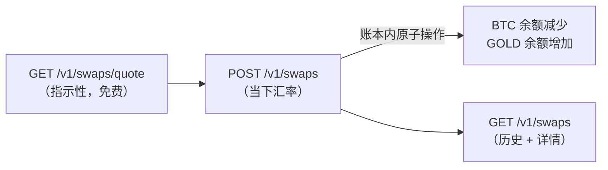

**兑换（Swaps）**在你的四种货币 — `USDT`、`USDC`、`BTC` 和 `GOLD` — 之间**同步、即时**地转换余额，资金始终不离开你的账户。任意币对均可（包括 `BTC` ↔ `GOLD` 直接兑换）。你在报价中看到的汇率就是执行汇率：**没有额外手续费** — 报价即到账。



## 1. 询价（可选，免费）

```bash
curl "https://api.qbank.cl/platform/v1/swaps/quote?from_asset=USDT&to_asset=BTC&amount=1000" \
  -H "Authorization: Bearer <token>"
```

```json
{
  "from_asset": "USDT",
  "to_asset": "BTC",
  "from_amount": "1000.000000",
  "to_amount": "0.01568419",
  "rate": "0.00001568",
  "indicative": true
}
```

报价是**指示性的**：兑换按 `POST` 时刻的汇率执行（BTC 和 GOLD 价格会波动）。稳定币币对（`USDT` ↔ `USDC`）保持稳定。

## 2. 执行兑换

<CodeGroup>

```bash USDT → BTC
curl -X POST https://api.qbank.cl/platform/v1/swaps \
  -H "Authorization: Bearer <token>" \
  -H "Content-Type: application/json" \
  -d '{
    "from_asset": "USDT",
    "to_asset": "BTC",
    "amount": "1000",
    "idempotency_key": "swap-2026-07-10-a"
  }'
```

```bash BTC → GOLD (direct)
curl -X POST https://api.qbank.cl/platform/v1/swaps \
  -H "Authorization: Bearer <token>" \
  -H "Content-Type: application/json" \
  -d '{
    "from_asset": "BTC",
    "to_asset": "GOLD",
    "amount": "0.01",
    "idempotency_key": "swap-2026-07-10-b"
  }'
```

```bash USDT → USDC
curl -X POST https://api.qbank.cl/platform/v1/swaps \
  -H "Authorization: Bearer <token>" \
  -H "Content-Type: application/json" \
  -d '{
    "from_asset": "USDT",
    "to_asset": "USDC",
    "amount": "500",
    "idempotency_key": "swap-2026-07-10-c"
  }'
```

</CodeGroup>

`amount` 以**源**货币（`from_asset`）计，最多可使用该币种的小数位数（USDT/USDC/GOLD 为 6 位，BTC 为 8 位）。

`201` 响应 — 兑换是同步的，你的余额即时变动：

```json
{
  "swap_id": "8a1b2c3d-4e5f-6a7b-8c9d-0e1f2a3b4c5d",
  "from_asset": "USDT",
  "to_asset": "BTC",
  "from_amount": "1000.000000",
  "to_amount": "0.01568419",
  "rate": "0.00001568",
  "status": "completed",
  "idempotency_key": "swap-2026-07-10-a",
  "created_at": "2026-07-10T15:00:00Z"
}
```

使用相同的 `idempotency_key` 重放 → 返回 `200`、原始兑换记录及 `idempotency_hit: true` — **绝不重复执行**。

## 3. 查询与历史

```bash
# History with pagination, dates and currency filter (matches both legs)
curl "https://api.qbank.cl/platform/v1/swaps?from=2026-07-01&to=2026-07-10&asset=BTC&page=1&page_size=50" \
  -H "Authorization: Bearer <token>"

# Detail
curl https://api.qbank.cl/platform/v1/swaps/{swap_id} \
  -H "Authorization: Bearer <token>"
```

在你的流水（`GET /v1/movements`）和[对账单](/zh/guides/statement)中，兑换以源货币的 `swap_out` 和目标货币的 `swap_in` 显示，各自在自己的分区中对账。

## 规则与限额

- **同一账户**：资金始终不离开你的账户 — 只是更换币种。因此不需要 OTP。
- `USDT`、`USDC`、`BTC` 和 `GOLD` 之间的**任意币对**（源 ≠ 目标）。
- **按当下的执行汇率**：BTC 和 GOLD 使用实时执行价格；如果价格不可用或已过期，兑换会被拒绝并返回 `503 pricing_unavailable`（绝不按旧价格执行）。
- **波动性货币限额**（BTC/GOLD，与出款和银行卡消费共享）：每笔操作上限和每账户 24 小时滚动交易量上限（`GET /v1/settlement` 可查看你的限额）。USDT ↔ USDC 没有限额。
- 需要你已通过的[身份核验](/zh/guides/kyc)且已启用 `swaps` 服务。

## 错误

| HTTP | `error` | 原因 | 解决方案 |
|---|---|---|---|
| 400 | `invalid_asset` | 货币不在 USDT/USDC/BTC/GOLD 之内 | 检查 `from_asset`/`to_asset` |
| 400 | `invalid_pair` | 源货币与目标货币相同 | 选择不同的货币 |
| 400 | `invalid_amount` | 金额无效或小数位过多 | 遵守源货币的小数位数 |
| 400 | `amount_too_small` | 金额不足目标货币的最小单位 | 提高金额 |
| 400 | `swap_asset_disabled` | 你所在组织禁用了其中一种货币 | 联系你的运营方 |
| 400 | `idempotency_key_required` | 缺少幂等键 | 在请求体或请求头中发送 |
| 402 | `insufficient_funds` | 源货币余额不足 | 充值或降低金额 |
| 403 | `verification_required` / `service_disabled` | 账户未核验或服务已关闭 | 完成入驻流程 / 联系你的运营方 |
| 422 | `settlement_limit_exceeded` | 兑换超过波动性货币的单笔操作上限 | 拆分操作 |
| 422 | `settlement_daily_limit_exceeded` | 你超过了波动性货币的 24 小时交易量 | 稍后重试 |
| 503 | `pricing_unavailable` | 执行价格不可用或已过期 | 几分钟后重试 |

## 常见问题

<AccordionGroup>
<Accordion title="为什么兑换汇率与我在别处看到的市场价格不同？">
报价汇率是你账户的**执行**汇率：它包含了提供即时、有保障兑换的成本（即时流动性、无滑点、无需资金离开账户）。与出款和入款汇率的理念相同：报价就是你实际收到的金额，事后没有任何意外费用。
</Accordion>
<Accordion title="报价有保障吗？">
没有 — 它是指示性的。BTC 和 GOLD 价格会波动，因此执行时使用 POST 时刻的价格。稳定币之间（USDT ↔ USDC）差异可忽略不计。最终数额以兑换响应中的 `to_amount` 为准（已入账）。
</Accordion>
<Accordion title="我可以撤销一笔兑换吗？">
无法撤销：已执行的兑换是最终的（你的余额已经变动）。你可以随时按当时的汇率换回来。
</Accordion>
<Accordion title="为什么我当天的第一笔 BTC→GOLD 兑换就因限额被拒绝？">
波动性货币限额在兑换、以 BTC/GOLD 支付的出款和以 BTC/GOLD 支付的银行卡消费之间共享 — 它们全部计入你账户同一个 24 小时滚动交易量。通过 `GET /v1/settlement` 查看你的上限。
</Accordion>
<Accordion title="持有 GOLD 或 BTC 余额有什么好处？">
GOLD 代表足金克数，BTC 代表比特币：在不离开生态系统的情况下获得价格敞口。你可以直接用这些余额支付出款、手续费和银行卡消费（多资产结算），并随时换回 USDT/USDC。
</Accordion>
</AccordionGroup>
